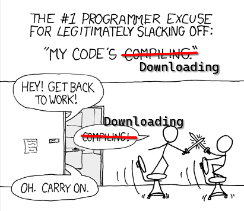
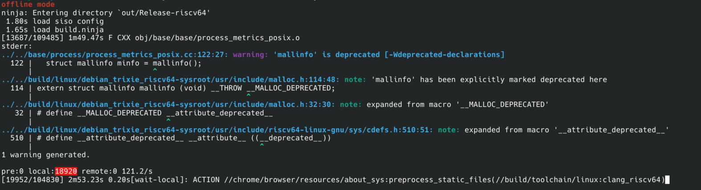
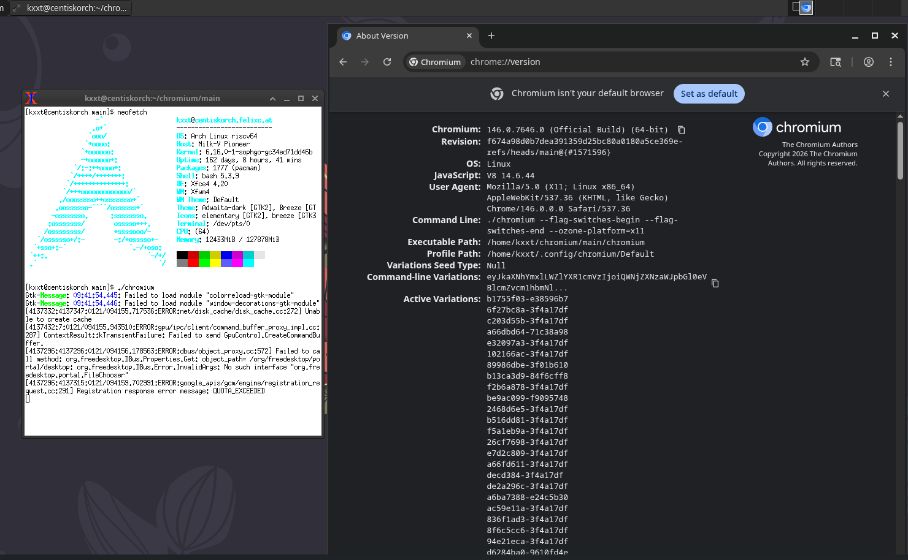

import PR from "@/components/mdx/PR"


I have already written a blog post about [cross-compiling mainline Chromium for RISC-V from scratch](../cross-compile-chromium-for-riscv/).
However, that blog is pretty much outdated now because many improvements have made it into the Chromium code base.
It is year 2026 now so I decided to write a new blog post to share the latest guide on how to cross-compile mainline Chromium for RISC-V from scratch.

# Environment Setup

For this blog post, I assume that you are using a Debian-like environment.
More specifically, I used a freshly created Debian Trixie container.
This blog post assumes cross-compiling from x86_64 to riscv64
but might just also apply to cross-compiling from arm64 to riscv64.

First, let’s install some really basic stuff in case you haven't installed them:

```bash
sudo apt update && sudo apt install -y curl git lsb-release python3 git file vim sudo
```

Then, please use a non-root user for the rest part of this blog post.

# Retrieve the Source Code

First, we need to install `depot_tools` for retrieving the source code of Chromium:

```bash
cd ~
git clone https://chromium.googlesource.com/chromium/tools/depot_tools.git
```

Then add the following code to your `.bashrc` (Please adjust it if other shells are used): 

```bash
export PATH="$HOME/depot_tools:$PATH"
```

And source it:

```bash
. .bashrc
```

Then let us create a directory for chromium development. I will just use `~/chromium`.

```bash
mkdir ~/chromium && cd $_
```

And now we can fetch the Chromium source code using the `fetch` program from `depot_tools`:

```bash
fetch --nohooks chromium
```

Depending on your network conditions, this might take a long time. (Or to put it another way, a lot of time for a rest)



After it finishes, install additional dependencies:

```bash
sudo src/build/install-build-deps.sh
```

After that, edit `.gclient` to add RISC-V to the architectures we want to build.
It should look like the following code block, where `checkout_riscv64` is added to `custom_vars`.

```python .gclient
solutions = [
  {
    "name": "src",
    "url": "https://chromium.googlesource.com/chromium/src.git",
    "managed": False,
    "custom_deps": {},
    "custom_vars": {
      "checkout_riscv64": True,
    },
  },
]
```

And then synchronize the source again:

```bash
gclient sync
```

This time, the synchronization would also download toolchains, including Debian RISC-V sysroot for our cross-compilation.  

:::note

The main branch is at commit `f674a98d0b7dea391359d25bc80a0180a5ce369e` at the time of writing.
If you just want to reproduce this blog post before starting other work on Chromium RISC-V, you can use this commit instead of `main` branch:

```bash
git checkout f674a98d0b7dea391359d25bc80a0180a5ce369e
gclient sync
```
:::

# Apply Patches

At the time of writing, most patches for enabling building Chromium for riscv64 has been merged by the Chromium project.
However, we still have two patches that are not merged yet and we need to apply them manually.

Let's change into the source directory first.

```bash
cd src
```

The first one is the sandbox patch, which could be applied by:

```bash
git fetch https://chromium.googlesource.com/chromium/src refs/changes/20/4935120/11 && git cherry-pick FETCH_HEAD
```

The second one is a SwiftShader patch that switches the default LLVM version from 10 to 16. We need this patch because LLVM 10 is too historic to support RISC-V. It could be applied by:

```bash
git -C third_party/swiftshader fetch https://swiftshader.googlesource.com/SwiftShader refs/changes/29/75929/2 && git -C third_party/swiftshader cherry-pick FETCH_HEAD
```

Aside from the two unmerged patches, we need to apply another patch.
This patch has already been merged into V8 main branch but
the Chromium commit I use here still uses an older commit of V8.

```bash
git -C v8 fetch https://chromium.googlesource.com/v8/v8 refs/changes/90/7498990/9 && git -C v8 cherry-pick FETCH_HEAD
```

This patch fixes browser crashes in V8 caused by the accidental unconditional usage of RVV code.

# Configure

Now, with the patches applied, we are ready to configure the build.

For this blog post, I will configure a release build:

```bash
export PATH="$PWD/buildtools/linux64:$PATH"
gn gen "out/Release-riscv64"  --args='
    is_official_build=true
    is_debug=false
    target_cpu="riscv64"
    treat_warnings_as_errors=false
    chrome_pgo_phase=0
    use_debug_fission=false
    symbol_level=1'
```

You might have noticed that two unusual GN flags are used here:

- `treat_warnings_as_errors=false`: By default, Chromium ensures its code to be warning-free by turning compiler warnings into errors.
  However, the RISC-V port is currently not warning-free and thus we need this flag.
- `use_debug_fission=false`: This is a workaround for [`-gsplit-dwarf is unsupported with RISC-V linker relaxation (-mrelax)`.](https://maskray.me/blog/2021-03-14-the-dark-side-of-riscv-linker-relaxation)
- `chrome_pgo_phase=0`: Chromium distributes PGO profiles and would enable PGO by default. I am not sure whether using the bundled PGO profiles that are originally generated on X86-64 for our RISC-V cross-compilation is a good idea so I disabled it.

:::info

A debug build can be configured by:

```bash
gn gen "$DEBUG_OUT_DIR"  --args='
    is_debug=true
    target_cpu="riscv64"
    treat_warnings_as_errors=false
    chrome_pgo_phase=0
    use_debug_fission=false
    symbol_level=2'
```

:::

# Build

Now it's time for building!

```bash
autoninja -C out/Release-riscv64 chrome
```

This is another good chance to rest as the build will take some time.


During the build, you may see warnings like



Feel free to upload a CL to fix them.

Aside from that, a linker warning is expected:

```
Hard-float 'd' ABI can't be used for a target that doesn't support the D instruction set extension (ignoring target-abi)
```

This is an [LLVM bug](https://github.com/llvm/llvm-project/issues/69780) that causes the generated CFI functions to lack desired target attributes. It is harmless here but a little annoying.

# Package

First, strip Chromium, it's too large if not stripped.

```bash
autoninja -C out/Release-riscv64 chrome.stripped
```

Then we can use the following simple script to create a tarball of Chromium:

```bash
#!/bin/bash
OUT=out/Release-riscv64

pkgdir=chromium-dist
mkdir -p "$pkgdir"

install -D "$OUT"/chrome.stripped "$pkgdir/chromium"

files=(
    chrome_100_percent.pak
    chrome_200_percent.pak
    chrome_crashpad_handler
    libqt5_shim.so
    libqt6_shim.so
    resources.pak
    v8_context_snapshot.bin

    # ANGLE
    libEGL.so
    libGLESv2.so

    # SwiftShader ICD
    libvk_swiftshader.so
    libvulkan.so.1
    vk_swiftshader_icd.json

    # ICU
    icudtl.dat
)

cp "${files[@]/#/$OUT/}" "$pkgdir"

install -Dm644 -t "$pkgdir/locales" "$OUT"/locales/*.pak

tar --zstd -cf chromium-dist.tar.zst --directory="$pkgdir" .
```

Now you can transfer `chromium-dist.tar.zst` to real riscv64 board to test the freshly built Chromium!


:::note

Chromium provides build targets for creating deb and rpm packages.

But the scripts for generating deb and rpm packages currently does
not support RISC-V yet.

```bash
# Build deb
ninja -C out/Release-riscv64 "chrome/installer/linux:unstable_deb"
# Build rpm
ninja -C out/Release-riscv64 "chrome/installer/linux:unstable_rpm"
```

:::


# Run

You need a real RISC-V board for testing out the freshly built Chromium binary.
IIRC, qemu user-mode emulation cannot run Chromium.
You might also try to run it inside a qemu-system emulated virtual machine but that would be very slow and you need to be patient.

<div style={{width: '200px', 'margin-left': 'auto', 'margin-right': 'auto'}}>


</div>

Here's a screenshot of my build running on Arch Linux RISC-V:



# What's Next

Congratulations! You have successfully compiled Chromium to RISC-V and ran it on a real RISC-V board.

Naturally, it is time for setting up CI/CD for automating your Chromium builds.

Personally, I maintains a [downstream CI](https://github.com/riscv-forks/chromium-riscv) but no continuous delivery for Chromium.
If you set up a continuous delivery pipeline for RISC-V Chromium, please comment and let me know 🥰.

I do have a [continuous delivery pipeline for Electron RISC-V](https://github.com/riscv-forks/electron-riscv-releases),
which is a Chromium-based framework for creating cross-platform applications with web technologies.

You may also read [the old blog post I wrote in 2024](../cross-compile-chromium-for-riscv/), which contains much more (outdated) details. That is still valuable for compiling old versions of Chromium.


# Acknowledgements

The comics in this blog post are from [XKCD](https://xkcd.com/) and licensed under a [Creative Commons Attribution-NonCommercial 2.5 License](https://creativecommons.org/licenses/by-nc/2.5/).
Some of them are modified.

Special thanks to [felixonmars](https://github.com/felixonmars) for providing me remote access to the Milk-V Pioneer box,
which I could test my Chromium builds on.

If you find this blog post helpful, you can sponsor my open source work
via [GitHub Sponsors](https://github.com/sponsors/kxxt).
Your sponsorship would contribute significantly to the long-term sustainability of my open-source projects.