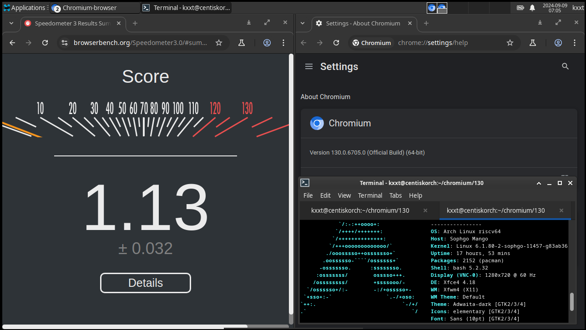

import PR from "@/components/mdx/PR"

It is well known that compiling a large software like Chromium can take a lot of resources. Most riscv64 linux distros are directly building
chromium on real riscv64 hardware or QEMU user-mode emulator. Packagers need to be very patient because of the poor performance of the RISC-V chips/emulators
at the current stage. Building chromium in qemu-user on 5950X can take at least 2.6 days to complete, and building it on slow hardwares like unmatched boards
can take a lot longer than that. The 64 core SG2042 server brought some excitement
[but later it was proven that some quirks or even system instability can be encountered when building chromium on it.](https://github.com/revyos/revyos/issues/27)

So the most reasonable way to build and develop (or hack on) chromium for RISC-V appears to be cross compilation. But as everyone knows, cross-compilation in general can be hard, let alone compiling such a large project like chromium. In the following post, I will walk you through the procedures about cross compiling mainline chromium for riscv64 from the absolute scratch, [staying as close to upstream as possible](https://docs.fedoraproject.org/en-US/package-maintainers/Staying_Close_to_Upstream_Projects/).

# Environment Preparation

For the purpose of this post, I assume you are cross compiling chromium from x86_64 to riscv64.
It might also be possible to do the cross-compilation on arm64 but I never tried.

The cross-compilation will be done in a [Debian bookworm](https://www.debian.org/releases/bookworm/) environment.
Don't worry if you are using other distros. We will setup a [systemd](https://syste.md/) container so it will work if you are using a [systemd](https://syste.md/) powered Linux distro. If not, then you can try to do it in a docker/podman container.

:::warning

You might insist on following this post on your beloved distro and I cannot stop you from doing that. Here's some problems you might encounter:

- Cross compiler uses different search paths than Debian sysroot(which we will build later), causing compiler errors
- `depot_tools` messes with your environment. After adding `depot_tools` to `PATH`, `ninja` and some binaries are wrapped and uses Google's prebuilt
instead of the ones installed on your system. And lots of binaries are downloaded from Google's server. So to avoid tainting your system, you might want to do it in a container.

::: 

## Creating the Container

:::tip

I put no assumption about your current working directory. But [building chromium should take at least 100GB disk space](https://chromium.googlesource.com/chromium/src/+/0862b0b17217aa69a4d8ab23b92310534160cde2/docs/linux/build_instructions.md#System-requirements)
and for faster build you should be using an SSD.

That being said, it's a common practice to place such containers in `/var/lib/machines` so that you can easily manage such containers with `machinectl`
without any additional configuration.

:::

Install `debootstrap` and create a base container:

```bash
sudo debootstrap bookworm ./chromium-devel
```

Then enter the container:

```bash
sudo systemd-nspawn -D chromium-devel/
```

You should be greeted with a root shell.

## Installing Dependencies

First, let's install some really basic stuff:

```bash
apt update && apt install -y curl git lsb-release python3 git file vim sudo
```

## Creating a non-root User

Building as root is bad, let's create a non-root user and give it sudo privillege.

```bash
useradd -m porter -G sudo -s /bin/bash
passwd porter
```

Then switch to the `porter` account and go home:

```bash
su porter
cd
```

Don't forget to set up your git config:

```bash
git config --global user.email "you@example.com"
git config --global user.name "Your Name"
```

## Install depot_tools

[`depot_tools`](https://chromium.googlesource.com/chromium/tools/depot_tools.git) are the official tools for Chromium development.
Most importantly, it includes `gclient` which manages hundreds of git repos. We will use it to fetch Chromium source code.

```bash
git clone https://chromium.googlesource.com/chromium/tools/depot_tools.git
```

Then permanently add it to `PATH` by adding the following line to your `.bashrc`:

```bash
export PATH="$HOME/depot_tools:$PATH"
```

Source the `.bashrc` to apply the change:

```bash
. .bashrc
```

# Fetch the Sources

First, create a directory for the sources and `cd` into it. I will use `~/Workspaces/chromium`:

```bash
mkdir -p Workspaces/chromium && cd $_
```

Then fetch the Chromium source code using the `fetch` command from `depot_tools`:

```bash
fetch --nohooks chromium
```

Mind the `--nohooks` argument because some dependencies are not yet installed.

This step can take quite a lot time depending on your network condition. While downloading, do something else and relax!

After it finishes, install additional dependencies:

```bash
sudo src/build/install-build-deps.sh
```

Then we can run the hooks(which download toolchains and sysroots and do some other stuff):

```bash
gclient runhooks
```

Then `cd` into `src`, the Chromium source repo.

:::note

The main branch is at commit `790c25b96b62748e965b7b5df8112b09ed179b35` at the time of writing.
For better reproducibility and less work, you can use this commit instead of `main` branch:

```bash
git checkout 790c25b96b62748e965b7b5df8112b09ed179b35
gclient sync
```

But hey, come on! You are not reading this post solely for the purpose of exactly reproduce the same result, right?
Let's build mainline and expect to solve some problems by yourself! If you have already run the above commands, run

```bash
git checkout main
gclient sync
```

to switch back to mainline. 

:::

# Build the Toolchains

Chromium uses its own LLVM(and Rust) toolchain. The LLVM toolchain is built with RISC-V target enabled but most components missing.
Most importantly, `compiler-rt` is missing. 
Building `compiler-rt` requires a Debian sysroot, as upstream doesn't maintain Debian sysroot for riscv64,
they cannot enable those components for riscv64, thus blocking riscv64 from being officially supported.

Debian only supports riscv64 in `sid` at the time of writing, while other architectures are using Debian `bulleye` sysroots. So it is unlikely that a
riscv64 sysroot patch will be accepted by upstream, at least before `trixie` is released with riscv64 support.

So in order to build a LLVM toolchain with sufficient riscv64 support, we need to build a Debian sysroot first.

## Debian Sysroot

Debian sysroots are placed in `build/linux`, and following the convention we should name our sysroot `debian_sid_riscv64-sysroot`.

Let's create a Debian sysroot via `debootstrap`. This is the most simple way to go.

```bash
sudo apt install -y debootstrap
sudo debootstrap \
  --arch=riscv64 \
  --include=qtbase5-dev,qt6-base-dev,qt6-base-dev-tools,krb5-multidev,libasound2-dev,libatk-bridge2.0-dev,libatk1.0-dev,libatspi2.0-dev,libblkid-dev,libbluetooth-dev,libc-dev-bin,libc6-dev,libcrypt-dev,libcups2-dev,libcurl4-gnutls-dev,libdbus-1-dev,libdbusmenu-glib-dev,libdbusmenu-gtk3-dev,libdevmapper1.02.1,libdrm-dev,libffi-dev,libflac-dev,libgbm-dev,libgcc-12-dev,libgcrypt20-dev,libgdk-pixbuf-2.0-dev,libgl1-mesa-dev,libglib2.0-dev,libglib2.0-dev-bin,libgtk-3-dev,libgtk-4-dev,libjsoncpp-dev,libkrb5-dev,libmount-dev,libnotify-dev,libnsl-dev,libnss3-dev,libpango1.0-dev,libpci-dev,libpcre2-dev,libpipewire-0.3-dev,libpulse-dev,libre2-dev,libselinux1-dev,libsepol-dev,libspeechd-dev,libstdc++-12-dev,libstdc++-13-dev,libtirpc-dev,libudev1,libva-dev,libx11-xcb-dev,libxkbcommon-x11-dev,libxshmfence-dev,linux-libc-dev,mesa-common-dev,uuid-dev,zlib1g-dev,wayland-protocols,libasan8 \
  sid \
  build/linux/debian_sid_riscv64-sysroot \
  https://snapshot.debian.org/archive/debian/20240907T023014Z/
```

Some of the packages might be unnecessary but the above command should work. 

:::tip

In case you need to add packages to the sysroot, you can chroot into the sysroot and use `apt` to
install packages if you have [set up QEMU user mode emulation on your host](https://wiki.archlinux.org/title/QEMU#Chrooting_into_arm/arm64_environment_from_x86_64).

If you didn't setup QEMU user mode emulation on your host, you can also add the new package to the list and remove then rebuild the sysroot.
In that case you probably want to use `--cache-dir` to avoid redownloading packages.

:::

You might encounter some errors about configuring packages, that doesn't affect our usage and we can ignore them.

:::note

As suggested by Revy, the errors come from the second stage of debootstrap. A more sane way to create the sysroot is to
debootstrap a base system first and then chroot into it to install other packages:

```bash
sudo debootstrap \
  --arch=riscv64 sid \
  build/linux/debian_sid_riscv64-sysroot \
  https://snapshot.debian.org/archive/debian/20240907T023014Z/

sudo chroot build/linux/debian_sid_riscv64-sysroot bash -e "echo 'qtbase5-dev,qt6-base-dev,qt6-base-dev-tools,krb5-multidev,libasound2-dev,libatk-bridge2.0-dev,libatk1.0-dev,libatspi2.0-dev,libblkid-dev,libbluetooth-dev,libc-dev-bin,libc6-dev,libcrypt-dev,libcups2-dev,libcurl4-gnutls-dev,libdbus-1-dev,libdbusmenu-glib-dev,libdbusmenu-gtk3-dev,libdevmapper1.02.1,libdrm-dev,libffi-dev,libflac-dev,libgbm-dev,libgcc-12-dev,libgcrypt20-dev,libgdk-pixbuf-2.0-dev,libgl1-mesa-dev,libglib2.0-dev,libglib2.0-dev-bin,libgtk-3-dev,libgtk-4-dev,libjsoncpp-dev,libkrb5-dev,libmount-dev,libnotify-dev,libnsl-dev,libnss3-dev,libpango1.0-dev,libpci-dev,libpcre2-dev,libpipewire-0.3-dev,libpulse-dev,libre2-dev,libselinux1-dev,libsepol-dev,libspeechd-dev,libstdc++-12-dev,libstdc++-13-dev,libtirpc-dev,libudev1,libva-dev,libx11-xcb-dev,libxkbcommon-x11-dev,libxshmfence-dev,linux-libc-dev,mesa-common-dev,uuid-dev,zlib1g-dev,wayland-protocols,libasan8' | tr ',' ' ' | xargs apt install -y"
```

But this assumes that you have [set up QEMU user mode emulation on your host](https://wiki.archlinux.org/title/QEMU#Chrooting_into_arm/arm64_environment_from_x86_64). 
If not, you can safely ignore the errors for now since that doesn't affect our sysroot usage in this blog post.

:::

Then we need to modify the sysroot because [chromium expect to find `pkgconfig`s in `<sysroot>/usr/lib/pkgconfig`](https://chromium.googlesource.com/chromium/src/+/790c25b96b62748e965b7b5df8112b09ed179b35/build/linux/sysroot_scripts/sysroot_creator.py#790):

And we need to remove `usr/bin/python*` because otherwise when building the LLVM toolchain it attempts to execute the `python` binary from the sysroot.

```bash
cd build/linux/debian_sid_riscv64-sysroot
sudo mv usr/lib/riscv64-linux-gnu/pkgconfig/* usr/lib/pkgconfig/
sudo rm usr/bin/python*
cd -
```

:::note

In a previous snapshot, the `libm.so` is an absolute symlink, causing troubles when building chromium.

The snapshot used above doesn't have this problem. But if you are using a different snapshot, feel free to
run `find <PATH_TO_SYSROOT> -type l -lname '/*' | grep lib` to search for absolute symlinks that might cause trouble for the build and manually replace them with equivalent relative symlinks.

:::


:::tip

You can also create the sysroot via [Chromium's sysroot creator script](https://chromium.googlesource.com/chromium/src/+/790c25b96b62748e965b7b5df8112b09ed179b35/build/linux/sysroot_scripts/sysroot_creator.py),
but this approach requires you to edit that script to support riscv64, which is not a trivial task.

For [electron riscv fork](https://github.com/riscv-forks/electron), I am taking this approach because it is more automatic and closer to upstream.
The relevant patch is `https://github.com/riscv-forks/electron/blob/README/sysroot.patch`.

:::

## LLVM Toolchain

It's possible to use other LLVM toolchains or even gcc(more patches are needed, of course). Note that for cross language LTO to work you'll need
the Rust toolchain to be built against matching LLVM. Such toolchains are also available for download on kernel.org: https://mirrors.edge.kernel.org/pub/tools/llvm/rust/.
This blog post aims to stay close to upstream so we will use Chromium's LLVM toolchain.

`tools/clang/scripts/build.py` builds Chromium's LLVM toolchain. It includes fuchsia and Android support which requires NDK to be present.
To avoid the need of setting up NDK and save build time, we will disable Android and fuchsia support when building the toolchain.

Apply the following patch that adds riscv64 support and disables some unnecessary parts for the purpose of this blog post.

```diff
From 793181377f3fadc5e239503d5f068cc7b9f65e65 Mon Sep 17 00:00:00 2001
From: kxxt <rsworktech@outlook.com>
Date: Sat, 10 Feb 2024 09:19:00 +0800
Subject: [PATCH] clang toolchain: riscv64 support

And drop android and fuchsia build to reduce build time.
---
 build/config/clang/BUILD.gn    |  2 ++
 tools/clang/scripts/build.py   | 21 +++++++++++-
 tools/clang/scripts/package.py | 62 ++++++++++------------------------
 3 files changed, 40 insertions(+), 45 deletions(-)

diff --git a/build/config/clang/BUILD.gn b/build/config/clang/BUILD.gn
index cbb5230967b17..e66ab2b0ee211 100644
--- a/build/config/clang/BUILD.gn
+++ b/build/config/clang/BUILD.gn
@@ -204,6 +204,8 @@ template("clang_lib") {
           _dir = "armv7-unknown-linux-gnueabihf"
         } else if (current_cpu == "arm64") {
           _dir = "aarch64-unknown-linux-gnu"
+        } else if (current_cpu == "riscv64") {
+          _dir = "riscv64-unknown-linux-gnu"
         } else {
           assert(false)  # Unhandled cpu type
         }
diff --git a/tools/clang/scripts/build.py b/tools/clang/scripts/build.py
index 0a6e21456e86f..e88b3b63d2137 100755
--- a/tools/clang/scripts/build.py
+++ b/tools/clang/scripts/build.py
@@ -548,10 +548,17 @@ def DownloadDebianSysroot(platform_name, skip_download=False):
       'arm': 'fe81e7114b97440262bce004caf02c1514732e2fa7f99693b2836932ad1c4626',
       # hash from https://chromium-review.googlesource.com/c/chromium/src/+/5506275/1/build/linux/sysroot_scripts/sysroots.json#21
       'arm64': '308e23faba3174bd01accfe358467b8a40fad4db4c49ef629da30219f65a275f',
+      'riscv64': 'SKIP',
   }
 
-  toolchain_name = f'debian_bullseye_{platform_name}_sysroot'
+  release = 'bullseye' if platform_name != 'riscv64' else 'sid'
+
+  toolchain_name = f'debian_{release}_{platform_name}_sysroot'
   output = os.path.join(LLVM_BUILD_TOOLS_DIR, toolchain_name)
+
+  if hashes[platform_name] == 'SKIP':
+    return output
+
   U = toolchain_bucket + hashes[platform_name]
   if not skip_download:
     DownloadAndUnpack(U, output)
@@ -837,6 +844,7 @@ def main():
     sysroot_i386 = DownloadDebianSysroot('i386', args.skip_checkout)
     sysroot_arm = DownloadDebianSysroot('arm', args.skip_checkout)
     sysroot_arm64 = DownloadDebianSysroot('arm64', args.skip_checkout)
+    sysroot_riscv64 = DownloadDebianSysroot('riscv64', args.skip_checkout)
 
     # Add the sysroot to base_cmake_args.
     if platform.machine() == 'aarch64':
@@ -1197,6 +1205,17 @@ def main():
         "sanitizers":
         True,
     }
+    runtimes_triples_args['riscv64-unknown-linux-gnu'] = {
+        "args": [
+            'CMAKE_SYSROOT=%s' % sysroot_riscv64,
+            # Can't run tests on x86 host.
+            'LLVM_INCLUDE_TESTS=OFF',
+        ],
+        "profile":
+        True,
+        "sanitizers":
+        True,
+    }
   elif sys.platform == 'win32':
     sysroot = os.path.dirname(os.path.dirname(GetWinSDKDir()))
     runtimes_triples_args['i386-pc-windows-msvc'] = {
diff --git a/tools/clang/scripts/package.py b/tools/clang/scripts/package.py
index fa6c150751d62..fe1a904637b57 100755
--- a/tools/clang/scripts/package.py
+++ b/tools/clang/scripts/package.py
@@ -237,7 +237,7 @@ def main():
     build_cmd = [
         sys.executable,
         os.path.join(THIS_DIR, 'build.py'), '--bootstrap', '--disable-asserts',
-        '--run-tests', '--pgo'
+        '--without-android', '--without-fuchsia', '--pgo'
     ]
     if sys.platform != 'darwin':
       build_cmd.append('--thinlto')
@@ -294,16 +294,6 @@ def main():
         # Add llvm-readobj (symlinked from llvm-readelf) for extracting SONAMEs.
         'bin/llvm-readobj',
     ])
-    if sys.platform != 'darwin':
-      # The Fuchsia runtimes are only built on non-Mac platforms.
-      want.update([
-          'lib/clang/$V/lib/aarch64-unknown-fuchsia/libclang_rt.builtins.a',
-          'lib/clang/$V/lib/x86_64-unknown-fuchsia/libclang_rt.builtins.a',
-          'lib/clang/$V/lib/x86_64-unknown-fuchsia/libclang_rt.profile.a',
-          'lib/clang/$V/lib/x86_64-unknown-fuchsia/libclang_rt.asan.so',
-          'lib/clang/$V/lib/x86_64-unknown-fuchsia/libclang_rt.asan-preinit.a',
-          'lib/clang/$V/lib/x86_64-unknown-fuchsia/libclang_rt.asan_static.a',
-      ])
   if sys.platform == 'darwin':
     runtime_package_name = 'clang-mac-runtime-library'
     runtime_packages = set([
@@ -347,36 +337,25 @@ def main():
         'lib/clang/$V/lib/i386-unknown-linux-gnu/libclang_rt.asan.a',
         'lib/clang/$V/lib/x86_64-unknown-linux-gnu/libclang_rt.asan.a',
         'lib/clang/$V/lib/x86_64-unknown-linux-gnu/libclang_rt.asan.a.syms',
+        'lib/clang/$V/lib/riscv64-unknown-linux-gnu/libclang_rt.asan.a',
+        'lib/clang/$V/lib/riscv64-unknown-linux-gnu/libclang_rt.asan.a.syms',
         'lib/clang/$V/lib/i386-unknown-linux-gnu/libclang_rt.asan_static.a',
         'lib/clang/$V/lib/x86_64-unknown-linux-gnu/libclang_rt.asan_static.a',
+        'lib/clang/$V/lib/riscv64-unknown-linux-gnu/libclang_rt.asan_static.a',
 
         # AddressSanitizer C++ runtime.
         'lib/clang/$V/lib/i386-unknown-linux-gnu/libclang_rt.asan_cxx.a',
         'lib/clang/$V/lib/x86_64-unknown-linux-gnu/libclang_rt.asan_cxx.a',
         'lib/clang/$V/lib/x86_64-unknown-linux-gnu/libclang_rt.asan_cxx.a.syms',
-
-        # AddressSanitizer Android runtime.
-        'lib/clang/$V/lib/linux/libclang_rt.asan-aarch64-android.so',
-        'lib/clang/$V/lib/linux/libclang_rt.asan-arm-android.so',
-        'lib/clang/$V/lib/linux/libclang_rt.asan-i686-android.so',
-        'lib/clang/$V/lib/linux/libclang_rt.asan-riscv64-android.so',
-        'lib/clang/$V/lib/linux/libclang_rt.asan_static-aarch64-android.a',
-        'lib/clang/$V/lib/linux/libclang_rt.asan_static-arm-android.a',
-        'lib/clang/$V/lib/linux/libclang_rt.asan_static-i686-android.a',
-        'lib/clang/$V/lib/linux/libclang_rt.asan_static-riscv64-android.a',
-
-        # Builtins for Android.
-        'lib/clang/$V/lib/linux/libclang_rt.builtins-aarch64-android.a',
-        'lib/clang/$V/lib/linux/libclang_rt.builtins-arm-android.a',
-        'lib/clang/$V/lib/linux/libclang_rt.builtins-i686-android.a',
-        'lib/clang/$V/lib/linux/libclang_rt.builtins-x86_64-android.a',
-        'lib/clang/$V/lib/linux/libclang_rt.builtins-riscv64-android.a',
+        'lib/clang/$V/lib/riscv64-unknown-linux-gnu/libclang_rt.asan_cxx.a',
+        'lib/clang/$V/lib/riscv64-unknown-linux-gnu/libclang_rt.asan_cxx.a.syms',
 
         # Builtins for Linux and Lacros.
         'lib/clang/$V/lib/aarch64-unknown-linux-gnu/libclang_rt.builtins.a',
         'lib/clang/$V/lib/armv7-unknown-linux-gnueabihf/libclang_rt.builtins.a',
         'lib/clang/$V/lib/i386-unknown-linux-gnu/libclang_rt.builtins.a',
         'lib/clang/$V/lib/x86_64-unknown-linux-gnu/libclang_rt.builtins.a',
+        'lib/clang/$V/lib/riscv64-unknown-linux-gnu/libclang_rt.builtins.a',
 
         # crtstart/crtend for Linux and Lacros.
         'lib/clang/$V/lib/aarch64-unknown-linux-gnu/clang_rt.crtbegin.o',
@@ -385,12 +364,8 @@ def main():
         'lib/clang/$V/lib/armv7-unknown-linux-gnueabihf/clang_rt.crtend.o',
         'lib/clang/$V/lib/x86_64-unknown-linux-gnu/clang_rt.crtbegin.o',
         'lib/clang/$V/lib/x86_64-unknown-linux-gnu/clang_rt.crtend.o',
-
-        # HWASAN Android runtime.
-        'lib/clang/$V/lib/linux/libclang_rt.hwasan-aarch64-android.so',
-        'lib/clang/$V/lib/linux/libclang_rt.hwasan-preinit-aarch64-android.a',
-        'lib/clang/$V/lib/linux/libclang_rt.hwasan-riscv64-android.so',
-        'lib/clang/$V/lib/linux/libclang_rt.hwasan-preinit-riscv64-android.a',
+        'lib/clang/$V/lib/riscv64-unknown-linux-gnu/clang_rt.crtbegin.o',
+        'lib/clang/$V/lib/riscv64-unknown-linux-gnu/clang_rt.crtend.o',
 
         # MemorySanitizer C runtime (pure C won't link with *_cxx).
         'lib/clang/$V/lib/x86_64-unknown-linux-gnu/libclang_rt.msan.a',
@@ -405,34 +380,33 @@ def main():
         'lib/clang/$V/lib/armv7-unknown-linux-gnueabihf/libclang_rt.profile.a',
         'lib/clang/$V/lib/i386-unknown-linux-gnu/libclang_rt.profile.a',
         'lib/clang/$V/lib/x86_64-unknown-linux-gnu/libclang_rt.profile.a',
-        'lib/clang/$V/lib/linux/libclang_rt.profile-i686-android.a',
-        'lib/clang/$V/lib/linux/libclang_rt.profile-x86_64-android.a',
-        'lib/clang/$V/lib/linux/libclang_rt.profile-aarch64-android.a',
-        'lib/clang/$V/lib/linux/libclang_rt.profile-arm-android.a',
-        'lib/clang/$V/lib/linux/libclang_rt.profile-riscv64-android.a',
+        'lib/clang/$V/lib/riscv64-unknown-linux-gnu/libclang_rt.profile.a',
 
         # ThreadSanitizer C runtime (pure C won't link with *_cxx).
         'lib/clang/$V/lib/x86_64-unknown-linux-gnu/libclang_rt.tsan.a',
         'lib/clang/$V/lib/x86_64-unknown-linux-gnu/libclang_rt.tsan.a.syms',
+        'lib/clang/$V/lib/riscv64-unknown-linux-gnu/libclang_rt.tsan.a',
+        'lib/clang/$V/lib/riscv64-unknown-linux-gnu/libclang_rt.tsan.a.syms',
 
         # ThreadSanitizer C++ runtime.
         'lib/clang/$V/lib/x86_64-unknown-linux-gnu/libclang_rt.tsan_cxx.a',
         'lib/clang/$V/lib/x86_64-unknown-linux-gnu/libclang_rt.tsan_cxx.a.syms',
+        'lib/clang/$V/lib/riscv64-unknown-linux-gnu/libclang_rt.tsan_cxx.a',
+        'lib/clang/$V/lib/riscv64-unknown-linux-gnu/libclang_rt.tsan_cxx.a.syms',
 
         # UndefinedBehaviorSanitizer C runtime (pure C won't link with *_cxx).
         'lib/clang/$V/lib/i386-unknown-linux-gnu/libclang_rt.ubsan_standalone.a',
         'lib/clang/$V/lib/x86_64-unknown-linux-gnu/libclang_rt.ubsan_standalone.a',
         'lib/clang/$V/lib/x86_64-unknown-linux-gnu/libclang_rt.ubsan_standalone.a.syms',
+        'lib/clang/$V/lib/riscv64-unknown-linux-gnu/libclang_rt.ubsan_standalone.a',
+        'lib/clang/$V/lib/riscv64-unknown-linux-gnu/libclang_rt.ubsan_standalone.a.syms',
 
         # UndefinedBehaviorSanitizer C++ runtime.
         'lib/clang/$V/lib/i386-unknown-linux-gnu/libclang_rt.ubsan_standalone_cxx.a',
         'lib/clang/$V/lib/x86_64-unknown-linux-gnu/libclang_rt.ubsan_standalone_cxx.a',
         'lib/clang/$V/lib/x86_64-unknown-linux-gnu/libclang_rt.ubsan_standalone_cxx.a.syms',
-
-        # UndefinedBehaviorSanitizer Android runtime, needed for CFI.
-        'lib/clang/$V/lib/linux/libclang_rt.ubsan_standalone-aarch64-android.so',
-        'lib/clang/$V/lib/linux/libclang_rt.ubsan_standalone-arm-android.so',
-        'lib/clang/$V/lib/linux/libclang_rt.ubsan_standalone-riscv64-android.so',
+        'lib/clang/$V/lib/riscv64-unknown-linux-gnu/libclang_rt.ubsan_standalone_cxx.a',
+        'lib/clang/$V/lib/riscv64-unknown-linux-gnu/libclang_rt.ubsan_standalone_cxx.a.syms',
 
         # Ignorelist for MemorySanitizer (used on Linux only).
         'lib/clang/$V/share/msan_*list.txt',
-- 
2.39.2

```

LLVM build script expects another sysroot to be installed. We can create a symlink to make it happy:

```bash
mkdir -p third_party/llvm-build-tools
ln -s ../../build/linux/debian_sid_riscv64-sysroot third_party/llvm-build-tools/debian_sid_riscv64_sysroot
```

Then start building LLVM toolchain:

```bash
# This script will package the toolchain in addition to building it.
tools/clang/scripts/package.py
```

:::bug

If you are building an older version of Chromium(less than `126.0.6478.185`), you might encounter the following issue when linking Chromium:

- [LLD segfault in `SymbolTableSection<ELFT>::writeTo`](https://github.com/llvm/llvm-project/issues/79944)

Please try a newer toolchain.

:::

## Rust Toolchain

Chromium's prebuilt rust toolchain already includes support for riscv64 target. So usually we don't need to do anything.

But in case you want to build an older version of Chromium, you need to be aware of the following two issues:

- [On riscv64gc linux, split-debuginfo ="unpacked" caused error: A dwo section may not contain relocations](https://github.com/rust-lang/rust/issues/110224)
fixed by me in <PR repo="rust-lang/rust" number="120518" title="riscv only supports split_debuginfo=off for now" half/> and available since rust 1.78.0
- [Cross-language LTO is broken for riscv64 lp64d](https://github.com/rust-lang/rust/issues/121924) fixed by me in <PR repo="rust-lang/rust" number="123612" title="Set target-abi module flag for RISC-V targets" half/> and available since rust 1.79.0

# Patch the Sources

Before building Chromium, we need to apply some RISC-V specific patches.

## Chromium

The riscv64 patch for sandbox: https://chromium-review.googlesource.com/c/chromium/src/+/4935120

Apply this patch by running:

```bash
git fetch https://chromium.googlesource.com/chromium/src refs/changes/20/4935120/3 && git cherry-pick FETCH_HEAD
```

And to make Chromium recognize our riscv64 sysroot, apply the following patch:

```diff
From 3ade41428a07f7bbc3e361011b0506aa7a4b213f Mon Sep 17 00:00:00 2001
From: kxxt <rsworktech@outlook.com>
Date: Sat, 10 Feb 2024 10:10:53 +0800
Subject: [PATCH] sysroot: riscv64 support

---
 build/config/sysroot.gni                       | 4 +++-
 build/linux/sysroot_scripts/install-sysroot.py | 8 +++++---
 build/linux/sysroot_scripts/sysroots.json      | 5 +++++
 3 files changed, 13 insertions(+), 4 deletions(-)

diff --git a/build/config/sysroot.gni b/build/config/sysroot.gni
index 47fe4cbc840dd..965890580f417 100644
--- a/build/config/sysroot.gni
+++ b/build/config/sysroot.gni
@@ -22,7 +22,7 @@ declare_args() {
   use_sysroot =
       current_cpu == "x86" || current_cpu == "x64" || current_cpu == "arm" ||
       current_cpu == "arm64" || current_cpu == "mipsel" ||
-      current_cpu == "mips64el" || (current_cpu == "riscv64" && is_android)
+      current_cpu == "mips64el" || current_cpu == "riscv64"
 }
 
 if (sysroot == "") {
@@ -49,6 +49,8 @@ if (sysroot == "") {
       sysroot = "$target_sysroot_dir/debian_bullseye_armhf-sysroot"
     } else if (current_cpu == "arm64") {
       sysroot = "$target_sysroot_dir/debian_bullseye_arm64-sysroot"
+    } else if (current_cpu == "riscv64") {
+      sysroot = "$target_sysroot_dir/debian_sid_riscv64-sysroot"
     } else {
       assert(false, "No linux sysroot for cpu: $target_cpu")
     }
diff --git a/build/linux/sysroot_scripts/install-sysroot.py b/build/linux/sysroot_scripts/install-sysroot.py
index abd58136efc83..22b63794f1e7c 100755
--- a/build/linux/sysroot_scripts/install-sysroot.py
+++ b/build/linux/sysroot_scripts/install-sysroot.py
@@ -36,7 +36,7 @@ from urllib.request import urlopen
 SCRIPT_DIR = os.path.dirname(os.path.abspath(__file__))
 SRC_DIR = os.path.dirname(os.path.dirname(os.path.dirname(SCRIPT_DIR)))
 
-VALID_ARCHS = ("amd64", "i386", "armhf", "arm64", "mipsel", "mips64el")
+VALID_ARCHS = ("amd64", "i386", "armhf", "arm64", "mipsel", "mips64el", "riscv64")
 
 ARCH_TRANSLATIONS = {
     "x64": "amd64",
@@ -89,14 +89,16 @@ def main(args):
         sysroots_json_path = DEFAULT_SYSROOTS_PATH
 
     if options.arch:
+        target_platform = 'sid' if options.arch == 'riscv64' else DEFAULT_TARGET_PLATFORM
         InstallSysroot(
             sysroots_json_path,
-            DEFAULT_TARGET_PLATFORM,
+            target_platform,
             ARCH_TRANSLATIONS.get(options.arch, options.arch),
         )
     elif options.all:
         for arch in VALID_ARCHS:
-            InstallSysroot(sysroots_json_path, DEFAULT_TARGET_PLATFORM, arch)
+            target_platform = 'sid' if arch == 'riscv64' else DEFAULT_TARGET_PLATFORM
+            InstallSysroot(sysroots_json_path, target_platform, arch)
     else:
         print("You much specify one of the options.")
         return 1
diff --git a/build/linux/sysroot_scripts/sysroots.json b/build/linux/sysroot_scripts/sysroots.json
index f146ea68bc72d..6d305f1b1fc51 100644
--- a/build/linux/sysroot_scripts/sysroots.json
+++ b/build/linux/sysroot_scripts/sysroots.json
@@ -34,5 +34,10 @@
         "SysrootDir": "debian_bullseye_mipsel-sysroot",
         "Tarball": "debian_bullseye_mipsel_sysroot.tar.xz",
         "URL": "https://commondatastorage.googleapis.com/chrome-linux-sysroot"
+    },
+    "sid_riscv64": {
+        "SysrootDir": "debian_sid_riscv64-sysroot",
+        "Tarball": "debian_sid_riscv64_sysroot.tar.xz",
+        "URL": "DUMMY"
     }
 }
-- 
2.39.2

```

In order to build Linux installer (deb and rpm packages), apply the following patch:

```diff
From 8a7431dab05449316e952ee38a5de04f7e508617 Mon Sep 17 00:00:00 2001
From: kxxt <rsworktech@outlook.com>
Date: Sat, 10 Feb 2024 10:04:49 +0800
Subject: [PATCH 1/3] installer: riscv64 support

---
 chrome/installer/linux/BUILD.gn | 4 ++++
 1 file changed, 4 insertions(+)

diff --git a/chrome/installer/linux/BUILD.gn b/chrome/installer/linux/BUILD.gn
index 51f7c978a0b32..ce94b6fb4aa55 100644
--- a/chrome/installer/linux/BUILD.gn
+++ b/chrome/installer/linux/BUILD.gn
@@ -453,6 +453,8 @@ template("linux_package") {
       deb_arch = "mips64el"
     } else if (current_cpu == "loong64") {
       deb_arch = "loong64"
+    } else if (current_cpu == "riscv64") {
+      deb_arch = "riscv64"
     } else {
       assert(false, "Linux installer not configured for this architecture.")
     }
@@ -504,6 +506,8 @@ template("linux_package") {
         rpm_arch = "mips64el"
       } else if (current_cpu == "loong64") {
         rpm_arch = "loongarch64"
+      } else if (current_cpu == "riscv64") {
+        rpm_arch = "riscv64"
       } else {
         assert(false, "Linux installer not configured for this architecture.")
       }
-- 
2.46.0

```

And apply the following patches to fix build:

Upstream CL Link: https://chromium-review.googlesource.com/c/chromium/src/+/5850670

```diff
From 77941f390f27b8f439956d78682a571e6d9b5bd8 Mon Sep 17 00:00:00 2001
From: kxxt <rsworktech@outlook.com>
Date: Sun, 8 Sep 2024 13:57:06 +0200
Subject: [PATCH 2/3] [riscv] cargo_crate.gni: add riscv64 case

---
 build/rust/cargo_crate.gni | 2 +-
 1 file changed, 1 insertion(+), 1 deletion(-)

diff --git a/build/rust/cargo_crate.gni b/build/rust/cargo_crate.gni
index e5d1b2f831e6d..ded0204dcae7a 100644
--- a/build/rust/cargo_crate.gni
+++ b/build/rust/cargo_crate.gni
@@ -429,7 +429,7 @@ template("cargo_crate") {
           rust_abi_target,
         ]
       }
-      if (current_cpu == "arm64" || current_cpu == "x64") {
+      if (current_cpu == "arm64" || current_cpu == "x64" || current_cpu == "riscv64") {
         args += [
           "--pointer-width",
           "64",
-- 
2.46.0

```

A workaround for partition allocator:

It will be fixed in https://chromium-review.googlesource.com/c/chromium/src/+/5839530 .


```diff
From 82d266dd56d0e3ee782e984eba0725fe2320cd93 Mon Sep 17 00:00:00 2001
From: kxxt <rsworktech@outlook.com>
Date: Sun, 08 Sep 2024 15:18:23 +0200
Subject: [PATCH] Ensure lock not on the same cacheline as read-mostly flags in PartitionRoot

Fix static assertion failure(from the end of partition_root.cc) when
compiling for riscv64.

Bug: none
Change-Id: I365a02a906354deecb592b9c204cf57d33a38857
---

diff --git a/base/allocator/partition_allocator/src/partition_alloc/partition_root.h b/base/allocator/partition_allocator/src/partition_alloc/partition_root.h
index 09481b6d..01f8ae78 100644
--- a/base/allocator/partition_allocator/src/partition_alloc/partition_root.h
+++ b/base/allocator/partition_allocator/src/partition_alloc/partition_root.h
@@ -284,7 +284,8 @@
 
   // Not used on the fastest path (thread cache allocations), but on the fast
   // path of the central allocator.
-  alignas(std::hardware_destructive_interference_size) internal::Lock lock_;
+  alignas(std::hardware_destructive_interference_size) alignas(
+      64) internal::Lock lock_;
 
   Bucket buckets[internal::kNumBuckets] = {};
   Bucket sentinel_bucket{};

```

:::note

I also consider this is a bug in gcc/clang.

[By default, `std::hardware_destructive_interference_size` is set to 32 by gcc for targets that does not override it.](https://gcc.gnu.org/pipermail/libstdc++/2024-September/059490.html)
[And clang takes the values from gcc.](https://github.com/llvm/llvm-project/pull/89446)
But most riscv64 cpus have an L1 cacheline size of 64 bytes. If 32 is used here the performance will be worse than using 64.

[This bug is reported to GCC upstream, but it probably will take some time before the value is updated to 64 for riscv.](https://gcc.gnu.org/bugzilla/show_bug.cgi?id=116662)

[This commit about using `std::hardware_destructive_interference_size` is reverted in a later commit](https://chromium-review.googlesource.com/c/chromium/src/+/5841144) but might reland in the future.

:::

## ffmpeg

Chromium doesn't use ffmpeg's build system. It stores generated files like `config.h` for every architecture/platform combination.
So this means that we need to build the generated files for riscv64.

First, let's apply this patch to Chromium:

```diff
From c584ec24dcc628c7a7df6637811f3b369dd49043 Mon Sep 17 00:00:00 2001
From: Levi Zim <rsworktech@outlook.com>
Date: Tue, 11 Jun 2024 04:14:28 +0200
Subject: [PATCH] media/ffmpeg: add riscv64 support

---
 media/ffmpeg/scripts/build_ffmpeg.py    | 16 +++++++++++++++-
 media/ffmpeg/scripts/generate_gn.py     |  2 +-
 media/ffmpeg/scripts/robo_lib/config.py |  2 +-
 3 files changed, 17 insertions(+), 3 deletions(-)

diff --git a/media/ffmpeg/scripts/build_ffmpeg.py b/media/ffmpeg/scripts/build_ffmpeg.py
index 3661b91740ae0..16b135d38f70a 100755
--- a/media/ffmpeg/scripts/build_ffmpeg.py
+++ b/media/ffmpeg/scripts/build_ffmpeg.py
@@ -42,7 +42,7 @@ BRANDINGS = [
 
 ARCH_MAP = {
     'android': ['ia32', 'x64', 'arm-neon', 'arm64'],
-    'linux': ['ia32', 'x64', 'noasm-x64', 'arm', 'arm-neon', 'arm64'],
+    'linux': ['ia32', 'x64', 'noasm-x64', 'arm', 'arm-neon', 'arm64', 'riscv64'],
     'mac': ['x64', 'arm64'],
     'win': ['ia32', 'x64', 'arm64'],
 }
@@ -897,6 +897,20 @@ def ConfigureAndBuild(target_arch, target_os, host_os, host_arch,
                     '--extra-cflags=--target=mips64el-linux-gnuabi64',
                     '--extra-ldflags=--target=mips64el-linux-gnuabi64',
                 ])
+        elif target_arch == "riscv64":
+            configure_flags['Common'].extend([
+              '--arch=riscv64',
+              '--extra-cflags=-march=rv64gc',
+            ])
+            if target_os == 'linux':
+                configure_flags['Common'].extend([
+                    '--enable-cross-compile',
+                    '--target-os=linux',
+                    '--sysroot=' + os.path.join(
+                        CHROMIUM_ROOT_DIR, 'build/linux/debian_sid_riscv64-sysroot'),
+                    '--extra-cflags=--target=riscv64-linux-gnu',
+                    '--extra-ldflags=--target=riscv64-linux-gnu',
+                ])
         else:
             print('Error: Unknown target arch %r for target OS %r!' %
                   (target_arch, target_os),
diff --git a/media/ffmpeg/scripts/generate_gn.py b/media/ffmpeg/scripts/generate_gn.py
index 12455913ea76f..4611c274bf161 100755
--- a/media/ffmpeg/scripts/generate_gn.py
+++ b/media/ffmpeg/scripts/generate_gn.py
@@ -78,7 +78,7 @@ GN_SOURCE_END = """]
 _Attrs = ('ARCHITECTURE', 'TARGET', 'PLATFORM')
 Attr = collections.namedtuple('Attr', _Attrs)(*_Attrs)
 SUPPORT_MATRIX = {
-    Attr.ARCHITECTURE: set(['ia32', 'x64', 'arm', 'arm64', 'arm-neon']),
+    Attr.ARCHITECTURE: set(['ia32', 'x64', 'arm', 'arm64', 'arm-neon', 'riscv64']),
     Attr.TARGET: set(['Chromium', 'Chrome']),
     Attr.PLATFORM: set(['android', 'linux', 'win', 'mac'])
 }
diff --git a/media/ffmpeg/scripts/robo_lib/config.py b/media/ffmpeg/scripts/robo_lib/config.py
index 84a6bf5196d95..7f0c3d0a7f221 100644
--- a/media/ffmpeg/scripts/robo_lib/config.py
+++ b/media/ffmpeg/scripts/robo_lib/config.py
@@ -204,7 +204,7 @@ class RoboConfiguration:
             self._host_operating_system = "linux"
 
             try:
-                with open("/etc/lsb-release", "r") as f:
+                with open("/etc/os-release", "r") as f:
                     result = f.read()
                     if "Ubuntu" in result or "Debian" in result:
                         self._os_flavor = packages.OsFlavor.Debian
-- 
2.39.2

```

Then let's build ffmpeg for riscv64:

```bash
export PATH="/home/porter/Workspaces/chromium/src/third_party/llvm-build/Release+Asserts/bin:$PATH"
media/ffmpeg/scripts/build_ffmpeg.py linux riscv64
```

After building, you should see:

```
Done. If desired you may copy config.h/config.asm into the source/config tree using copy_config.sh. 
```

To do that, first `cd` into `third_party/ffmpeg`, then patch:

```diff
From de2123a51e19938903c4b96cc5568c764f00c996 Mon Sep 17 00:00:00 2001
From: kxxt <rsworktech@outlook.com>
Date: Sun, 8 Sep 2024 06:25:01 +0200
Subject: [PATCH] ffmpeg: include riscv64 in copy_config.h

---
 chromium/scripts/copy_config.sh | 2 +-
 1 file changed, 1 insertion(+), 1 deletion(-)

diff --git a/chromium/scripts/copy_config.sh b/chromium/scripts/copy_config.sh
index a18048cf04..0d080211aa 100755
--- a/chromium/scripts/copy_config.sh
+++ b/chromium/scripts/copy_config.sh
@@ -10,7 +10,7 @@ for os in android linux linux-noasm mac win; do
     # Copy config files for various architectures:
     #   - ia32/x64 have config.asm, config.h
     #   - arm/arm-neon have config.h
-    for arch in arm arm-neon arm64 ia32 x64 mipsel mips64el; do
+    for arch in arm arm-neon arm64 ia32 x64 mipsel mips64el riscv64; do
       # Don't waste time on non-existent configs, if no config.h then skip.
       [ ! -e "build.$arch.$os/$target/config.h" ] && continue
       for f in config.h config_components.h config.asm libavutil/avconfig.h libavutil/ffversion.h libavcodec/bsf_list.c libavcodec/codec_list.c libavcodec/parser_list.c libavformat/demuxer_list.c libavformat/muxer_list.c libavformat/protocol_list.c; do
-- 
2.39.2

```

and run `copy_config.sh`:

```bash
chromium/scripts/copy_config.sh
```

:::note

[`copy_config.sh` was removed when Chromium moved most of the scripts from `third_party/ffmpeg` to `media/ffmpeg`.](https://chromium-review.googlesource.com/c/chromium/third_party/ffmpeg/+/5436037)
It's unclear to me why they did that, [but it has been added back for now and might be converted into a Python script in the future](https://chromium-review.googlesource.com/c/chromium/third_party/ffmpeg/+/5732592/comment/3f0b76cb_9ff11d3f/).

So for some old versions of Chromium between these two commits, there's no `copy_config.sh` available. You need to copy the config files manually or obtain `copy_config.sh` elsewhere.

:::

Then you should see some generated files are copied to `chromium/config` for riscv64:

```bash
$ git status
HEAD detached from 6711fb8465
Untracked files:
  (use "git add <file>..." to include in what will be committed)
        chromium/config/Chrome/linux/riscv64/
        chromium/config/Chromium/linux/riscv64/

nothing added to commit but untracked files present (use "git add" to track)

```

We are not done yet. We need to update Chromium's ffmpeg build recipe for riscv64. 

```bash
../../media/ffmpeg/scripts/generate_gn.py
```

`generate_gn.py` updates `ffmpeg_generated.gni` by scanning all the build dirs of ffmpeg for every architecture/platform combination.

Previously we generated the build dir for riscv64: `build.riscv64.linux`. Then the generated `ffmpeg_generated.gni` only comes with riscv64
linux support. 

In order to support other architecture/platform combinations, build them before running `generate_gn.py`. 

Some executables for the build architecture also need ffmpeg, so we also need to build ffmpeg for our build architecture(x86_64):

```
sudo apt install -y yasm
../../media/ffmpeg/scripts/build_ffmpeg.py linux x64
chromium/scripts/copy_config.sh
../../media/ffmpeg/scripts/generate_gn.py
```

## SwiftShader

SwiftShader supports riscv64, but compiling with the default LLVM 10 results in compiler errors.
So let's apply a patch for switching to LLVM 16:

`cd` into `third_party/swiftshader` and apply the following patch:

```diff
From 563b597de79e12e6aad67614b21df2d802cadce5 Mon Sep 17 00:00:00 2001
From: Levi Zim <rsworktech@outlook.com>
Date: Sun, 28 Jan 2024 09:08:09 +0800
Subject: [PATCH] Default to use llvm16
MIME-Version: 1.0
Content-Type: text/plain; charset=UTF-8
Content-Transfer-Encoding: 8bit

Fix the following error when compiling chromium targeting riscv64 using llvm 10

../../third_party/swiftshader/src/Reactor/LLVMJIT.cpp:796:83: error: no member named 'Create' in 'llvm::jitlink::InProcessMemoryManager'
  796 |             , objectLayer(session, llvm::cantFail(llvm::jitlink::InProcessMemoryManager::Create()))
      |                                                   ~~~~~~~~~~~~~~~~~~~~~~~~~~~~~~~~~~~~~~~^
1 error generated

Change-Id: Ideb0c987dad35ca06b247e18ded6398f313921de
Reviewed-on: https://swiftshader-review.googlesource.com/c/SwiftShader/+/73008
Commit-Queue: Shahbaz Youssefi <syoussefi@google.com>
Kokoro-Result: kokoro <noreply+kokoro@google.com>
Reviewed-by: Shahbaz Youssefi <syoussefi@google.com>
Presubmit-Ready: Shahbaz Youssefi <syoussefi@google.com>
Tested-by: Shahbaz Youssefi <syoussefi@google.com>
Reviewed-by: Alexis Hétu <sugoi@google.com>
---
 src/Reactor/BUILD.gn | 2 +-
 1 file changed, 1 insertion(+), 1 deletion(-)

diff --git a/src/Reactor/BUILD.gn b/src/Reactor/BUILD.gn
index 67dfeb0ec..dcb13614a 100644
--- a/src/Reactor/BUILD.gn
+++ b/src/Reactor/BUILD.gn
@@ -307,7 +307,7 @@ if (supports_subzero) {
 
 if (supports_llvm) {
   swiftshader_source_set("swiftshader_llvm_reactor") {
-    llvm_dir = "../../third_party/llvm-10.0"
+    llvm_dir = "../../third_party/llvm-16.0"
 
     deps = [
       ":swiftshader_reactor_base",
-- 
2.39.2

```

:::note

As you can see, this patch has been merged. But later it was reverted because it breaks Chromium's CI.

So we still need to manually apply this patch.

:::

## V8

[RISC-V support is already in upstream V8](https://issues.chromium.org/issues/42200975), but it appears that V8 development doesn't take riscv64
into consideration and it's up to the RISC-V team to fix breakages afterwards. This often results in not buildable V8 releases for riscv64.
So we usually need to backport some V8 patches or update V8 to a new version.

At Chromium commit `790c25b96b62748e965b7b5df8112b09ed179b35`, there's no problem about compiling and running v8 for riscv64.

But you might run into some compiler errors when building other revisions. 

# Configure

Please read https://www.chromium.org/developers/gn-build-configuration/ to learn more about gn build configuration.

To do a release build, run

```bash
gn gen out/Release-riscv64 --args='
is_official_build=true
is_debug=false
is_clang=true
target_cpu="riscv64"
treat_warnings_as_errors=false
chrome_pgo_phase=0
use_debug_fission=false
symbol_level=1'
```

For the purpose of simplifying this blog post, here I added `treat_warnings_as_errors=false`. If this flag is not added, you will need to apply
more patches to make Chromium compile.
And `use_debug_fission` is set to `false` to workaround [`-gsplit-dwarf is unsupported with RISC-V linker relaxation (-mrelax)`.](https://maskray.me/blog/2021-03-14-the-dark-side-of-riscv-linker-relaxation)


# Build

```bash
ninja -C out/Release-riscv64 chrome
```

If you are building mainline instead of commit `790c25b96b62748e965b7b5df8112b09ed179b35`, then fix any build errors that arise and rerun it until success.

# Run & Debug

First, strip Chromium, it's too large if not stripped.

```bash
ninja -C out/Release-riscv64 chrome.stripped
```

Then we can use the following simple script to create a tarball of Chromium:

```bash
#!/bin/bash
OUT=out/Release-riscv64

pkgdir=chromium-dist
mkdir -p "$pkgdir"

install -D "$OUT"/chrome.stripped "$pkgdir/chromium"
install -Dm4755 "$OUT"/chrome_sandbox "$pkgdir/chrome-sandbox"

files=(
    chrome_100_percent.pak
    chrome_200_percent.pak
    chrome_crashpad_handler
    libqt5_shim.so
    libqt6_shim.so
    resources.pak
    v8_context_snapshot.bin

    # ANGLE
    libEGL.so
    libGLESv2.so

    # SwiftShader ICD
    libvk_swiftshader.so
    libvulkan.so.1
    vk_swiftshader_icd.json

    # ICU
    icudtl.dat
)

cp "${files[@]/#/$OUT/}" "$pkgdir"

install -Dm644 -t "$pkgdir/locales" "$OUT"/locales/*.pak

tar --zstd -cf chromium-dist.tar.zst --directory="$pkgdir" .
```

Now you can transfer `chromium-dist.tar.zst` to real riscv64 board to test the freshly built Chromium!

:::note

Chromium provides targets for creating deb and rpm packages.

But our sysroot is built using `debootstrap`, which doesn't support Chromium's way of building deb package.

You need to use a sysroot created by Chromium's sysroot creator script for the following two commands to work.

You might need to clean your out dir and restart the build if the sysroot is changed.

```bash
# Build deb
ninja -C out/Release-riscv64 "chrome/installer/linux:unstable_deb"
# Build rpm
ninja -C out/Release-riscv64 "chrome/installer/linux:unstable_rpm"
```

:::


Here's a screenshot of the freshly built mainline Chromium running on [Arch Linux RISC-V](https://archriscv.felixc.at/):




# Upstream Your Patch

If you have developed a patch for making Chromium better on riscv64. Don't forget to upstream your patch.

[In general, Chromium usually will accept small/medium changes that has negligible cost, but adding a large amount of code or new abstraction
for a currently unsupported architecture like RISC-V won't be accepted.](https://chromium.googlesource.com/chromium/src/+/main/docs/contributing.md#code-guidelines)

See https://chromium.googlesource.com/chromium/src/+/main/docs/contributing.md for more details on how to upstream your patch.

# Electron for RISC-V

Electron has an infrastructure for applying patches to Chromium, and [the riscv fork of electron](https://github.com/riscv-forks/electron)
uses it to apply riscv64 patches.

So it's very likely that you can find riscv64 patches for some old versions of Chromium there.

# Thanks

Finally, thanks [Revy](https://github.com/RevySR) for inspiring me to write this blog post and helping me to improve it.
