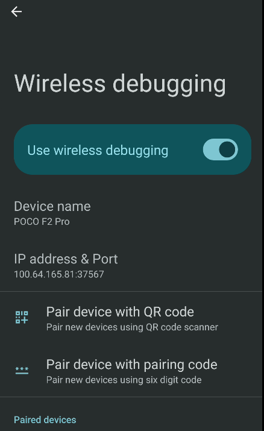

:::info

Revision history:

- 2025-06-06: Initial publication.
- 2025-06-14: Add [Handling fwmarks Conflicts](#handling-fwmarks-conflicts) and [Co-existence with Android System VPN](#co-existence-with-android-system-vpn)

:::

In the previous blog post, I wrote about [remote unlocking of LUKS encrypted rootfs with tailscale on Arch Linux](../archlinux-remote-luks-rootfs-unlock/).
To be honest, there are already a lot of blogs and wiki pages about remote unlocking of LUKS encrypted rootfs.
But it seems that no one write about remote unlocking of Android phones with tailscale.
There are quite a lot interests in running **linux tailscale daemon** on Android,
for example,
- [Magisk-Tailscaled](https://github.com/anasfanani/Magisk-Tailscaled)
- [A github issue in tailscale repo](https://github.com/tailscale/tailscale/issues/394)
- [A fork of tailscale for Android](https://github.com/gbraad-tailscale/tailscaled-android)
- [An issue about tailscale in termux](https://github.com/termux/termux-packages/issues/10166)
- [My previous attempt](../clash-for-android-and-tailscale) which runs tailscale daemon to provide a SOCKS5 server for clash

But the above solutions does not provide a full-featured tailscale experience because they all
use `userspace-networking` instead of `tun` and thus does not work transparently.

By full-featured, I mean that
- Tailscale is directly integrated into system routing decisions.
- You can use another Android VPN app with it without any special configuration.
- Tailscale SSH works, so that you can get a remote shell of your phone.

Of course, there are currently some non-working features like MagicDNS.
But I don't think that is technically impossible.
Personally I disable MagicDNS on all my devices and thus I won't work on getting it work.

# Why

Don't ask me why. Who don't want to access their devices from anywhere?
And it could offer some degree of help if you accidentally lose your phone.

More importantly, if you decided to go crazy and [self-host some services on an Android phone](../self-hosting-services-on-android-phone/), tailscale would provide an easy way to access them
since usually the phone won't get a public IPv4 address. (You can even try more crazy stuff
like reverse proxying it via an nginx server running on a VPS)

# A Quick Refresher on Android FBE

This blog post will use `/data/tailscale` to store tailscale state. To better understand the rationale and
implication, let's have a quick refresher on [Android FBE](https://source.android.com/docs/security/features/encryption/file-based):

Current Android phones encrypt the userdata partition with file-based encryption instead of full disk encryption like LUKS.
This approach provides more flexibility because different files can be encrypted with different keys.
On Android, there are two classes of storage used in FBE,

- Credential Encrypted (CE) storage, which is only available after the user unlocked the device.
- Device Encrypted (DE) storage, which is available before the user unlocks the device. (But it is still encrypted!)

`/data/tailscale` will be in Device Encrypted storage, which means that we can have tailscale daemon running
before the user unlocks the device (Great!). But this also means that the tailscale secret keys are not protected by your Android password.

# Requirements

First, the only hard requirement:

- A rooted Android phone (I only tested it on Android 15, but it should work for recent Android releases)

Then, here are some soft requirements only necessary if you want to follow this blog's approach:

- You are building the Android system you use from source.
- You are **familiar** with building Android system from source

If you don't meet the soft requirements, don't worry.
There are other ways to do it like writing a magisk module.

# Patching Tailscale for Android

I have created [a fork of tailscale for running a full-featured daemon on Android](https://github.com/android-kxxt/external_tailscale).
This section explains some of the patches in that fork. So you may just skip this section if you are not interested
in the technical details.

The tailscale daemon is written in golang.
It already contains support for `GOOS=android` with the intention to be used in tailscale's official Android app.
The code base already has lots of branches for handling Android quirks.
Some of them only applies to official app without root permission, while others apply to Android platform in general.

We would need a linux like tailscaled instead of a binary to be used within the official app.
There are two ways to move forward,
- Build with `GOOS=linux` and update the code to handle Android edge cases
- Build with `GOOS=android` and update the code to align the behavior of Android to Linux.

Both approaches are reasonable to some degree. I randomly chose the second approach.

## Aligning the behavior to Linux

This is the boring part.
Update `go:build` directives and `if/switch` branches to use linux code for android. For example:

```diff
From 1cdf1aad17d80a79a52bd699e7c14c3a63707bc4 Mon Sep 17 00:00:00 2001
From: kxxt <rsworktech@outlook.com>
Date: Mon, 2 Jun 2025 15:53:40 +0800
Subject: [PATCH] Use linux router on Android

---
 wgengine/router/router_android.go | 2 +-
 wgengine/router/router_linux.go   | 2 --
 2 files changed, 1 insertion(+), 3 deletions(-)

diff --git a/wgengine/router/router_android.go b/wgengine/router/router_android.go
index deeccda4a..79dab99e6 100644
--- a/wgengine/router/router_android.go
+++ b/wgengine/router/router_android.go
@@ -1,7 +1,7 @@
 // Copyright (c) Tailscale Inc & AUTHORS
 // SPDX-License-Identifier: BSD-3-Clause
 
-//go:build android
+//go:build ignore
 
 package router
 
diff --git a/wgengine/router/router_linux.go b/wgengine/router/router_linux.go
index adc54c88d..80191b248 100644
--- a/wgengine/router/router_linux.go
+++ b/wgengine/router/router_linux.go
@@ -1,8 +1,6 @@
 // Copyright (c) Tailscale Inc & AUTHORS
 // SPDX-License-Identifier: BSD-3-Clause
 
-//go:build !android
-
 package router
 
 import (
```

## Carefully handle IP rules

Tailscale uses quite a few IP rules where it seems that just a single rule would suffice.

```
5210:   from all fwmark 0x80000/0xff0000 lookup main
5230:   from all fwmark 0x80000/0xff0000 lookup default
5250:   from all fwmark 0x80000/0xff0000 unreachable
5270:   from all lookup 52
```

They actually justified it in the comments:

```go
// baseIPRules are the policy routing rules that Tailscale uses, when not
// running on a UBNT device.
//
// The priority is the value represented here added to r.ipPolicyPrefBase,
// which is usually 5200.
//
// NOTE(apenwarr): We leave spaces between each pref number.
// This is so the sysadmin can override by inserting rules in
// between if they want.
//
// NOTE(apenwarr): This sequence seems complicated, right?
// If we could simply have a rule that said "match packets that
// don't have this fwmark", then we would only need to add one link
// to table 52 and we'd be done. Unfortunately, older kernels
// and 'ip rule' implementations (including busybox), don't support
// checking for the lack of a fwmark, only the presence. The technique
// below works even on very old kernels.
```

So they are using a complicated approach to support old kernels and old `ip rule` implementations.
Sounds fair.

But let's review the complicated approach when we use it on Android. Here is what we get:

```
0:      from all lookup local
5210:   from all fwmark 0x80000/0xff0000 lookup main
5230:   from all fwmark 0x80000/0xff0000 lookup default
5250:   from all fwmark 0x80000/0xff0000 unreachable
5270:   from all lookup 52
10000:  from all fwmark 0xc0000/0xd0000 lookup legacy_system
11000:  from all iif lo oif dummy0 uidrange 0-0 lookup dummy0
11000:  from all iif lo oif rmnet_data0 uidrange 0-0 lookup rmnet_data0
16000:  from all fwmark 0x10063/0x1ffff iif lo lookup local_network
16000:  from all fwmark 0xd0001/0xdffff iif lo lookup rmnet_data0
17000:  from all iif lo oif dummy0 lookup dummy0
17000:  from all fwmark 0xc0000/0xc0000 iif lo oif rmnet_data0 lookup rmnet_data0
18000:  from all fwmark 0x0/0x10000 lookup legacy_system
19000:  from all fwmark 0x0/0x10000 lookup legacy_network
20000:  from all fwmark 0x0/0x10000 lookup local_network
32000:  from all unreachable
```

The sutle problem is that Android comes with its own set of complicated ip rules.
If a packet is marked by tailscale's bypass fwmark, by rules with pref `5210` and `5230` it would directly
land in the main and default routing table, bypassing all Android system rules with pref higher than 10000.

The solution is simplifying the rules as I do not need to support old kernels or `ip rule` implementations:  

```
5270:   not from all fwmark 0x80000/0xff0000 lookup 52 
```

```diff
From 1532c1671cd65ec9028d123649ce16ae48c77ac4 Mon Sep 17 00:00:00 2001
From: kxxt <rsworktech@outlook.com>
Date: Mon, 2 Jun 2025 16:22:07 +0800
Subject: [PATCH] Use separate ip rule for android

---
 wgengine/router/router_linux.go | 35 +++++++++++++++++++++++++++++++++
 1 file changed, 35 insertions(+)

diff --git a/wgengine/router/router_linux.go b/wgengine/router/router_linux.go
index 80191b248..61c9a384f 100644
--- a/wgengine/router/router_linux.go
+++ b/wgengine/router/router_linux.go
@@ -10,6 +10,7 @@ import (
 	"net/netip"
 	"os"
 	"os/exec"
+	"runtime"
 	"strconv"
 	"strings"
 	"sync/atomic"
@@ -1200,6 +1201,28 @@ var (
 // and 'ip rule' implementations (including busybox), don't support
 // checking for the lack of a fwmark, only the presence. The technique
 // below works even on very old kernels.
+//
+// NOTE(kxxt): This doesn't work well with Android. In Android, we have
+//
+// 	    0:      from all lookup local
+// 	*   5210:   from all fwmark 0x80000/0xff0000 lookup main
+// 	*   5230:   from all fwmark 0x80000/0xff0000 lookup default
+// 	*   5250:   from all fwmark 0x80000/0xff0000 unreachable
+// 	*   5270:   from all lookup 52
+// 	    10000:  from all fwmark 0xc0000/0xd0000 lookup legacy_system
+// 	    11000:  from all iif lo oif dummy0 uidrange 0-0 lookup dummy0
+// 	    11000:  from all iif lo oif rmnet_data0 uidrange 0-0 lookup rmnet_data0
+// 	    16000:  from all fwmark 0x10063/0x1ffff iif lo lookup local_network
+// 	    16000:  from all fwmark 0xd0001/0xdffff iif lo lookup rmnet_data0
+// 	    17000:  from all iif lo oif dummy0 lookup dummy0
+// 	    17000:  from all fwmark 0xc0000/0xc0000 iif lo oif rmnet_data0 lookup rmnet_data0
+// 	    18000:  from all fwmark 0x0/0x10000 lookup legacy_system
+// 	    19000:  from all fwmark 0x0/0x10000 lookup legacy_network
+// 	    20000:  from all fwmark 0x0/0x10000 lookup local_network
+// 	    32000:  from all unreachable
+//
+// That directly skipped all android networking rules for packets matching 0x80000/0xff0000
+
 var baseIPRules = []netlink.Rule{
 	// Packets from us, tagged with our fwmark, first try the kernel's
 	// main routing table.
@@ -1236,6 +1259,16 @@ var baseIPRules = []netlink.Rule{
 	// usual rules (pref 32766 and 32767, ie. main and default).
 }
 
+var androidIPRules = []netlink.Rule{
+	// Packets from us, not tagged with our fwmark
+	{
+		Priority: 70,
+		Invert:   true,
+		Mark:     linuxfw.TailscaleBypassMarkNum,
+		Table:    tailscaleRouteTable.Num,
+	},
+}
+
 // ubntIPRules are the policy routing rules that Tailscale uses, when running
 // on a UBNT device.
 //
@@ -1260,6 +1293,8 @@ var ubntIPRules = []netlink.Rule{
 func ipRules() []netlink.Rule {
 	if getDistroFunc() == distro.UBNT {
 		return ubntIPRules
+	} else if runtime.GOOS == "android" {
+		return androidIPRules
 	}
 	return baseIPRules
 }
```

## Handling fwmarks Conflicts

By observing the `ip rule` output, we can also spot that tailscale and Android system has conflicting ranges in their usage of the 32bit fwmarks.

[Android netd's code](https://android.googlesource.com/platform/system/netd/+/master/include/Fwmark.h) self-documented its usage of the bits in fwmarks. Here is a visualization for readers who are not inclined to read the source code:


So we are only left with 8 bits to play with on Android.

Tailscale assumes that sysadmins would use the lower 2 bytes and noted in comments that K8S uses a few bits in the second byte. So they use the third byte (16:23 bits), where the 16:20 bits are unfortunately already allocated to netd on Android. Tailscale currently only uses 4 bits out of the 8 bits but leaves the other 4 bits for future use.

As fwmarks is a precious resource on Android, let tailscale itself take the 8 reserved bits seems too generous,
leaving no room for customization on rooted Android system. The following patch only allocates the higher 4 bits of the reserved bits to tailscale.


```diff
commit 29a452fdff2e7c83f5e3320f2be23782b6b8a578
Author: kxxt <rsworktech@outlook.com>
Date:   Sat Jun 7 10:02:24 2025 +0800

    Avoid collision with AOSP netd fwmarks

diff --git a/util/linuxfw/linuxfw.go b/util/linuxfw/linuxfw.go
index be520e7a4..8f37a0973 100644
--- a/util/linuxfw/linuxfw.go
+++ b/util/linuxfw/linuxfw.go
@@ -1,7 +1,7 @@
 // Copyright (c) Tailscale Inc & AUTHORS
 // SPDX-License-Identifier: BSD-3-Clause
 
-//go:build linux
+//go:build linux && !android
 
 // Package linuxfw returns the kind of firewall being used by the kernel.
 package linuxfw
diff --git a/util/linuxfw/linuxfw_android.go b/util/linuxfw/linuxfw_android.go
new file mode 100644
index 000000000..bd48c8753
--- /dev/null
+++ b/util/linuxfw/linuxfw_android.go
@@ -0,0 +1,196 @@
+// Copyright (c) Tailscale Inc & AUTHORS
+// SPDX-License-Identifier: BSD-3-Clause
+
+//go:build android
+
+// Package linuxfw returns the kind of firewall being used by the kernel.
+package linuxfw
+
+import (
+	"errors"
+	"fmt"
+	"os"
+	"strconv"
+	"strings"
+
+	"github.com/tailscale/netlink"
+	"tailscale.com/types/logger"
+)
+
+// MatchDecision is the decision made by the firewall for a packet matched by a rule.
+// It is used to decide whether to accept or masquerade a packet in addMatchSubnetRouteMarkRule.
+type MatchDecision int
+
+const (
+	Accept MatchDecision = iota
+	Masq
+)
+
+type FWModeNotSupportedError struct {
+	Mode FirewallMode
+	Err  error
+}
+
+func (e FWModeNotSupportedError) Error() string {
+	return fmt.Sprintf("firewall mode %q not supported: %v", e.Mode, e.Err)
+}
+
+func (e FWModeNotSupportedError) Is(target error) bool {
+	_, ok := target.(FWModeNotSupportedError)
+	return ok
+}
+
+func (e FWModeNotSupportedError) Unwrap() error {
+	return e.Err
+}
+
+type FirewallMode string
+
+const (
+	FirewallModeIPTables FirewallMode = "iptables"
+	FirewallModeNfTables FirewallMode = "nftables"
+)
+
+// The following bits are added to packet marks for Tailscale use.
+//
+// We tried to pick bits sufficiently out of the way that it's
+// unlikely to collide with existing uses. We have 4 bytes of mark
+// bits to play with. We leave the lower byte alone on the assumption
+// that sysadmins would use those. Kubernetes uses a few bits in the
+// second byte, so we steer clear of that too.
+//
+// AOSP's code for Fwmark allocation is
+// https://android.googlesource.com/platform/system/netd/+/master/include/Fwmark.h
+//
+//	struct {
+//	    unsigned netId          : 16;
+//	    bool explicitlySelected :  1;
+//	    bool protectedFromVpn   :  1;
+//	    Permission permission   :  2;
+//	    bool uidBillingDone     :  1;
+//	    unsigned reserved       :  8;
+//	    unsigned vendor         :  2;  // reserved for vendor
+//	    bool ingress_cpu_wakeup :  1;  // reserved for config_networkWakeupPacketMark/Mask
+//	};
+//
+// The lower 0-20 bits are already allocated.
+// Bit 21-28 is currently unused.
+// In the future,AOSP is likely to use some of the lower bits of the 8 bits.
+// Tailscale currently reserves 8 bits for its own usage but only uses 4 bits.
+// For max compatibility with future AOSP development, we will use the higher 4 bits
+// of the reserved part.
+//
+// The constants are in the iptables/iproute2 string format for
+// matching and setting the bits, so they can be directly embedded in
+// commands.
+const (
+	// The mask for reading/writing the 'firewall mask' bits on a packet.
+	// See the comment on the const block on why we only use the third byte.
+	//
+	// We claim bits 25:28 entirely.
+	TailscaleFwmarkMask    = "0x1e000000"
+	TailscaleFwmarkMaskNum = 0x1e000000
+
+	// Packet is from Tailscale and to a subnet route destination, so
+	// is allowed to be routed through this machine.
+	TailscaleSubnetRouteMark    = "0x8000000"
+	TailscaleSubnetRouteMarkNum = 0x8000000
+
+	// Packet was originated by tailscaled itself, and must not be
+	// routed over the Tailscale network.
+	TailscaleBypassMark    = "0x10000000"
+	TailscaleBypassMarkNum = 0x10000000
+)
+
+// getTailscaleFwmarkMaskNeg returns the negation of TailscaleFwmarkMask in bytes.
+func getTailscaleFwmarkMaskNeg() []byte {
+	return []byte{0xe1, 0xff, 0xff, 0xff}
+}
+
+// getTailscaleFwmarkMask returns the TailscaleFwmarkMask in bytes.
+func getTailscaleFwmarkMask() []byte {
+	return []byte{0x1e, 0x00, 0x00, 0x00}
+}
+
+// getTailscaleSubnetRouteMark returns the TailscaleSubnetRouteMark in bytes.
+func getTailscaleSubnetRouteMark() []byte {
+	return []byte{0x08, 0x00, 0x00, 0x00}
+}
+
+// checkIPv6ForTest can be set in tests.
+var checkIPv6ForTest func(logger.Logf) error
+
+// checkIPv6 checks whether the system appears to have a working IPv6
+// network stack. It returns an error explaining what looks wrong or
+// missing.  It does not check that IPv6 is currently functional or
+// that there's a global address, just that the system would support
+// IPv6 if it were on an IPv6 network.
+func CheckIPv6(logf logger.Logf) error {
+	if f := checkIPv6ForTest; f != nil {
+		return f(logf)
+	}
+
+	_, err := os.Stat("/proc/sys/net/ipv6")
+	if os.IsNotExist(err) {
+		return err
+	}
+	bs, err := os.ReadFile("/proc/sys/net/ipv6/conf/all/disable_ipv6")
+	if err != nil {
+		// Be conservative if we can't find the IPv6 configuration knob.
+		return err
+	}
+	disabled, err := strconv.ParseBool(strings.TrimSpace(string(bs)))
+	if err != nil {
+		return errors.New("disable_ipv6 has invalid bool")
+	}
+	if disabled {
+		return errors.New("disable_ipv6 is set")
+	}
+
+	// Older kernels don't support IPv6 policy routing. Some kernels
+	// support policy routing but don't have this knob, so absence of
+	// the knob is not fatal.
+	bs, err = os.ReadFile("/proc/sys/net/ipv6/conf/all/disable_policy")
+	if err == nil {
+		disabled, err = strconv.ParseBool(strings.TrimSpace(string(bs)))
+		if err != nil {
+			return errors.New("disable_policy has invalid bool")
+		}
+		if disabled {
+			return errors.New("disable_policy is set")
+		}
+	}
+
+	if err := CheckIPRuleSupportsV6(logf); err != nil {
+		return fmt.Errorf("kernel doesn't support IPv6 policy routing: %w", err)
+	}
+
+	return nil
+}
+
+func CheckIPRuleSupportsV6(logf logger.Logf) error {
+	// First try just a read-only operation to ideally avoid
+	// having to modify any state.
+	if rules, err := netlink.RuleList(netlink.FAMILY_V6); err != nil {
+		return fmt.Errorf("querying IPv6 policy routing rules: %w", err)
+	} else {
+		if len(rules) > 0 {
+			logf("[v1] kernel supports IPv6 policy routing (found %d rules)", len(rules))
+			return nil
+		}
+	}
+
+	// Try to actually create & delete one as a test.
+	rule := netlink.NewRule()
+	rule.Priority = 1234
+	rule.Mark = TailscaleBypassMarkNum
+	rule.Table = 52
+	rule.Family = netlink.FAMILY_V6
+	// First delete the rule unconditionally, and don't check for
+	// errors. This is just cleaning up anything that might be already
+	// there.
+	netlink.RuleDel(rule)
+	// And clean up on exit.
+	defer netlink.RuleDel(rule)
+	return netlink.RuleAdd(rule)
+}
```

## Handle Odd iptables Implementation

`go-iptables` is relying on the error message from `iptables` to detect if the error is just complaining about the target does not exist.

Somehow [Android's iptable implementation returned another error message when the target does not exist](https://cs.android.com/android/platform/superproject/main/+/main:external/iptables/libxtables/xtables.c;l=989).
This made `go-iptables` mad and throwing a hard error instead of a recoverable non-existent target error.

I have made a pull request to fix it:
https://github.com/coreos/go-iptables/pull/132/


## Replacing the Defaults

Nothing interesting, we are just setting the default socket path to `/data/tailscale/tailscaled.sock`
and state dir to `/data/tailscale`.

```diff
From 15f011e2564dbd5966349903a20f4542bca00b7e Mon Sep 17 00:00:00 2001
From: kxxt <rsworktech@outlook.com>
Date: Tue, 3 Jun 2025 03:09:20 +0800
Subject: [PATCH] Set default paths for Android

---
 paths/paths.go      | 3 +++
 paths/paths_unix.go | 2 ++
 2 files changed, 5 insertions(+)

diff --git a/paths/paths.go b/paths/paths.go
index 28c3be02a..1023b58fd 100644
--- a/paths/paths.go
+++ b/paths/paths.go
@@ -30,6 +30,9 @@ func DefaultTailscaledSocket() string {
 	if runtime.GOOS == "plan9" {
 		return "/srv/tailscaled.sock"
 	}
+	if runtime.GOOS == "android" {
+		return "/data/tailscale/tailscaled.sock"
+	}
 	switch distro.Get() {
 	case distro.Synology:
 		if distro.DSMVersion() == 6 {
diff --git a/paths/paths_unix.go b/paths/paths_unix.go
index 50a8b7ca5..29b10eaef 100644
--- a/paths/paths_unix.go
+++ b/paths/paths_unix.go
@@ -30,6 +30,8 @@ func statePath() string {
 		return "/Library/Tailscale/tailscaled.state"
 	case "aix":
 		return "/var/tailscale/tailscaled.state"
+	case "android":
+		return "/data/tailscale/tailscaled.state"
 	default:
 		return ""
 	}
```

## Fixing Tailscale SSH for Android

Tailscale SSH is disabled for Android.
Just fiddling with `go:build` directives to enable it won't work
because `/etc/passwd` and `/etc/group` are shameless lies in Android.
(See it for yourself by running `cat /etc/passwd` in `adb shell`)

There is no silver bullet to make it work with Android. But we do have a silver lining.
For a shell in Android, most of the time we are referring to `adb shell`.
The adb shell has a fixed user `shell`(Unless you count rooted adb in).
And the system group ids and user ids are statically allocated.

So let's just hardcode it into tailscale ssh code and call it a day.

```diff
diff --git a/ipn/ipnlocal/ssh.go b/ipn/ipnlocal/ssh.go
index e48b1f2f1..c1b477652 100644
--- a/ipn/ipnlocal/ssh.go
+++ b/ipn/ipnlocal/ssh.go
@@ -1,7 +1,7 @@
 // Copyright (c) Tailscale Inc & AUTHORS
 // SPDX-License-Identifier: BSD-3-Clause
 
-//go:build (linux && !android) || (darwin && !ios) || freebsd || openbsd || plan9
+//go:build linux || (darwin && !ios) || freebsd || openbsd || plan9
 
 package ipnlocal
 
diff --git a/ipn/ipnlocal/ssh_stub.go b/ipn/ipnlocal/ssh_stub.go
index d129084e4..401f42bf8 100644
--- a/ipn/ipnlocal/ssh_stub.go
+++ b/ipn/ipnlocal/ssh_stub.go
@@ -1,7 +1,7 @@
 // Copyright (c) Tailscale Inc & AUTHORS
 // SPDX-License-Identifier: BSD-3-Clause
 
-//go:build ios || android || (!linux && !darwin && !freebsd && !openbsd && !plan9)
+//go:build ios || (!linux && !darwin && !freebsd && !openbsd && !plan9)
 
 package ipnlocal
 
diff --git a/ssh/tailssh/incubator.go b/ssh/tailssh/incubator.go
index 9e1a9ea94..442fedcf2 100644
--- a/ssh/tailssh/incubator.go
+++ b/ssh/tailssh/incubator.go
@@ -7,7 +7,7 @@
 // and groups to the specified `--uid`, `--gid` and `--groups`, and
 // then launches the requested `--cmd`.
 
-//go:build (linux && !android) || (darwin && !ios) || freebsd || openbsd
+//go:build linux || (darwin && !ios) || freebsd || openbsd
 
 package tailssh
 
diff --git a/ssh/tailssh/tailssh.go b/ssh/tailssh/tailssh.go
index 19a2b11fd..e42f09bdf 100644
--- a/ssh/tailssh/tailssh.go
+++ b/ssh/tailssh/tailssh.go
@@ -1,7 +1,7 @@
 // Copyright (c) Tailscale Inc & AUTHORS
 // SPDX-License-Identifier: BSD-3-Clause
 
-//go:build (linux && !android) || (darwin && !ios) || freebsd || openbsd || plan9
+//go:build linux || (darwin && !ios) || freebsd || openbsd || plan9
 
 // Package tailssh is an SSH server integrated into Tailscale.
 package tailssh
diff --git a/ssh/tailssh/user.go b/ssh/tailssh/user.go
index ac92c762a..097f0d296 100644
--- a/ssh/tailssh/user.go
+++ b/ssh/tailssh/user.go
@@ -1,7 +1,7 @@
 // Copyright (c) Tailscale Inc & AUTHORS
 // SPDX-License-Identifier: BSD-3-Clause
 
-//go:build (linux && !android) || (darwin && !ios) || freebsd || openbsd || plan9
+//go:build linux || (darwin && !ios) || freebsd || openbsd || plan9
 
 package tailssh
 
diff --git a/util/osuser/group_ids.go b/util/osuser/group_ids.go
index 7c2b5b090..d7164b22e 100644
--- a/util/osuser/group_ids.go
+++ b/util/osuser/group_ids.go
@@ -23,6 +23,30 @@ func GetGroupIds(user *user.User) ([]string, error) {
 		return nil, nil
 	}
 
+	// We are hardcoding for shell user
+	if runtime.GOOS == "android" {
+		return []string{
+			"1002", // bluetooth
+			"1005", // audio
+			"1007", // log
+			"1013", // media
+			"1015", // sdcard_rw
+			"1024", // mtp
+			"1065", // reserved_disk
+			"1077", // external_storage
+			"1078", // ext_data_rw
+			"1079", // ext_data_obb
+			"3001", // net_bt_admin
+			"3002", // net_bt
+			"3003", // inet
+			"3007", // net_bt_acct
+			"3010", // wakelock
+			"3011", // uhid
+			"3013", // ???
+			"9997", // everybody
+		}, nil
+	}
+
 	if runtime.GOOS != "linux" {
 		return user.GroupIds()
 	}
diff --git a/util/osuser/user.go b/util/osuser/user.go
index 8b96194d7..754b6e72a 100644
--- a/util/osuser/user.go
+++ b/util/osuser/user.go
@@ -97,6 +97,16 @@ func lookup(usernameOrUID string, std lookupStd, wantShell bool) (*user.User, st
 		}, "/bin/rc", nil
 	}
 
+	if runtime.GOOS == "android" {
+		return &user.User{
+			Uid:      "2000",
+			Gid:      "2000",
+			Username: "shell",
+			Name:     "shell",
+			HomeDir:  "/",
+		}, "/system/bin/sh", nil
+	}
+
 	// Start with getent if caller wants to get the user shell.
 	if wantShell {
 		return userLookupGetent(usernameOrUID, std)
```

# Creating An Android Init Service

To make tailscale daemon start as the system boots, we need to make it a service.
(Just like we use tailscaled systemd service on Linux).
But there's no [systemd](https://syste.md) on Android.
All we have is a simple(compared to systemd) Android init system.

Refer to [its documentation](https://android.googlesource.com/platform/system/core/+/master/init/README.md)
if you wish to learn more.

## Build and Install the Binaries

Initially I thought I could build and install tailscale binaries by writing a [soong blueprint](https://source.android.com/docs/setup/reference/androidbp).

But it turns out to be impossible because `blueprint_go_binary` build rule only supports building go binaries for the host, not the target system.

So let's just build the binaries outside AOSP's build system and use `cc_prebuilt_binary` to include them into the `system_ext` partition of the target system:

```bash
GOOS=android GOARCH=arm64 ./build_dist.sh tailscale.com/cmd/tailscale
GOOS=android GOARCH=arm64 ./build_dist.sh tailscale.com/cmd/tailscaled
```

```soong prebuilt/Android.bp
package {
    default_applicable_licenses: ["BSD-3-Clause"],
}

cc_prebuilt_binary {
    name: "tailscale",
    visibility: ["//visibility:public"],
    system_ext_specific: true,
    arch: {
        arm64: {
            srcs: ["arm64/tailscale"],
        },
    }
}

cc_prebuilt_binary {
    name: "tailscaled",
    visibility: ["//visibility:public"],
    system_ext_specific: true,
    arch: {
        arm64: {
            srcs: ["arm64/tailscaled"],
        },
    }
}
```

The prebuilts are available in https://github.com/android-kxxt/external_tailscale_prebuilt

## The Service

We will write an `rc` file called `init.tailscale.rc` in Android Init language.

Here is its content, assuming `tailscaled` is installed to `system_ext` partition:

```properties init.tailscale.rc
#
# Copyright (C) 2025 Levi Zim
#
# SPDX-License-Identifier: BSD-3-Clause
#

# As late as possible, it won't work until we have network
on boot
    mkdir /data/tailscale 0770 root root
    start tailscaled

service tailscaled /system_ext/bin/tailscaled -verbose 10
    # NET_ADMIN, NET_RAW: tun and raw socket
    # SETGID, SETUID: tailscale ssh
    capabilities NET_ADMIN NET_RAW SETGID SETUID
    gentle_kill
    stdio_to_kmsg
    setenv HOME /data/tailscale
    user root
    group root vpn
```

It is quite self-explanatory. We are starting the tailscaled service on boot trigger
(Sadly there is no equivalent to `network-online.target`),
with logs redirecting to kmsg and running as root.
(Setting the capabilities alone won't suffice because it would need to invoke `iptables`).

## Sepolicy

For the service to work, we also need to apply appropriate sepolicy to it.
Please refer to [a blog post from LineageOS project](https://lineageos.org/engineering/HowTo-SELinux/)
for a quick intro on SELinux on Android if you are not already familiar with it.

It is in general very hard to write a suitable sepolicy for tailscale daemon,
which needs to spawn tailscale SSH shells and execute iptables with `NET_ADMIN` capability.

:::note

Android does have an existing solution to this kind of problem.
After all, why shipping `ip{,tables}` commands if the system is not able to use them.

Android provides the [`netutils` wrapper utility](https://source.android.com/docs/core/architecture/hidl/network-stack#netutils-wrapper), labeled as `u:object_r:netutils_wrapper_exec:s0`, which allows processes
with suitable SELinux context to invoke a subset of the functionalities of the wrapped Linux utilities
(`ip`, `iptables`, `ip6tables`, `ndc`, `tc`).

For example, a vendor process with suitable security context can invoke `/system/bin/ip-wrapper-1.0 addr add XXX`.

However, the subset of functionalities provided by the wrapper is severely limited, which might not be enough
for tailscale to work.

:::

Here we will do a little cheat to run tailscale daemon in a permissive domain,
which means that it will just ignore all SELinux rules.

```m4 external/tailscale/sepolicy/tailscaled.te
# Tailscale service
type tailscaled, domain, coredomain, bpfdomain, relaxeddomain, socket_between_core_and_vendor_violators;
type tailscaled_exec, exec_type, system_file_type, file_type;
type tailscaled_data_file, file_type;

net_domain(tailscaled)
init_daemon_domain(tailscaled)
file_type_auto_trans(tailscaled, system_data_file, tailscaled_data_file)

# It is very hard to constrain tailscale, which needs to call iptables.
# In general it runs as root on Linux distros as well.
permissive tailscaled;

# Silence noisy selinux logs. We won't enforce selinux for tailscale in the future.
dontaudit tailscaled self:capability_class_set *;
dontaudit tailscaled self:capability2 *;
dontaudit tailscaled kernel:security *;
dontaudit tailscaled { kernel file_type }:system *;
dontaudit tailscaled self:memprotect *;
dontaudit tailscaled domain:anon_inode *;
dontaudit tailscaled domain:{ process process2 } *;
dontaudit tailscaled domain:fd *;
dontaudit tailscaled domain:dir *;
dontaudit tailscaled domain:lnk_file *;
dontaudit tailscaled domain:{ fifo_file file } *;
dontaudit tailscaled domain:socket_class_set *;
dontaudit tailscaled domain:ipc_class_set *;
dontaudit tailscaled domain:key *;
dontaudit tailscaled {fs_type fusefs_type}:filesystem *;
dontaudit tailscaled {fs_type dev_type file_type}:dir_file_class_set *;
dontaudit tailscaled node_type:node *;
dontaudit tailscaled node_type:{ tcp_socket udp_socket rawip_socket } *;
dontaudit tailscaled netif_type:netif *;
dontaudit tailscaled port_type:socket_class_set *;
dontaudit tailscaled port_type:{ tcp_socket dccp_socket } *;
dontaudit tailscaled domain:peer *;
dontaudit tailscaled domain:binder *;
dontaudit tailscaled property_type:property_service *;
dontaudit tailscaled property_type:file *;
dontaudit tailscaled service_manager_type:service_manager *;
dontaudit tailscaled hwservice_manager_type:hwservice_manager *;
dontaudit tailscaled vndservice_manager_type:service_manager *;
dontaudit tailscaled servicemanager:service_manager list;
dontaudit tailscaled hwservicemanager:hwservice_manager list;
dontaudit tailscaled vndservicemanager:service_manager list;
dontaudit tailscaled keystore:keystore2 *;
dontaudit tailscaled domain:drmservice *;
dontaudit tailscaled unlabeled:filesystem *;
dontaudit tailscaled postinstall_file:filesystem *;
dontaudit tailscaled domain:bpf *;
dontaudit tailscaled unlabeled:vsock_socket *;
dontaudit tailscaled self:perf_event *;
```

```m4 external/tailscale/sepolicy/file_contexts
# Tailscale Daemon
/system_ext/bin/tailscaled u:object_r:tailscaled_exec:s0
```

## Include It Into the Build

Now it is time to include it into the AOSP build:

```makefile
SYSTEM_EXT_PRIVATE_SEPOLICY_DIRS += external/tailscale/sepolicy

PRODUCT_PACKAGES += \
    tailscale \
    tailscaled \
    init.tailscale.rc
```

Then we can build an OTA package and sideload it in recovery.
(Or alternatively, if you are already on a recent build, `mka systemextimage` and flash it in userspace `fastbootd`)

# Run It

After flashing the OTA package,
tailscale daemon should now starts as the phone boots.
But we haven't logged in.

## Tailscale Authentication

To log into tailscale, we use `tailscale` cli as usual.

Open an adb root shell and run

```sh
tailscale up --accept-dns=false --ssh --accept-routes
```

- `--accept-dns=false`: MagicDNS does not work so disable it.
- `--ssh`: Enable tailscale SSH.
- `--accept-routes`: Tailscale subnet router. Just my personal preference.


By default this device will be called `node` in the admin console.
Now it is a good time to rename it.

And you may want to disable key expiry for this device as well.

## Tailscale SSH ACL

Mobile devices contain highly sensitive information.
Allowing any devices in your tailnet to access it is a bad idea in general.

So let's setup strict ACL rules.

I am tagging my personal devices with `personal` tag and personal mobile devices with `personal-mobile` tag.
I plan to allow `personal` devices ssh into `personal-mobile` devices.
But unfortunately, the following ACL rules do not work.

```json
// Define users and devices that can use Tailscale SSH.
"ssh": [
	{
		"action": "check",
		"src":    ["tag:personal"],
		"dst":    ["tag:personal-mobile"],
		"users":  ["autogroup:nonroot", "root"],
	},
],
```

Tailscale shows an error message: [`"check" action does not support tags in src`.](https://github.com/tailscale/tailscale/issues/5027)

So I decided to allow any device to try to ssh into `personal-mobile` devices but require **a re-authentication for every SSH connection**:

```json
"ssh": [
	{
		"action": "check",
		"checkPeriod": "always",
		"src":    ["autogroup:member"],
		"dst":    ["tag:personal-mobile"],
		"users":  ["autogroup:nonroot", "root"],
	},
],
```

This also does not work. [A tagged node isn't part of `autogroup:members`, tagged nodes are not associated with a User.](https://github.com/tailscale/tailscale/issues/5692).
So tailscale SSH ACL rules really sucks.
For the purpose of this blog post, I will just use an `accept` rule:

```json
"ssh": [
	{
		"action":      "accept",
		// "checkPeriod": "always",
		"src":         ["tag:personal"],
		"src":         ["autogroup:member"],
		"dst":         ["tag:personal-mobile"],
		"users":       ["autogroup:nonroot", "root"],
	},
],
```

But I will use a dropbear ssh server and disable tailscale SSH for mobile devices in the future.

## Service Management

This section is primarily for those who are not familiar with how to manage init services on Android.

As we all know, `systemctl start/stop/restart` can be used to start/stop/restart a service on Linux
(Well, at least on distros with [systemd](https://syste.md)).

The equivalent command on Android, is `setprop ctl.start/stop/restart` (And the wrapper program `start` and `stop`).
For example, to stop tailscale daemon, simply run `stop tailscaled`, to restart it, run `setprop ctl.restart tailscaled`.

# Remote Unlocking

Remote unlocking is no longer a hard problem once we got tailscale daemon working before
the user is asked to unlock the phone(to decrypt credential storage).

With tailscale, we can do remote ADB debugging. And [scrcpy](https://github.com/Genymobile/scrcpy/) even
enables you to interact with the device over ADB.

## Enable ADB over Network

In Android settings, there are not direct way to enable adb over network.
However, there is a toggle called `Wireless debugging` in `Developer options`.
It could only be enabled if the device is connected to Wi-Fi
(Yes, you cannot enable it even if you start a hotspot on your phone).
But when it is enabled, it actually listens on other network interfaces as well.

This odd setting has become more and more annoying on recent Android releases.
Recent Android releases ramdomize the port of ADB service.



But fortunately, we still have other ways to enable ADB over Network persistently with a fixed port.

Open an ADB root shell and run the following command:

```sh
setprop persist.adb.tcp.port 5555 # Or a port of your choice
```

Then reboot your phone. (or just run `setprop ctl.restart adbd` to restart adbd).
ADB should now also be available on tcp port 5555.

:::info

**How to disable it?**

Android does not provide a command like `delprop` or `rmprop` to unset a property.
So we cannot simply unset that property.
The `persist.*` properties are persisted in `/data/property/persistent_properties`.
But I wouldn't recommend anyone to try to directly mess with that file.

`setprop persist.adb.tcp.port ""` would disable the ADB service on that TCP port.
For the changes to apply, you need to reboot your phone or restart adbd service.

:::

Exposing ADB to public network seems to be a bad idea even though ADB has public key based authorization.

ADB actually supports another property called `service.adb.listen_addrs` that could limit the IP address to listen on.
But sadly it does not check `persist.adb.listen_addrs` and I don't think it would work with tailscale service
because ADB daemon starts before the tailscale interface is up.

Well, at least we can still use iptables to restrict it.

## Remote ADB Authorization

Now, what happens if you are away with your android device.
But the adb server on your laptop is not authorized.

Well, you could cheat it by transferring the adb key from an authorized machine to your current machine.

But we already have tailscale SSH access to the phone. If you can elevate to root in tailscale SSH shell
(using Magisk su or KernelSU for example),
you can also append your current adb public key(`~/.android/adbkey.pub`) to `/data/misc/adb/adb_keys`.

## Remote Unlocking

Now it comes to the simple part.
First, reboot the phone so that CE storage is encrypted.

Let's try to unlock and control it remotely.

We will use [scrcpy](https://github.com/Genymobile/scrcpy), a popular tool to view and control an Android device over ADB.
Of course nothing stops you from unlocking it programmatically through the `input` command:

```
$ adb shell input
Usage: input [<source>] [-d DISPLAY_ID] <command> [<arg>...]

The sources are: 
      touchnavigation
      touchscreen
      joystick
      stylus
      touchpad
      gamepad
      dpad
      mouse
      keyboard
      trackball
      rotaryencoder
[axis_value] represents an option specifying the value of a given axis 
      The syntax is as follows: --axis <axis_name>,<axis_value>
            where <axis_name> is the name of the axis as defined in 
            MotionEvent without the AXIS_ prefix (e.g. SCROLL, X)
      Sample [axis_values] entry: `--axis Y,3`, `--axis SCROLL,-2`

-d: specify the display ID.
      (Default: -1 for key event, 0 for motion event if not specified.)
The commands and default sources are:
      text <string> (Default: keyboard)
      keyevent [--longpress|--duration <duration to hold key down in ms>] [--doubletap] [--async] [--delay <duration between keycodes in ms>] <key code number or name> ... (Default: keyboard)
      tap <x> <y> (Default: touchscreen)
      swipe <x1> <y1> <x2> <y2> [duration(ms)] (Default: touchscreen)
      draganddrop <x1> <y1> <x2> <y2> [duration(ms)] (Default: touchscreen)
      press (Default: trackball)
      roll <dx> <dy> (Default: trackball)
      motionevent <DOWN|UP|MOVE|CANCEL> <x> <y> (Default: touchscreen)
      scroll (Default: rotaryencoder). Has the following syntax:
            scroll <x> <y> [axis_value] (for pointer-based sources)
            scroll [axis_value] (for non-pointer-based sources)
            Axis options: SCROLL, HSCROLL, VSCROLL
            None or one or multiple axis value options can be specified.
            To specify multiple axes, use one axis option for per axis.
            Example: `scroll --axis VSCROLL,2 --axis SCROLL,-2.4`
      keycombination [-t duration(ms)] <key code 1> <key code 2> ... (Default: keyboard, the key order is important here.)
```

First, let's connect scrcpy to the Android phone's TCP adb server over tailscale:

```bash
scrcpy --tcpip=100.65.60.109:5555 # Replace the IP with yours
```

Then right click on the scrcpy UI to wake up the screen of the Android phone.
Here is what we get:


Now we can unlock the phone as usual.
Well, it is not entirely as usual because when you swipe up to unlock your phone,
you can no longer see the UI in scrcpy because that is forbidden for the sake of security.

But still nothing stops you from unlocking it as the input still works.
You can blindly click the buttons on the screen or blindly draw your unlock pattern.
Just joking, if you are using PIN or password, you can just type it on your keyboard and press enter.
Well, if you are using with pattern lock, good luck with that.

Now CE storage is unlocked and you can enjoy remotely using your phone over scrcpy over ADB over tailscale.

# Security Concerns

We are not finished yet. Before you adopts the approach in this blog post,
I still have some security concerns to state.

## Concerns about Using scrcpy Remotely

It might looks cool to unlock and use your phone(or whatever Android device) remotely.
But if someone sees that a phone unlocks its screen by itself they might think the phone is hacked.
And they can also freely access the phone after you unlock it remotely.

You could use `scrcpy --tcpip=XXX:YYY --new-display` to use a virtual display after unlocking the CE storage(first screen unlock after boot).
(And BTW, a new display is also very nice since we could use different display dimensions. e.g. `--new-display=1920x1080`)

But to unlock the CE storage, you cannot use `--new-display`.
This means that when you are remotely unlocking the CE storage, an attacker with physical access to the device
could take over the control of the phone.

So make sure that the device is put at a physically secure location if you want to use it remotely.
And after unlocking the CE storage, restart scrcpy with `--new-display` to use a virtual display instead of the device's physical display.


## Concerns about Tailscale Daemon

Tailscale daemon is running as root and with a permissive SELinux context, this does not match the general Android security practice. But it is what we get on most Linux platforms.

It should be possible to write proper sepolicy for it(but with a bit of modification to Android system sepolicy).

## Concerns about ADB Over Network

The instructions in this blog post exposes ADB service to all network interfaces of the phone.

Although adb implements authorization, you may still want to limit it to tailscale interface using `iptables`.

# Co-existence with Android System VPN

# Wrap Up

Thank you for taking time to read this long blog post.
Hopefully it could be helpful.

Here are some links to the repositories used in this blog post:

- Patched tailscale: https://github.com/android-kxxt/external_tailscale
- Prebuilt binaries of patched tailscale: https://github.com/android-kxxt/external_tailscale_prebuilt

If you are not familiar with building Android system from source and modifying it in source form.
You can still achieve it by writing a Magisk module.
