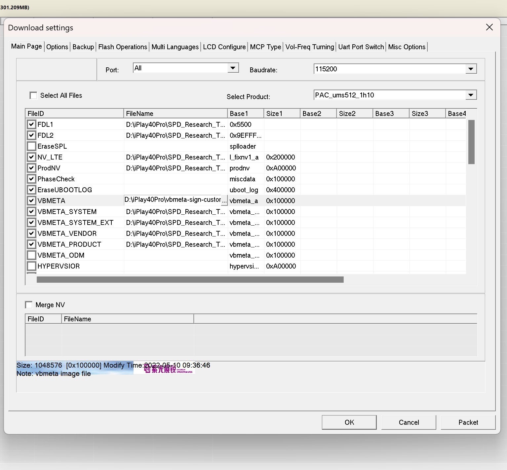

> :warning: **注意**
>
> Root/刷机有风险，继续阅读即表示你了解 Root/刷机造成的风险，且本人不对你的行为承担任何责任

# 解锁

解锁前请先开启开发者模式，并在开发者模式菜单选择允许解锁。

> :warning: **警告**
>
> 解锁将清除设备上的所有数据！请务必先备份好重要数据。

**注意**：本文中的所有操作全部基于国际版系统，如果你使用的是国内版系统，可以下载国际版刷机包并按照本文操作。切忌将本文提供的两个镜像文件与国内版混用！YOU HAVE BEEN WARNED!

首先，解锁 Bootloader, 请根据[这篇针对 Unisoc 芯片通用的解锁教程](https://www.hovatek.com/forum/thread-32287.html)解锁你的 Bootloader.

然后，不想手动操作的人可以下载[适用于 iPlay40 Pro 的刷机包](https://www.alldocube.com/en/firmware/alldocube-iplay40ht1020h-firmware-download/)
和这两个文件 [vbmeta-sign-custom.img](https://drive.google.com/file/d/1SHhoZmaatZSH1x0zCseLL2KSlyjax0Ig/view?usp=sharing), [magisk_patched.img](https://drive.google.com/file/d/1S_ZLmTNtbXNYAKXMKIPTXKfxWeuTUOON/view?usp=sharing)，直接跳到[最后一步](#%E5%9C%A8-research-tool-%E4%B8%AD%E5%88%B7%E5%85%A5%E4%B8%A4%E4%B8%AA%E9%95%9C%E5%83%8F)。

# 提取公钥

下载[适用于 iPlay40 Pro 的刷机包](https://www.alldocube.com/en/firmware/alldocube-iplay40ht1020h-firmware-download/)
和 [SPD Research Tool](https://spdflashtool.com/category/research-tool).

打开 SPD Research Tool, 加载从刷机包中解压出来的 pac 文件。

这时，从 pac 文件解包得到的各个分区的镜像文件会出现在 SPD Research Tool 的目录下 `ImageFiles` 目录的一个子目录里中。

我们进入这个子目录，把 `boot.img` 和 `vbmeta-sign.img` 保存下来，存到另一个文件夹。

然后，根据[这篇教程](https://www.hovatek.com/forum/thread-32667.html)的说明，从 `vbmeta-sign.img` 中提取出各个分区的公钥，放到 `keys` 目录下。

# 使用 Magisk 来 patch boot.img

在设备上安装 Magisk Manager, 把上一步的 `boot.img` 复制到内部存储，从 Magisk Manager 中 patch `boot.img`, 把 patch
之后得到的文件（称之为`magisk_patched-xxxxx.img`）复制到电脑上。

# 创建自己的 vbmeta-sign-custom.img

**注**： 笔者是在 Manjaro Linux 环境下运行的本小节和下一小节的代码，若要在 Windows 上运行，建议你使用 Powershell 而非 cmd.

请阅读并理解[这一篇教程](https://www.hovatek.com/forum/thread-32664.html)，下载这篇教程里提到的 `avbtool` 和适用于 Android 10 的`vbmeta_pad.py`。

[创建自己的私钥](https://www.hovatek.com/forum/thread-32662.html)或者使用解锁 Bootloader 时使用的 modified_fastboot
目录下的 `rsa4096_vbmeta.pem`, 下文称使用的私钥文件为 `key.pem`.

运行下面的命令来导出公钥：

```sh
python2 avbtool extract_public_key --key key.pem --output keys/mykey.bin
```

然后运行下面的命令来创建我们自己的 `vbmeta-sign-custom.img`.

注意 flag 一定要设置为 0!

```sh
python2 avbtool make_vbmeta_image --key modified_fastboot/rsa4096_vbmeta.pem --algorithm SHA256_RSA4096 --flag 0 --chain_partition boot:1:keys/mykey.bin --chain_partition dtbo:6:keys/dtbo.key --chain_partition socko:13:keys/socko.key --chain_partition odmko:14:keys/odmko.key --chain_partition vbmeta_system:2:keys/vbmeta_system.key --chain_partition vbmeta_system_ext:3:keys/vbmeta_system_ext.key --chain_partition vbmeta_vendor:4:keys/vbmeta_vendor.key --chain_partition vbmeta_product:5:keys/vbmeta_product.key --chain_partition l_modem:7:keys/l_modem.key --chain_partition l_ldsp:8:keys/l_ldsp.key --chain_partition l_gdsp:9:keys/l_gdsp.key --chain_partition pm_sys:10:keys/pm_sys.key --chain_partition l_agdsp:11:keys/l_agdsp.key --chain_partition l_cdsp:12:keys/l_cdsp.key --padding_size 20480 --output vbmeta-sign-custom.img
```

然后运行

```sh
python2 vbmeta_pad.py
```

得到一个大小与原来的 `vbmeta-sign.img` 完全相同的 `vbmeta-sign-custom.img`.

# 给 magisk_patched-xxxxx.img 签名

接下来，我们用自己的私钥给 `magisk_patched-xxxxx.img` 签名，并把原厂的一些属性加回去：

```sh
python2 avbtool add_hash_footer --image magisk_patched-xxxxx.img --partition_name boot --partition_size 67108864 --key modified_fastboot/rsa4096_vbmeta.pem --algorithm SHA256_RSA4096 --prop com.android.build.boot.fingerprint:Alldocube/iPlay_40H/T1020H:11/RP1A.201005.001/8688:user/release-keys --prop com.android.build.boot.os_version:11
```

# 在 Research Tool 中刷入两个镜像

在 SPD Research Tool 的 Driver 目录下有一个[网页链接](https://androiddatahost.com/gzn5n
)，从这个链接下载驱动程序并安装，然后重启电脑。

再次打开 Research Tool, 加载 pac 文件。

在 Research Tool 中，点击设置按钮，

- 将 `VBMETA` 对应的文件路径改为我们创建的 `vbmeta-sign-custom.img`.
- 将 `BOOT` 对应的文件路径改为我们的 `magisk_patched-xxxxx.img`

如果你确定你的设备上运行的系统与 pac 文件里的系统的 Build Number 一致，你也可以选择只刷写 `BOOT` 和 `VBMETA` 两个分区，这可以节省不少时间。



然后，点击刷机按钮，将设备关机，按住电源键和音量下键接入电脑，Research Tool 会开始刷机，耐心等待刷机结束。

# 结束

重启设备，享受 Magisk 吧！没有 Root 权限的设备永远都不是自己的设备！