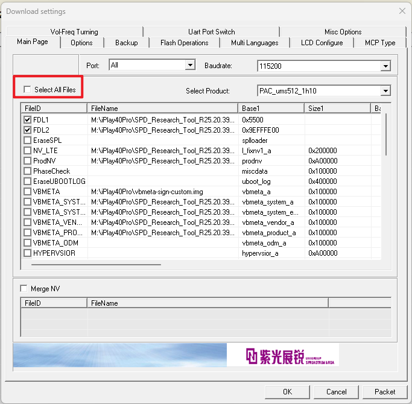

在踩了很多坑之后，我终于在 iPlay40 Pro 上用上了 Lineage OS + Magisk. 于是我写下了这篇博客作为记录，同时也希望会对别人有所帮助。


:::danger

Root/刷机有风险，继续阅读即表示你了解 Root/刷机造成的风险，且本人不对你的行为承担任何责任. 

以下教程中你的数据将会被多次擦除，所以请务必提前备份好你的数据。

:::


首先，我们需要解锁 bootloader, 然后让 Magisk 跑起来。请读者先完成我之前的 [Alldocube iPlay40 Pro Root 教程 | kxxt](https://www.kxxt.dev/blog/how-to-root-iplay40pro/) 这一博客中的内容，让 Magisk 跑起来。

# 坑

从 [Treble Info App](https://gitlab.com/TrebleInfo/TrebleInfo/-/releases) 中我们能看出 iPlay40 Pro 支持 GSI (通用系统镜像)，

但是，直接刷写 `system` 分区肯定是不行的， 这会导致 AVB 校验过不去。另外众所周知，紫光展锐的机子没办法用一个 blank vbmeta 把 AVB 这套东西给禁用掉， 也不能 `--disable-verity`。那么，很自然的想法是我们自己给 `system.img` 签名并且相应的编辑 `vbmeta.img` 和 `vbmeta_system.img`. 去年我就卡在这里了， 没搞明白怎么签这一大堆签名（我只会给 `boot.img` 签名，但是 `system.img` 的格式不一样）。

[这个 XDA 贴子](https://forum.xda-developers.com/t/cubot-pocket-unlock-bootloader-and-flashing-gsi-lineageos.4477671/)给出了一种方法。虽然刷写 `vbmeta` 时不能 `disable-verity`,  但是其实我们只需要对 `vbmeta_system` 和  `vbmeta_product`  进行 `disable-verity` 即可， 这是我之前没有想到的。

那么，假设现在你已经跟随我上面提到的那篇博客， 在国际版固件上把 Magisk 给跑起来了。
接下来我们准备刷机。

# GSI 选取

可以在下面这个链接查看 GSI 列表：
[Generic System Image (GSI) list · phhusson/treble\_experimentations Wiki · GitHub](https://github.com/phhusson/treble_experimentations/wiki/Generic-System-Image-%28GSI%29-list)

我测试了 AOSP 和 Lineage OS 的镜像。

Android 13 版本的镜像能跑，但是 `adb logcat` 里会不停的持续输出错误日志， 虽然没有严重到影响用户体验的地步，但是我最终还是决定不用 Android 13 了。

另外蓝牙在部分 Android 13 发行版上不 work，在 Google 的 CI 上下载的 AOSP Android 13 镜像上是 work 的。Phh Treble 的 AOSP/Lineage OS 20 上蓝牙不 work， 估计是他们的蓝牙相关 patch 和 iPlay40 Pro 不太搭。

所以我最终选择了 Lineage OS 19 (Phh Treble, AndyYan's Build, Android 12). 
- 下载地址: [Andy Yan's personal builds // GSI - Browse /lineage-19.x at SourceForge.net](https://sourceforge.net/projects/andyyan-gsi/files/lineage-19.x/)
- 对于 iPlay40 Pro, 选择 arm64, b,  另外 vndklite 或者非 vndklite 的镜像都可以.

:::tip

vndklite 的系统可以允许你在设备上随意挂载根分区进行读写. 

```bash
# mount -o remount,rw /
```
但是注意, 我们采用的系统镜像没有任何剩余的可用空间, 如果你想要在设备上编辑 `system` 分区(因为 [System-as-Root](https://source.android.com/docs/core/architecture/partitions/system-as-root), 即编辑 `/`) ,  请先对 GSI 镜像进行扩容 (以下命令在 Linux 系统上运行, `$image` 为你下面要刷写的 `system.img`):下面的代码演示了给要刷写的镜像扩容 500MB 空间:
```bash
$ dd if=/dev/zero bs=1M count=500 >> $image
500+0 records in  
500+0 records out  
524288000 bytes (524 MB, 500 MiB) copied, 2.10985 s, 248 MB/s
$ parted $image
WARNING: You are not superuser.  Watch out for permissions.  
GNU Parted 3.6  
Using /path/to/your/image
Welcome to GNU Parted! Type 'help' to view a list of commands.  
(parted) resizepart 1  
End?  [3301MB]?  Press Enter
(parted) ^D
``` 

:::

# 刷写 system

请确保电脑已经使用 `adb` 连接到设备。然后使用 `adb` 进入 `fastbootd` （不能在 `fastboot` 下操作，必须在 userspace fastboot 下操作）:

```bash
adb reboot fastboot
```

然后，在 `fastbootd` 模式下刷写 `vbmeta_system` 和 `vbmeta_product`:

这里的 `vbmeta_{system,product}.img` 即在 pac 文件中提取出来的原始文件，没有做任何改动。

```bash
fastboot --disable-verity --disable-verification flash vbmeta_system vbmeta_system.img  
fastboot --disable-verity --disable-verification flash vbmeta_product vbmeta_product.img
```

然后，调整一下 `product` 分区的大小并刷写 `system`。这里 `system.img` 即为你要刷写的 GSI 镜像。

```bash
fastboot resize-logical-partition product_a 38000  
fastboot flash system system.img
```

刷写完成之后先不要重启，打开 ResearchTool，加载 pac 固件，取消选中所有文件。

:::tip

你也可以直接跳过 Research Tool 这一步骤, 直接从 Fastbootd 的菜单进入 Recovery 来清除用户数据, 这样子就不需要单独的分区扩容步骤了.

:::



然后进行固件下载， 这将会清除用户数据. 


然后点击电源键重启系统， 再同时按住电源键+音量下键，直到 Research Tool 开始下载， 然后松开。

在 Research Tool 下载完成后， 我们就可以开机了！

# 数据分区扩容

在刷写部分 GSI 镜像后，操作系统在第一次启动时就会要求恢复出厂设置，清除 `data`.

如果操作系统没有让你这样做，你顺利的进入了系统，那么你会发现可用空间非常小，我们需要手动清楚数据分区吗，对数据分区进行扩容，让它恢复应有的大小。

首先重启到 recovery:

```bash
adb reboot recovery
```


然后按一下电源键+音量上键组合键，打开 recovery 菜单：


使用音量上下键选中 `清除数据/恢复出厂设置`, 按电源键确定，再选中 `Factory data reset`，按电源键来开始清除数据。


耐心等待数据清楚完毕后， 我们的数据分区就恢复到了应有的大小。然后重启系统即可享受 Lineage OS + Magisk.


# 安全警告

此 build 设置了 `ro.adb.secure=0`, 即任何人都可以使用 adb 调试此设备, 不需要授权, 这十分的不安全. 读者可以通过编辑 `/system/build.prop` 和 `/system/system_ext/etc/build.prop` 来阻止其他人在未经授权的情况下通过 adb 调试你的设备.

另外, 本文中给出的 Lineage OS 镜像链接是使用公开的密钥签名的， 存在安全风险。我建议读者自己构建 Lineage OS 的 GSI 并亲自签名来杜绝此风险。
- 关于 GSI 的构建请参考此 GitHub 仓库： [GitHub - AndyCGYan/lineage\_build\_unified: Unified script for building GSI and device-specific LineageOS](https://github.com/AndyCGYan/lineage_build_unified)
- 关于签名: [Signing Builds | LineageOS Wiki](https://wiki.lineageos.org/signing_builds)
- 关于使用公开/泄漏的密钥签名的系统的安全风险: [Principles for Secure Software Distribution: Lessons from Leaked Android Platform Signing Keys](https://www.chainguard.dev/unchained/principles-for-secure-software-distribution)

# Reference
- [Cubot Pocket: unlock bootloader and flashing GSI/lineageOS](https://forum.xda-developers.com/t/cubot-pocket-unlock-bootloader-and-flashing-gsi-lineageos.4477671/)
- [How to boot into recovery mode on Unisoc / Spreadtrum (SPD) devices](https://www.hovatek.com/forum/thread-2167.html)
- [将 Fastboot 移至用户空间  |  Android 开源项目  |  Android Open Source Project](https://source.android.com/docs/core/architecture/bootloader/fastbootd?hl=zh-cn)
- [Generic System Image (GSI) list · phhusson/treble\_experimentations Wiki · GitHub](https://github.com/phhusson/treble_experimentations/wiki/Generic-System-Image-%28GSI%29-list)]
- [linux - Can I expand the size of a file based disk image? - Super User](https://superuser.com/questions/693158/can-i-expand-the-size-of-a-file-based-disk-image)

