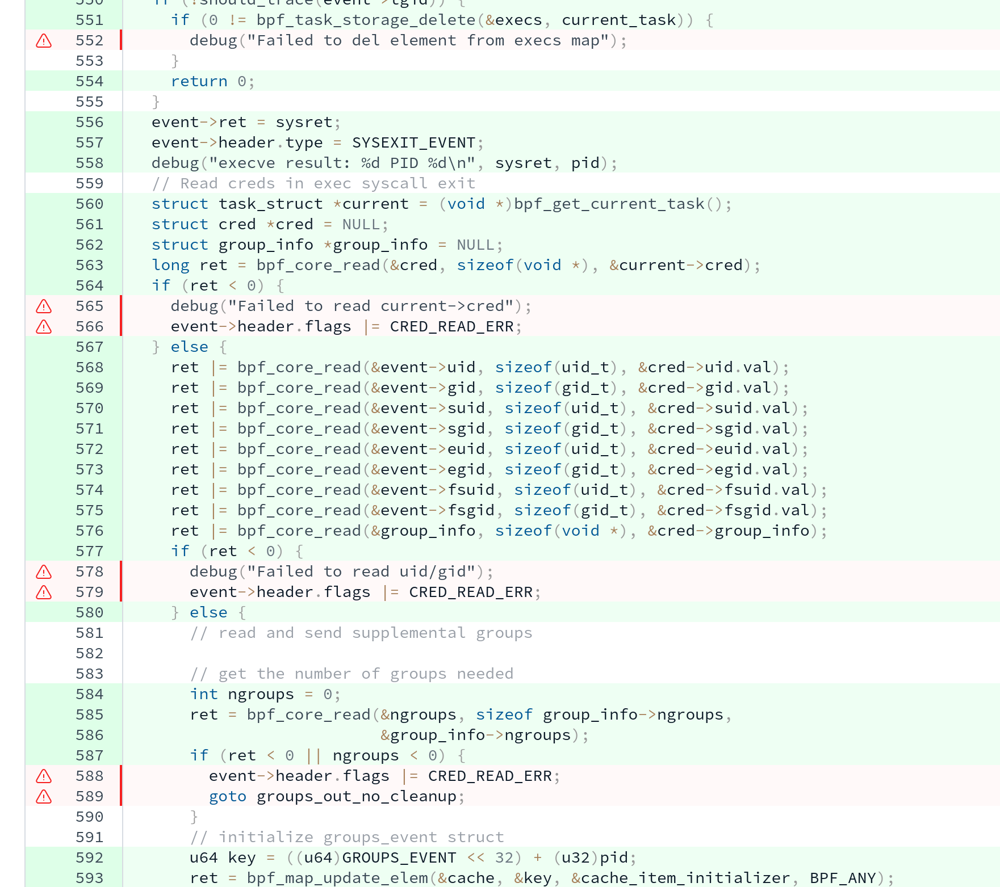
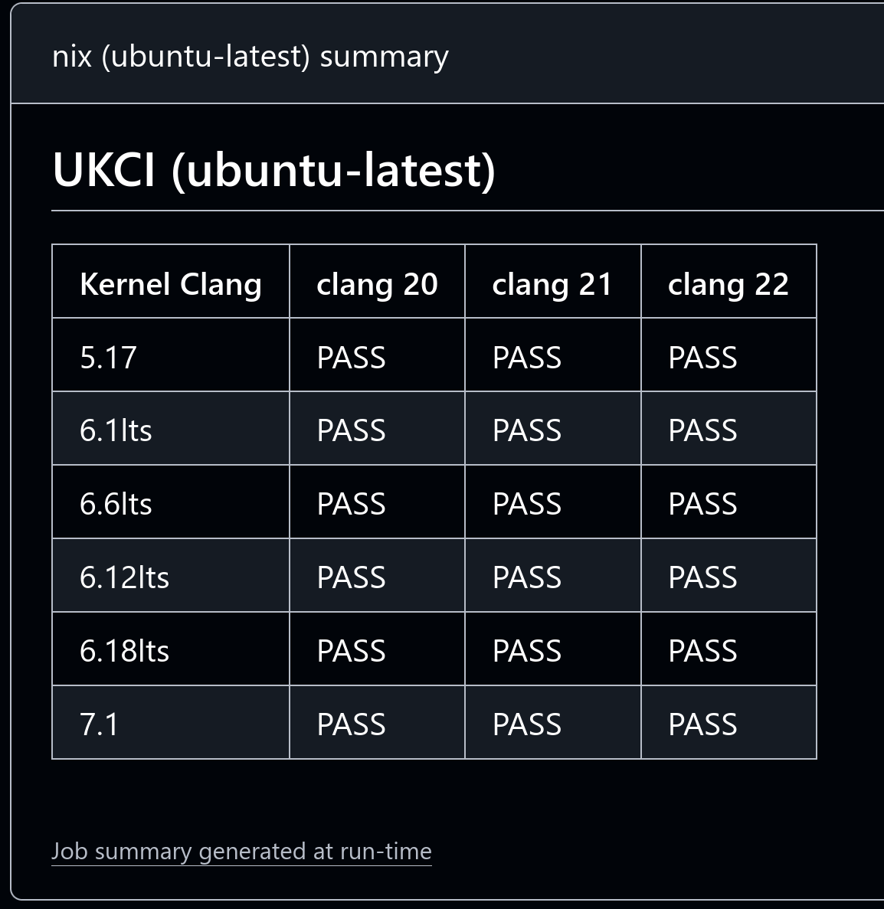

# Preface

Creating a brand new open-source (or even closed-source) project is fun, but maintaining it is not that fun.
And as for maintaining an eBPF program, it is clearly not fun.
I am always interested in creating fun projects (the latest one is https://kconfigwtf.kxxt.dev, BTW)
and being a drive-by contributor in the FOSS community.
But apparently I didn't pay enough effort to properly maintain my projects.
I think the turning point for me to become a maintainer is the packaging of [tracexec](https://github.com/kxxt/tracexec)
into official software repositories of Arch Linux and NixOS, which increased expectation upon me to properly maintain it.

In this blog post, I am going to share why maintaining an eBPF program is hard based on my own experience with maintaining
the eBPF backend of tracexec. In case you didn't know, [tracexec](https://github.com/kxxt/tracexec) is an exec syscall tracer
written in Rust with support for both `ptrace(2)` backend and an eBPF backend. The eBPF backend was first released as part of `v0.6.0`
in September 2024, but marked as experimental. Almost two years later, I finally stabilized the eBPF backend now.
And now I am writing a blog post to share my findings.

Although this blog post is mostly about maintaining a userspace software written in Rust with an eBPF program written in C
and loaded with [libbpf-rs](https://github.com/libbpf/libbpf-rs), I believe most of the content still applies if your userspace/eBPF program
is written in another language. I will start by categorizing the maintenance burdens in the next section.

# Maintenance Burdens

The biggest maintenance burden is a kernel compatibility hell. It is very easy to write a eBPF program that only works with certain kernel versions/configurations. It is also known as the "it works on my machine" problem.


Regular userspace software also face the same problem for similar but not the exact reasons and there is a lazy solution as illustrated by the following meme.


However, the same cannot be applied to eBPF programs because we cannot justify forcing the users to use a specific kernel. (And BTW I don't like projects using Docker/whatever container technology as an excuse to drop support for using the binary/source code directly).

Enough about memes. Let's enter the real Kernel compatibility hell.

## Kernel Compatibility Hell

Let's start with something easy.

### `kfunc`/`helper` Compatibility

Linux eBPF use `helper`s and `kfunc`s to provide APIs for eBPF programs.
`helper`s provide stable APIs while `kfunc`s provide unstable APIs.

When writing an eBPF program, pay attention to the `helper`s and `kfunc`s you use and query their supported kernel versions from https://docs.ebpf.io/
to avoid unintentionally raising the MSKV (Minimum Supported Kernel Version) of your eBPF program.

For example, tracexec makes extensive use of `bpf_loop`, which is introduced in Linux 5.17 as documented on https://docs.ebpf.io/linux/helper-function/bpf_loop/.
This limits the MSKV of tracexec to 5.17.

### Sleepable `fentry` relies on `CONFIG_FUNCTION_ERROR_INJECTION`

Now lets suppose that we are working on a syscall tracing eBPF program that needs to inspect user-space memory.
In some scenarios you might find it disappointing that [the kernel throws an `EFAULT` error at you when you try to read some user-space memories](https://mozillazg.com/2024/03/ebpf-tracepoint-syscalls-sys-enter-execve-can-not-get-filename-argv-values-case-en.html).
It is because by default eBPF programs cannot sleep thus are unable to handle page faults.

Well, sleepable eBPF programs come to our rescue. It's as simple as enabling a flag in libbpf-rs and change `bpf_probe_read_user{,_str}`
to `bpf_copy_from_user{,_str}`:

```rust
open_skel.progs.sys_execve_fentry.set_flags(BPF_F_SLEEPABLE);
open_skel
	.progs
	.sys_execveat_fentry
	.set_flags(BPF_F_SLEEPABLE);
```

And it works on my machine (I use Arch and CachyOS, BTW)!
Is there anything wrong with this approach?

Yes. You will find it failing to load on Fedora 43.

Sleepable eBPF programs rely on `CONFIG_FUNCTION_ERROR_INJECTION`, which is enabled in Arch Linux kernels
but not in Fedora kernels. What a surprise! Our sleepable eBPF programs are not injecting any errors but would rely
on such a kernel config. [It turns out that the sleepable eBPF check are just using the error injection list
as an allowlist and there actually should have been no problem using sleepable eBPF without `CONFIG_FUNCTION_ERROR_INJECTION`](https://lore.kernel.org/bpf/CAADnVQK6qP8izg+k9yV0vdcT-+=axtFQ2fKw7D-2Ei-V6WS5Dw@mail.gmail.com/)

So now you need to maintain a non-sleepable code path for the distributions that do not enable
`CONFIG_FUNCTION_ERROR_INJECTION` for their kernels.
And according to https://kconfigwtf.kxxt.dev/CONFIG_/FUNCTION_ERROR_INJECTION/, the status of this config is

- AlmaLinux/CentOS/OracleLinux/RockyLinux 8 enabled it on amd64, but disabled it on other architectures.
- AlmaLinux/CentOS/OracleLinux/RockyLinux 9 enabled it for all architectures.
- AlmaLinux/CentOS/OracleLinux/RockyLinux 10 disabled it for all architectures.
- Alpine, Debian and Fedora disabled it.
- Ubuntu enabled it for some kernel packages on some architectures.
- Android only enabled it on android12-5.10, android13-5.10 and android13-5.15.
- Proxmox, Void, Arch, OpenSUSE, Guix, AmazonLinux al2023 and AzureLinux 3.0 enabled it.

Luckily, a new change included in the recent release of Linux 7.1 would change that.
[Commit `16d9c5660692 ("bpf: Always allow sleepable programs on syscalls")`](https://github.com/torvalds/linux/commit/16d9c5660692d) 
allow sleepable eBPF programs on syscalls.

But you still need to handle the mess since distros are still on old kernels and it would take years for many people to upgrade to at least 7.1.
(Or worse, some people pin their kernels and never upgrade. I hope you don't need to support such users.)

### Architecture Differences

Many eBPF features are implemented in a CPU architecture-specific way.
Thus it is normal for a feature to be supported on x86_64 earlier than other architectures.
So the Minimum Supported Kernel Version of your eBPF may be different depending on CPU architecture.
Here are two examples that I encountered.

#### Atomics

- x86_64 supports BPF atomics since [`5ca419f2864a ("bpf: Add BPF_FETCH field / create atomic_fetch_add instruction")`](https://github.com/torvalds/linux/commit/5ca419f2864a), which is released in 5.12.
- Arm64 supports BPF atomics since [`1902472b4fa9 ("bpf, arm64: Support more atomic operations")`](https://github.com/torvalds/linux/commit/1902472b4fa97dba1fd10a204c6b231d6a560081), which is released in 5.18.
- RISC-V supports BPF atomics since [`dd642ccb45ec ("riscv, bpf: Implement more atomic operations for RV64")`](https://github.com/torvalds/linux/commit/dd642ccb45ecce1402eb2550f5284fc6bb9ed7b8), which is released in 5.19.

I am referring to `BPF_FETCH` and `BPF_ADD` instructions here. Other BPF atomics might be introduced in a different kernel version.

#### BPF JIT

I never thought whether the JIT compiler for eBPF is enabled would have a direct impact on whether my eBPF program could be verified or not. But it turns out some eBPF programs cannot load when the JIT is turned off.

For example, callbacks are not allowed in non-JITed programs:

```c
[   41.125389] bpf_jit: unknown atomic op code 01
libbpf: prog 'sys_execve': BPF program load failed: -EINVAL
libbpf: prog 'sys_execve': -- BEGIN PROG LOAD LOG --
callbacks are not allowed in non-JITed programs
processed 42321 insns (limit 1000000) max_states_per_insn 25 total_states 2846 peak_states 533 mark_read 48
-- END PROG LOAD LOG --
libbpf: prog 'sys_execve': failed to load: -EINVAL
libbpf: failed to load object 'tracexec_system_bpf'
libbpf: failed to load BPF skeleton 'tracexec_system_bpf': -EINVAL
Error: 
   0: Invalid argument (os error 22)
```

Such errors are rarely seen nowadays unless you are testing eBPF program on an emerging/obsolete architecture.

[Commit `81c22041d9f1 ("bpf, x86, arm64: Enable jit by default when not built as always-on")`](https://github.com/torvalds/linux/commit/81c22041d9f1) enabled BPF JIT by default for x86_64 and arm64, which is released in Linux v5.6.
However, RISC-V is still using BPF interpreter by default when I wrote this blog post.

### Dynamic Ftrace with Direct Calls

I am not an expert on Linux kernel. So the following error message when I run my `fentry` program looks very confusing to me.

```c
libbpf: prog 'sys_execve': failed to attach: -ENOTSUPP
libbpf: prog 'sys_execve': failed to auto-attach: -ENOTSUPP
Error: 
   0: Unknown error 524 (os error 524)

Location:
   /tmp/nix-build-tracexec-0.17.0.drv-0/source/crates/tracexec-backend-ebpf/src/bpf/tracer.rs:624
```

There's no verifier error in the logs and the log doesn't say it failed to load. It only states that
the attachment of eBPF program failed.

The errno conveys almost no information about why the attachment failed.

When eBPF failed, how could we debug it and find the root cause? No joking, with eBPF itself.

I located the source code (shown in the next code block) that throws the `ENOTSUPP` with bpftrace in https://github.com/kxxt/tracexec/issues/173.


```c
/* first time registering */
static int register_fentry(struct bpf_trampoline *tr, void *new_addr)
{
	void *ip = tr->func.addr;
	unsigned long faddr;
	int ret;

	faddr = ftrace_location((unsigned long)ip);
	if (faddr) {
		if (!tr->fops)
			return -ENOTSUPP;
		tr->func.ftrace_managed = true;
	}

	if (bpf_trampoline_module_get(tr))
		return -ENOENT;

	if (tr->func.ftrace_managed) {
		ftrace_set_filter_ip(tr->fops, (unsigned long)ip, 0, 1);
		ret = register_ftrace_direct_multi(tr->fops, (long)new_addr);
	} else {
		ret = bpf_arch_text_poke(ip, BPF_MOD_CALL, NULL, new_addr);
	}

	if (ret)
		bpf_trampoline_module_put(tr);
	return ret;
}
```

It turns out that we are missing `CONFIG_DYNAMIC_FTRACE_WITH_DIRECT_CALLS` on this kernel.

Again different distros set it differently. But most of them enable this config on latest kernels for most architectures.
Check the details at https://kconfigwtf.kxxt.dev/CONFIG_/DYNAMIC_FTRACE_WITH_DIRECT_CALLS/.

You may rarely encounter such errors on x86_64 since it implements `DYNAMIC_FTRACE_WITH_DIRECT_CALLS` as early as Linux 5.5, with [commit `562955fe6a55 ("ftrace/x86: Add register_ftrace_direct() for custom trampolines")`](https://github.com/torvalds/linux/commit/562955fe6a558b9ef98ad87c470314946338cb2f).

However, it is implemented much later for arm64 and riscv64.

- `DYNAMIC_FTRACE_WITH_DIRECT_CALLS` is implemented for arm64 in [commit `2aa6ac03516d ("arm64: ftrace: Add direct call support")`](https://github.com/torvalds/linux/commit/2aa6ac03516d078cf0c35aaa273b5cd11ea9734c), which is released in Linux 6.4.
- It is implemented for riscv64 in [commit `196c79f19a92 ("riscv: ftrace: Add DYNAMIC_FTRACE_WITH_DIRECT_CALLS support")`](https://github.com/torvalds/linux/commit/196c79f19a92764d45005599f35338cf0a9eafbb), which is released in Linux 6.8.

### `BPF_F_NO_PREALLOC` Maps with Sleepable eBPF

It is a common practice to use BPF maps for keeping states across multiple eBPF hook invocations.
But in some cases we don't know how big the map might become and might set a huge size for it.

This is exactly where `BPF_F_NO_PREALLOC` is useful. It avoids preallocating memory for the huge size.
However, using it directly may cause load failure of your eBPF program on old kernels.

Before Linux 6.1, sleepable programs can only use preallocated maps. It is fixed in
[commit `02cc5aa29e8c ("bpf: Remove prealloc-only restriction for sleepable bpf programs.")`](https://github.com/torvalds/linux/commit/02cc5aa29e8cef4c1d710accd423546ab63f4eda).

### Syscall Wrappers

It might not be surprising that the syscall symbols looks like `__x64_sys_execve`/`__arm64_sys_execve`/`__riscv_sys_execve`.

And indeed that's the case with latest kernels.

However, the syscall symbols didn't always look like this.
The symbols above are generated by architecture-specific syscall wrappers, controlled by `CONFIG_ARCH_HAS_SYSCALL_WRAPPER`.

- It is implemented for arm64 in [commit `4378a7d4be30 ("arm64: implement syscall wrappers")`](https://github.com/torvalds/linux/commit/4378a7d4be30ec6994702b19936f7d1465193541), which is released in v4.19.
- It is implemented for riscv64 much later in [commit `08d0ce30e0e4 ("riscv: Implement syscall wrappers")`](https://github.com/torvalds/linux/commit/08d0ce30e0e4), which is released in v6.6.

Thus, to trace `execve` on Linux \< 6.6 on riscv64, we need to attach to `__se_sys_execve` instead of `__riscv_sys_execve`.

And that's not all nuisance of syscall wrappers. `tracexec` supports both `fentry/fexit` and `kprobe/kretprobe`.
When testing `kprobe/kretprobe` code path on Linux 6.12 riscv64, the following error occurs:

```c
test test_exec_emits_auxiliary_events ... libbpf: prog 'sys_execve_kprobe': failed to create kprobe '__riscv_sys_execve+0x0' perf event: -EINVAL
libbpf: prog 'sys_execve_kprobe': failed to auto-attach: -EINVAL
Error: Invalid argument (os error 22)

Location:
    /build/source/crates/tracexec-backend-ebpf/src/test_utils.rs:249:3
FAILED
```

It's similar to the `CONFIG_DYNAMIC_FTRACE_WITH_DIRECT_CALLS` case, where the eBPF program loaded successfully but failed to attach.
But this time it is `kprobe` instead of `fentry` that failed to attach.

Nowadays the AI agents are better at digging out the root cause of such errors.
So instead of building and spinning up a riscv64 qemu virtual machine with 6.12 kernel and `bpftrace` the errno all the way down,
I just pointed my agent at the 6.12 kernel source code and it could identify where the errno comes from by inspecting the code.
The following code throws the culprit `EINVAL`:

```c
static int check_ftrace_location(struct kprobe *p)
{
	unsigned long addr = (unsigned long)p->addr;

	if (ftrace_location(addr) == addr) {
#ifdef CONFIG_KPROBES_ON_FTRACE
		p->flags |= KPROBE_FLAG_FTRACE;
#else
		return -EINVAL;
#endif
	}
	return 0;
}
```

RISC-V syscall wrappers can start at an ftrace patchable function entry, and generic kprobes rejects those without `CONFIG_KPROBES_ON_FTRACE`, which is still not supported on RISC-V at the time of writing. Another edge case to handle.

## Why not tracepoints?

You might be wondering why I didn't use syscall tracepoints.
After all, unlike kprobes/fprobes syscall tracepoints are highly stable kernel interfaces.
By using syscall tracepoints, we can skip a lot of caveats mentioned above.

There are three reasons.

- First, [tracepoints are typically slower than `fentry/fexit` because there are more overheads](https://blog.leonhw.com/post/ebpf-talk-147-tracepoint-vs-raw_tp-tp_btf-vs-kprobe-vs-fentry-fexit/).
- Second, tracepoints do not support sleepable eBPF programs (at least for now).
	- At the time of writing, support for sleepable tracepoint eBPF programs is merged into mainline but not available in any kernel releases.
	- [Commit `439ebd5b5708 ("bpf: Add sleepable support for raw tracepoint programs")`](https://github.com/torvalds/linux/commit/439ebd5b5708f236f7a4a9784194f7ecb77cd814) adds sleepable support for raw tracepoint programs.
	- [Commit `57918341dd19 ("bpf: Add sleepable support for classic tracepoint programs")`](https://github.com/torvalds/linux/commit/57918341dd19) adds sleepable support for classic tracepoint programs.
	- But sleepable `fentry/fexit` programs are introduced much earlier in [commit `1e6c62a88215 ("bpf: Introduce sleepable BPF programs")`](https://github.com/torvalds/linux/commit/1e6c62a88215), which is released in Linux 5.10.
- Third, tracepoints only handles the native syscall interface. If you want to handle any alternative syscall interfaces, you will need `fprobe`/`kprobe` anyway. This is explained in details in the next subsection.

## Alternative Syscall Interfaces

Tracing `__x64_sys_execve` is typically sufficient, because most Linux software uses the native x86_64 syscall interface.
However, we shouldn't ignore the elephant in the room: the alternative syscall interfaces.

On x86_64, there are two major alternative syscall interfaces.

The first is the compat ia32 interface meant to be used by legacy 32-bit applications. The symbol is `__ia32_compat_sys_execve`.

The second is the less popular x32 syscall interface. The symbol is `__x32_compat_sys_execve`.
[Kernel developers have considered remove x32 completely many times.](https://lwn.net/Articles/1074897/)

If you are writing a tracing eBPF program for security purposes, you **MUST** take the alternative syscall interfaces into consideration.
Or better, use LSM hooks whenever possible.
Attackers could exploit your failure to implement tracing for the alternative syscall interfaces to avoid detection.

## Kernel Regressions

If a user-space software is abandoned by its maintainer, the software can still function correctly.
It's just that there are no longer new features, bug fixes and security fixes.
Many users may still continue to use the software even though it is no longer maintained.

However, if a kernel-space software is abandoned by its maintainer, the software rots quickly.
Out-of-tree kernel modules will throw build errors when the users upgrades their kernel.
The same applies to eBPF, but at a much slower pace than out-of-tree kernel modules.

- First, eBPF programs may use `kfuncs`, which is an unstable kernel API that might change across releases.
- Second, the Linux kernel is evolving all the time, the kernel symbols you are tracing today might just disappear tomorrow.
- Third, there are kernel regression bugs that may affect your eBPF programs.

For example, I have experienced at least 3 kernel regressions that affects `tracexec`. I will introduce them in the following sub-subsections.

### The LTS Regression

The Linux LTS kernel version range `[6.6.64, 6.6.70)` suffered from degraded eBPF verification performance due to
a backport of a security fix. eBPF programs that previously load fine on 6.6 LTS kernels may fail to load with `E2BIG` errors.

I [reported this regression to the list](https://lore.kernel.org/all/k32rq5abffq5kss5ejrzj3yx2dgn4c2ken2hrudws52mwuua4k@j64qawub3icu/) on Sat, 4 Jan 2025 and the report leads to a revert.

[The fix later landed again in 6.6.140](https://lore.kernel.org/stable/cover.1778516196.git.paul.chaignon@gmail.com/)
on Sun, 17 May 2026 after backporting more verifier performance improvements to counter the performance degradation of the security fix.

### The Mainline Regression

I encountered another regression with Linux 6.19.5 where my eBPF program failed to load with `E2BIG` again.

I [reported it to the list](https://lore.kernel.org/bpf/ed857a23-bd73-4915-b080-558b5934bc8f@kxxt.dev/) on Fri, 6 Mar 2026.
Before Eduard took a detailed look, I already find a workaround.

For my special case, I am iterating over an fd bitmap with hand-written bpf code.
After switching to use `bpf_iter_bits` (introduced in v6.11), the bpf program could load again.

So it appears that after the patch that causes the regression, the verifier is no longer happy about my hand-written
iteration over a bitmap using `bpf_loop`, `find_next_bit` and `generic___ffs`.

There are other people who encountered this regression and [Eduard shared some advice for overcoming it](https://lore.kernel.org/bpf/b943320a099bc171a10e533935eef8dd06b30e2c.camel@gmail.com/).

### BPF Local Storage Regression

This regression is a hidden one. It does not cause the eBPF program to fail to load.
Instead, it causes `bpf_task_storage_get` helper to always fail to allocate on riscv64 Linux \>= 6.19.

The regression is caused by the migration to `kmalloc_nolock` in BPF local storage code.
It turns out that this regression not only affects riscv64, but also affects all architectures without `HAVE_CMPXCHG_DOUBLE`.
Currently only x86, arm64, s390 and loongarch selects `HAVE_CMPXCHG_DOUBLE`.

[I reported this regression to the list](https://lore.kernel.org/linux-mm/9bea1536-534a-4a59-9b5f-92389fb05688@kxxt.dev/)
and Harry shared a patch to fix it. The patch link returns 404 now because the corresponding git branch has been deleted.
But clearly the fix has not yet made it into mainline yet.

## LLVM Version Differences

Apart from differences between kernel versions, LLVM version differences also play a role in deciding whether
an eBPF program could be accepted/rejected by the verifier.

For example, I encountered an [`E2BIG` error when loading my eBPF programs only when compiled with clang 20/21](https://github.com/kxxt/tracexec/issues/105).
I bisected LLVM and find [`627746581b8f ("Reapply "[clang][CodeGen] Zero init unspecified fields in initializers in C" (#109898) (#110051)")`](https://github.com/llvm/llvm-project/commit/627746581b8fde4143533937130f420bbbdf9ddf) is the bad commit.

However, this patch looks benign. It only zero-initializes structure padding and recursively empty-initializes members not explicitly initialized in the initializer list.

It turns out that a special argument is spilled onto the stack.
The argument is a pointer to a BPF map element.
The spill requires the verifier to track it on the stack across the long & complex function body.
And the verifier gave up in the end.
I [fixed it by adjusting the code](https://github.com/kxxt/tracexec/pull/106) to save the verifier from tracking the spilled variable across the whole function.

## Tests and Code Coverage

How could we test eBPF applications? Testing eBPF programs naturally requires root (or a bunch of `CAP_XXX` combinations).
So now I need to run tests as root in Rust projects.
Unfortunately there is no existing mechanism in Rust/Cargo to configure some tests to run as root.

And it is easy to measure test coverage of a user-space program because there are a lot of tools (`cargo-llvm-cov` for example).

But how could we measure coverage of an eBPF program?

- Cilium created [`coverbee`](https://github.com/cilium/coverbee) but the project looks unmaintained now, with the last release of v0.3.2 on Mar 6, 2023. It is, of course, written in go so I cannot directly use it in my tests, which uses libbpf-rs instead.
- Elastic created [`bpfcov`](https://github.com/elastic/bpfcov) but the project is also unmaintained now, with the last code change happened in 2022. It contains an out-of-tree LLVM pass to instrument your eBPF programs and a CLI to collect source-based coverage for eBPF programs.

I didn't find more projects for measuring the coverage of eBPF programs. And the only two projects I find appears unmaintained.

## Continuous Integration

We covered a lot about regressions in this section. And IMO the best fix for regressions is Continuous Integration (CI).

[A lots of kernel verifier changes are tested upon Cilium eBPF programs](https://pchaigno.github.io/ebpf/2025/09/23/test-verifier-changes-on-cilium-bpf-programs.html). But other eBPF programs does not enjoy such support.
Thus we need to setup our own CI for our eBPF programs, to catch regressions from the kernel and LLVM.

But setting up a CI for eBPF programs is easier said than done.
- We need to build and run virtual machines for many kernel versions and CPU architectures.
- Without KVM, running virtual machines can be very slow. (linux-arm64 runners in GitHub Actions lacks KVM).
- We need to compile and test the eBPF program across many (Kernel version, LLVM version, CPU architecture) combinations.
	- For example, suppose we want to support all LTS kernel releases, latest stable kernel and mainline kernel. That includes
	  Linux 5.10, 5.15, 6.1, 6.6, 6.12, 6.18, 7.1 and 7.2-rc. 8 kernels to test.
	- And suppose we want to support the last three LLVM releases (20, 21 and 22 at the time of writing).
	- Then let's assume we need to support three CPU architectures (x86_64, arm64 and riscv64).
	- That's `8 * 3 * 3 = 72` combinations in total! It will cost lots of compute hours.

# My Current Solutions

That's a lot of maintenance burdens. In this section, let's see how I dealt with them.

## Implementation Wrappers

As mentioned in [*Dynamic Ftrace with Direct Calls*](#dynamic-ftrace-with-direct-calls) and [*Syscall Wrappers*](#syscall-wrappers),
sometimes fentry eBPF programs fail to attach, and sometimes kprobe eBPF programs fail to attach.
But I never find a case where both of them fail.
So naturally the solution is implement both program types and dynamically choose which one to load
in userspace based on feature detection results or user preference.

To do that, though, we must first have multiple implementations in the eBPF program.
For example, in the following code, The actual implementation is function `trace_exec_common`.
We support both kprobe and fprobe by writing simple wrappers around `trace_exec_common`.


```c
#ifdef TRACEXEC_TARGET_X86_64
#define SYSCALL_PREFIX "x64"
#define SYSCALL_COMPAT_PREFIX "ia32_compat"
#elif TRACEXEC_TARGET_AARCH64
#define SYSCALL_PREFIX "arm64"
#elif TRACEXEC_TARGET_RISCV64
#define SYSCALL_PREFIX "riscv"
#endif


static __always_inline int trace_exec_common(bool is_execveat, bool is_compat,
                                             const u8 *base_filename,
                                             const u8 *const *argv,
                                             const u8 *const *envp);

SEC("kprobe/__" SYSCALL_PREFIX "_sys_execve")
int BPF_KSYSCALL(sys_execve_kprobe, u8 *base_filename, u8 const *const *argv,
                 u8 const *const *envp) {
  trace_exec_common(false, false, base_filename, argv, envp);
  return 0;
}

SEC("fentry/__" SYSCALL_PREFIX "_sys_execve")
int BPF_PROG(sys_execve_fentry, struct pt_regs *regs) {
  trace_exec_common(false, false, (u8 *)PT_REGS_PARM1_CORE(regs),
                    (u8 const *const *)PT_REGS_PARM2_CORE(regs),
                    (u8 const *const *)PT_REGS_PARM3_CORE(regs));
  return 0;
}

SEC("fentry/__" SYSCALL_PREFIX "_sys_execveat")
int BPF_PROG(sys_execveat_fentry, struct pt_regs *regs, int ret) {
  trace_exec_common(true, false, (u8 *)PT_REGS_PARM2_CORE(regs),
                    (u8 const *const *)PT_REGS_PARM3_CORE(regs),
                    (u8 const *const *)PT_REGS_PARM4_CORE(regs));
  struct exec_event *event = bpf_task_storage_get(
      &execs, (struct task_struct *)bpf_get_current_task_btf(), NULL, BPF_ANY);
  if (!event || !ctx)
    return 0;

  event->fd = PT_REGS_PARM1_CORE(regs);
  event->flags = PT_REGS_PARM5_CORE(regs);
  return 0;
}

SEC("kprobe/__" SYSCALL_PREFIX "_sys_execveat")
int BPF_KSYSCALL(sys_execveat_kprobe, s32 fd, u8 *base_filename,
                 u8 const *const *argv, u8 const *const *envp, u64 flags) {
  trace_exec_common(true, false, base_filename, argv, envp);
  struct exec_event *event = bpf_task_storage_get(
      &execs, (struct task_struct *)bpf_get_current_task_btf(), NULL, BPF_ANY);
  if (!event || !ctx)
    return 0;

  event->fd = fd;
  event->flags = flags;
  return 0;
}
```

## Conditional Loading

To dynamically select the eBPF implementation to use, we can perform feature detection in user-space and allow users to override them.
For example, here is my code for detecting whether `fentry/kprobe` programs should be used.

```rust
pub fn kernel_have_ftrace_with_direct_calls(
  kconfig: Option<&HashMap<String, ConfigSetting>>,
  override_env: Option<&[(OsString, OsString)]>,
) -> bool {
  // First, check special env `TRACEXEC_USE_KPROBE`
  if elevate::env_var_string(override_env, "TRACEXEC_USE_KPROBE")
    .map(|v| !v.is_empty())
    .unwrap_or_default()
  {
    return false;
  }
  elevate::env_var_string(override_env, "TRACEXEC_USE_FENTRY")
    .map(|v| !v.is_empty())
    .unwrap_or_default() ||
  // Then, we try to read kernel config
  kconfig
    .map(|configs| configs.contains_key("CONFIG_DYNAMIC_FTRACE_WITH_DIRECT_CALLS"))
    .unwrap_or_default() ||
  // Finally, we try to decide based on kernel version
  {
    cfg_if! {
      if #[cfg(target_arch = "x86_64")] {
        // We support linux >= 5.17, which all have this feature
        true
      } else if #[cfg(target_arch = "aarch64")] {
        // https://github.com/torvalds/linux/commit/2aa6ac03516d078cf0c35aaa273b5cd11ea9734c
        tracexec_core::is_current_kernel_ge((6, 4)).unwrap_or_default()
      } else if #[cfg(target_arch = "riscv64")] {
        // https://github.com/torvalds/linux/commit/b21cdb9523e5561b97fd534dbb75d132c5c938ff
        tracexec_core::is_current_kernel_ge((6, 16)).unwrap_or_default()
      } else {
          compile_error!("unsupported architecture");
      }
    }
  }
}

pub fn kernel_rejects_syscall_wrapper_kprobes(
  #[allow(unused)] kconfig: Option<&HashMap<String, ConfigSetting>>,
) -> bool {
  cfg_if! {
    if #[cfg(target_arch = "riscv64")] {
      let Some(configs) = kconfig else {
        return false;
      };
      // RISC-V syscall wrappers can start at an ftrace patchable function entry,
      // and generic kprobes rejects those without CONFIG_KPROBES_ON_FTRACE:
      // https://github.com/torvalds/linux/blob/ab9de95c9cf952332ab79453b4b5d1bfca8e514f/kernel/kprobes.c#L1598-L1602
      kernel_have_syscall_wrappers(kconfig)
        && configs.contains_key("CONFIG_DYNAMIC_FTRACE")
        && !configs.contains_key("CONFIG_KPROBES_ON_FTRACE")
    } else {
      false
    }
  }
}
```

## Conditional Code

Many other compatibility problems can be solved with conditional code.
Some are in user-space, while others are in kernel-space.
The most complex ones require both user-space and kernel-space conditional code.

### Kernel-Space

libbpf provides a convenient mechanism for resolving conditional code at eBPF program load-time based on kernel version.
For example, the following code enables RCU kfuncs only when the kernel version is greater than 6.2, which introduced eBPF RCU kfuncs.
It ensures that we won't accidentally use RCU kfuncs on kernels that do not support them, like 6.1lts.

```c
// Kernel version at program load time
extern int LINUX_KERNEL_VERSION __kconfig;

extern void bpf_rcu_read_lock(void) __ksym;
extern void bpf_rcu_read_unlock(void) __ksym;

#define MIN_KERNEL_VERSION_FOR_RCU_KFUNC KERNEL_VERSION(6, 2, 0)

int __always_inline rcu_read_lock() {
  if (LINUX_KERNEL_VERSION >= MIN_KERNEL_VERSION_FOR_RCU_KFUNC) {
    bpf_rcu_read_lock();
  }
  return 0;
}

int __always_inline rcu_read_unlock() {
  if (LINUX_KERNEL_VERSION >= MIN_KERNEL_VERSION_FOR_RCU_KFUNC) {
    bpf_rcu_read_unlock();
  }
  return 0;
}
```

For checking the existence of kfuncs, we can also use the `bpf_ksym_exists` macro.
We no longer need to hard-code the kernel version thus it's simpler than the above example.

```c
extern void bpf_rcu_read_lock(void) __weak __ksym;
extern void bpf_rcu_read_unlock(void) __weak __ksym;

int __always_inline rcu_read_lock() {
  if (bpf_ksym_exists(bpf_rcu_read_lock)) {
    bpf_rcu_read_lock();
  }
  return 0;
}

int __always_inline rcu_read_unlock() {
  if (bpf_ksym_exists(bpf_rcu_read_unlock)) {
    bpf_rcu_read_unlock();
  }
  return 0;
}
```

I also use it to implement polyfills for kfuncs.
For example, the kernel added a [bits iterator](https://docs.ebpf.io/linux/kfuncs/bpf_iter_bits_new/) in 6.11.
Prior to 6.11, I use hand-written C code to implement the same functionality.
Using the new bits iterator helps me overcome a [verifier performance regression introduced in 6.19.4](#the-mainline-regression),
but I still want to support old kernels.

<CH.Code rows={20}>

```c CoreLogic
extern int bpf_iter_bits_new(struct bpf_iter_bits *it, const u64 *unsafe_ptr__ign, u32 nr_words) __weak __ksym;

const u32 BPF_BITS_ITER_MAX_BYTES = 512;
const u32 BPF_BITS_ITER_MAX_BITS = BPF_BITS_ITER_MAX_BYTES * 8;

static int read_fds(struct exec_event *event) {
  ...
  if (bpf_ksym_exists(bpf_iter_bits_new)) {
    // When using iter_bits, the unit of size is bit (not the number of words)
    ctx.size *= BITS_PER_LONG;
    u32 chunks =
        (ctx.size + BPF_BITS_ITER_MAX_BITS - 1) / BPF_BITS_ITER_MAX_BITS;
    ret = bpf_loop(chunks, iter_fdset_chunk, &ctx, 0);
  } else {
    ret = bpf_loop(ctx.size, read_fds_impl, &ctx, 0);
  }
  ...
}
```

```c Polyfill
// BEGIN hand-written implementation for iterating the fdset

// Ref:
// https://elixir.bootlin.com/linux/v6.10.3/source/include/asm-generic/bitops/__ffs.h#L45
static __always_inline unsigned int generic___ffs(unsigned long word) {
  unsigned int num = 0;

#if BITS_PER_LONG == 64
  if ((word & 0xffffffff) == 0) {
    num += 32;
    word >>= 32;
  }
#endif
  if ((word & 0xffff) == 0) {
    num += 16;
    word >>= 16;
  }
  if ((word & 0xff) == 0) {
    num += 8;
    word >>= 8;
  }
  if ((word & 0xf) == 0) {
    num += 4;
    word >>= 4;
  }
  if ((word & 0x3) == 0) {
    num += 2;
    word >>= 2;
  }
  if ((word & 0x1) == 0)
    num += 1;
  return num;
}

// Find the next set bit
//   Returns the bit number for the next set bit
//   If no bits are set, returns BITS_PER_LONG.
// Ref:
// https://github.com/torvalds/linux/blob/0b2811ba11b04353033237359c9d042eb0cdc1c1/include/linux/find.h#L44-L69
static __always_inline unsigned int find_next_bit(long bitmap,
                                                  unsigned int offset) {
  if (offset >= BITS_PER_LONG)
    return BITS_PER_LONG;
  bitmap &= GENMASK(BITS_PER_LONG - 1, offset);
  return bitmap ? generic___ffs(bitmap) : BITS_PER_LONG;
}

// A helper to read fdset into cache,
// read open file descriptors and send info into ringbuf
static int read_fds_impl(u32 index, struct fdset_reader_context *ctx) {
  struct exec_event *event;
  if (ctx == NULL || (event = ctx->event) == NULL)
    return 1; // unreachable
  // 64 bits of a larger fdset.
  long unsigned int *pfdset = &ctx->fdset[index];
  struct fdset_word_reader_context subctx = {
      .event = event,
      .fd_array = ctx->fd_array,
      .next_bit = BITS_PER_LONG,
      .word_index = index,
  };
  // Read a 64bits part of fdset from kernel
  int ret = bpf_core_read(&subctx.fdset, sizeof(subctx.fdset), pfdset);
  if (ret < 0) {
    debug("Failed to read %u/%u member of fdset", index, ctx->size);
    event->header.flags |= FDS_PROBE_FAILURE;
    return 1;
  }
  long unsigned int *pcloexec_set = &ctx->cloexec_set[index];
  // Read a 64bits part of close_on_exec set from kernel
  ret = bpf_core_read(&subctx.cloexec, sizeof(subctx.cloexec), pcloexec_set);
  if (ret < 0) {
    debug("Failed to read %u/%u member of close_on_exec", index, ctx->size);
    subctx.flags_read_failure = true;
    // fallthrough
  }
  // debug("cloexec %u/%u = %lx", index, ctx->size, // subctx.fdset,
  //       subctx.cloexec);
  // if it's all zeros, let's skip it:
  if (subctx.fdset == 0)
    return 0;
  subctx.next_bit = find_next_bit(subctx.fdset, 0);
  bpf_loop(BITS_PER_LONG, read_fdset_word, &subctx, 0);
  return 0;
}

static int read_fdset_word(u32 index, struct fdset_word_reader_context *ctx) {
  if (ctx == NULL)
    return 1;
  if (ctx->next_bit == BITS_PER_LONG)
    return 1;
  unsigned int fdnum = ctx->next_bit + BITS_PER_LONG * ctx->word_index;
  bool cloexec = false;
  if (ctx->cloexec & (1UL << ctx->next_bit))
    cloexec = true;
  _read_fd(fdnum, ctx->fd_array, ctx->event, cloexec,
           ctx->flags_read_failure);
  ctx->next_bit = find_next_bit(ctx->fdset, ctx->next_bit + 1);
  return 0;
}

// END hand-written implementation for iterating the fdset
```

```c New-Implementation
// BEGIN iter bits implementation for iterating the fdset

static int iter_fdset_chunk(u32 chunk, void *data) {
  struct fdset_reader_context *ctx = data;
  int ret;

  const u32 base = chunk * BPF_BITS_ITER_MAX_BITS;

  if (base >= ctx->size)
    return 1; // stop loop

  u32 remaining = ctx->size - base;
  u32 chunk_nr_words =
      (remaining < BPF_BITS_ITER_MAX_BITS ? remaining
                                          : BPF_BITS_ITER_MAX_BITS) /
      BITS_PER_LONG;

  const u64 *fdset_chunk = ((const u64 *)ctx->fdset) + (base / 64);

  int *pbit_index;
  bpf_for_each(bits, pbit_index, fdset_chunk, chunk_nr_words) {
    u32 fd = base + *pbit_index;

    bool cloexec = false;

    int index = fd / 64;
    int offset = fd & 63;

    long unsigned int *pcloexec_set = &ctx->cloexec_set[index];
    u64 cloexec_word = 0;
    bool flags_read_failure = false;

    ret = bpf_core_read(&cloexec_word, sizeof(cloexec_word), pcloexec_set);
    if (ret < 0) {
      debug("Failed to check if fd %u is cloexec", fd);
      flags_read_failure = true;
    }

    cloexec = cloexec_word & (1UL << offset);

    ret = _read_fd(fd, ctx->fd_array, ctx->event, cloexec,
                   flags_read_failure);
    if (ret != 0) {
      debug("Failed to get info about fd %u (inside bpf bits iter)", fd);
    }
  }

  return 0;
}

// END iter bits implementation for iterating the fdset
```

</CH.Code>

### User-Space

Some nice new improvements of eBPF are not compatible with old kernels, like [*`BPF_F_NO_PREALLOC` Maps with Sleepable eBPF*](#bpf_f_no_prealloc-maps-with-sleepable-ebpf).

This one could be toggled from user-space by setting the map flags via libbpf-rs, as demonstrated by the following code.
Thus we can keep the compatibility with old kernel while enjoying the new improvement on new kernels.

```rust
const MIN_SLEEPABLE_NO_PREALLOC_HASH_MAPS: (u32, u32) = (6, 1);

pub fn kernel_supports_sleepable_no_prealloc_hash_maps() -> bool {
  tracexec_core::is_current_kernel_ge(MIN_SLEEPABLE_NO_PREALLOC_HASH_MAPS).unwrap_or_default()
}

...

if kernel_supports_sleepable_no_prealloc_hash_maps() {
  open_skel
    .maps
    .tracee_closure
    .set_map_flags(BPF_F_NO_PREALLOC)?;
}
```

To handle missing [*Syscall Wrappers*](#syscall-wrappers), we need additional user-space code,
because the `SEC` macro only accepts compile-time constants.
Luckily, we can change the kernel symbol to attach at runtime in user-space code.

The following code detects the presence of syscall wrappers and disables autoattaching eBPF programs.

```rust
pub fn kernel_have_syscall_wrappers(
  #[allow(unused)] kconfig: Option<&HashMap<String, ConfigSetting>>,
) -> bool {
  // arm64 and x86_64 both have syscall wrappers long before 5.17
  cfg_if! {
   if #[cfg(target_arch = "riscv64")] {
      // https://github.com/torvalds/linux/commit/b21cdb9523e5561b97fd534dbb75d132c5c938ff
      kconfig
        .map(|configs| configs.contains_key("CONFIG_ARCH_HAS_SYSCALL_WRAPPER"))
        .unwrap_or_default() ||
        tracexec_core::is_current_kernel_ge((6, 6)).unwrap_or_default()
    } else {
      true
    }
  }
}

let kernel_have_syscall_wrappers = kernel_have_syscall_wrappers(kconfig.as_ref());
if !kernel_have_syscall_wrappers {
  // Only handle kprobe here because the only supported kernels
  // that could trigger it is riscv linux < 6.6, which won't
  // support ftrace_with_direct_calls anyway.
  open_skel.progs.sys_execve_kprobe.set_autoattach(false);
  open_skel.progs.sys_execveat_kprobe.set_autoattach(false);
  open_skel
    .progs
    .sys_exit_execve_kretprobe
    .set_autoattach(false);
  open_skel
    .progs
    .sys_exit_execveat_kretprobe
    .set_autoattach(false);
}
```

Then we can manually attach to the symbols without syscall wrappers.

```rust
pub fn attach_kprobes_without_syscall_wrappers(
  skel: &mut TracexecSystemSkel,
  attach_set: BitFlags<AttachSet>,
) -> libbpf_rs::Result<()> {
  if attach_set.contains(AttachSet::Execve) {
    skel.links.sys_execve_kprobe = Some(
      skel
        .progs
        .sys_execve_kprobe
        .attach_kprobe(false, "__se_sys_execve")?,
    );
    skel.links.sys_exit_execve_kretprobe = Some(
      skel
        .progs
        .sys_exit_execve_kretprobe
        .attach_kprobe(true, "__se_sys_execve")?,
    );
  }

  if attach_set.contains(AttachSet::Execveat) {
    skel.links.sys_execveat_kprobe = Some(
      skel
        .progs
        .sys_execveat_kprobe
        .attach_kprobe(false, "__se_sys_execveat")?,
    );

    skel.links.sys_exit_execveat_kretprobe = Some(
      skel
        .progs
        .sys_exit_execveat_kretprobe
        .attach_kprobe(true, "__se_sys_execveat")?,
    );
  }
  Ok(())
}


let mut skel = open_skel.load()?;
skel.attach()?;
if !kernel_have_syscall_wrappers {
  attach_kprobes_without_syscall_wrappers(&mut skel, AttachSet::all())?;
}
```

### Combination of Kernel-Space and User-Space 

The more complex problems requires conditional code in both kernel-space and user-space.

<CH.Section>

For example, suppose we want to use sleepable eBPF program whenever possible and fallback to non-sleepable eBPF program.

We should use sleepable _`bpf_copy_from_user`_ in sleepable context and use non-sleepable _`bpf_probe_read_user`_ in non-sleepable context.
Otherwise the verifier will yell at us.
But AFAIK there is no way to determine whether we are in a sleepable context or not. So we need to pass that information from the user-space.

The following code shows the kernel part. It also involves falling-back to _`bpf_probe_read_user_str`_ when the kernel does not support the _`bpf_copy_from_user_str`_ kfunc.

```c
extern int bpf_copy_from_user_str(void *dst, u32 dst__sz, const void *unsafe_ptr__ign, u64 flags) __weak __ksym;

const volatile struct {
  u32 nofile;
  bool follow_fork;
  bool sleepable;
  pid_t tracee_pid;
  unsigned int tracee_pidns_inum;
} tracexec_config = {
    // https://www.kxxt.dev/blog/max-possible-value-of-rlimit-nofile/
    .nofile = 2147483584,
    .follow_fork = false,
    .sleepable = false,
    .tracee_pid = 0,
    .tracee_pidns_inum = 0,
};

static __always_inline int read_user_pointer(void *dst, u32 size,
                                             const void *unsafe_ptr) {
  if (tracexec_config.sleepable) {
    return bpf_copy_from_user(dst, size, unsafe_ptr);
  }
  return bpf_probe_read_user(dst, size, unsafe_ptr);
}

static __always_inline int read_user_string(void *dst, u32 size,
                                            const void *unsafe_ptr) {
  if (tracexec_config.sleepable && bpf_ksym_exists(bpf_copy_from_user_str)) {
    return bpf_copy_from_user_str(dst, size, unsafe_ptr, BPF_ANY);
  }
  return bpf_probe_read_user_str(dst, size, unsafe_ptr);
}
```

</CH.Section>

<CH.Section>

The following user-space code probes whether sleepable eBPF programs are available and set _`BPF_F_SLEEPABLE`_ and _`rodata.tracexec_config.sleepable`_ correspondingly.

```rust
pub fn can_i_use_sleepable_fentry(
  kconfig: Option<&HashMap<String, ConfigSetting>>,
  override_env: Option<&[(OsString, OsString)]>,
) -> bool {
  if elevate::env_var_string(override_env, "TRACEXEC_NO_SLEEP")
    .map(|v| !v.is_empty())
    .unwrap_or_default()
  {
    return false;
  }
  kconfig
    .map(|configs| configs.contains_key("CONFIG_FUNCTION_ERROR_INJECTION"))
    // Defaults to true
    .unwrap_or(true)
}


// Check if we can use sleepable fentry
if can_i_use_sleepable_fentry(kconfig.as_ref(), override_env) {
  rodata.tracexec_config.sleepable = MaybeUninit::new(true);
  // Can use sleepable fentry :(
  open_skel.progs.sys_execve_fentry.set_flags(BPF_F_SLEEPABLE);
  open_skel
    .progs
    .sys_execveat_fentry
    .set_flags(BPF_F_SLEEPABLE);
  #[cfg(target_arch = "x86_64")]
  {
    open_skel.progs.compat_sys_execve.set_flags(BPF_F_SLEEPABLE);
    open_skel
      .progs
      .compat_sys_execveat
      .set_flags(BPF_F_SLEEPABLE);
  }
}
```

</CH.Section>

### Handle Alternative Syscall Interfaces

Currently tracexec only handles the most popular [*Alternative Syscall Interface*](#alternative-syscall-interfaces): 32bit syscall interface on x86_64.
Naturally, it is done by conditional compilation.
And it requires carefully handling of user-space data in the eBPF code because pointers are 32bit.

```c
#ifdef TRACEXEC_TARGET_X86_64
#define SYSCALL_PREFIX "x64"
#define SYSCALL_COMPAT_PREFIX "ia32_compat"
#define COMPAT_PT_REGS_PARM1_CORE(x) ((u32)(BPF_CORE_READ(__PT_REGS_CAST(x), bx)))
#define COMPAT_PT_REGS_PARM2_CORE(x) ((u32)(BPF_CORE_READ(__PT_REGS_CAST(x), cx)))
#define COMPAT_PT_REGS_PARM3_CORE(x) ((u32)(BPF_CORE_READ(__PT_REGS_CAST(x), dx)))
#define COMPAT_PT_REGS_PARM4_CORE(x) ((u32)(BPF_CORE_READ(__PT_REGS_CAST(x), si)))
#define COMPAT_PT_REGS_PARM5_CORE(x) ((u32)(BPF_CORE_READ(__PT_REGS_CAST(x), di)))
#endif

#ifdef SYSCALL_COMPAT_PREFIX

SEC("fexit/__" SYSCALL_COMPAT_PREFIX "_sys_execveat")
int BPF_PROG(compat_sys_exit_execveat, struct pt_regs *regs, int ret) {
  return tp_sys_exit_exec(ret);
}

SEC("fentry/__" SYSCALL_COMPAT_PREFIX "_sys_execveat")
int BPF_PROG(compat_sys_execveat, struct pt_regs *regs, int ret) {
  trace_exec_common(true, true, (u8 *)(u64)COMPAT_PT_REGS_PARM2_CORE(regs),
                    (u8 const *const *)(u64)COMPAT_PT_REGS_PARM3_CORE(regs),
                    (u8 const *const *)(u64)COMPAT_PT_REGS_PARM4_CORE(regs));
  struct exec_event *event = bpf_task_storage_get(
      &execs, (struct task_struct *)bpf_get_current_task_btf(), NULL, BPF_ANY);
  if (!event || !ctx)
    return 0;

  event->fd = COMPAT_PT_REGS_PARM1_CORE(regs);
  event->flags = COMPAT_PT_REGS_PARM5_CORE(regs);
  return 0;
}

SEC("fexit/__" SYSCALL_COMPAT_PREFIX "_sys_execve")
int BPF_PROG(compat_sys_exit_execve, struct pt_regs *regs, int ret) {
  return tp_sys_exit_exec(ret);
}

SEC("fentry/__" SYSCALL_COMPAT_PREFIX "_sys_execve")
int BPF_PROG(compat_sys_execve, struct pt_regs *regs) {
  trace_exec_common(false, true, (u8 *)(u64)COMPAT_PT_REGS_PARM1_CORE(regs),
                    (u8 const *const *)(u64)COMPAT_PT_REGS_PARM2_CORE(regs),
                    (u8 const *const *)(u64)COMPAT_PT_REGS_PARM3_CORE(regs));
  return 0;
}
#endif
```

There is a limitation with this approach, though.
It assumes that the 32-bit alternative syscall interface always exists and will cause the eBPF program to fail to load when it doesn't.

Currently that problem does not surface since all major Linux distros enable it by default at the time of writing: https://kconfigwtf.kxxt.dev/CONFIG_/IA32_EMULATION/.
But I do anticipate that it will become a real problem in the future as 32-bit support rots and distros will start to disable it.

## Running eBPF tests in a Rust project

I didn't find a particularly good way to run part of Rust tests as root.
But we can run the tests that need to run as root separately from the normal tests by marking them as ignored:

```rust
#[rstest]
#[file_serial(bpf)]
#[ignore = "root"]
fn test_trace_fork_emits_fork_event(sh_executable: PathBuf) -> color_eyre::Result<()> {
  with_skel(function_name!(), prepare_trace_fork_only, |skel| {
    let capture = run_fork_and_capture(skel, &sh_executable, Duration::from_secs(2))?;
    assert_eq!(capture.event.header.r#type, event_type::FORK_EVENT);
    assert_ne!(capture.child_pid, capture.event.parent_tgid);
    Ok(())
  })
}
```

And run all the ignored tests as root:

```bash
CARGO_TARGET_X86_64_UNKNOWN_LINUX_GNU_RUNNER="sudo -E" cargo test --workspace -- --ignored
```

## `bpfcov-rs`: Code Coverage for libbpf-rs Programs

To solve the [code coverage problem of libbpf-rs eBPF programs](#tests-and-code-coverage), I forked `bpfcov` to modernize it and add support for libbpf-rs.

The original code base requires outdated LLVM 12.0 and produces the coverage output in an ancient format.
Unfortunately, I knows little about handling LLVM major version upgrades for an LLVM pass plugin.
But with my proper guidance and validation loop, coding agents successfully ported the ancient code base
to modern LLVM 21/22 and implemented a rust crate for usage with libbpf-rs.

The code repository of `bpfcov-rs` is at https://github.com/kxxt/bpfcov-rs. It is also published as `bpfcov` on crates.io.

Finally I can track the code coverage of eBPF code in CodeCov: https://app.codecov.io/gh/kxxt/tracexec/blob/main/crates%2Ftracexec-backend-ebpf%2Fsrc%2Ftracexec_system.bpf.c.



## UKCI with Nix

To continuously test the eBPF code against many (Kernel version, LLVM version, CPU architecture) combinations,
I created a UKCI (User-space Kernel-space CI) system with Nix.
It is based on the [kernel-development-flake](https://github.com/jordanisaacs/kernel-module-flake).

Testing the full (Kernel version, LLVM version, CPU architecture) combinations takes a lot of time and I made a compromise
by only testing the (Kernel version, CPU architecture) combinations with latest stable LLVM.
The full combinations are only tested once per week.
But I will add a `full-ci` label to eBPF related PRs to ensure that they are tested with the full combinations.

The UKCI works as follows:

1. Building the flake produces kernels, initrds and test binaries of the tested combinations.
2. `ukci` script starts the qemu virtual machines and test scripts in parallel.
3. Each test script attempts to ssh into its VM and execute the tests.
4. After all tests finished, a test summary is outputted in GitHub Actions UI, as shown in the following picture.



Currently my UKCI setup supports 3 architectures: x86_64, arm64 and riscv64.

- x86_64 UKCI runs with KVM as GitHub Actions supports KVM in their x86_64 runners.
- arm64 UKCI runs without KVM on GitHub Actions' linux arm64 runners.
- riscv64 UKCI is cross-compiled from x86_64 and runs via `qemu-system-riscv64` on x86_64 runners.
  - On the one hand, GitHub Actions do not offer native riscv64 runners.
  - On the other hand, at the time of writing, using nixpkgs on riscv64 natively is almost impossible.
    There is a binary cache for cross-compilation to riscv64 but no binary cache for native compilation.

My kernel test matrix includes the following kernel targets and I use a GitHub Actions workflow to update it weekly.

- The Minimum Supported Kernel Version (MSKV)
- LTS kernels: 6.1lts, 6.6lts, 6.12lts, 6.18lts
- Latest stable kernel: 7.1 at the time of writing.
- Latest RC release if exist.

I am planning to integrate `bpf-next` into my UKCI as well,
which would shorten the time between a regression patch is merged and the regression is noticed by me.

# Conclusion

Writing an eBPF program is fun, but maintaining one takes effort and can be hard.
Note I am not writing this blog post to discourage you from maintaining an eBPF program.
To the countrary, this blog post might encourage you to do so, because any problem listed in this blog post is already a solved problem.

The maintenance burden of eBPF programs is still much heavier than user-space software, but that's not a fair comparison after all.
eBPF is kernel code, and we should compare it against other kernel code like out-of-tree kernel modules.
IMO the maintenance burden of eBPF programs is much much lighter than out-of-tree kernel modules, with the safety-guarantee offered by the verifier at the same time.

# Acknowledgements

Thanks to everyone who helped me on the BPF mailing list!

Special thanks to [`taoky`](https://github.com/taoky) for telling me that the syscall tracepoints do not handle alternative syscall interfaces.

And I want to express my gratitude for GitHub Actions, which generously provides a large amount of compute hours for my UKCI.