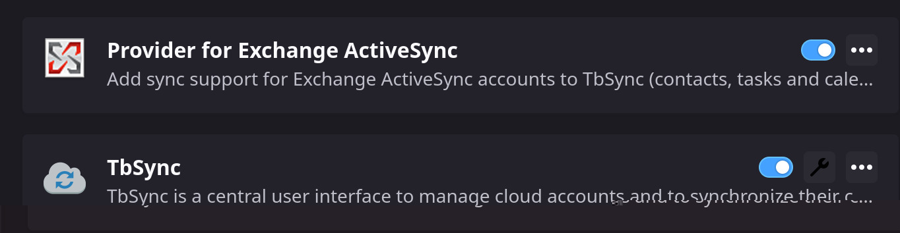

因为 Outlook 的日历并不走 CalDav 协议，所以没办法直接和 Thunderbird 集成，鉴于目前网络上此方面的教程稀少，遂撰写此文。

# 配置 Thunderbird

打开 Thunderbird 的扩展插件页面，安装 TbSync 和 Provider for Exchange ActiveSync 两个插件（如下图所示）：

然后点击 TbSync 插件的配置按钮（见上图）

点击 Account actions > Add new account > Exchange ActiveSync

然后输入 Outlook 邮箱和密码

>  **注意**
>
> 如果你设置了两步认证（2FA），请输入你的应用密码而不是账户密码，你可以在[这个链接](https://account.live.com/proofs/AppPassword)获取到你的应用密码。

然后勾选 “Enable and synchronize this account” 这个复选框，再选择你想要同步的内容（联系人、日历、任务、待办）即可。

# 和 Gnome 集成

因为 Gnome 只和自家的 evolution 集成，所以我们在 Gnome 的日历组件上看不到我们在 Thunderbird 里的日历。

要解决这个问题，我们需要把 Thunderbird 中的日历同步到 evolution。

我们可以使用 EDS Calendar Integration 插件来实现这个功能.

安装了此插件之后，就能正常的在 Gnome 的通知栏日历上看到 Thunderbird 里面的事件，也会在事件发生之前收到系统通知。
