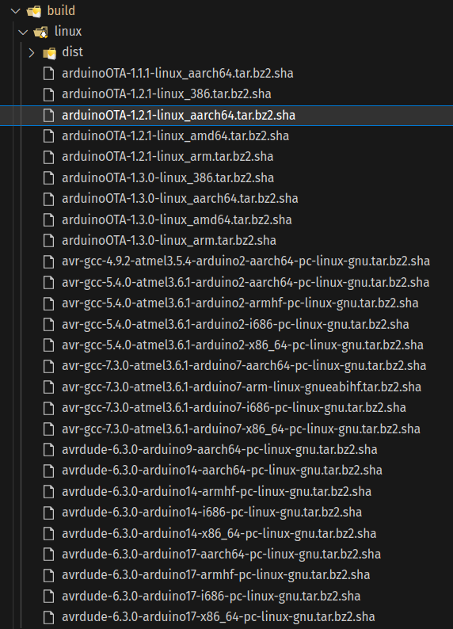
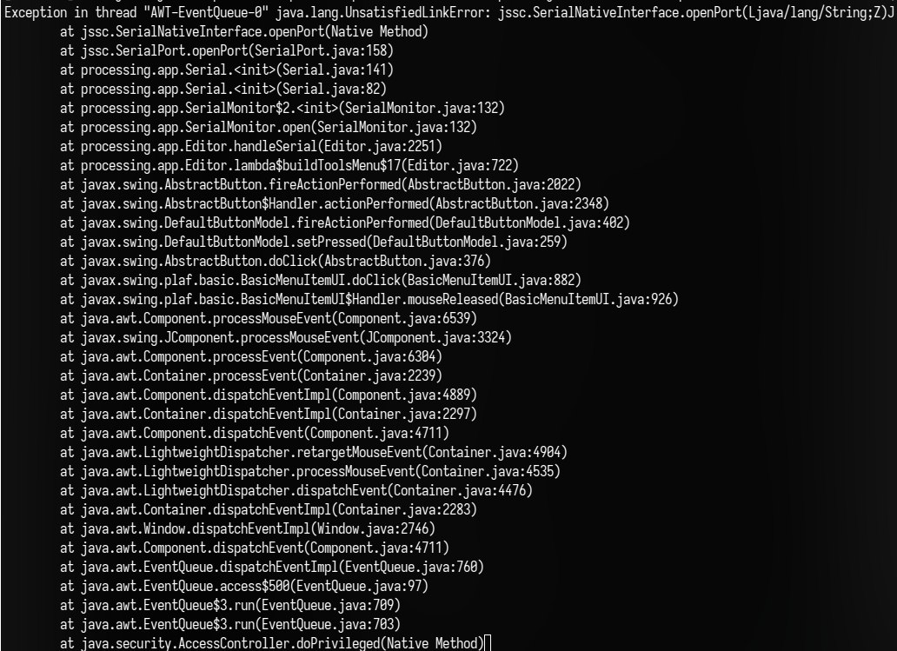
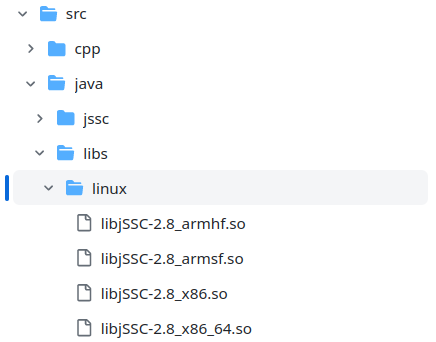
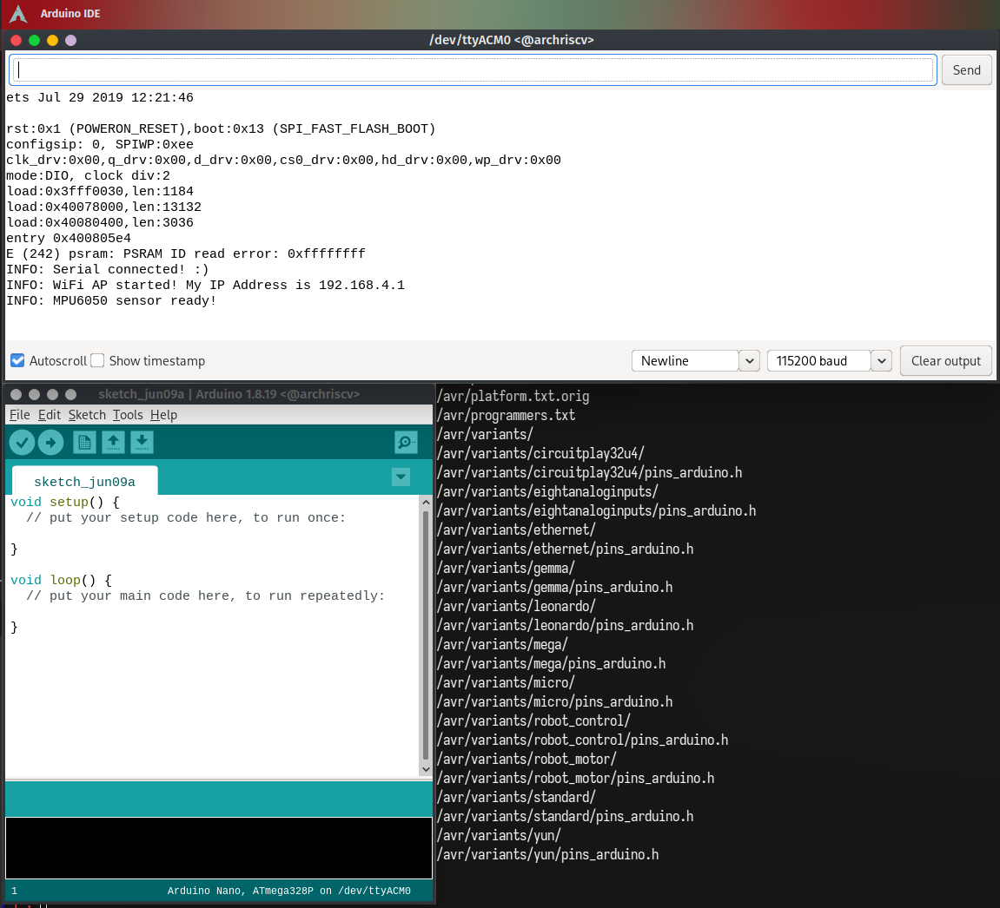
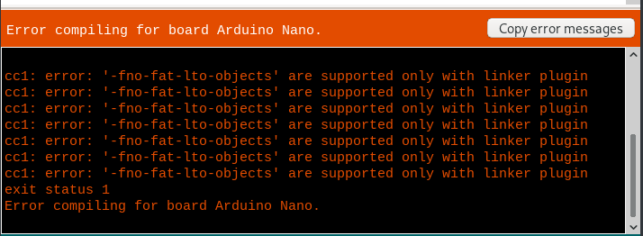

import AsciinemaPlayer from "../../../src/components/mdx/asciinema-player.tsx"

在 [Arch Linux RISC-V](https://archriscv.felixc.at/) 实习期间，我尝试将 [第一代 Arduino IDE](https://github.com/arduino/Arduino) 移植到 RISC-V 64 上。这篇文章记录了我在移植过程中遇到的问题和解决方案。

首先， 我们来看一下 Arch Linux 怎么给 Arduino 写的 [`PKGBUILD`](https://gitlab.archlinux.org/archlinux/packaging/packages/arduino/-/blob/8ae0d968593d7f6d7c9bf3189371242c30a9eb66/PKGBUILD) (下面为节选):

<CH.Section rows={20}>

呦，这也太不清真了吧。[有两个共享库是直接从网上拉下来的](focus://7:10)，完全没有从源码编译。不过[从注释来看](focus://24:29,37:40)显然这个包的维护者也意识到了这个问题。

```bash PKGBUILD(part)
source=("${pkgname}-${pkgver}.tar.xz::https://github.com/arduino/Arduino/releases/download/${pkgver}/arduino-${pkgver}.tar.xz"
        "${pkgname}-${pkgver}.tar.xz.asc::https://github.com/arduino/Arduino/releases/download/${pkgver}/arduino-${pkgver}.tar.xz.asc"
        # GPG signatures are not required as zip shasum is already provided by the buildfile
        # https://github.com/arduino/Arduino/issues/11522#issuecomment-840135044
        "https://github.com/arduino-libraries/WiFi101-FirmwareUpdater-Plugin/releases/download/v0.12.0/WiFi101-Updater-ArduinoIDE-Plugin-0.12.0.zip"
        "arduino-examples-1.9.1.zip::https://github.com/arduino/arduino-examples/archive/refs/tags/1.9.1.zip"
        "https://downloads.arduino.cc/libastylej-2.05.1-5.zip"
        "https://downloads.arduino.cc/libastylej-2.05.1-5.zip.asc"
        "https://downloads.arduino.cc/liblistSerials/liblistSerials-1.4.2-2.zip"
        "https://downloads.arduino.cc/liblistSerials/liblistSerials-1.4.2-2.zip.asc"
        "arduino.sh")
package() {
    cd "arduino-${pkgver}/build/linux/work"

    # Create directories
    install -dm755 "${pkgdir}/usr/share/"{doc,icons/hicolor,applications,mime/packages}

    # Copy the whole SDK
    cp -a . "${pkgdir}/usr/share/arduino"

    # Create wrapper for java8 + buider and documentation symlink
    install -Dm755 "${srcdir}/arduino.sh" "${pkgdir}/usr/bin/arduino"

    # Link arduino-builder, libastylej, libserialport and docs
    # TODO astyle libserialport do not work yet
    # TODO remove unzip dependency once all deps are resolved
    # https://github.com/arduino/ctags/issues/12
    # https://github.com/arduino/Arduino/issues/5538
    # https://github.com/arduino/listSerialPortsC/issues/9

    # Arduino-builder
    # https://bugs.archlinux.org/task/52377
    # https://github.com/arduino/arduino-builder/issues/209
    ln -s /usr/bin/arduino-builder "${pkgdir}/usr/share/arduino/arduino-builder"
    install -dm755 "${pkgdir}/usr/share/arduino/tools-builder"

    #rm "${pkgdir}/usr/share/arduino/lib/libastylej.so"
    #ln -s /usr/lib/libastyle-2.05.1.so "${pkgdir}/usr/share/arduino/lib/libastylej.so"
    #rm "${pkgdir}/usr/share/arduino/lib/liblistSerialsj.so"
    #ln -s /usr/lib/libserialport.so "${pkgdir}/usr/share/arduino/lib/liblistSerialsj.so"

    # Install desktop icons (keep a symlink for the arduino binary)
    cp -a lib/icons/* "${pkgdir}/usr/share/icons/hicolor"
    rm -rf "${pkgdir}/usr/share/arduino/lib/icons"
    ln -s /usr/share/icons/hicolor "${pkgdir}/usr/share/arduino/lib/icons"

    # Create desktop file using existing template
    sed "s,<BINARY_LOCATION>,arduino %U,g;s,<ICON_NAME>,arduino,g" "lib/desktop.template" \
    > "${pkgdir}/usr/share/applications/arduino.desktop"

    # Install Arduino mime type
    ln -s /usr/share/arduino/lib/arduino-arduinoide.xml "${pkgdir}/usr/share/mime/packages/arduino.xml"

    # Install manpage
    install -Dm644 "${srcdir}/arduino-${pkgver}/build/shared/arduino.1" "${pkgdir}/usr/share/man/man1/arduino.1"
}
```

</CH.Section>

整体上，感觉把 Arduino IDE 移植到 RISC-V 64 应该是挺简单的，毕竟它主要是用跨平台的 Java 语言写的。

那么， 我们再去 Arduino IDE 的 [GitHub 仓库](https://github.com/arduino/Arduino) 看看，有没有什么跟平台/架构绑死的代码。

这一看可不得了，这仓库比刚才的 PKGBUILD 还不清真，这个仓库里存了一大堆预先编译好的二进制文件的压缩文件的 checksum,
然后在构建的时候直接从网上拉下来，解压缩。

这里面并没有给 riscv64 的预构建文件，所以我们通通需要自己编译。



不过幸运的是，有一些组件已经被 Arch Linux 拆出来单独打包了，比如 [`avr-gcc`](https://archlinux.org/packages/extra/x86_64/avr-gcc/), [`arduino-builder`](https://archlinux.org/packages/extra/x86_64/arduino-builder/), [`arduino-avr-core`](https://archlinux.org/packages/extra/x86_64/arduino-avr-core/) 等等.

所以我们只需要自己编译一些没有被拆出来的组件就好了。

# 编译两个共享库

从表面上来看，只有两个共享库需要编译。

## listSerialPortsC

首先是 [`listSerialPortsC`](https://github.com/arduino/listSerialPortsC) 这个库.

没有什么需要改的，把 [`compile_linux.sh`](https://github.com/arduino/listSerialPortsC/blob/master/compile_linux.sh) 里的命令稍微改一改就好了。因为是直接在 riscv64 上编译，所以不需要交叉编译。

```bash
git clone https://github.com/arduino/listSerialPortsC
cd listSerialPortsC/
git submodule update --init
cd libserialport
./autogen.sh
./configure
make clean
make
cd ..
JAVA_INCLUDE_PATH=/usr/lib/jvm/java-8-openjdk/include
gcc main.c libserialport/linux_termios.c libserialport/linux.c libserialport/serialport.c -Ilibserialport/  -o listSerialC
gcc jnilib.c libserialport/linux_termios.c libserialport/linux.c libserialport/serialport.c -Ilibserialport/ -I$JAVA_INCLUDE_PATH -I$JAVA_INCLUDE_PATH/linux/ -shared -fPIC -o liblistSerialsj.so
```

## astyle

然后是 [`astyle`](https://astyle.sourceforge.net/), 这个库是用来格式化代码的. Arduino 维护了[一个仓库](https://github.com/arduino/astyle) 来存放他们的构建脚本和 patches. 对于 riscv64 来说，基本没有什么需要改的。

```bash
git clone https://github.com/arduino/astyle && cd astyle
svn co svn://svn.code.sf.net/p/astyle/code/tags/2.05.1 astyle-code && cd astyle-code
for f in `ls ../patches/*.patch` ; do
	patch -p0 < ../patches/$f
done
cd AStyle/build/gcc/
make clean
JAVA_HOME=/usr/lib/jvm/java-8-openjdk CFLAGS="-Os" LDFLAGS="-s" make java
cp bin/libastyle*.so ../../../../libastylej64.so
```

<AsciinemaPlayer src="./astyle.cast" rows={25} cols={80}/>
[](astyle.cast)

# 构建 Arduino IDE

Arduino 使用了一个很 old fashion 的 xml 文件来描述构建过程，这个文件即 [`build.xml`](https://github.com/arduino/Arduino/blob/master/build/build.xml).

感觉这个文件的抽象程度不太够，很多同样的逻辑被写了很多遍，不过这也在一定程度上方便了我们的修改。只需要把 `linuxaarch64` 的部分复制一份，改成 `linuxriscv64`， 再稍作修改就好了。

<CH.Section rows={20} lineNumbers={true}>

```diff arduino/arduino-add-riscv64-support.patch
diff --git a/build/build.xml b/build/build.xml
index c4de6aecf..418be1f1e 100644
--- a/build/build.xml
+++ b/build/build.xml
@@ -24,6 +24,7 @@
   <condition property="platform" value="linux64"><os family="unix" arch="amd64" /></condition>
   <condition property="platform" value="linuxarm"><os family="unix" arch="arm" /></condition>
   <condition property="platform" value="linuxaarch64"><os family="unix" arch="aarch64" /></condition>
+  <condition property="platform" value="linuxriscv64"><os family="unix" arch="riscv64" /></condition>

   <condition property="windows_host" value="true"><os family="windows" /></condition>

@@ -35,6 +36,7 @@
   <condition property="linux"><equals arg1="${platform}" arg2="linux64" /></condition>
   <condition property="linux"><equals arg1="${platform}" arg2="linuxarm" /></condition>
   <condition property="linux"><equals arg1="${platform}" arg2="linuxaarch64" /></condition>
+  <condition property="linux"><equals arg1="${platform}" arg2="linuxriscv64" /></condition>

   <condition property="staging_folder" value="macosx"><equals arg1="${platform}" arg2="macosx" /></condition>
   <condition property="staging_folder" value="windows"><equals arg1="${platform}" arg2="windows" /></condition>
@@ -42,6 +44,7 @@
   <condition property="staging_folder" value="linux"><equals arg1="${platform}" arg2="linux64" /></condition>
   <condition property="staging_folder" value="linux"><equals arg1="${platform}" arg2="linuxarm" /></condition>
   <condition property="staging_folder" value="linux"><equals arg1="${platform}" arg2="linuxaarch64" /></condition>
+  <condition property="staging_folder" value="linux"><equals arg1="${platform}" arg2="linuxriscv64" /></condition>

   <condition property="staging_hardware_folder" value="Arduino.app/Contents/Java/hardware"><equals arg1="${platform}" arg2="macosx" /></condition>
   <condition property="staging_hardware_folder" value="hardware"><equals arg1="${platform}" arg2="windows" /></condition>
@@ -49,6 +52,7 @@
   <condition property="staging_hardware_folder" value="hardware"><equals arg1="${platform}" arg2="linux64" /></condition>
   <condition property="staging_hardware_folder" value="hardware"><equals arg1="${platform}" arg2="linuxarm" /></condition>
   <condition property="staging_hardware_folder" value="hardware"><equals arg1="${platform}" arg2="linuxaarch64" /></condition>
+  <condition property="staging_hardware_folder" value="hardware"><equals arg1="${platform}" arg2="linuxriscv64" /></condition>

   <condition property="arch-bits" value="32">
     <equals arg1="${platform}" arg2="linux32"/>
@@ -62,6 +66,9 @@
   <condition property="arch-bits" value="64">
     <equals arg1="${platform}" arg2="linuxaarch64"/>
   </condition>
+  <condition property="arch-bits" value="64">
+    <equals arg1="${platform}" arg2="linuxriscv64"/>
+  </condition>

   <condition property="launch4j-download-unpack-target-name" value="launch4j-windows"><os family="windows" /></condition>
   <property name="launch4j-download-unpack-target-name" value="launch4j-linux"/>
@@ -72,12 +79,14 @@
   <property name="LINUX64_BUNDLED_JVM" value="none"/>
   <property name="LINUXARM_BUNDLED_JVM" value="none"/>
   <property name="LINUXAARCH64_BUNDLED_JVM" value="none"/>
+  <property name="LINUXRISCV64_BUNDLED_JVM" value="none"/>
   <condition property="linux-bundle-jvm-task" value="noop">
     <and>
       <equals arg1="${LINUX32_BUNDLED_JVM}" arg2="none"/>
       <equals arg1="${LINUX64_BUNDLED_JVM}" arg2="none"/>
       <equals arg1="${LINUXARM_BUNDLED_JVM}" arg2="none"/>
       <equals arg1="${LINUXAARCH64_BUNDLED_JVM}" arg2="none"/>
+      <equals arg1="${LINUXRISCV64_BUNDLED_JVM}" arg2="none"/>
     </and>
   </condition>
   <condition property="linux-bundle-jvm-task" value="bundle">
@@ -94,6 +103,9 @@
       <not>
         <equals arg1="${LINUXAARCH64_BUNDLED_JVM}" arg2="none"/>
       </not>
+      <not>
+        <equals arg1="${LINUXRISCV64_BUNDLED_JVM}" arg2="none"/>
+      </not>
     </or>
   </condition>

@@ -776,6 +788,23 @@
     </antcall>
   </target>

+  <target name="linux-libastyle-riscv64" depends="linux-build" description="Copy libastyle.so for Riscv64">
+    <antcall target="portable-${portable}">
+      <param name="parentdir" value="linux/work" />
+    </antcall>
+    <copy file="../../astyle/libastylej.so" tofile="linux/work/lib/libastylej.so" />
+    <chmod perm="755" file="linux/work/lib/libastylej.so" />
+    <copy file="../../listSerialPortsC/liblistSerialsj.so"  todir="linux/work/lib/" />
+    <chmod perm="755" file="linux/work/lib/liblistSerialsj.so" />
+  </target>
+
+  <target name="linuxriscv64-build" depends="linux-libastyle-riscv64" description="Build linux (Riscv64) version">
+    <antcall target="linux-jvm-${linux-bundle-jvm-task}">
+      <param name="JVM" value="${LINUXRISCV64_BUNDLED_JVM}"/>
+    </antcall>
+    <antcall target="build-arduino-builder" />
+  </target>
+
   <target name="linux32-build" depends="linux-libastyle-x86" description="Build linux (32-bit) version">
     <antcall target="linux-jvm-${linux-bundle-jvm-task}">
       <param name="JVM" value="${LINUX32_BUNDLED_JVM}"/>
@@ -832,6 +861,8 @@

   <target name="linuxaarch64-run" depends="build,start"/>

+  <target name="linuxriscv64-run" depends="build,start"/>
+
   <target name="linux32-start">
     <exec executable="./linux/work/arduino" spawn="false" failonerror="true"/>
   </target>
@@ -848,6 +879,10 @@
     <exec executable="./linux/work/arduino" spawn="false" failonerror="true"/>
   </target>

+  <target name="linuxriscv64-start">
+    <exec executable="./linux/work/arduino" spawn="false" failonerror="true"/>
+  </target>
+
   <target name="build-arduino-builder" unless="no_arduino_builder">
     <property name="ARDUINO-BUILDER-EXTRA-VERSION" value="" /> <!-- default if not set already -->
     <delete dir="${staging_folder}/arduino-builder-${platform}" includeemptydirs="true"/>
@@ -979,6 +1014,9 @@
   <target name="linuxaarch64-dist" depends="linux-dist"
 	  description="Build .tar.xz of linux aarch64 version" />

+  <target name="linuxriscv64-dist" depends="linux-dist"
+	  description="Build .tar.xz of linux riscv64 version" />
+
   <!-- - - - - - - - -->
   <!-- Windows       -->
   <!-- - - - - - - - -->
diff --git a/build/build_all_dist.bash b/build/build_all_dist.bash
index 65e67a743..68f98c575 100755
--- a/build/build_all_dist.bash
+++ b/build/build_all_dist.bash
@@ -18,6 +18,9 @@ mv linux/arduino-*-linuxarm.tar.xz ../
 ant -Djava.net.preferIPv4Stack=true -Dplatform=linuxaarch64 $@ clean dist
 mv linux/arduino-*-linuxaarch64.tar.xz ../

+ant -Djava.net.preferIPv4Stack=true -Dplatform=linuxriscv64 $@ clean dist
+mv linux/arduino-*-linuxriscv64.tar.xz ../
+
 ant -Djava.net.preferIPv4Stack=true -Dplatform=windows $@ clean dist
 mv windows/arduino-*-windows.zip ../

```

主要修改的地方就是 [`astyle` 和 `listSerialPortsC`](focus://76:84) 的部分，
让构建脚本去复制我们编译出来的文件而不是从网上下载解压得到的文件，其他的就是复制粘贴查找替换了。

</CH.Section>

这样我们就得到了第一版 `PKGBUILD`:

<CH.Code rows={20}>

```diff riscv64.patch
--- PKGBUILD
+++ PKGBUILD
@@ -17,7 +17,7 @@ arch=('x86_64')
 url="https://github.com/arduino/Arduino"
 license=('GPL' 'LGPL')
 depends=('gtk3' 'desktop-file-utils' 'shared-mime-info' 'java-runtime=8' 'arduino-builder')
-makedepends=('gtk2-compat' 'java-environment=8' 'ant' 'unzip' 'asciidoc')
+makedepends=('gtk2-compat' 'java-environment=8' 'ant' 'unzip' 'asciidoc' 'git' 'subversion')
 optdepends=('arduino-docs: Offline documentation for arduino'
             'arduino-avr-core: AVR core with upstream avr-gcc and avrdude')
 options=(!strip)
@@ -32,7 +32,12 @@ source=("${pkgname}-${pkgver}.tar.xz::https://github.com/arduino/Arduino/release
         "https://downloads.arduino.cc/libastylej-2.05.1-5.zip.asc"
         "https://downloads.arduino.cc/liblistSerials/liblistSerials-1.4.2-2.zip"
         "https://downloads.arduino.cc/liblistSerials/liblistSerials-1.4.2-2.zip.asc"
-        "arduino.sh")
+        "arduino.sh"
+	"$pkgname-add-riscv64-support.patch"
+	"git+https://github.com/arduino/listSerialPortsC#commit=e4427fa91eb09dcb27541221e134e3333311d32d"
+	"git+https://github.com/arduino/libserialport"
+	"arduino-astyle::git+https://github.com/arduino/astyle#commit=ad8512f5043ae752c1e07b35ef5c5fc0e7bcedb2"
+	"astyle::svn://svn.code.sf.net/p/astyle/code/tags/2.05.1")
 sha512sums=('a7ebc544c3fdc528763dee6f31b923c889aec65139c7ff8bd5309e034cad681d089a5f5fa7fecf3b00e553f812cbfb5ae330344edabdf2cbdaa34425e3ea06ba'
             'SKIP'
             '17e2d07fbdca491a8d80abb6f2ceb000c68af59b755da7db70dce2d5f781204340f43365c40e641acf0b084b2073b3b056f63d68990f405adefb76887f4c5b72'
@@ -41,11 +46,50 @@ sha512sums=('a7ebc544c3fdc528763dee6f31b923c889aec65139c7ff8bd5309e034cad681d089
             'SKIP'
             '5ee4ca9c3137957b4130434cd0ee740fc1747ed1e015a94e5909e2392563c87ad7b60b156aed305510ec5f6cec495b2b478d8e355a9cdef6ca6bfb3ce97badf5'
             'SKIP'
-            '78e2959daeb84828fe3a17b931831cf2581182ef14cc4afacdfba7c305967ebf461bf4098dbae3c07acab5a54d8ee64ba5245c8a75cd2064172bcfbf5dcc243d')
+            '78e2959daeb84828fe3a17b931831cf2581182ef14cc4afacdfba7c305967ebf461bf4098dbae3c07acab5a54d8ee64ba5245c8a75cd2064172bcfbf5dcc243d'
+            'd555d409c9f2338c10cc33ae19cf229a7acdebc91984c7d3fd164b8f7e9e0354a921af2b1d281e14d3936f4e15329123a6e099d16e5b6b3995e3c987301e0d19'
+            'SKIP'
+            'SKIP'
+            'SKIP'
+            'SKIP')
 validpgpkeys=('326567C1C6B288DF32CB061A95FA6F43E21188C4') # Arduino Packages <support@arduino.cc>
 
+prepare() {
+    # liblistSerials
+    cd listSerialPortsC
+    git submodule init
+    git config submodule.libserialport.url "$srcdir/libserialport"
+    git -c protocol.file.allow=always submodule update
+
+    # astyle
+    cd ../astyle
+    for f in `ls ../arduino-astyle/patches/*.patch` ; do
+	patch -p0 < $f
+    done
+
+    # arduino
+    cd "../arduino-${pkgver}"
+    patch -Np1 -i ../$pkgname-add-riscv64-support.patch
+}
+
 build() {
-    cd "arduino-${pkgver}/build"
+    # liblistSerials
+    cd listSerialPortsC/libserialport
+    JAVA_INCLUDE_PATH=/usr/lib/jvm/java-8-openjdk/include
+    ./autogen.sh
+    ./configure --host=riscv64-linux-gnu
+    make
+    cd ..
+    gcc main.c libserialport/linux_termios.c libserialport/linux.c libserialport/serialport.c -Ilibserialport/  -o listSerialC
+    gcc jnilib.c libserialport/linux_termios.c libserialport/linux.c libserialport/serialport.c -Ilibserialport/ -I$JAVA_INCLUDE_PATH -I$JAVA_INCLUDE_PATH/linux/ -shared -fPIC -o liblistSerialsj.so
+
+    # astyle
+    cd ../astyle/AStyle/build/gcc
+    JAVA_HOME=/usr/lib/jvm/java-8-openjdk CFLAGS="-Os" LDFLAGS="-s" make java
+    cp bin/libastyle*.so ../../../libastylej.so
+
+    # arduino
+    cd "../../../../arduino-${pkgver}/build"
 
     # Compile with java8
     export PATH=/usr/lib/jvm/default/bin/:"$PATH"
```

```bash PKGBUILD
# Maintainer: NicoHood <archlinux {cat} nicohood {dog} de>
# PGP ID: 97312D5EB9D7AE7D0BD4307351DAE9B7C1AE9161
# Contributor: Tomas Schertel <tschertel at gmail dot com>
# Contributor: Christopher Loen <christopherloen at gmail dot com>
# Contributor: Peter Reschenhofer <peter.reschenhofer@gmail.com>
# Contributor: Niels Martignène <niels.martignene@gmail.com>
# Contributor: PyroPeter <googlemail.com@abi1789>
# Contributor: darkapex <me@jailuthra.in>
# Contributor: tty0 <vt.tty0[d0t]gmail.com>

pkgname=arduino
pkgver=1.8.19
pkgrel=2
epoch=1
pkgdesc="Arduino prototyping platform SDK"
arch=('x86_64')
url="https://github.com/arduino/Arduino"
license=('GPL' 'LGPL')
depends=('gtk3' 'desktop-file-utils' 'shared-mime-info' 'java-runtime=8' 'arduino-builder')
makedepends=('gtk2-compat' 'java-environment=8' 'ant' 'unzip' 'asciidoc' 'git' 'subversion')
optdepends=('arduino-docs: Offline documentation for arduino'
            'arduino-avr-core: AVR core with upstream avr-gcc and avrdude')
options=(!strip)
install="arduino.install"
source=("${pkgname}-${pkgver}.tar.xz::https://github.com/arduino/Arduino/releases/download/${pkgver}/arduino-${pkgver}.tar.xz"
        "${pkgname}-${pkgver}.tar.xz.asc::https://github.com/arduino/Arduino/releases/download/${pkgver}/arduino-${pkgver}.tar.xz.asc"
        # GPG signatures are not required as zip shasum is already provided by the buildfile
        # https://github.com/arduino/Arduino/issues/11522#issuecomment-840135044
        "https://github.com/arduino-libraries/WiFi101-FirmwareUpdater-Plugin/releases/download/v0.12.0/WiFi101-Updater-ArduinoIDE-Plugin-0.12.0.zip"
        "arduino-examples-1.9.1.zip::https://github.com/arduino/arduino-examples/archive/refs/tags/1.9.1.zip"
        "https://downloads.arduino.cc/libastylej-2.05.1-5.zip"
        "https://downloads.arduino.cc/libastylej-2.05.1-5.zip.asc"
        "https://downloads.arduino.cc/liblistSerials/liblistSerials-1.4.2-2.zip"
        "https://downloads.arduino.cc/liblistSerials/liblistSerials-1.4.2-2.zip.asc"
        "arduino.sh"
	"$pkgname-add-riscv64-support.patch"
	"git+https://github.com/arduino/listSerialPortsC#commit=e4427fa91eb09dcb27541221e134e3333311d32d"
	"git+https://github.com/arduino/libserialport"
	"arduino-astyle::git+https://github.com/arduino/astyle#commit=ad8512f5043ae752c1e07b35ef5c5fc0e7bcedb2"
	"astyle::svn://svn.code.sf.net/p/astyle/code/tags/2.05.1")
sha512sums=('a7ebc544c3fdc528763dee6f31b923c889aec65139c7ff8bd5309e034cad681d089a5f5fa7fecf3b00e553f812cbfb5ae330344edabdf2cbdaa34425e3ea06ba'
            'SKIP'
            '17e2d07fbdca491a8d80abb6f2ceb000c68af59b755da7db70dce2d5f781204340f43365c40e641acf0b084b2073b3b056f63d68990f405adefb76887f4c5b72'
            'c0e21dd374b2751a1e5f2b790202d4883879da2e26e9a23ccbaec478647e2b8160cbc085e76888deafc05b9b14b1aff4ce2a9b834a7b83e8226c3bc41801015c'
            '0678ed29caf8d80aeb852aa8a7f6fe545655314e75eaf6660a2a90505cda39863414ed05cfb8a3323f92d250601c8684021551606c40cea5ed81a1c322a0348c'
            'SKIP'
            '5ee4ca9c3137957b4130434cd0ee740fc1747ed1e015a94e5909e2392563c87ad7b60b156aed305510ec5f6cec495b2b478d8e355a9cdef6ca6bfb3ce97badf5'
            'SKIP'
            '78e2959daeb84828fe3a17b931831cf2581182ef14cc4afacdfba7c305967ebf461bf4098dbae3c07acab5a54d8ee64ba5245c8a75cd2064172bcfbf5dcc243d'
            'd555d409c9f2338c10cc33ae19cf229a7acdebc91984c7d3fd164b8f7e9e0354a921af2b1d281e14d3936f4e15329123a6e099d16e5b6b3995e3c987301e0d19'
            'SKIP'
            'SKIP'
            'SKIP'
            'SKIP')
validpgpkeys=('326567C1C6B288DF32CB061A95FA6F43E21188C4') # Arduino Packages <support@arduino.cc>

prepare() {
    # liblistSerials
    cd listSerialPortsC
    git submodule init
    git config submodule.libserialport.url "$srcdir/libserialport"
    git -c protocol.file.allow=always submodule update

    # astyle
    cd ../astyle
    for f in `ls ../arduino-astyle/patches/*.patch` ; do
	patch -p0 < $f
    done

    # arduino
    cd "../arduino-${pkgver}"
    patch -Np1 -i ../$pkgname-add-riscv64-support.patch
}

build() {
    # liblistSerials
    cd listSerialPortsC/libserialport
    JAVA_INCLUDE_PATH=/usr/lib/jvm/java-8-openjdk/include
    ./autogen.sh
    ./configure --host=riscv64-linux-gnu
    make
    cd ..
    gcc main.c libserialport/linux_termios.c libserialport/linux.c libserialport/serialport.c -Ilibserialport/  -o listSerialC
    gcc jnilib.c libserialport/linux_termios.c libserialport/linux.c libserialport/serialport.c -Ilibserialport/ -I$JAVA_INCLUDE_PATH -I$JAVA_INCLUDE_PATH/linux/ -shared -fPIC -o liblistSerialsj.so

    # astyle
    cd ../astyle/AStyle/build/gcc
    JAVA_HOME=/usr/lib/jvm/java-8-openjdk CFLAGS="-Os" LDFLAGS="-s" make java
    cp bin/libastyle*.so ../../../libastylej.so

    # arduino
    cd "../../../../arduino-${pkgver}/build"

    # Compile with java8
    export PATH=/usr/lib/jvm/default/bin/:"$PATH"

    # Do not include their avr-core + tools and no docs. We build them seperately
    ant clean dist -Dversion="${pkgver}" build -Dlight_bundle=true \
                                             -Dno_docs=true \
                                             -Dlocal_sources=true \
                                             -Dno_arduino_builder=true

    # Build man page
    a2x -f manpage shared/manpage.adoc
}

package() {
    cd "arduino-${pkgver}/build/linux/work"

    # Create directories
    install -dm755 "${pkgdir}/usr/share/"{doc,icons/hicolor,applications,mime/packages}

    # Copy the whole SDK
    cp -a . "${pkgdir}/usr/share/arduino"

    # Create wrapper for java8 + buider and documentation symlink
    install -Dm755 "${srcdir}/arduino.sh" "${pkgdir}/usr/bin/arduino"

    # Link arduino-builder, libastylej, libserialport and docs
    # TODO astyle libserialport do not work yet
    # TODO remove unzip dependency once all deps are resolved
    # https://github.com/arduino/ctags/issues/12
    # https://github.com/arduino/Arduino/issues/5538
    # https://github.com/arduino/listSerialPortsC/issues/9

    # Arduino-builder
    # https://bugs.archlinux.org/task/52377
    # https://github.com/arduino/arduino-builder/issues/209
    ln -s /usr/bin/arduino-builder "${pkgdir}/usr/share/arduino/arduino-builder"
    install -dm755 "${pkgdir}/usr/share/arduino/tools-builder"

    #rm "${pkgdir}/usr/share/arduino/lib/libastylej.so"
    #ln -s /usr/lib/libastyle-2.05.1.so "${pkgdir}/usr/share/arduino/lib/libastylej.so"
    #rm "${pkgdir}/usr/share/arduino/lib/liblistSerialsj.so"
    #ln -s /usr/lib/libserialport.so "${pkgdir}/usr/share/arduino/lib/liblistSerialsj.so"

    # Install desktop icons (keep a symlink for the arduino binary)
    cp -a lib/icons/* "${pkgdir}/usr/share/icons/hicolor"
    rm -rf "${pkgdir}/usr/share/arduino/lib/icons"
    ln -s /usr/share/icons/hicolor "${pkgdir}/usr/share/arduino/lib/icons"

    # Create desktop file using existing template
    sed "s,<BINARY_LOCATION>,arduino %U,g;s,<ICON_NAME>,arduino,g" "lib/desktop.template" \
    > "${pkgdir}/usr/share/applications/arduino.desktop"

    # Install Arduino mime type
    ln -s /usr/share/arduino/lib/arduino-arduinoide.xml "${pkgdir}/usr/share/mime/packages/arduino.xml"

    # Install manpage
    install -Dm644 "${srcdir}/arduino-${pkgver}/build/shared/arduino.1" "${pkgdir}/usr/share/man/man1/arduino.1"
}
```

</CH.Code>


# 调试

<CH.Section>

然后启动 qemu-user 测试了一下，发现 Arduino IDE 能顺利的跑起来.

:::tip

这里使用的 archriscv qemu-user 容器可以参考[这个教程](https://github.com/felixonmars/archriscv-packages/wiki/Setup-Arch-Linux-RISC-V-Development-Environment)搭建，注意需要修改 _`start-user`_ 脚本来

1. [挂载串口设备 _`/dev/ttyACM0`_ (设备名视情况而定)](focus://start-user#4)
2. [共享 _`/run/user/1000`_ 目录](focus://start-user#3) (可能不是必须的)
3. [共享 X11 unix socket _`/tmp/.X11-unix`_ 目录](focus://start-user#5)

:::


<CH.Code>

```bash commands-to-run
xhost +local:
sudo ./start-user
```

---

```bash start-user
systemd-nspawn -a -D ./archriscv \
    --bind=/home/kxxt/Workspaces/arch-riscv:/home/kxxt/archriscv \
    --bind=/run/user/1000 \
    --bind=/dev/ttyACM0 \
    --bind-ro=/tmp/.X11-unix \
    --capability=CAP_SYS_ADMIN
```

</CH.Code>

</CH.Section>


但是串口监视器不工作。



[Google 搜索结果](https://www.google.com/search?client=firefox-b-d&q=java.lang.UnsatisfiedLinkError%3A+jssc.SerialNativeInterface.openPort%28Ljava%2Flang%2FString%3BZ%29J)
显示确实有 Arduino 用户遇到过这个问题，但是搜出来的解决方案并不适用于我们的情况。

只好去看 [jssc 的源码](https://github.com/java-native/jssc/tree/v2.8.0)了. 一看，卧槽，竟然还有这种操作！

> This version contains native libs for Windows(x86, x86-64), Linux(x86, x86-64, ARM soft & hard float), Solaris(x86, x86-64), Mac OS X(x86, x86-64, PPC, PPC64).
All native libs contains in the jssc.jar file and you don't need manage native libs manually.



jSSC 把各种平台的 native 库都打包到了 jar 里面去， 自然里面没有适用于 riscv64 的。

这严重的破坏了 [jar 文件格式的平台无关性 (platform-independent)](https://docs.oracle.com/javase/8/docs/technotes/guides/jar/index.html).
kxxt 在此强烈谴责这种行为！！ 👿😡😤

# 解决

那么应该把 riscv64 的 native 库也打包到 jar 里面去就能解决问题了。

jSSC 2.8.0 的仓库里就只有光秃秃的源码和预编译好的 native libs, 也没有 `Makefile`, 也没有 `CMakeLists.txt` 之类的构建脚本， `README` 和 Wiki 里也没有构建的命令。

只好自己去猜一猜试一试了:

<CH.Section>

```bash
git clone https://github.com/java-native/jssc -b v2.8.0 && cd jssc
mkdir build
cp -r src/java/libs build
JAVA_INCLUDE_PATH=/usr/lib/jvm/java-8-openjdk/include
g++ src/cpp/_nix_based/jssc.cpp -I$JAVA_INCLUDE_PATH -I$JAVA_INCLUDE_PATH/linux/ \
    -shared -fPIC -o build/libs/linux/libjSSC-2.8_riscv64.so -static-libstdc++ -static-libgcc
find src/java/jssc -type f -name '*.java' | xargs javac -d build
jar cf jssc-2.8.0-arduino4.jar -C build .
```

使用我们自己编译出来的 _`jssc-2.8.0-arduino4.jar`_ 替换掉 `/usr/share/arduino/lib/jssc-2.8.0-arduino4.jar` 之后，
再次启动 Arduino IDE，打开串口监视器，它就 work 辣！

</CH.Section>



# 结尾

因为 Arduino 和 ESP32 的 board registry 里面并没有 riscv64 的工具链，所以我们只能去使用包仓库里的 `arduino-avr-core` 了。

然而我手头并没有 AVR 的板子，只有两个 ESP32 板子，所以并没有办法去把编译出来的程序烧录到板子上去测试。

另外我们仓库里的 `avr-gcc` 还有个小问题有待解决，不知道为什么它在 riscv64 上会不支持 `-fno-fat-lto-objects` 选项，
而 Arduino 在编译的时候会用到这个选项。


