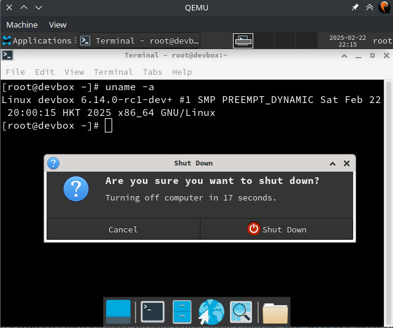
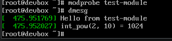

This blog post focuses on setting up a [Rust for Linux][r4l]
development environment that aims for ~*:zap: blazingly :zap:*~ **fast iteration**.

# Prerequisite

- Linux dev machine preferably on x86_64 architecture.
- Enable virtualization options needed for KVM in UEFI/BIOS Setup (Optional, for better performance)
- Install dependencies for building kernel, which varies from distribution to distribution.
- [Install a recent Rust compiler, bindgen, LLVM and Clang.](https://docs.kernel.org/rust/quick-start.html#requirements-developing) (At the time of writing, gccrs is still experimental)
- Install [QEMU system emulator](https://www.qemu.org/)

# Getting the Source

The first step is cloning the git repository.

Linux kernel adopts a distributed development model where there are many subsystems,
and each subsystem usually keeps a git repository, which is used to submit pull requests to Linus.
And Linus will merge them into mainline.

So there's usually a need to work with multiple git repositories from different subsystems.
Here we will manage them using git remotes, keeping a single git repository locally.

Later we will create [worktrees][worktree] and rootfs so we need to choose a workspace directory first,
here I will use `~/Workspaces/kernel`.

```bash
export WORKSPACE=$HOME/Workspaces/kernel
mkdir -p -- "$WORKSPACE" && cd $_
```

First, let us clone the mainline tree:

```bash
git clone git://git.kernel.org/pub/scm/linux/kernel/git/torvalds/linux.git
```

And then add the [Rust for Linux][r4l] tree to it and fetch from it:

```bash
cd linux
git remote add rust https://github.com/Rust-for-Linux/linux.git
git fetch rust
```

We can see a few rusty branches from this remote become available:

```
remote: Enumerating objects: 10187, done.
remote: Counting objects: 100% (2685/2685), done.
remote: Total 10187 (delta 2685), reused 2685 (delta 2685), pack-reused 7502 (from 1)
Receiving objects: 100% (10187/10187), 9.76 MiB | 3.69 MiB/s, done.
Resolving deltas: 100% (6657/6657), completed with 876 local objects.
From https://github.com/Rust-for-Linux/linux
 * [new branch]                for-rust-upstream-ci -> rust/for-rust-upstream-ci
 * [new branch]                rust                 -> rust/rust
 * [new branch]                rust-block-next      -> rust/rust-block-next
 * [new branch]                rust-dev             -> rust/rust-dev
 * [new branch]                rust-fixes           -> rust/rust-fixes
 * [new branch]                rust-next            -> rust/rust-next
```

<CH.Section>

But before rushing to checkout _`rust-next`_ branch and configure and build the kernel,
let's create a [git worktree][worktree].

:::info

A [git worktree][worktree] is a separate working tree attached to the same git repository.
During development, it is often handy to be able to work on multiple branches/topics concurrently.
For instance, working on rusty feature `A` on a branch based on _`rust-next`_ and working on bug fixes
in other subsystems based on a different git branch.

By using [git worktree][worktree], we can avoid other suboptimal solutions like:

- (*anti-pattern*) Copy the entire git repository to work on another branch concurrently.
  This obviously occupies much more disk space and will require running _`git fetch`_ in both repos in the future.
- Just checking out another branch when switching tasks, which is very tedious and will often trigger rebuild of all the codes.

:::

We will place the worktrees under _`$WORKSPACE/trees`_ and name the branch(and the worktree) _`rust-quick-start`_:

```bash
mkdir -p -- "$WORKSPACE/trees"
git worktree add -b rust-quick-start "$WORKSPACE/trees/rust-quick-start" rust/rust-next
cd ../trees/rust-quick-start
```

</CH.Section>

# Configure the Kernel

Manually configuring the kernel in menuconfig is tedious.
So I have created a relatively minimal kernel config which you can download [here](.config).

This [`.config`](.config) enables a minimal set of options, like

- Loadable Kernel Module
- Rust
- eBPF
- root on NFS and networking during early boot
- Things needed to run [systemd](https://syste.md)
- Virtio GPU, PS2 Keyboard and Mouse, etc to run a desktop environment

All you need to do is to [download the config file](.config) to the root of your worktree and name it `.config`.

Then we update the `.config` file via `make LLVM=1 olddefconfig`,
which will set new options to their default values.

# Build the Kernel

:::caution

At the time of writing, there's a bug in the kernel that will cause build errors under this `.config`.

Specifically, x86 builds with both `CONFIG_GENDWARFKSYMS` and `CONFIG_FUNCTION_TRACER` enabled will result in
an error complaining about missing prototype for `get_kernel_nofault()`.

So I picked the fix from mailing lists into my branch:

```bash
curl https://lore.kernel.org/all/173881156244.211648.1242168038709680511.stgit@devnote2/raw | git am
```

Future readers might not need to do this once the fix is present in [Rust for Linux][r4l]'s tree.

:::

Let's first check rust is available:

```bash
$ make LLVM=1 rustavailable 
Rust is available!
```

Cool! Time for a build:

```bash
make LLVM=1 -j$(nproc)
```

And after waiting, the kernel is built:

```bash
  OBJCOPY arch/x86/boot/vmlinux.bin
  AS      arch/x86/boot/header.o
  LD      arch/x86/boot/setup.elf
  OBJCOPY arch/x86/boot/setup.bin
  BUILD   arch/x86/boot/bzImage
Kernel: arch/x86/boot/bzImage is ready  (#1)
```

Now let's build a rootfs to boot.

# Build a rootfs

We will boot a full Linux distribution with our built kernel.
In this blog post, I will create an Arch Linux rootfs but it is also possible to use
other distributions if you want to tweak the commands. (I use Arch, BTW :smile:)

<CH.Section>

First create a directory for storing rootfs and _`cd`_ into it:

```bash
mkdir -p -- "$WORKSPACE/rootfs" && cd $_
```

</CH.Section>

Then bootstrap a base Arch Linux chroot:

```bash
sudo mkdir arch
sudo pacstrap arch base systemd-sysvcompat vim busybox
```

And setting up some basic stuff:

```bash
sudo ln -sf $(realpath /etc/localtime) arch/etc/localtime
echo devbox | sudo tee arch/etc/hostname
sudo passwd -R $(realpath arch)
```

Now we have an Arch Linux rootfs on our host,
which is very handy for us to transfer files between host and guest.
But how could we use it as rootfs in emulator?

The simple answer is NFS.
(Well, there are other options like [`9pfs`](https://wiki.qemu.org/Documentation/9p_root_fs), but personally I get a lot of quirks when using it)

To make the rootfs available over NFS, we need to install nfs server on host and enable it:

```bash
sudo systemctl start nfs-server.service
```

<CH.Section>

Then add our workspace folder to _`/etc/exports`_:

```bash
echo "$WORKSPACE 127.0.0.1(rw,sync,no_subtree_check,no_root_squash,insecure)" | sudo tee -a /etc/exports
```

</CH.Section>

Here I choose to expose not only the rootfs but the entire workspace over NFS
because I find it easier this way to run kselftests in guest.

And export it:

```bash
sudo exportfs -av
```

# Write a Minimal Init

Wait. Shouldn't we use [Systemd](https://syste.md) for init?

Sure, but most of the time we do not need it and a simple init could dramatically speed up things.

Let us save the following script to `arch/init2` and give it executable permission.

<CH.Code lineNumbers={true}>

```bash init2
#!/bin/sh
echo "### BEGIN INIT ###"
mkdir -p /proc
mkdir -p /sys
mkdir -p /dev
mount -t devtmpfs none /dev
mkdir -p /dev/pts
mount -t devpts none /dev/pts
mount -t proc none /proc
mount -t sysfs none /sys
mount -t debugfs debugfs /sys/kernel/debug

ln -s /proc/self/fd /dev/fd

ip addr add 10.0.2.15 dev eth0
ip link set lo up
ip link set eth0 up

echo 8 > /proc/sys/kernel/printk
mount -a

echo "### END INIT ###"
setsid busybox cttyhack bash
```

</CH.Code>

This init script simply mounts the filesystems, configures the network, setting printk level and drops you into a shell.

:::note

Those magic IP addresses come from [QEMU User Networking](https://wiki.qemu.org/Documentation/Networking#User_Networking_(SLIRP)).

The performance of QEMU User Networking is poor but nonetheless should be enough for doing kernel hacking.

:::

# Boot!

```bash
cd -- "$WORKSPACE/trees/rust-quick-start"
sudo qemu-system-x86_64 \
    -kernel arch/x86/boot/bzImage -M pc \
    -m 4G -smp 4 \
    -vga none -nographic \
    -no-reboot \
    -accel kvm \
    -netdev user,id=n1,hostfwd=tcp::8022-:22 -device e1000,netdev=n1 \
    -append "root=/dev/nfs rw nfsroot=10.0.2.2:$WORKSPACE/rootfs/arch ip=10.0.2.15:10.0.2.2:10.0.2.2:255.255.255.0 console=ttyS0 init=/init2"
```

If everything works as intended, you should now booted into a bash shell of the guest.

# Didn't We Forget Modules?

Yes. we forgot to install the modules into the rootfs. Let's do it now:

<CH.Section>

First we will create _`/lib/modules`_ in rootfs and _`chown`_ that directory so that
we do not need to install modules as root. (Don't do that in production :joy:)

```bash
sudo mkdir -p -- "$WORKSPACE/rootfs/arch/lib/modules"
sudo chown "$USER:$USER" -- $_
```

</CH.Section>

Then we can install modules:

```bash
make LLVM=1 INSTALL_MOD_PATH="$WORKSPACE/rootfs/arch" modules_install
```

# Graphics and Systemd

Here I will install xfce4 as the desktop environment,
which is super light-weight.

```bash
# In guest
pacman -S xfce4 lightdm{,-gtk-greeter}
```

Then we need to tweak our qemu command line to add a display:

```bash
sudo qemu-system-x86_64 \
    -kernel arch/x86/boot/bzImage -M pc \
    -m 4G -smp 4 \
    -vga virtio \
    -display default \
    -no-reboot \
    -accel kvm \
    -device qemu-xhci \
    -netdev user,id=n1,hostfwd=tcp::8022-:22 -device e1000,netdev=n1 \
    -append "root=/dev/nfs rw nfsroot=10.0.2.2:$WORKSPACE/rootfs/arch ip=10.0.2.15:10.0.2.2:10.0.2.2:255.255.255.0 console=ttyS0"
```

A qemu window should pop up. After login, getting into the desktop environment is as easy as one line:

```bash
systemctl start lightdm
```

There are some quirks about the mouse in QEMU, I haven't figured out why.



# Write Some Rust Code

I didn't know if Rust for Linux is capable enough to be used to rewrite core kernel code so I am going to try crazy stuff like that now.

Let's try to rewrite the very simple `int_pow.c` and load a module to test it out:

```diff
diff --git a/lib/math/int_pow.c b/lib/math/int_pow.c
deleted file mode 100644
index 0cf426e69bda..000000000000
--- a/lib/math/int_pow.c
+++ /dev/null
@@ -1,32 +0,0 @@
-// SPDX-License-Identifier: GPL-2.0
-/*
- * An integer based power function
- *
- * Derived from drivers/video/backlight/pwm_bl.c
- */
-
-#include <linux/export.h>
-#include <linux/math.h>
-#include <linux/types.h>
-
-/**
- * int_pow - computes the exponentiation of the given base and exponent
- * @base: base which will be raised to the given power
- * @exp: power to be raised to
- *
- * Computes: pow(base, exp), i.e. @base raised to the @exp power
- */
-u64 int_pow(u64 base, unsigned int exp)
-{
-	u64 result = 1;
-
-	while (exp) {
-		if (exp & 1)
-			result *= base;
-		exp >>= 1;
-		base *= base;
-	}
-
-	return result;
-}
-EXPORT_SYMBOL_GPL(int_pow);
diff --git a/lib/math/int_pow.rs b/lib/math/int_pow.rs
new file mode 100644
index 000000000000..3277e781e497
--- /dev/null
+++ b/lib/math/int_pow.rs
@@ -0,0 +1,11 @@
+///! int_pow, now in a rust crate
+
+/// int_pow - computes the exponentiation of the given base and exponent
+/// @base: base which will be raised to the given power
+/// @exp: power to be raised to
+///
+/// Computes: pow(base, exp), i.e. @base raised to the @exp power
+#[no_mangle]
+pub extern "C" fn int_pow(base: u64, exp: u32) -> u64 {
+    base.pow(exp)
+}
diff --git a/rust/exports.c b/rust/exports.c
index 587f0e776aba..67a4649e448c 100644
--- a/rust/exports.c
+++ b/rust/exports.c
@@ -24,3 +24,5 @@
 #ifdef CONFIG_RUST_BUILD_ASSERT_ALLOW
 EXPORT_SYMBOL_RUST_GPL(rust_build_error);
 #endif
+
+EXPORT_SYMBOL_RUST_GPL(int_pow);
diff --git a/test-module/Makefile b/test-module/Makefile
new file mode 100644
index 000000000000..aec620066fb4
--- /dev/null
+++ b/test-module/Makefile
@@ -0,0 +1 @@
+obj-m += test-module.o
diff --git a/test-module/test-module.c b/test-module/test-module.c
new file mode 100644
index 000000000000..2f9764aa972a
--- /dev/null
+++ b/test-module/test-module.c
@@ -0,0 +1,18 @@
+#include <linux/module.h>
+#include <linux/printk.h>
+#include <linux/math.h> 
+
+static int __init init_test_module(void) {
+    pr_info("Hello from test-module\n");
+    pr_info("int_pow(2, 10) = %llu\n", int_pow(2, 10));
+    return 0; 
+} 
+
+static void __exit exit_test_module(void) { 
+    pr_info("Goodbye from test-module\n"); 
+}
+
+module_init(init_test_module);
+module_exit(exit_test_module);
+
+MODULE_LICENSE("GPL");
```

```bash
make LLVM=1 -j$(nproc)
make LLVM=1 M=test-module/ modules
make LLVM=1 M=test-module/ INSTALL_MOD_PATH="$WORKSPACE/rootfs/arch" modules_install
```

Wow, to my surprise, it works!



In practice, though, you should probably try other stuff like writing a driver in rust.
Rewriting core kernel things in rust are unlikely to be accepted at the time of writing:/

# Recap: Inner Dev Loop

To summarize, the inner dev loop is 

1. Build kernel (and install modules)
  ```bash
  make LLVM=1 -j$(nproc)
  make LLVM=1 INSTALL_MOD_PATH="$WORKSPACE/rootfs/arch" modules_install
  ```
2. Test the changes in QEMU

This blog post uses 
- git worktree for efficient topic/branch management
- QEMU instead of real hardware
- root on NFS so that transfering files between host and guest are very handy
- two `init`s tailored for different development tasks
- full linux distribution as rootfs so that it is simple to test anything as easy as on host

to achieve faster inner dev loop.

[r4l]: https://rust-for-linux.com/
[worktree]: https://git-scm.com/docs/git-worktree

