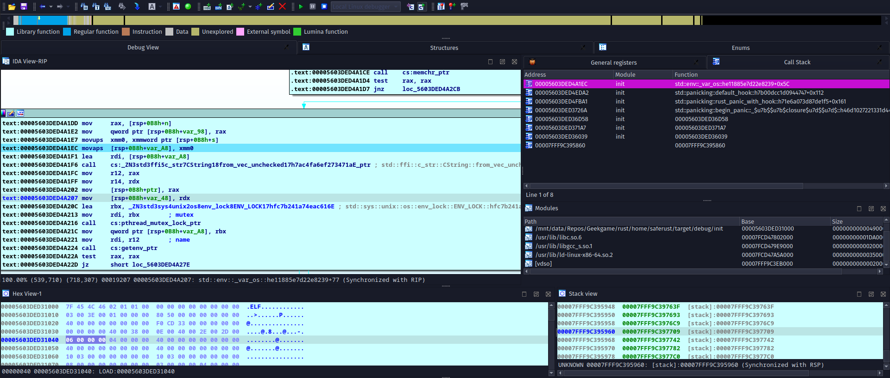

Recently I particated in [Geekgame 2nd](TODO), which is a pretty good CTF competition
for CTF newbies like me.

One problem in that competition is to submit a safe rust program that will segfault.
The problem forces you to begin your rust code by `#![forbid(unsafe_code)]`, which can't
be worked around by `#![allow(unsafe_code)]`.

Of course, there is [an attribute `allow_internal_unsafe`](https://doc.rust-lang.org/beta/unstable-book/language-features/allow-internal-unsafe.html)
which allows you to use unsafe code inside a macro. 

But after [this PR](https://github.com/rust-lang/rust/pull/57467) was merged, 
you can no longer use this attribute when unsafe code is forbidden.

(See [this issue](https://github.com/rust-lang/rust/issues/56768) for more information on that PR)

So how can you cause a segfault in safe rust under the assumption that
you can not bypass `#![forbid(unsafe_code)]`.

# Stack Overflow

Rust can handle stack overflow in most cases (for example, infinite recursion).

An infinite recursion will indeed cause a segfault. 
But rust's signal handler will catch it and
kill your program by `SIGABRT` instead of `SIGSEGV`.

:::note

In case you want to know.

There are some discussions about why `SIGABRT` is used instead of `SIGSEGV`:

- https://github.com/rust-lang/rust/issues/31273
- `SIGILL` was used previously: https://github.com/rust-lang/rust/issues/26458

:::

Diving into [the implementation of that signal handler](https://github.com/rust-lang/rust/blob/008bc1d587b4f9d7197eb159922dd2080eea9284/library/std/src/sys/unix/stack_overflow.rs#L57-L102), 
we can understand how rust handles segfault:

```rust library/std/src/sys/unix/stack_overflow.rs
// Signal handler for the SIGSEGV and SIGBUS handlers. We've got guard pages
// (unmapped pages) at the end of every thread's stack, so if a thread ends
// up running into the guard page it'll trigger this handler. We want to
// detect these cases and print out a helpful error saying that the stack
// has overflowed. All other signals, however, should go back to what they
// were originally supposed to do.
//
// This handler currently exists purely to print an informative message
// whenever a thread overflows its stack. We then abort to exit and
// indicate a crash, but to avoid a misleading SIGSEGV that might lead
// users to believe that unsafe code has accessed an invalid pointer; the
// SIGSEGV encountered when overflowing the stack is expected and
// well-defined.
//
// If this is not a stack overflow, the handler un-registers itself and
// then returns (to allow the original signal to be delivered again).
// Returning from this kind of signal handler is technically not defined
// to work when reading the POSIX spec strictly, but in practice it turns
// out many large systems and all implementations allow returning from a
// signal handler to work. For a more detailed explanation see the
// comments on #26458.
unsafe extern "C" fn signal_handler(
    signum: libc::c_int,
    info: *mut libc::siginfo_t,
    _data: *mut libc::c_void,
) {
    let guard = thread_info::stack_guard().unwrap_or(0..0);
    let addr = (*info).si_addr() as usize;

    // If the faulting address is within the guard page, then we print a
    // message saying so and abort.
    if guard.start <= addr && addr < guard.end {
        rtprintpanic!(
            "\nthread '{}' has overflowed its stack\n",
            thread::current().name().unwrap_or("<unknown>")
        );
        rtabort!("stack overflow");
    } else {
        // Unregister ourselves by reverting back to the default behavior.
        let mut action: sigaction = mem::zeroed();
        action.sa_sigaction = SIG_DFL;
        sigaction(signum, &action, ptr::null_mut());

        // See comment above for why this function returns.
    }
}
```

After reading the comments in the code, you should understand how the stack 
overflow was caught and handled specially.

(The documentation is so good that you have no need to read the code.)

To cause a real segfault, we need to move the stack pointer after
the guard pages in one go.

I found one way to achieve that: create a struct which was aligned to a huge number.

Here is [a link to rust playground](https://play.rust-lang.org/?version=stable&mode=debug&edition=2021&gist=142f00959988896a5d887e79a589eda7), 
which is very handy when you don't have your IDEs/compilers at hand.

```rust
#![forbid(unsafe_code)]
#[repr(align(268435456))]
struct X {
    a: [usize; 100],
}

pub fn main() {
    let mut x = X { a: [2; 100] };
    for i in 1..100 {
        x.a[i] = i;
    }
    for i in 1..100 {
        print!("{}", x.a[i]);
    }
}
```

Note that the for loops are only a workaround to prevent the compiler from
optimizing away the variable. You won't get a segfault if you remove
the for loops and run the program built in release profile.

# Link code into .init section

:::warning

This method only works with old versions of rust compilers. (Tested with rustc 1.51.0 stable)

New rust compilers(e.g. 1.65 nightly) considers some attributes 'unsafe'
and refuse to compile code with such unsafe attributes when you 
added `#![forbid(unsafe_code)]`.

Read these materials if you want to learn more:

- [Add allow-by-default lints for all attributes with unsafe behaviors #82499](https://github.com/rust-lang/rust/issues/82499)
- [Pre-RFC: unsafe attributes](https://internals.rust-lang.org/t/pre-rfc-unsafe-attributes/17462)

:::

Geekgame competition uses rust 1.51, which means we can still 
use this method to cause a segfault.

In case you don't know, 
> `.init` section holds executable instructions that contribute to the process initialization code.
That is, when a program starts to run, the system arranges to execute the code in this sec-
tion before calling the main program entry point.

To learn more about the ELF format, read [this book](http://www.skyfree.org/linux/references/ELF_Format.pdf).

```rust
#![forbid(unsafe_code)]
#[link_section = ".init"]
#[no_mangle]
fn bad(){
    panic!()
}

fn main() {}
```

For some reason that I do not know, we must add the `no_mangle` attribute.
Otherwise the function won't be linked into `.init` section.



The program will segfault in rust's default panic hook. (in a function call to `std::env::_var_os::he11885e7d22e8239`)

See <Link to="/blog/geekgame-2nd-writeup/#flag2-1">my writeup(in Chinese)</Link> for the second part of the CTF problem. 
You can link arbitrary machine code into `.init` section. 

# CVEs

You can only write safe rust code, but there are a lot of unsafe code wrapped in a safe API.

If your rust standard library have memory bugs, you can make use of such bugs
to cause a segfault in your safe rust code.

See [Rust CVE](https://github.com/Qwaz/rust-cve) for a list of CVEs in the rust standard library.

We can make use of [`CVE-2021-28879`](https://cve.mitre.org/cgi-bin/cvename.cgi?name=CVE-2021-28879)
to cause a segfault in safe rust code.

```rust
#![forbid(unsafe_code)]
// This code is copied from https://github.com/rust-lang/rust/issues/80335
fn overflowed_zip(arr: &[i32]) -> impl Iterator<Item = (i32, &())> {
    static UNIT_EMPTY_ARR: [(); 0] = [];

    let mapped = arr.into_iter().map(|i| *i);
    let mut zipped = mapped.zip(UNIT_EMPTY_ARR.iter());
    zipped.next();
    zipped
}

fn main() {
    let arr = [1, 2, 3];
    let zip = overflowed_zip(&arr).zip(overflowed_zip(&arr));

    dbg!(zip.size_hint());
    for (index, num) in zip.map(|((num, _), _)| num).enumerate() {
        println!("{}: {}", index, num);
    }
}
```

