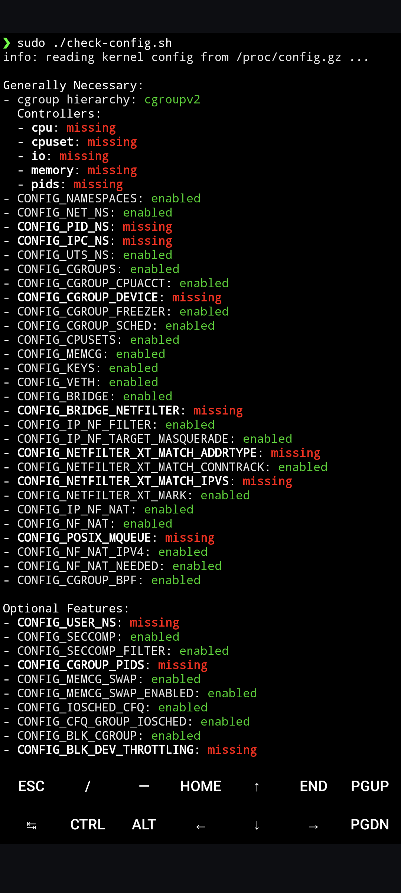
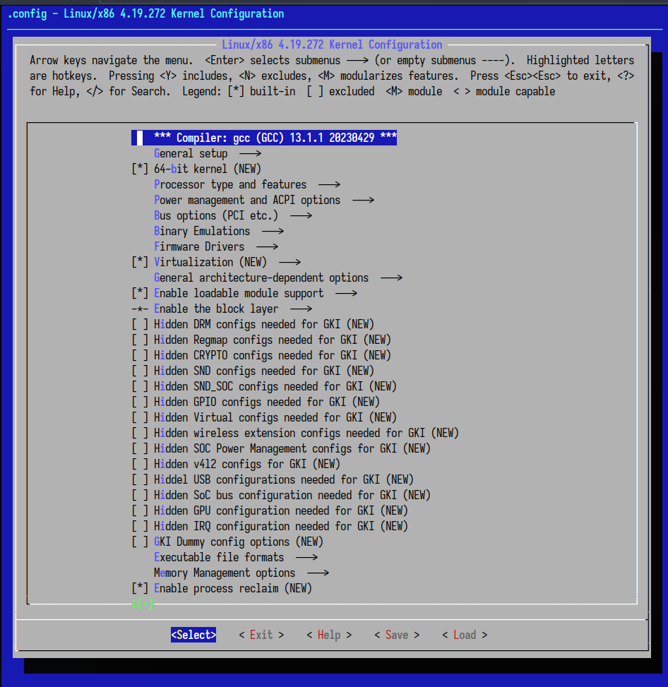
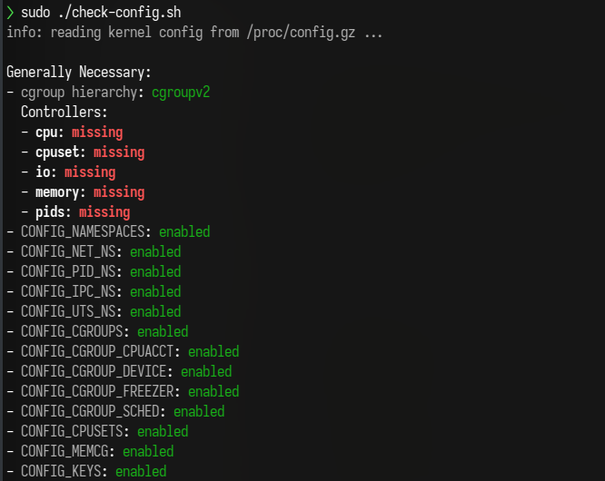
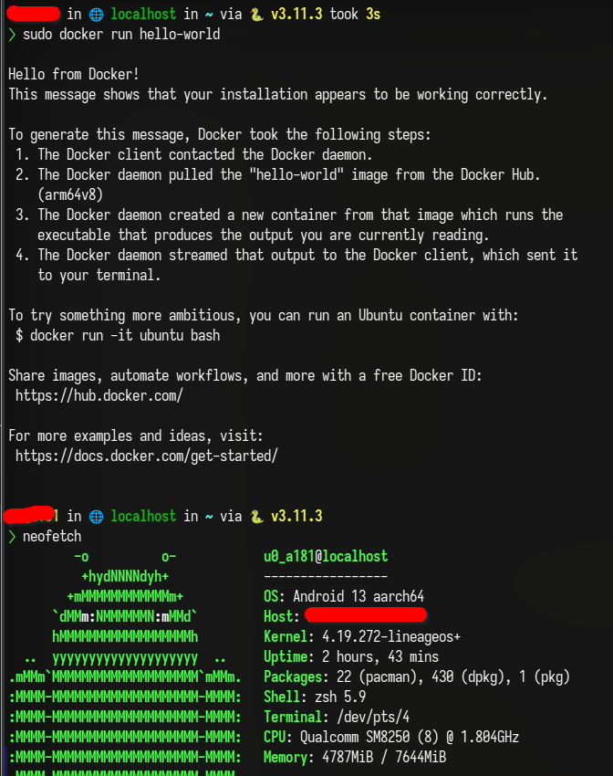
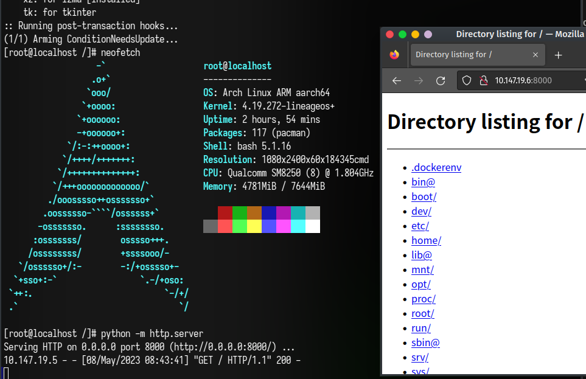
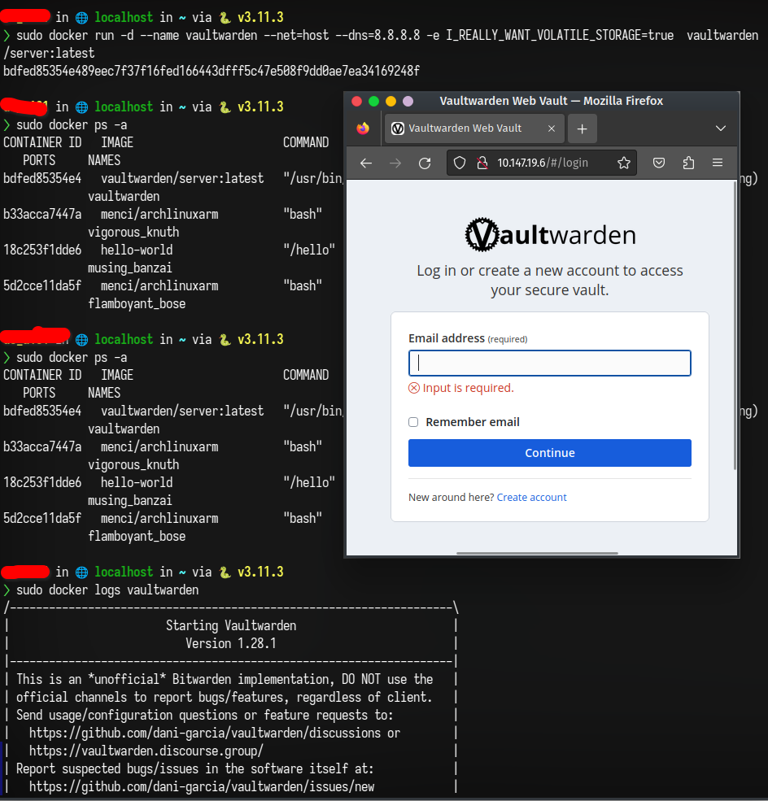
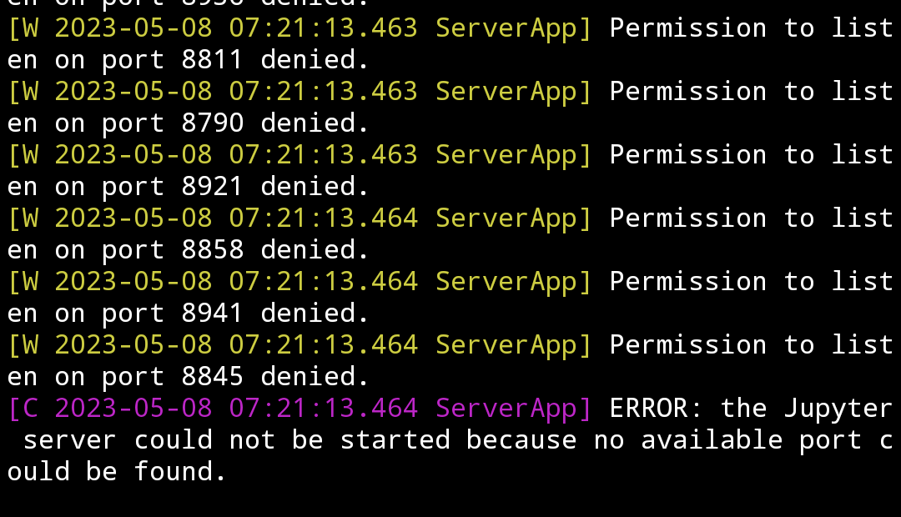

Sometimes I want to self-host some services. But my VPS is already overloaded and I don't want to rent a new VPS.
Maybe it is a good idea to host services on my Android phone. The phone is always connected to the Internet and it is powerful enough to run some services.
To be honest, it is too powerful that I usually don't use it to its full potential. So why not use it to host some services?
And I always keep my phone from running out of battery.

I am running [LineageOS](https://lineageos.org/) on my phone. It is a custom Android ROM that is free and open-source.
This article is based on LineageOS. If you are using other Android ROMs, you need to know how to build a custom kernel for your phone.

**Some assumptions before continuing**:

- You have unlocked the bootloader of your phone.
- You have a rooted Android phone running LineageOS.
  - If you are not using LineageOS, this article may still be helpful to you, but you can't follow the steps exactly.
- You have installed [Termux](https://termux.com/) on your phone and you know it well.
- You have basic knowledge of Docker.
- You understand that following the instructions in this article may cause your phone to be bricked.
  - I am not responsible for any damage to your phone.
- You are using a Linux machine.
- You should be comfortable with using the command line on linux, if not, you should learn it first.
- Your phone is is using the latest version of LineageOS.
  - If not, you should update it first.

:::warning
Be sure to check all the assumptions above before continuing.

Making changes to boot.img is **DANGEROUS**.
And **I am not responsible for any damage to your phone**.

**You should know what you are doing before continuing.**
:::

I found that there is already a guide on [how to run Docker in termux](https://gist.github.com/FreddieOliveira/efe850df7ff3951cb62d74bd770dce27).
(It will be called the guide in the following text)
But it is a generic guide and I want something more specific to my phone, or LineageOS. So I wrote this article.

# Building Kernel from Source

The default kernel of LineageOS doesn't support some features that are required by Docker.
So we need to build a custom kernel for our phone.

First, clone the LineageOS source code and set up the build environment by following the [official guide](https://wiki.lineageos.org/devices/).
(Select your phone model and follow the instructions under "Build for yourself"). You should stop before the "Start the build" section.

After that, you should have a directory `android/lineage` under your home/working directory.

:::note
By default,
all the relative paths in this article are relative to `android/lineage`.
:::

Then, let's try to build the kernel and `boot.img` to see if everything is working.

```bash
cd android/lineage
source build/envsetup.sh
breakfast <your phone model>
m bootimage
```

If everything works fine, you should see the `boot.img` under `out/target/product/<your phone model>/boot.img`.

Before customizing the kernel, we should verify that the untampered kernel can boot successfully. Then **magisk patch it** and flash it to your phone in fastboot.

```bash
adb reboot fastboot
fastboot flash boot magisk_patched.img
```

If it boots successfully, you can continue to customize the kernel :tada: :tada: :tada:.

Otherwise, you should fix the problem first. Unfortunately, I can't help you with that because most errors are device-specific.

# Build a Custom Kernel

First, let's check what config options are missing in the default kernel.

In termux, run the following commands one by one:

```bash
pkg install wget
wget https://raw.githubusercontent.com/moby/moby/master/contrib/check-config.sh
chmod +x check-config.sh
sed -i '1s_.*_#!/data/data/com.termux/files/usr/bin/bash_' check-config.sh
sudo ./check-config.sh
```

You should see a lot of config options are missing. We need to enable some of them in the kernel config.



Then, let's get our hands dirty! First of all, find the kernel source directory of your phone model.

## Find the Kernel Source Directory

<CH.Section>

For me, it is _`kernel/xiaomi/sm8250`_. If you can't find it at a glance, you can usually find it by looking
at the _`BoardConfig.mk`_ file under _`device/<your phone manufacturer>/<your phone model>/`_. In my case,
this file includes another file:

```makefile
include device/xiaomi/sm8250-common/BoardConfigCommon.mk
```

</CH.Section>

By taking a look at _`device/xiaomi/sm8250-common/BoardConfigCommon.mk`_,

<CH.Section>

I found that my kernel source directory is _`kernel/xiaomi/sm8250`_:

<CH.Code>

```bash
$ grep kernel BoardConfigCommon.mk
TARGET_KERNEL_SOURCE := kernel/xiaomi/sm8250
```

</CH.Code>

</CH.Section>

## Patching

:::note
This section assumes that you are in the kernel source directory.
By default, all the relative paths in this section are relative to the kernel source directory.
:::

Following the guide, there is a file that **needs to be patched**[^1] because of a bug introduced by Google.

```bash
curl -L https://gist.github.com/kxxt/9e6d0edc57e2dbc62ac8ba09383230ef/raw/6c35eb39b5f6baa4f3ad67e55298400365511470/termux-kernel-docker.patch \
 | patch -Np1
```

## Configuring

Then, we need to **enable some config options**.

{/* Run `ARCH=arm64 make menuconfig` to launch the kernel's configuration menu:



Enable the missing config options. You can use the search function to find them.

In my case, I manually enabled the following options:

- General Setup
  - System V IPC (Optional)
  - Namespaces support
    - [x] User namespace
  - [x] Control Group Support
    - [x] Memory controller
    - [x] IO controller
    - [x] CPU controller
      - Group scheduling for SCHED_OTHER
        - [x] CPU bandwidth provisioning for FAIR_GROUP_SCHED
    - [x] PIDs controller
    - [x] Device controller
- Platform selection
  - [x] Qualcomm Platforms
- [x] Networking support
  - Networking options
    - [x] TCP/IP networking
    - [x] Network packet filtering framework (Netfilter)
- Device Drivers
  - [x] Network device support
    - [x] Virtual eXtensible Local Area Network (VXLAN)
    - Network core driver support
      - [x] IP-VLAN support
      - [x] MAC-VLAN support
  - [x] Multiple devices driver support (RAID and LVM)
    - [x] Device mapper support
      - [x] Thin provisioning target
- Networking support
  - Networking options
    - [x] 802.1Q/802.1ad VLAN Support
    - [x] 802.1d Ethernet Bridging
      - [x] VLAN filtering
    - Network packet filtering framework (Netfilter)
      - Core Netfilter Configuration
        - [x] Netfilter connection tracking support
      - [x] IP virtual server support
        - [x] Netfilter connection tracking
        - [x] TCP load balancing support
        - [x] UDP load balancing support
        - [x] round-robin scheduling
      - [x] Advanced netfilter configuration
        - [x] Bridged IP/ARP packets filtering
      - Core Netfilter Configuration
        - [x] Netfilter Xtables support (required for ip_tables)
          - [x] "addrtype" address type match support
          - [x] "ipvs" match support
          - [x] "control group" match support
    - [x] Networking priority cgroup
    - [x] Qos and/or fair queueing
      - [x] Control Group Classifier
- Enable the block layer
  - [x] Block layer bio throttling support
- [x] Bus support

  - [x] PCI support
  - [x] PCI controller drivers
    - [x] MSM PCIe Controller driver
      - [x] MSM PCIe MSI support

- Device Drivers
  - [x] Xiaomi device
  - [x] Xiaomi SM8250
  - Xiaomi board selection
  - [x] Xiaomi \<phone_model\> board
  - [x] I2C support
  - Input device Support
    - Generic input layer (needed for keyboard, mouse, ...)
    - [x] Touchscreens
      - [x] Focaltech Touchscreen
        - [x] Focaltech Touchscreen Fod func
      - [x] Xiaomi Touch Feature
    - [x] Fingerprints
      - [x] Finger print card goodix (FINGERPRINT_GOODIX_FOD)
    - Miscellaneous devices
      - [x] Awinic AW8697 HAPTIC
  - [x] Power supply class support - [x] TI Technologies, Inc. Charger support - [x] BQ2597X power supply framework based driver (CONFIG_BQ2597X_CHARGE_PUMP) - [x] Maxim Integrated Charger and Fuel Gauge support - [x] Support ds28e16 as encryption IC. (CONFIG_BATT_VERIFY_BY_DS28E16) - [x] Support Onewire Driver.
        :::attention
        Depending on the check result, you may need to enable more options.
        :::

After that, save the config as `.config` and exit.

Generate a `defconfig` file and then copy the `defconfig` to config directory:

````bash
make savedefconfig
mv defconfig arch/arm64/configs/docker.config
``` */}

Make a copy of the config file of your phone and edit it:

```bash
cd arch/arm64/configs/
cp vendor/<your phone vendor>/<your phone model>.config docker.config
vim docker.config
````

Based on the check results I get inside termux, I appended the following lines. You may need to append more lines depending on your check results.

```bash
# Docker support

CONFIG_SYSVIPC=y
CONFIG_CGROUPS=y
CONFIG_MEMCG=y
CONFIG_BLK_CGROUP=y
CONFIG_CGROUP_SCHED=y
CONFIG_CFS_BANDWIDTH=y
CONFIG_CGROUP_PIDS=y
CONFIG_CGROUP_DEVICE=y
CONFIG_USER_NS=y
CONFIG_PID_NS=y
CONFIG_SMP=y
CONFIG_BRIDGE_NETFILTER=y
CONFIG_CGROUP_PER=y
CONFIG_NETFILTER_XT_MATCH_ADDRTYPE=y
CONFIG_IP_VS=y
CONFIG_IP_VS_NFCT=y
CONFIG_IP_VS_PROTO_TCP=y
CONFIG_IP_VS_PROTO_UDP=y
CONFIG_IP_VS_RR=y
CONFIG_NETFILTER_XT_MATCH_IPVS=y
CONFIG_POSIX_MQUEUE=y
CONFIG_VXLAN=y
CONFIG_BRIDGE_VLAN_FILTERING=y
CONFIG_IPVLAN=y
CONFIG_MACVLAN=y
CONFIG_DM_THIN_PROVISIONING=y
# Optional
CONFIG_BLK_DEV_THROTTLING=y
CONFIG_NET_CLS_CGROUP=y
CONFIG_CGROUP_NET_PRIO=y
```

And commit all the changes then clean the kernel directory:

```bash
git add arch net
git commit -m "docker support"
make mrproper
```

:::tip
In my case, `make mrproper` deleted some nesscessary files with file extension `.i`.

If you encounter the same problem, you can restore them by running the following command:

```bash
git restore '*.i'
```

:::

Then modify the `BoardConfig.mk` file of your phone:

It should be under `device/<your phone manufacturer>/<your phone model>/BoardConfig.mk` (relative to repo root).

Change the `TARGET_KERNEL_CONFIG` variable to make it point to the config file we just created:

```makefile
TARGET_KERNEL_CONFIG += docker.config
```

## Building

Finally, we can build the kernel:

Execute the following command at the root directory of the repo to build the kernel:

```bash
source build/envsetup.sh
breakfast <your phone model>
m bootimage
```

## Flashing

If everything works fine, you should find the result `boot.img` under `out/target/product/<your phone model>/`.

Magisk patch it as before and flash it to your phone.

```bash
adb reboot fastboot
fastboot flash boot magisk_patched_with_docker_enabled_boot.img
```

# Check again

If everything goes well, and you phone still boots, let us check again if docker works.

In termux:

```bash
sudo ./check-config.sh
```



For me, some cgroup controllers are still missing. But I can still run docker containers.
Maybe it is the check script's bug.

# Install docker

Installing docker on termux is very convenient now. Just run the following command:

```bash
pkg install root-repo && pkg install docker
```

# Run it!

Now it is time to run docker!

Let's start the docker daemon first:

```bash
sudo dockerd --iptables=false
```

Then, open another termux session by swiping from the left edge of the screen to the right and click "New session".

Let's start with a simple hello world:

```bash
sudo docker run hello-world
```



It works! :tada: :smile: :smile: :smile:

Then let's try something more complicated:

```bash
sudo docker run -it --net=host --dns=8.8.8.8 menci/archlinuxarm bash
# inside the container
sudo pacman -Sy
pacman -S neofetch python
neofetch
python -m http.server
```

It works! :tada: :tada: :tada: I can access the web server from my laptop!
(I am using zerotier one to connect my phone and laptop via a virtual network)



To prove the potentional of docker on android, I tried to run vaultwarden (a self-hosted bitwarden server) on my phone.

It works! :tada: :tada: :tada: :tada: :tada: Although I prefer to run it on my VPS.




# Caveats

See [the guide](https://gist.github.com/FreddieOliveira/efe850df7ff3951cb62d74bd770dce27#31-caveats) for more details.

With bridged networking, you can't access the internet from inside the container. 
You can use `--net=host --dns=8.8.8.8` to solve this problem.

But with this solution, non root users inside the container can't `bind`.



I haven't figured out how to solve this problem yet.

To workaroud this problem, we can rewrite the Dockerfile to use the root user.

Using shared volume is also [problematic](https://gist.github.com/FreddieOliveira/efe850df7ff3951cb62d74bd770dce27#312-shared-volumes).
I plan to just store the data in the container.

# References

- https://gist.github.com/FreddieOliveira/efe850df7ff3951cb62d74bd770dce27
- https://www.reddit.com/r/LineageOS/comments/119qdd9/need_help_building_kernel_in_tree_with_custom/

[^1]: https://gist.github.com/FreddieOliveira/efe850df7ff3951cb62d74bd770dce27#netnetfilterxt_qtaguidc
