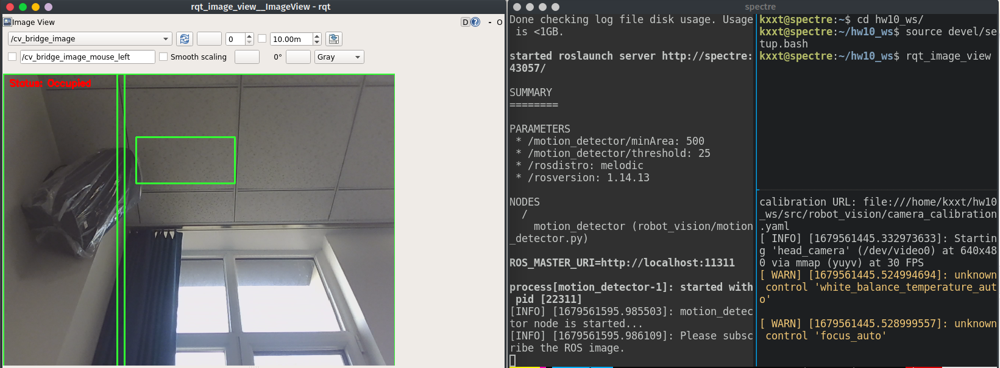

import Issue from "@/components/mdx/Issue"


# 背景

本学期的嵌入式机器人课的主要内容是 **ROS(Robot Operating System)**. 
上课教的是第一代 ROS Melodic (马上在 2023 年 5 月就停止支持了).
ROS 官方主要支持 Ubuntu 操作系统, 对我正在使用的 Archlinux 只有实验性的支持.

AUR 上的 ROS Melodic 已经被标记为 orphan 了, 于是我就装了 ROS Noetic, 比 Melodic 高一代.

然后我就开始各种踩坑了, 首先从 AUR 上装 ROS Noetic 的时候就遇到了
`ignition-cmake` 的 CMake 文件找不到的问题 <Issue number={2} open={false} repo="ros-noetic-arch/ros-noetic-gazebo-plugins" half/>.

AUR 里的 `ignition-cmake` 已经是 v3 了, 简单的看了一下, 缺的文件是 v2 提供的, 
而且 v2 和 v3 不冲突. 在安装了 v2 之后, AUR 里的 ROS Noetic 就能顺利的构建安装了.

这时, 我以为坑已经踩完了, 结果上课时遇到了一堆 Python2 相关的问题. ROS Noetic 带的一些 Python
脚本是 Python2 的, 遇上系统的 python3 就挂了, 另外实验提供的代码也全是 Python2 的, 
我都要手动翻译成 Python3 (不是什么大问题, 就是有点烦).

昨天踩了个大坑, `catkin_make` 的时候报找不到 `vtk` 9.1.0 的一些共享库. 很自然的, 
看起来是因为滚动升级把 `vtk` 给升级了, 系统里的 `vtk` 共享库都是 9.2.6 的. 
先用 `ripgrep` 搜 `9\.1\.0` 找出需要 rebuild 的包. 然后清掉缓存再 rebuild.
rebuild 的时候踩到坑了, 撞上了一样的问题. 我必须先把系统里的那些要 rebuild 的 ROS 包给强制卸载掉 (`pacman -Rdd`)
才能成功构建它们.

另外, 实验里的 OpenCV 人脸检测程序一跑就 hang. 我检查了一下, hang 在 `detectMultiScale` 里面了. 如果开个
mamba 环境跑的话就不会 hang, 目测是 Archlinux 带的 `(python-)opencv` 炸了.

于是, 为了减少踩坑, 我决定还是用 ROS Melodic 官方支持的 Ubuntu 18.04 作为开发环境吧. 
之前实验课配置过虚拟机, 不过体验很差. 我想过用 docker 架个开发环境, 
但是由于时不时需要往里面装新的软件包, 这就需要经常改 Dockerfile, 使用场景不是很 immutable.
最后我就决定试试 systemd-nspawn. 

下面是我在配置完成后写的总结过程, **因此可能会漏掉一些东西**.

# Bootstrap

先安装 `debootstrap`, 然后在 `/var/lib/machines/bionic` 下 bootstrap 一个 Ubuntu.

```bash
# 以 Root 身份运行
cd /var/lib/machines
debootstrap --include=dbus,systemd-container --components=main,universe,multiverse bionic bionic https://mirrors.tuna.tsinghua.edu.cn/ubuntu/
```

等 bootstrap 完了之后进去设个密码, 删掉 `/etc/securetty` 来避免等会登陆不了.

```bash
systemd-nspawn -D bionic
passwd
rm /etc/securetty
logout
```

# systemd-nspawn 配置

给我们的 bionic 容器写个配置文件: `/etc/systemd/nspawn/bionic.nspawn`:

<CH.Section>

```ini bionic.nspawn
[Exec]
PrivateUsers=off
ResolvConf=off

[Network]
VirtualEthernet=no

[Files]
BindReadOnly=/tmp/.X11-unix
Bind=/home/kxxt/repos/ros:/mnt
Bind=/dev/video1:/dev/video0
Bind=/run/user/1000
BindReadOnly=/run/user/1000/bus
Bind=/dev/dri
```

- 直接使用系统的现有 UID. 因为 Ubuntu 18.04 的 systemd 的版本太低, 不支持 systemd-nspawn 的一些高级功能
- 为了简单起见, 把 `VirtualEthernet` 设置成 `no`, 让容器直接使用宿主机网络.
- [不使用宿主机的 `resolv.conf`](focus://3)
- 另外, 为了能在容器里访问摄像头, 把 `/dev/video*` Bind 进去
- 为了启用硬件加速[^1], 把 `/dev/dri` Bind 进去. 
  - 我没有验证这个配置有没有生效, 反正最后跑 `glxinfo` 的结果是硬件加速启用了.
- [跟宿主机共享 X11 和 dbus](focus://9,13)
- [把需要共享的目录 Bind 进去](focus://10)

</CH.Section>


然后, 我们还需要编辑一下 `systemd-nspawn@bionic.service`:

```bash
sudo systemctl edit systemd-nspawn@bionic.service
```

添加下面的配置允许容器操作位于 `/dev/video1` 的摄像头设备.

```ini override.conf
[Service]
DeviceAllow=/dev/video1 rwm
```

# 容器系统配置

然后, 利用 `machinectl` 启动并登陆进容器:

```bash
sudo machinectl start bionic
sudo machinectl login bionic
```

不知道出了什么问题, 我在容器内遇到了 DNS 解析问题, 我的处理方法就是上文中提到的在 nspawn 
配置文件里把 `ResolveConf` 的模式从 `auto` 改成 `off`. 另外, 在容器内禁用 `systemd-resolved`
服务, 

```bash
sudo systemctl disable --now systemd-resolved
echo 'nameserver 8.8.8.8' > /etc/resolv.conf
```

容器内的主机名可能也需要配置一下. 我把它配置成了和宿主机一样.

```bash
echo 主机名 > /etc/hostname
```

并在 `/etc/hosts` 中添加

```
127.0.0.1       主机名
```

然后重启容器, 再重新登陆进去

```bash
sudo machinectl stop bionic
sudo machinectl start bionic
sudo machinectl login bionic
```

创建一个 uid 和宿主机上的用户相同的用户, 授予 sudo 权限.

然后安装 git, tmux, alacritty 等基本软件, 正常[安装 ROS](https://wiki.ros.org/melodic/Installation/Ubuntu).

# 使用 ROS

在宿主机上允许容器连接 X server, 并查看 `DISPLAY` 环境变量的值: 

```bash
$ xhost +local:
$ echo $DISPLAY
:0
```

以普通用户的身份登陆容器, 然后设置好 `DISPLAY` 环境变量. 建议放 `.bashrc` 里, 避免每次使用都要设置.

然后就可以使用 ROS 了.

```bash
export DISPLAY=:0
alacritty
```



# 一个 Bug

在使用时, 我遇到了 rosout 吃满内存的 Bug[^2], 可以通过创建以下文件来解决

```text /etc/security/limits.d/30-nofilelimit.conf
#<domain>  <type>  <item>  <value>

*          soft    nofile  1024
*          hard    nofile  524288
```

# References

- https://wiki.archlinux.org/title/systemd-nspawn
- https://clinta.github.io/getting-started-with-systemd-nspawnd/

[^1]: https://wiki.archlinux.org/title/systemd-nspawn#3D_graphics_acceleration
[^2]: https://answers.ros.org/question/336963/rosout-high-memory-usage/