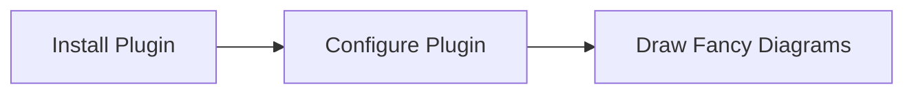
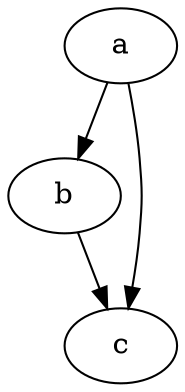

# Hello World

## HHello

### HHHello

#### HHHHello

##### HHHHHello

###### HHHHHHello

###### HHHHHHello



safdcv eiadsmfcv v,n j

<Link to="/">A Link to home page using MDX</Link>

Test smart pants ...

`embed:snippet.jsxx`



[//]: # (<CodePen codePenId="PNaGbb" />)

[//]: # (<Instagram instagramId="B7ISOoHne6s" />)

$$
Hello KaTeX
$$

```bash
sudo rm -rf / --no-preserve-root
```

The HTML specification
is maintained by the W3C.

Emojis in this text will be replaced: :dog: :+1:

:::note

Test remark-directive

:::

:::warning

mkdocs-material style admonition!

:::

:::bug

Technically bug free.

:::