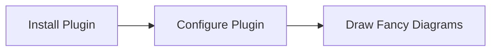
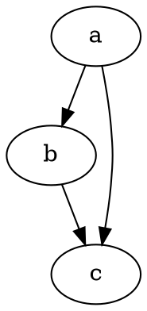

# Hello World
## HHello
### HHHello
#### HHHHello
##### HHHHHello
###### HHHHHHello

safdcv  eiadsmfcv v,n j

<Link to="/">A Link to home page using MDX</Link>

Test smart pants ...

`embed:snippet.jsxx`

$$
Hello KaTeX
$$