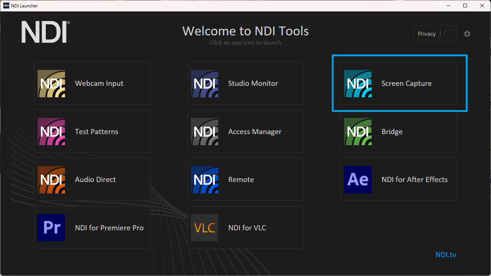
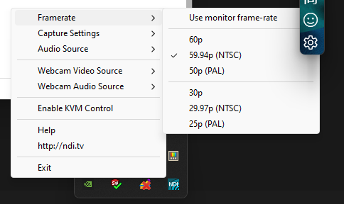
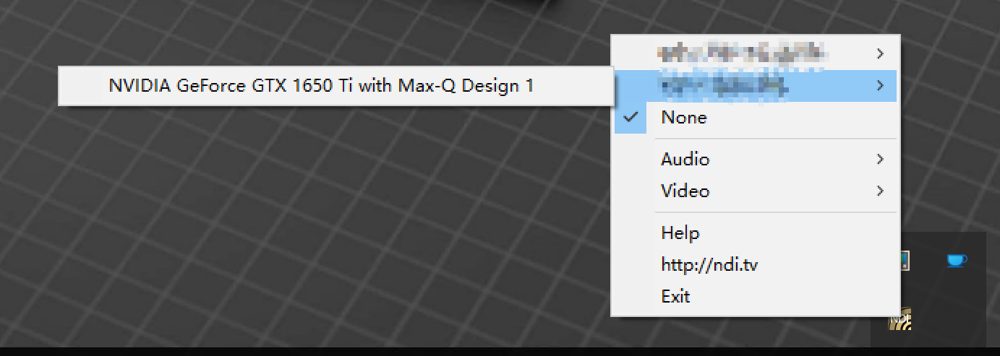
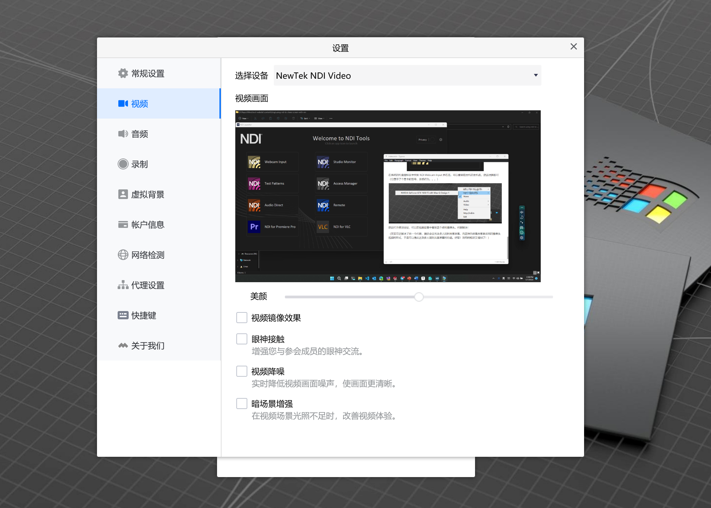
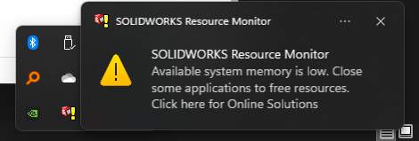

又到了一年的七月，暑期学校开了计算机图形学与数字孪生这门课，~~然而它和计算机图形学几乎没有任何关系~~，这门课的主要内容是学习使用 SolidWorks 软件，于是乎，我出于无奈，又落入到了要每天和异常难用的 Windows 操作系统打交道的境地。上课的方式是腾讯会议，而出于腾讯系软件的悠久的作恶历史，我自然将它安装在了一个 Hyper-V 上的 Win 10 虚拟机上。但是遇到了一点问题：课上需要在腾讯会议里共享屏幕，而我又不可能再把像 SolidWorks 这样的庞然大物再往虚拟机里塞一份。于是我需要找到一种方法来在虚拟机中共享宿主机的屏幕。

首先，我通过搜索找到了 V2EX 上的两个帖子：

- [大家在拒绝/隔离国产软件方面有哪些好用的实践经验？](https://v2ex.com/t/755253)
- [求腾讯会议 Linux 解决方案](https://v2ex.com/t/644869)

这两个帖子或多或少的提到了虚拟机中的屏幕共享问题，但是没有任何解决方案。（当然，现在腾讯会议已经有 Linux 版本了，我一般配合 `firejail` 使用）

# 自主探索

虽然虚拟机无法直接访问到宿主机的屏幕，但是虚拟机却可以共享宿主机的摄像头！

于是我想出了一种方案：在宿主机上开 OBS Studio 捕获宿主机屏幕，然后利用虚拟摄像头在虚拟机的腾讯会议中使用。

但是，遗憾的是，经过尝试，这种方法行不通。RDP 设置中可共享的摄像头中没有显示 OBS Studio 的虚拟摄像头。通过 Google, 我找出了原因：RDP 设置中的可共享的摄像头都是硬件摄像头，而显然 OBS Studio 模拟出来的 WebCam 不在其列。

# 解决方案

在搜索 OBS Studio 虚拟摄像头的相关问题时，我无意中，浏览到了 OBS Studio 的另一个插件 `obs-ndi`. 

然后我迅速的查阅了一下 NDI 是什么，发现它是一种 Video-over-IP 的技术，而虚拟机和宿主机恰好是默认连接在一个 Hyper-V 交换机下的（Default Switch），于是我应该可以很方便的利用它把来自宿主机的一个视频输入转换成虚拟机内的一个虚拟摄像头，这样的话我就可以通过 NDI 将宿主机的屏幕内容共享给虚拟机内的腾讯会议了！

首先在虚拟机和宿主机上都安装 NDI Tools, 下载地址是 https://www.ndi.tv/tools/

然后我惊喜的发现 NDI Tools 已经内置了把屏幕捕获作为视频输入的工具，我甚至不需要使用 OBS Studio 的虚拟摄像头. (请忽视图片中 Win11 不合风格的白色标题栏)

点击 `Screen Capture` 打开屏幕捕获功能，然后可以在托盘图标中找到 NDI Screen Capture, 可以修改帧率等设置，也可以一起共享宿主机的系统声音。

然后在虚拟机中打开 NDI Tools, 选择 Webcam Input, 

在系统的托盘图标区中找到 NDI Webcam Input 并右击，可以看到宿主机的主机名，然后选择即可（它显示了个显卡的型号，迷惑行为。。。）

然后打开疼训会议，可以在视频设置中看到这个虚拟摄像头。问题解决！

（其实它还解决了另一个问题，腾讯会议无法多人同时共享屏幕，而这种伪屏幕共享是采用的摄像头视频的形式，于是可以借此达到多人同时共享屏幕的功能。好耶！没用的知识又增加了！）

然而画质稍微有点糊，不过勉强能用了。调整到 1080p30 在腾讯会议里还是看起来糊，不过从浏览器里测试起来挺清楚的，这个锅让腾讯会议去背吧！

**更新：** 可以在共享屏幕中选择外接视频源，这样可以防止画质变的太糊。

# 尾声

话不多说了，还有四个复杂的零件要设计呢。SolidWorks 好像对我的虚拟机不太满意，它已经在抱怨内存不足了。希望这个解决方案对正在阅读这篇水文的您有所帮助。

最后吐槽一下 SolidWorks 卡的要死，这软件是在单线程执行那些复杂操作吗? 在 CPU 占用都不到 50%，内存也还有 2GB 空闲的时候，这个软件却卡的要死！估计工作负载大部分都分给 UI 线程了。
